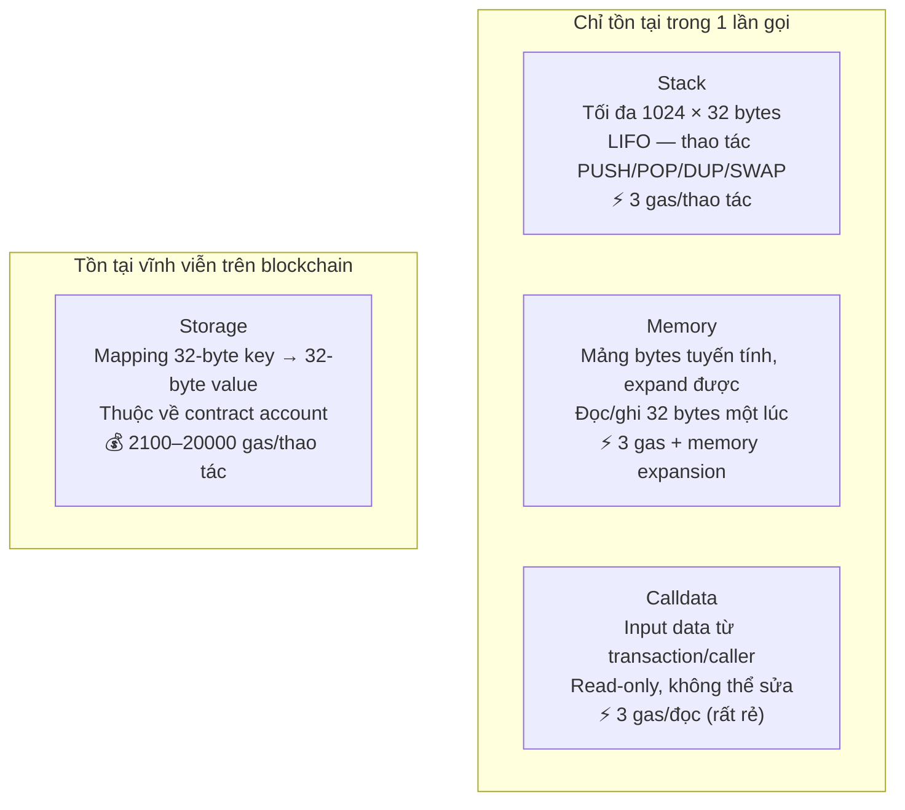

> **Prerequisites**: [[02-account-model-world-state|02. Account Model & World State]], [[07-gas-model-eip1559|07. Gas Model & EIP-1559]]
> **Objectives**:
> - Hiểu EVM là stack machine hoạt động như thế nào
> - Phân biệt 4 vùng dữ liệu: stack, memory, storage, calldata
> - Nắm execution context: những thông tin nào EVM biết trong một lần chạy
> - Trace tay một đoạn bytecode đơn giản step-by-step
> - Hiểu creation code vs runtime code khi deploy contract
> - Biết các opcode quan trọng và nhóm phân loại của chúng

---

## Motivation

Ở Lesson 02, ta biết Contract Account có `codeHash` — hash của EVM bytecode. Nhưng bytecode đó được *thực thi* như thế nào? Ai chạy nó? Nó có thể làm được gì?

**EVM (Ethereum Virtual Machine)** là "CPU" của Ethereum — bộ máy chạy tất cả smart contract. Hiểu EVM là hiểu Ethereum ở mức sâu nhất: tại sao một số pattern tốn gas nhiều hơn, tại sao reentrancy attack hoạt động, tại sao storage expensive, tại sao calldata rẻ hơn memory. Mọi thứ đều có câu trả lời ở đây.

---

## Concept: EVM là Stack Machine

> [!definition] Definition 8.1 — EVM Stack Machine
> EVM là một **stack-based virtual machine**: tất cả phép tính đều thực hiện thông qua một **stack** (ngăn xếp) theo cơ chế LIFO (Last In, First Out).
>
> Đặc điểm:
> - Stack có tối đa **1024 phần tử**, mỗi phần tử 32 bytes (256-bit word)
> - Hầu hết opcode lấy operand từ stack top và push kết quả lên stack
> - Không có register như x86/ARM — chỉ có stack

So sánh với các kiến trúc khác:

| | Stack Machine (EVM) | Register Machine (x86) |
|---|---|---|
| Tính toán | Pop từ stack, push kết quả | Load vào register, tính, store |
| Đơn giản để implement | ✅ Rất đơn giản | ❌ Phức tạp hơn |
| Phù hợp đa nền tảng | ✅ Tất định trên mọi CPU | Phụ thuộc vào ISA cụ thể |
| Ví dụ | EVM, JVM, WebAssembly | x86, ARM, RISC-V |

---

## Concept: Bốn Vùng Dữ Liệu

EVM có bốn nơi để lưu trữ dữ liệu, với chi phí và vòng đời khác nhau hoàn toàn:



> [!definition] Definition 8.2 — Stack
> Stack là nơi EVM thực hiện tất cả phép tính. Operands được push lên stack trước, opcode pop chúng ra và push kết quả lại.
>
> Giới hạn: 1024 items. Tràn stack (stack overflow) dừng execution ngay lập tức.

> [!definition] Definition 8.3 — Memory
> Memory là mảng bytes **tạm thời**, được mở rộng theo nhu cầu (bắt đầu từ 0 bytes). Được reset về 0 sau mỗi lần gọi. EVM đọc/ghi theo từng 32-byte word (`MLOAD`/`MSTORE`) hoặc 1 byte (`MSTORE8`).
>
> Chi phí mở rộng memory tăng phi tuyến: mở rộng lên 1KB rẻ, lên 1MB rất đắt.

> [!definition] Definition 8.4 — Calldata
> Calldata là dữ liệu input được gửi kèm transaction. Với EOA gọi contract: calldata = encoded function call. Calldata **read-only** — không thể sửa trong quá trình execution. Rẻ hơn memory vì không cần copy.
>
> Ví dụ: Gọi `transfer(0xAlice, 100)` → calldata = `0xa9059cbb` + 32-byte address + 32-byte uint256.

> [!definition] Definition 8.5 — Storage
> Storage là nơi lưu trạng thái **vĩnh viễn** của contract, tồn tại giữa các lần gọi và giữa các block. Được biểu diễn bằng Storage Trie (Lesson 04).
>
> Đây là nơi đắt nhất: `SSTORE` cold = 20,000 gas, `SLOAD` cold = 2,100 gas. Đắt vì phải ghi xuống disk và cập nhật Merkle trie.

---

## Concept: Execution Context

Mỗi khi EVM bắt đầu thực thi code, nó nhận một **execution context** — một tập hợp các thông tin môi trường:

> [!definition] Definition 8.6 — Execution Context
>
> | Biến | Opcode | Ý nghĩa |
> |------|--------|---------|
> | `address` | `ADDRESS` | Địa chỉ contract đang chạy |
> | `caller` | `CALLER` | Địa chỉ gọi contract này (msg.sender) |
> | `callvalue` | `CALLVALUE` | ETH gửi kèm (msg.value, wei) |
> | `calldata` | `CALLDATALOAD` | Input data của call |
> | `origin` | `ORIGIN` | EOA đã khởi tạo transaction gốc (tx.origin) |
> | `gasprice` | `GASPRICE` | Effective gas price của transaction |
> | `coinbase` | `COINBASE` | Địa chỉ validator của block hiện tại |
> | `timestamp` | `TIMESTAMP` | Unix timestamp của block (giây) |
> | `number` | `NUMBER` | Số block hiện tại |
> | `gasleft` | `GAS` | Gas còn lại |

> [!warning] `tx.origin` vs `msg.sender`
> `ORIGIN` luôn là EOA khởi tạo transaction gốc. `CALLER` là người gọi trực tiếp (có thể là một contract khác). Dùng `tx.origin` để auth là lỗ hổng bảo mật — contract trung gian có thể bị lợi dụng.

---

## Concept: Các Nhóm Opcode

EVM có ~150 opcode, chia thành các nhóm:

**Arithmetic & Logic** — `ADD`, `SUB`, `MUL`, `DIV`, `MOD`, `EXP`, `LT`, `GT`, `EQ`, `AND`, `OR`, `XOR`, `NOT`

**Stack** — `PUSH1`..`PUSH32`, `POP`, `DUP1`..`DUP16`, `SWAP1`..`SWAP16`

**Memory** — `MLOAD`, `MSTORE`, `MSTORE8`, `MSIZE`

**Storage** — `SLOAD`, `SSTORE`

**Control Flow** — `JUMP`, `JUMPI`, `JUMPDEST`, `PC`, `STOP`, `RETURN`, `REVERT`, `INVALID`

**Context** — `ADDRESS`, `CALLER`, `CALLVALUE`, `CALLDATALOAD`, `TIMESTAMP`, `NUMBER`, `GAS`, ...

**Calls** — `CALL`, `STATICCALL`, `DELEGATECALL`, `CREATE`, `CREATE2`

**Logs** — `LOG0`, `LOG1`, `LOG2`, `LOG3`, `LOG4`

**Crypto** — `KECCAK256`, `ECRECOVER` (qua precompile)

---

## Concept: Trace Bytecode Step-by-Step

Hãy trace một đoạn bytecode đơn giản: **tính (3 + 5) × 2 và lưu vào memory[0]**

```text
Bytecode: 6003 6005 01 6002 02 6000 52
```

Giải mã:
```text
PC  Hex   Opcode    Operand   Stack (top → bottom)    Gas used
──────────────────────────────────────────────────────────────
0   60 03  PUSH1     3         [3]                      3
2   60 05  PUSH1     5         [5, 3]                   3
4   01     ADD                 [8]          (5+3=8)     3
5   60 02  PUSH1     2         [2, 8]                   3
7   02     MUL                 [16]         (2×8=16)    5
8   60 00  PUSH1     0         [0, 16]                  3
10  52     MSTORE              []    memory[0]=16       3
                                                  Total: 23
```

Giải thích từng bước:
- `PUSH1 3`: push literal `3` lên stack → stack = `[3]`
- `PUSH1 5`: push literal `5` → stack = `[5, 3]`
- `ADD`: pop `5` và `3`, push `5+3=8` → stack = `[8]`
- `PUSH1 2`: push `2` → stack = `[2, 8]`
- `MUL`: pop `2` và `8`, push `2×8=16` → stack = `[16]`
- `PUSH1 0`: push memory offset `0` → stack = `[0, 16]`
- `MSTORE`: pop offset `0` và value `16`, lưu `16` vào `memory[0..31]`

---

## Concept: Creation Code vs Runtime Code

Khi deploy một smart contract, bytecode không đơn giản là copy thẳng vào chain. Có hai loại code:

> [!definition] Definition 8.7 — Creation Code vs Runtime Code
>
> **Creation code** (initialization code): Đoạn code chạy **một lần** khi deploy contract. Nhiệm vụ: thực thi constructor, cấp phát storage ban đầu, rồi **return runtime code**.
>
> **Runtime code** (deployed bytecode): Đoạn code được lưu vào `codeHash` của contract account, chạy **mỗi lần** contract được gọi.

```text
Transaction "to" = null (deploy)
     │
     ▼
EVM chạy creation code
     │  constructor() runs
     │  storage slots initialized
     ▼
RETURN runtime_code
     │
     ▼
EVM lưu runtime_code vào account storage
→ Contract Account được tạo với địa chỉ mới
```

Ví dụ creation code cực đơn giản (return bytecode `0x60016000`):

```text
bytecode: 60 04  60 0c  60 00  39  60 04  60 00  f3
          ─────  ─────  ─────  ──  ─────  ─────  ──
          PUSH1  PUSH1  PUSH1 CODECOPY PUSH1 PUSH1 RETURN
           4(len) 0c(src) 0(dst)       4(len) 0(dst)
```

---

## Worked Example — Disassembly thực tế với Python

```python
import pyevmasm as asm

# Disassemble creation code từ một contract ERC20 đơn giản
# (fragment ngắn để minh họa)
bytecode_hex = "6080604052348015600e575f80fd5b50603e80601a5f395ff3fe"
bytecode = bytes.fromhex(bytecode_hex)

print("=== Disassembly ===")
for inst in asm.disassemble_all(bytecode):
    print(f"  PC {inst.pc:3d}: {inst}")
```

**Output:**
```text
=== Disassembly ===
  PC   0: PUSH1 0x80
  PC   2: PUSH1 0x40
  PC   4: MSTORE           ← free memory pointer = 0x80
  PC   5: CALLVALUE
  PC   6: DUP1
  PC   7: ISZERO
  PC   8: PUSH1 0xe
  PC  10: JUMPI            ← nếu msg.value == 0, nhảy đến PC 14
  PC  11: PUSH0
  PC  12: DUP1
  PC  13: REVERT           ← nếu có ETH gửi kèm, revert
  PC  14: JUMPDEST
  PC  15: POP
  PC  16: PUSH1 0x3e       ← length của runtime code = 62 bytes
  PC  18: DUP1
  PC  19: PUSH1 0x1a       ← offset trong creation code
  PC  21: PUSH0
  PC  22: CODECOPY         ← copy runtime code vào memory[0]
  PC  23: PUSH0
  PC  24: RETURN           ← return memory[0..62] = runtime code
```

> [!note] `PUSH1 0x40, MSTORE` ở đầu mọi contract Solidity
> Dòng `6080604052` (PUSH1 0x80, PUSH1 0x40, MSTORE) là boilerplate của Solidity: lưu `0x80` vào memory slot `0x40`. Slot `0x40` là **free memory pointer** — Solidity dùng nó để theo dõi vị trí bộ nhớ trống tiếp theo trong memory.

---

## Concept: Call Types — CALL, STATICCALL, DELEGATECALL

Khi một contract gọi contract khác, EVM tạo một execution context mới. Có ba loại:

| Opcode | `address` | `caller` | Storage | ETH value | Dùng khi |
|--------|-----------|----------|---------|-----------|---------|
| `CALL` | Contract B | Contract A | B's storage | Được chuyển | Gọi contract thông thường |
| `STATICCALL` | Contract B | Contract A | B's storage | Không được | Read-only call — không thể SSTORE, emit event |
| `DELEGATECALL` | **Contract A** | msg.sender gốc | **A's storage** | Giữ nguyên | Library pattern — code của B chạy trong context của A |

> [!warning] DELEGATECALL và rủi ro bảo mật
> `DELEGATECALL` chạy code của contract B nhưng trong context của A — có thể đọc/ghi storage của A. Đây là cơ chế của upgradeable proxy pattern (EIP-1967), nhưng cũng là nguồn gốc của nhiều lỗ hổng nếu dùng sai (storage collision).

---

## Summary / Key Takeaways

- EVM là **stack machine** — tất cả tính toán qua stack 1024 × 32 bytes.
- Bốn vùng dữ liệu: **stack** (tạm, rẻ), **memory** (tạm, mở rộng được), **calldata** (read-only, rất rẻ), **storage** (vĩnh viễn, rất đắt).
- **Execution context** cung cấp thông tin môi trường: `msg.sender`, `msg.value`, `block.timestamp`, v.v.
- **Creation code** chạy một lần khi deploy, trả về **runtime code** được lưu vĩnh viễn.
- `CALL` / `STATICCALL` / `DELEGATECALL` — ba cách gọi contract khác nhau về context.
- Mọi opcode có gas cost cố định — đây là nền tảng để hiểu gas optimization.

---

## References

- Ethereum Yellow Paper — Section 9 (EVM), Appendix H (Virtual Machine Specification)
- ethereum.org — [EVM](https://ethereum.org/en/developers/docs/evm/)
- EVM opcodes reference — [www.evm.codes](https://www.evm.codes)
- pyevmasm — [github.com/crytic/pyevmasm](https://github.com/crytic/pyevmasm)
- Noxx — [EVM Deep Dives](https://noxx.substack.com/p/evm-deep-dives-the-path-to-shadowy)
