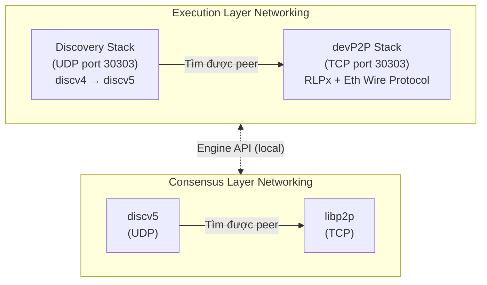

> **Prerequisites**: [[01-ethereum-big-picture|01. Ethereum — Big Picture & Design Philosophy]], [[03-rlp-encoding|03. RLP Encoding]], [[05-keccak-ecdsa-addresses|05. Keccak-256, ECDSA & Ethereum Addresses]]
> **Objectives**:
> - Hiểu tại sao Ethereum cần mạng P2P riêng thay vì dùng HTTP
> - Biết cấu trúc hai tầng networking: discovery stack và devp2p stack
> - Nắm Ethereum Node Record (ENR) và Node ID là gì
> - Hiểu Kademlia DHT và discv5 — cách nodes tìm nhau
> - Hiểu RLPx handshake và cách bảo mật kết nối
> - Phân biệt networking của Execution Layer (devp2p) và Consensus Layer (libp2p)

---

## Motivation

Hàng nghìn Ethereum node hoạt động độc lập trên toàn cầu — không ai biết IP của tất cả các node khác, không có server trung tâm để hỏi "ai đang online?". Vậy làm sao chúng tìm thấy nhau? Làm sao chúng đồng bộ blockchain hàng chục GB? Làm sao transaction lan truyền từ node của bạn đến validator trong vài giây?

Câu trả lời nằm ở **devp2p** — một bộ giao thức mạng P2P do Ethereum tự thiết kế, gồm hai tầng riêng biệt: **discovery** (tìm peers) và **data exchange** (trao đổi dữ liệu). Sau The Merge, còn có một lớp networking thứ hai cho Consensus Layer dùng **libp2p**.

---

## Concept: Kiến Trúc Hai Tầng



> [!definition] Definition 10.1 — Discovery Stack
> **Discovery stack** chạy trên **UDP**, chịu trách nhiệm tìm peers. Đây là bước đầu tiên khi một node mới khởi động: "Ai đang có mặt trong mạng? IP và port của họ là gì?"
>
> Hiện tại Ethereum Execution Layer dùng **discv4** (legacy) và đang chuyển sang **discv5**.

> [!definition] Definition 10.2 — devP2P Stack
> **devP2P stack** chạy trên **TCP**, chịu trách nhiệm trao đổi dữ liệu thực sự giữa các nodes sau khi đã biết địa chỉ nhau qua discovery. Bao gồm **RLPx** (encrypted transport) + **Ethereum Wire Protocol** (application-level messages).

---

## Concept: Ethereum Node Record (ENR)

Mỗi Ethereum node có một **danh thiếp kỹ thuật số** gọi là ENR:

> [!definition] Definition 10.3 — Ethereum Node Record (ENR) — EIP-778
> **ENR** là một bản ghi chứa thông tin kết nối của một node, được ký bằng private key của node đó. Định dạng:
>
> `RLP([signature, seq, k1, v1, k2, v2, ...])`
>
> Các trường quan trọng:
>
> | Key | Ý nghĩa |
> |-----|---------|
> | `id` | Loại identity scheme (thường `"v4"`) |
> | `secp256k1` | Compressed public key của node |
> | `ip` | IPv4 address |
> | `tcp` | TCP port (RLPx) |
> | `udp` | UDP port (discovery) |
> | `eth` | Fork ID — Ethereum chain và fork hiện tại |
>
> ENR được encode dạng base64 với prefix `enr:`. Ví dụ:
> `enr:-J24QG3pjTFObcDv...`

> [!definition] Definition 10.4 — Node ID
> **Node ID** = `keccak256(uncompressed_public_key)` — 32 bytes.
>
> Node ID là "địa chỉ" của node trong không gian Kademlia DHT. Hai nodes có Node ID gần nhau (XOR distance nhỏ) sẽ lưu thông tin về cùng một vùng địa chỉ.

---

## Concept: Kademlia DHT và discv4/discv5

### Kademlia — Distributed Hash Table

Ethereum dùng thuật toán **Kademlia DHT** để tổ chức việc tìm kiếm peers:

> [!definition] Definition 10.5 — Kademlia XOR Distance
> Trong Kademlia, "khoảng cách" giữa hai nodes **không phải** khoảng cách địa lý hay mạng — mà là phép **XOR** của hai Node IDs:
>
> $$d(A, B) = \text{NodeID}_A \oplus \text{NodeID}_B$$
>
> Mỗi node duy trì một **routing table** (k-buckets): danh sách các peers được phân nhóm theo khoảng cách XOR. Bucket gần hơn (distance nhỏ hơn) được cập nhật thường xuyên hơn.

Khi muốn tìm một node X, bạn hỏi các nodes gần X nhất mà bạn biết — chúng sẽ chỉ bạn đến nodes gần hơn nữa, và cứ như vậy. Số bước tìm kiếm $O(\log n)$ với $n$ nodes trong mạng.

### discv4 và discv5

**discv4** (discovery protocol v4) là giao thức discovery gốc của Ethereum, dùng Kademlia thuần túy qua UDP với 4 message types: `Ping`, `Pong`, `FindNode`, `Neighbors`.

**discv5** là phiên bản mới hơn với nhiều cải tiến:
- Dùng **ENR** thay vì enode URL
- Hỗ trợ **topic advertisement**: node có thể quảng cáo rằng mình hỗ trợ một subnetwork cụ thể (ví dụ: một attestation subnet)
- Bảo mật tốt hơn (Handshake protocol thay vì plaintext UDP)
- Dùng chung bởi cả Execution Layer và Consensus Layer

---

## Concept: RLPx — Encrypted Transport

Sau khi discovery tìm được IP/port của peer, **RLPx** thiết lập kết nối TCP được mã hóa và xác thực:

> [!definition] Definition 10.6 — RLPx Handshake
> RLPx dùng **ECIES** (Elliptic Curve Integrated Encryption Scheme) để trao đổi khóa phiên:
>
> **Bước 1 — Auth message** (Initiator → Recipient):
> - Initiator tạo ephemeral keypair mới
> - Gửi `auth = ECIES_encrypt(recipientPubKey, [ephemeral_pubkey, nonce, sig])`
> - Chữ ký `sig` = ECDSA của `keccak256(shared_secret XOR nonce)` bằng static privkey
>
> **Bước 2 — Auth-ack** (Recipient → Initiator):
> - Recipient giải mã auth, verify signature
> - Gửi `auth-ack = ECIES_encrypt(initiatorPubKey, [ephemeral_pubkey, nonce])`
>
> **Bước 3 — Derive session keys**:
> - Cả hai tính `ephemeral_shared_secret = ECDH(myEphemeralPriv, theirEphemeralPub)`
> - Derive `aes-secret`, `mac-secret` từ shared secret + nonces
>
> **Bước 4 — Hello frame**:
> - Gửi encrypted `Hello` message chứa: `protocolVersion`, `clientId`, `capabilities`, `listenPort`, `nodeKey`
> - Sau đó, negotiation `capabilities` → chọn subprotocol version (ví dụ `eth/68`)

```text
Initiator                          Recipient
    │                                  │
    │──── auth (ECIES encrypted) ──────►│
    │                                  │
    │◄─── auth-ack (ECIES encrypted) ──│
    │                                  │
    │  [Both derive aes-secret, mac-secret]
    │                                  │
    │──── Hello (encrypted frame) ─────►│
    │◄─── Hello (encrypted frame) ─────│
    │                                  │
    │  [Capabilities negotiated: eth/68]
    │                                  │
    │◄══ Regular encrypted traffic ═══►│
```

> [!note] Tại sao cần ECIES thay vì TLS?
> ECIES dùng secp256k1 — cùng đường cong với Ethereum keys — đơn giản hơn để implement trong mọi ngôn ngữ. TLS phức tạp hơn và phụ thuộc vào PKI (certificate authority), không phù hợp cho mạng permissionless phi tập trung.

---

## Concept: Ethereum Wire Protocol (eth/)

Sau khi RLPx handshake xong, **Ethereum Wire Protocol** (`eth/68` hiện tại) bắt đầu hoạt động. Đây là tầng application — trao đổi blockchain data:

| Message | Hướng | Mô tả |
|---------|-------|-------|
| `Status` | bidirectional | Trao đổi thông tin chain (genesis hash, best block, fork ID) |
| `GetBlockHeaders` | request | Yêu cầu block headers theo range |
| `BlockHeaders` | response | Trả về danh sách block headers |
| `GetBlockBodies` | request | Yêu cầu transaction lists của blocks |
| `BlockBodies` | response | Trả về transaction lists |
| `Transactions` | broadcast | Gossip transactions mới đến tất cả peers |
| `NewPooledTransactionHashes` | broadcast | Thông báo có tx mới (không kèm data) |
| `GetPooledTransactions` | request | Lấy transactions dựa trên hash |
| `GetReceipts` | request | Yêu cầu transaction receipts |

### Gossip Protocol cho Transactions

Khi bạn gửi một transaction:

```text
Your Node
    │
    ├──► Peers (fanout ~8-12): Transactions hoặc NewPooledTransactionHashes
    │         │
    │         ├──► Their Peers: gossip tiếp
    │         └──► ...
    │
    └── Trong vài giây, hầu hết nodes trên mạng biết tx này
```

Để tránh spam, Ethereum Wire Protocol dùng chiến lược **announce-then-fetch**: node mới biết về tx chỉ gửi hash (`NewPooledTransactionHashes`), peer quyết định có muốn fetch full tx không.

---

## Concept: Consensus Layer — libp2p

Sau The Merge, Consensus Layer dùng **libp2p** thay vì devp2p:

> [!definition] Definition 10.7 — Consensus Layer Networking
> Consensus Layer dùng **libp2p** — một framework mạng P2P modular phổ biến (cũng dùng bởi IPFS, Filecoin, Polkadot).
>
> Các subprotocols quan trọng:
> - **gossipsub**: Gossip protocol cho beacon blocks, attestations, sync committees
> - **req/resp**: Request/response cho sync (BeaconBlocksByRange, BeaconBlocksByRoot)
> - **discv5**: Tìm peers (cùng protocol với EL nhưng với ENR fields thêm `attnets`, `eth2`)

| | Execution Layer | Consensus Layer |
|---|---|---|
| Discovery | discv4/discv5 (UDP) | discv5 (UDP) |
| Transport | RLPx/devP2P (TCP) | libp2p/Noise (TCP) |
| Gossip | eth/ wire protocol | gossipsub |
| Port (default) | 30303 | 9000 |

---

## Worked Example — ENR trong thực tế

Dưới đây là cách đọc thông tin từ một ENR thực:

```text
enr:-J24QG3pjTFObcDvTOTJr2qPOTDH3-YxDqS47Ylm-kgM5BUwb1oD5Id6fSRTfUz...
```

Decode ENR này với `devp2p` CLI tool (Geth):

```bash
# Với Geth đã cài đặt:
devp2p enrdump "enr:-J24QG3pj..."

# Output:
# Node ID: 001816492db22f7572e9ee...
# URLv4:   enode://e508d6fb37...@157.90.215.208:30303
# Record has:
#   "eth"     → fork ID
#   "id"      → "v4"
#   "ip"      → 157.90.215.208
#   "secp256k1" → compressed public key
#   "tcp"     → 30303
#   "udp"     → 30303
```

```python
# Đọc thông tin mạng của node qua JSON-RPC (local node)
# (cần node đang chạy, ví dụ Geth)

# admin_nodeInfo
node_info = {
    "id": "00181649...",
    "name": "Geth/v1.13.14-stable/linux-amd64/go1.22.0",
    "enode": "enode://e508d6fb...@157.90.215.208:30303",
    "enr": "enr:-J24QG3p...",
    "ip": "157.90.215.208",
    "ports": {"discovery": 30303, "listener": 30303},
    "listenAddr": "[::]:30303",
    "protocols": {
        "eth": {"network": 1, "difficulty": "...", "genesis": "0xd4e567..."}
    }
}

# admin_peers — danh sách peers đang kết nối
peer_example = {
    "enode": "enode://abc123...@1.2.3.4:30303",
    "id": "abc123...",
    "name": "Nethermind/v1.25.0/...",
    "caps": ["eth/68", "snap/1"],
    "network": {"localAddress": "...", "remoteAddress": "1.2.3.4:30303"},
}
print(f"Connected to: {peer_example['name']}")
print(f"Capabilities: {peer_example['caps']}")
```

---

## Summary / Key Takeaways

- Ethereum networking có **hai tầng**: discovery stack (UDP, tìm peers) và devP2P stack (TCP, trao đổi data).
- **ENR (EIP-778)**: Bản ghi thông tin kết nối của node, ký bằng node private key.
- **Node ID** = `keccak256(pubkey)` — dùng làm "địa chỉ" trong Kademlia DHT.
- **Kademlia XOR distance**: Cách tổ chức routing table để tìm peers trong $O(\log n)$ bước.
- **discv5**: Discovery protocol mới hơn, dùng ENR, hỗ trợ topic advertisement.
- **RLPx**: Encrypted TCP transport dùng ECIES + secp256k1. Sau handshake → Ethereum Wire Protocol.
- **Ethereum Wire Protocol (eth/68)**: Gossip transactions và sync blockchain data.
- **Consensus Layer** dùng **libp2p + gossipsub** thay vì devp2p — chạy trên port 9000.

---

## References

- ethereum/devp2p specs — [github.com/ethereum/devp2p](https://github.com/ethereum/devp2p)
- EIP-778 — [ENR](https://eips.ethereum.org/EIPS/eip-778)
- ethereum.org — [Networking Layer](https://ethereum.org/en/developers/docs/networking-layer/)
- RLPx spec — [github.com/ethereum/devp2p/blob/master/rlpx.md](https://github.com/ethereum/devp2p/blob/master/rlpx.md)
- Kademlia paper — Maymounkov & Mazieres, 2002
- libp2p docs — [docs.libp2p.io](https://docs.libp2p.io)
