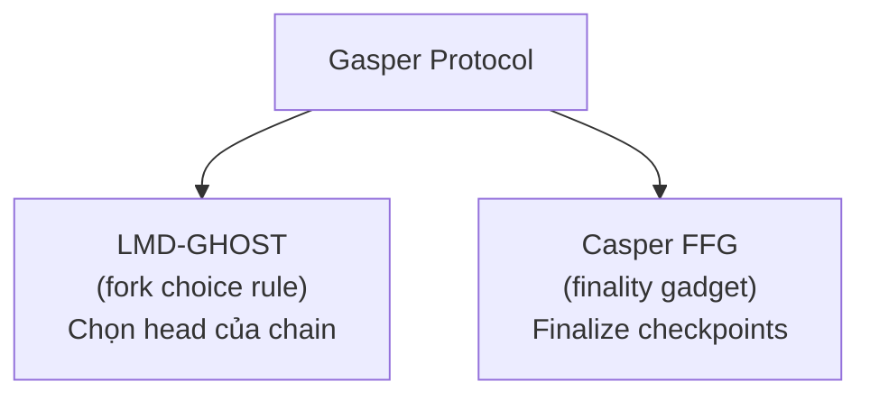

> **Prerequisites**: [[01-ethereum-big-picture|01. Ethereum — Big Picture & Design Philosophy]], [[06-transaction-lifecycle|06. Transaction Lifecycle & Types]]
> **Objectives**:
> - Hiểu tại sao Ethereum chuyển từ PoW sang PoS
> - Nắm cấu trúc thời gian: slot, epoch, checkpoint
> - Biết vai trò của validator: propose block và attest
> - Hiểu giao thức Gasper = LMD-GHOST + Casper FFG
> - Hiểu justification và finalization nghĩa là gì
> - Biết slashing, inactivity leak, và cơ chế rewards

---

## Motivation

Trước tháng 9/2022, Ethereum dùng **Proof of Work (PoW)** — miners cạnh tranh giải bài toán hash, tiêu thụ điện năng khổng lồ, block time biến động ~13 giây. Sau **The Merge**, Ethereum chuyển sang **Proof of Stake (PoS)** — validators đặt cọc ETH thay vì dùng điện để bảo vệ mạng.

Kết quả: năng lượng giảm ~99.95%, block time ổn định 12 giây, và đặc biệt — **finality** (tính chất block không thể bị revert) lần đầu tiên được đảm bảo rõ ràng về mặt kinh tế.

---

## Concept: Proof of Work vs Proof of Stake

| | Proof of Work | Proof of Stake |
|---|---|---|
| **Ai tạo block?** | Miner giải bài toán hash | Validator được chọn ngẫu nhiên theo stake |
| **Cái gì bị stake?** | Điện năng + phần cứng | ETH (32 ETH tối thiểu) |
| **Phạt khi gian lận?** | Mất chi phí điện + hardware | ETH bị slash (cắt giảm) |
| **Năng lượng** | Rất cao | ~99.95% thấp hơn |
| **Block time** | ~10–13s (biến động) | 12s (cố định, mỗi slot) |
| **Finality** | Probabilistic (6 blocks ≈ an toàn) | Economic finality (~13 phút) |

> [!definition] Definition 12.1 — Proof of Stake
> Trong **PoS**, quyền đề xuất block không phụ thuộc vào computing power mà vào **stake** (ETH đặt cọc). Validator được chọn **pseudo-random** với xác suất tỉ lệ thuận với stake của họ. Gian lận bị phạt bằng cách mất một phần ETH đã stake — đây là **stake-at-risk** tạo incentive kinh tế cho honest behavior.

---

## Concept: Cấu Trúc Thời Gian — Slot và Epoch

> [!definition] Definition 12.2 — Slot
> **Slot** là đơn vị thời gian cơ bản của Beacon Chain: **12 giây** mỗi slot.
>
> Mỗi slot có **một validator được chọn làm proposer** — người này có nhiệm vụ tạo và broadcast một beacon block mới. Nếu proposer offline hoặc bỏ lỡ slot → slot đó bị bỏ trống (missed slot), không có block.

> [!definition] Definition 12.3 — Epoch
> **Epoch** gồm **32 slots liên tiếp** = 32 × 12s = **384 giây ≈ 6.4 phút**.
>
> Epoch là đơn vị quan trọng cho:
> - Tính toán rewards và penalties
> - Thực hiện justification và finalization (Casper FFG)
> - Xáo trộn (reshuffling) validator committees

```text
Epoch N (6.4 phút = 32 slots × 12 giây)
┌────┬────┬────┬────┬────┬────┬─────────────┬────┐
│ S0 │ S1 │ S2 │ S3 │ S4 │ S5 │     ...     │S31 │
└────┴────┴────┴────┴────┴────┴─────────────┴────┘
  ↑                                            ↑
  Epoch boundary                        Epoch boundary
  = checkpoint N-1                     = checkpoint N
```

> [!definition] Definition 12.4 — Checkpoint
> **Checkpoint** là block đầu tiên của mỗi epoch (slot 0 của epoch). Checkpoints là đơn vị của Casper FFG — chỉ checkpoints mới được justify/finalize, không phải từng block riêng lẻ.

---

## Concept: Vai Trò Validator

Để trở thành validator, bạn cần deposit **32 ETH** vào Deposit Contract trên L1. Sau khoảng thời gian activation queue, bạn bắt đầu có trách nhiệm:

> [!definition] Definition 12.5 — Validator Duties
>
> **Block Proposal** (đề xuất block):
> - Mỗi epoch, mỗi validator được assign vào một slot cụ thể (pseudo-random)
> - Validator đó phải tạo BeaconBlock chứa execution payload, broadcast lên mạng
> - Phần thưởng: block proposal reward (lớn, nhưng ít khi xảy ra)
>
> **Attestation** (xác nhận):
> - Mỗi slot, tất cả validators được chia vào **committees** (ủy ban)
> - Mỗi validator trong committee phải submit một **attestation** — phiếu bầu xác nhận:
>   1. Block nào là head của chain (LMD-GHOST vote)
>   2. Checkpoint nào nên được justified (Casper FFG vote)
> - Phần thưởng: attestation reward (nhỏ, nhưng xảy ra mỗi epoch)
>
> **Sync Committee** (đồng bộ nhẹ):
> - 512 validators được chọn ngẫu nhiên mỗi ~27 giờ
> - Ký aggregate signature trên block header → phục vụ light clients

---

## Concept: Giao Thức Gasper = LMD-GHOST + Casper FFG

Ethereum dùng **Gasper** — kết hợp hai cơ chế:



### LMD-GHOST — Fork Choice Rule

> [!definition] Definition 12.6 — LMD-GHOST
> **LMD (Latest Message Driven) GHOST (Greediest Heaviest Observed SubTree)**
>
> Khi có nhiều fork (nhánh cạnh tranh), rule:
> 1. Bắt đầu từ genesis block
> 2. Tại mỗi điểm phân nhánh, chọn nhánh có **tổng trọng số attestation lớn nhất**
> 3. Mỗi validator chỉ tính vote **mới nhất** (Latest Message Driven — LMD), bỏ qua các vote cũ hơn
>
> LMD ngăn **long-range attack**: kẻ tấn công không thể dùng các attestation cũ để reorg chain.

### Casper FFG — Finality Gadget

> [!definition] Definition 12.7 — Casper FFG (Friendly Finality Gadget)
>
> Casper FFG mang lại **economic finality** — khi một checkpoint đã được finalize, để revert nó cần phải có ít nhất 1/3 tổng validator stake bị slash.
>
> **Justification**: Checkpoint $C$ được **justified** khi có >2/3 tổng validator stake vote cho link $(C_{parent} \to C)$.
>
> **Finalization**: Checkpoint $C$ được **finalized** khi $C$ được justified **VÀ** parent của $C$ cũng đã justified.

**Timeline finalization:**

```text
Epoch N:   Validators attest to checkpoint N
              └─ votes được aggregate và include trong blocks
Epoch N+1: Đủ votes → checkpoint N được JUSTIFIED
Epoch N+2: Nếu epoch N+1 cũng justified → checkpoint N được FINALIZED
```

Tổng cộng: **2 epochs ≈ 12.8 phút** từ block được propose đến finalized.

> [!note] "Safe" vs "Finalized" trong JSON-RPC
> Đây chính là lý do tại sao block tag `"safe"` (after 1 epoch, justified) và `"finalized"` (after 2 epochs) tồn tại trong JSON-RPC API (Lesson 11). Finalized block có **economic security** — để revert cần slash hàng tỉ USD stake.

---

## Concept: Rewards và Penalties

### Rewards

Validators nhận ETH mới (issuance) từ hai nguồn:

| Nguồn | Reward | Điều kiện |
|-------|--------|-----------|
| Attestation | Base reward × participation rate | Submit đúng hạn, vote đúng head |
| Block proposal | ~1/8 của epoch attestation rewards | Được chọn làm proposer |
| Sync committee | Thưởng riêng cho 512 validators | Được chọn vào sync committee |

> [!note] APR của validator
> Với ~1 triệu validators (tháng 3/2026), APR khoảng 3–4%. Validator nắm 32 ETH → nhận ~1–1.3 ETH mỗi năm. APR giảm khi có nhiều validators hơn (issuance chia cho nhiều người hơn).

### Penalties — Inactivity Leak

Nếu validator offline, họ chịu **inactivity penalty** nhỏ dần. Nhưng nếu **>1/3 validators đồng thời offline** (không đủ >2/3 để finalize), Ethereum kích hoạt **inactivity leak**:

> [!definition] Definition 12.8 — Inactivity Leak
> Khi chain không finalize được trong >4 epochs liên tiếp, validators offline bắt đầu mất ETH **theo cấp số nhân** cho đến khi:
> - Họ quay lại online, hoặc
> - Balance của họ giảm đủ để tổng validators còn lại = 2/3 → chain finalize lại được
>
> Mục tiêu: đảm bảo chain **luôn có thể finalize** dù có sự cố lớn. Các validators honest (online) không bị penalty.

### Slashing

> [!definition] Definition 12.9 — Slashing
> **Slashing** là hình phạt nặng cho các hành vi gian lận có thể làm hại đến tính toàn vẹn của chain:
>
> **Hai offenses bị slash:**
> 1. **Double proposal (equivocation)**: Proposer ký hai block khác nhau trong cùng slot
> 2. **Surround vote**: Validator ký attestation mâu thuẫn với attestation cũ (Casper FFG violation)
>
> **Hình phạt:**
> - Ngay lập tức: mất 1/32 stake (~1 ETH với 32 ETH stake)
> - Bị eject khỏi validator set sau 36 ngày
> - Correlation penalty: nếu nhiều validators bị slash cùng lúc, penalty tăng lên tối đa 100% stake

---

## Worked Example — Tracing một Slot

Hãy trace điều gì xảy ra trong **một slot** (12 giây):

```text
T=0s: Slot bắt đầu
│
│  Proposer (validator #12345) được assign slot này từ epoch trước
│  EL gửi execution payload lên CL qua Engine API
│
T=0-4s: Proposer tạo BeaconBlock
│  BeaconBlock = {
│      slot: 9,000,000,
│      proposer_index: 12345,
│      parent_root: hash_of_prev_block,
│      state_root: new_state_root,
│      body: {
│          execution_payload: { transactions: [...], ... },
│          attestations: [...],   ← attestations từ slot trước
│          deposits: [...],
│      }
│  }
│
T=4s: Proposer broadcast BeaconBlock qua libp2p gossipsub
│
T=4-12s: Attesters (trong committees của slot này) nhận block,
│  verify, tạo Attestation, broadcast:
│  Attestation = {
│      slot: 9,000,000,
│      committee_index: 3,
│      beacon_block_root: hash_of_new_block,  ← LMD vote
│      source: justified_checkpoint,           ← Casper FFG source
│      target: current_epoch_checkpoint,       ← Casper FFG target
│  }
│
T=12s: Slot kết thúc, slot tiếp theo bắt đầu
│  Attestations được aggregate thành BLS aggregate signature
│  Aggregate attestation được include vào block N+1
```

---

## Summary / Key Takeaways

- **PoS** thay PoW: validators stake 32 ETH thay vì tốn điện. Gian lận → stake bị slash.
- **Slot** = 12 giây. **Epoch** = 32 slots = 6.4 phút. **Finality** = 2 epochs ≈ 12.8 phút.
- **Checkpoint** = block đầu epoch — đơn vị của Casper FFG.
- **Gasper = LMD-GHOST** (chọn head của chain) **+ Casper FFG** (finalize checkpoints).
- **LMD**: Chọn nhánh nặng nhất — chỉ tính vote mới nhất của mỗi validator.
- **Casper FFG**: Checkpoint justified khi >2/3 vote; finalized khi cả nó và parent justified.
- **Inactivity leak**: Khi chain không finalize, validators offline bị penalty tăng dần.
- **Slashing**: Phạt nặng double proposal và surround vote — mất tối đa 100% stake.

---

## References

- ethereum.org — [Proof of Stake](https://ethereum.org/en/developers/docs/consensus-mechanisms/pos/)
- ethereum.org — [Gasper](https://ethereum.org/en/developers/docs/consensus-mechanisms/pos/gasper/)
- Casper FFG paper — Buterin & Griffith, 2017
- ethereum.org — [Beacon Chain](https://ethereum.org/en/roadmap/beacon-chain/)
- Ben Edgington — *Upgrading Ethereum* (eth2book.info)
