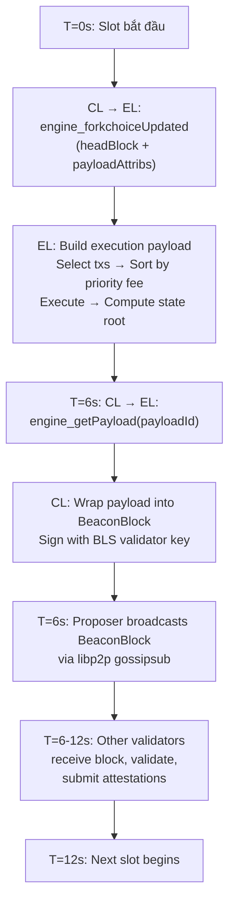
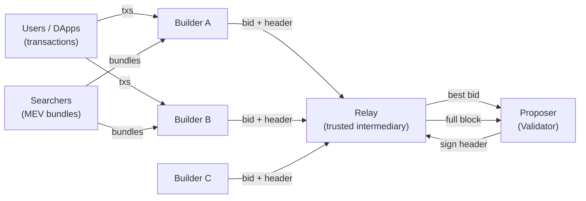

> **Prerequisites**: [[12-proof-of-stake-beacon-chain|12. Proof of Stake & Beacon Chain]], [[01-ethereum-big-picture|01. Ethereum — Big Picture & Design Philosophy]]
> **Objectives**:
> - Hiểu Engine API là giao thức gì và tại sao cần nó
> - Nắm toàn bộ luồng build-and-propose block trong 12 giây
> - Hiểu MEV (Maximal Extractable Value) là gì
> - Biết MEV-Boost và Proposer-Builder Separation (PBS) hoạt động như thế nào
> - Phân biệt local block building vs MEV-Boost

---

## Motivation

Lesson 12 giải thích validators và consensus protocol. Nhưng vẫn còn một câu hỏi quan trọng: khi một validator được chọn làm proposer trong slot 12 giây, **chính xác những gì diễn ra bên trong?** EL và CL phối hợp như thế nào để tạo ra một block hoàn chỉnh?

Và quan trọng hơn — **MEV** (Maximal Extractable Value) đã biến block building thành một thị trường đặc biệt: các chuyên gia gọi là "builders" cạnh tranh nhau để xây những block sinh lợi nhất, và validators chỉ việc chọn block tốt nhất qua **MEV-Boost**. Hiểu điều này là hiểu "chính trị nội bộ" của Ethereum và một nguồn thu nhập lớn của validators.

---

## Concept: Engine API

Sau The Merge, EL và CL chạy như hai tiến trình độc lập, giao tiếp qua **Engine API** — một JSON-RPC interface chạy nội bộ trên port `8551` (authenticated bằng JWT token).

> [!definition] Definition 13.1 — Engine API
> **Engine API** là tập hợp các RPC methods để CL điều khiển EL trong quá trình block production và validation. Chỉ CL mới được phép gọi Engine API — không phải ứng dụng bên ngoài.
>
> Ba methods cốt lõi:
>
> | Method | Hướng | Mục đích |
> |--------|-------|---------|
> | `engine_forkchoiceUpdated` | CL → EL | Cập nhật fork choice + (tùy chọn) bắt đầu build payload |
> | `engine_getPayload` | CL → EL | Lấy execution payload đã build |
> | `engine_newPayload` | CL → EL | Gửi payload mới để EL validate và execute |

### `engine_forkchoiceUpdated`

Đây là method được gọi nhiều nhất — mỗi slot CL phải nói cho EL biết "head của chain hiện tại là block nào":

```json
// CL → EL
{
  "forkchoiceState": {
    "headBlockHash":      "0xabc...",
    "safeBlockHash":      "0xdef...",
    "finalizedBlockHash": "0x123..."
  },
  "payloadAttributes": {
    "timestamp":             "0x67e1...",
    "prevRandao":            "0x456...",
    "suggestedFeeRecipient": "0xValidatorAddress...",
    "withdrawals":           []
  }
}
```

Nếu `payloadAttributes` có giá trị (proposer đang build block), EL bắt đầu **xây execution payload** — chọn transactions từ mempool, execute chúng, tính state root mới. Trả về `payloadId`.

### `engine_getPayload`

Sau khi EL build xong (hoặc hết thời gian), CL lấy payload:

```json
// CL → EL
{ "payloadId": "0x0123..." }

// EL → CL (trả về)
{
  "executionPayload": {
    "blockHash":    "0x...",
    "parentHash":   "0x...",
    "blockNumber":  "0x1312d00",
    "timestamp":    "0x...",
    "gasLimit":     "0x...",
    "gasUsed":      "0x...",
    "baseFeePerGas":"0x...",
    "transactions": ["0x02...", "0x02...", ...],
    "withdrawals":  [...]
  },
  "blockValue": "0x..."
}
```

### `engine_newPayload`

Khi validator nhận được block từ proposer khác (qua gossip), CL chuyển execution payload cho EL để validate và execute:

```json
// CL → EL
{ "executionPayload": { ... } }

// EL → CL (trả về)
{ "status": "VALID" | "INVALID" | "SYNCING" }
```

---

## Concept: Luồng Build-and-Propose Trong 12 Giây



> [!note] Tại sao lấy payload ở T=6s chứ không đợi đến T=11s?
> Proposer cần thời gian để broadcast block và attesters cần thời gian nhận và verify trước khi slot kết thúc. Thực tế, proposer phải broadcast trước T=4-6s để đủ attesters nhận được trong slot. EL cố gắng build block tốt nhất trong thời gian cho phép.

---

## Concept: MEV — Maximal Extractable Value

> [!definition] Definition 13.2 — MEV (Maximal Extractable Value)
> **MEV** là lợi nhuận tối đa có thể extract được bằng cách **kiểm soát thứ tự transactions trong block** — thêm, bỏ, hay sắp xếp lại transactions để tạo lợi nhuận.
>
> Trước đây gọi là "Miner Extractable Value" (PoW); nay là "Maximal Extractable Value" (PoS).

### Các dạng MEV phổ biến

**Arbitrage** (DEX arbitrage): Phát hiện chênh lệch giá giữa các DEX, đặt transaction ngay sau transaction gây ra chênh lệch để capture profit.

```text
Block:
  [1] User swap ETH→USDC trên Uniswap (làm tăng giá USDC trên Uniswap)
  [2] Searcher: Mua USDC rẻ trên Curve → Bán đắt trên Uniswap [profit!]
```

**Sandwich attack**: Chèn một tx mua trước (frontrun) và một tx bán sau (backrun) xung quanh một tx swap lớn của người dùng, khiến người dùng mua với giá cao hơn.

```text
Block:
  [1] Searcher: Mua ETH trước khi Alice mua (front-run, đẩy giá lên)
  [2] Alice:    Mua ETH với slippage cao hơn dự định  ← victim
  [3] Searcher: Bán ETH với giá cao hơn (back-run)   [profit!]
```

**Liquidation**: Phát hiện vị thế sắp bị liquidate trên lending protocols (Aave, Compound), submit tx liquidate để nhận liquidation bonus.

---

## Concept: MEV-Boost và Proposer-Builder Separation

Trước MEV-Boost, validator tự build block từ mempool của mình → bỏ lỡ phần lớn MEV vì thiếu infrastructure chuyên dụng. **MEV-Boost** giải quyết điều này bằng cách **tách vai trò**: block *building* và block *proposing* là hai việc khác nhau.

> [!definition] Definition 13.3 — Proposer-Builder Separation (PBS)
> **PBS** tách block production thành hai vai trò:
>
> - **Builder**: Chuyên gia xây dựng block — có mempool riêng, private orderflow, thuật toán tối ưu MEV. Cạnh tranh nhau để xây block sinh lợi nhất và bid (đấu giá) cho Proposer.
> - **Proposer**: Validator Ethereum — chọn block tốt nhất từ các builder thông qua đấu giá giá trị. Không cần tự biết cách extract MEV.



### Luồng MEV-Boost chi tiết

```text
1. Searcher gửi bundles (tx sequences) đến Builder qua private channel

2. Builder tập hợp: mempool txs + searcher bundles
   → Sắp xếp tối ưu để maximize block value
   → Gửi (block_header, bid) đến Relay

3. Relay:
   → Nhận blocks từ nhiều builders
   → Simulate để verify giá trị bid là thật
   → Chỉ expose block_header (không expose nội dung) cho Proposer

4. Proposer (T=0s của slot):
   → Nhận bids từ Relay qua MEV-Boost sidecar
   → So sánh: bid của builder vs local block (tự build)
   → Nếu bid > local value: ký block_header của builder

5. Proposer gửi signed header về Relay
   → Relay unlock full block body, gửi lại Proposer
   → Proposer broadcast full block qua gossip network

6. Validators khác validate và attest block
```

> [!warning] Rủi ro của MEV-Boost: Relay là điểm tin cậy
> Relay biết toàn bộ nội dung block trước khi Proposer ký. Nếu Relay độc hại, nó có thể tiết lộ nội dung block sớm hoặc từ chối serve block. Đây là lý do cộng đồng đang nghiên cứu **ePBS** (enshrined PBS) — đưa PBS vào protocol layer Ethereum để loại bỏ sự cần thiết của Relay.

---

## Concept: Withdrawals — Rút ETH Staking

Kể từ **Shanghai/Capella hard fork (tháng 4/2023)**, validators có thể rút ETH staking. Có hai loại:

| Loại | Mô tả |
|------|-------|
| **Partial withdrawal** | Tự động rút phần rewards vượt quá 32 ETH, giữ nguyên validator active |
| **Full withdrawal** | Voluntary exit → chờ exit queue → rút toàn bộ 32 ETH + rewards |

Withdrawals được xử lý đặc biệt: chúng đi qua CL (Beacon Chain biết balance của mỗi validator), được include vào execution payload dưới dạng **withdrawal operations** — không phải transactions thông thường, không cần gas.

---

## Summary / Key Takeaways

- **Engine API** là cầu nối EL ↔ CL: `forkchoiceUpdated` (fork choice + start build), `getPayload` (lấy payload), `newPayload` (validate payload).
- Block building trong 12s: T=0 CL triggers EL build, T=6 proposer lấy payload, broadcast block, T=6-12 attesters confirm.
- **MEV** = lợi nhuận từ kiểm soát thứ tự tx: arbitrage, sandwich, liquidation.
- **PBS via MEV-Boost**: Tách proposer (validator) và builder (chuyên gia MEV). Builder đấu giá block tốt nhất cho proposer qua Relay.
- **ePBS** (in progress): Đưa PBS vào protocol để loại bỏ trusted Relay.
- **Withdrawals** (sau Shanghai/Capella): Partial (tự động, rewards) và full (voluntary exit).

---

## References

- Engine API spec — [github.com/ethereum/execution-apis/tree/main/src/engine](https://github.com/ethereum/execution-apis/tree/main/src/engine)
- MEV-Boost — [boost.flashbots.net](https://boost.flashbots.net)
- Flashbots research — [writings.flashbots.net](https://writings.flashbots.net)
- ethereum.org — [Maximal Extractable Value](https://ethereum.org/en/developers/docs/mev/)
- EIP-4895 — Beacon chain push withdrawals as operations
