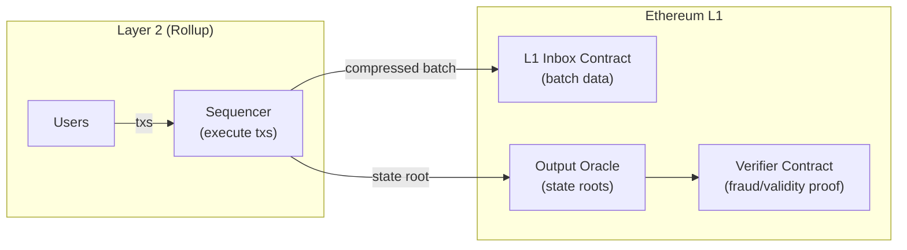

> **Prerequisites**: [[09-smart-contracts-abi-logs|09. Smart Contracts, ABI & Logs]], [[13-post-merge-architecture|13. Post-Merge Architecture]]
> **Objectives**:
> - Hiểu tại sao Ethereum cần Layer 2 và "blockchain trilemma"
> - Phân biệt Optimistic Rollup và ZK Rollup — cơ chế và trade-off
> - Nắm các actors trong hệ sinh thái rollup: sequencer, prover, verifier
> - Hiểu data availability và vai trò của EIP-4844 blobs
> - Biết cách bridge L1 ↔ L2 hoạt động

---

## Motivation

Ethereum mainnet có giới hạn ~1.2 triệu gas mỗi 12 giây — tương đương ~15 ETH transfers hoặc ~3–5 Uniswap swaps mỗi block. Với hàng triệu người dùng muốn tương tác, phí transaction trên L1 có thể lên đến hàng chục đến hàng trăm USD trong lúc peak.

**Layer 2 (L2)** giải quyết vấn đề scalability bằng cách thực thi transactions *ngoài* L1 nhưng vẫn **kế thừa bảo mật của L1**. Rollups — giải pháp L2 dominant — thực thi hàng nghìn transactions ngoài chain, sau đó đăng tổng hợp (compressed batch) lên L1 để L1 bảo đảm tính đúng đắn.

---

## Concept: Blockchain Trilemma

> [!definition] Definition 14.1 — Blockchain Trilemma
> Blockchain khó đồng thời đạt cả ba tính chất:
>
> - **Decentralization**: Nhiều nodes tham gia, không ai kiểm soát
> - **Security**: Chống lại tấn công kinh tế
> - **Scalability**: Xử lý nhiều transactions nhanh và rẻ
>
> Ethereum L1 ưu tiên decentralization + security, chấp nhận hy sinh scalability. Layer 2 giải quyết scalability bên ngoài L1 mà không làm giảm security của L1.

---

## Concept: Rollup — Ý Tưởng Cốt Lõi

> [!definition] Definition 14.2 — Rollup
> **Rollup** là một L2 scaling solution:
> 1. Thực thi hàng nghìn transactions **ngoài L1** (off-chain execution)
> 2. Đăng **compressed batch data** lên L1 (on-chain data availability)
> 3. Đăng **state root** lên L1 và dùng L1 để đảm bảo tính đúng đắn (on-chain settlement)
>
> Kết quả: throughput cao hơn L1 hàng trăm lần, phí thấp hơn, nhưng vẫn có thể verify bằng cách exit qua L1 nếu cần.



---

## Concept: Optimistic Rollup

> [!definition] Definition 14.3 — Optimistic Rollup
> **Optimistic Rollup** hoạt động theo nguyên tắc "tin tưởng trước, thách thức sau":
>
> 1. Sequencer thực thi transactions, tính state root mới, đăng batch lên L1
> 2. State root được **assume valid** (optimistic) — không cần proof ngay
> 3. Có một **challenge period** (thường 7 ngày): bất kỳ ai cũng có thể gửi **fraud proof** nếu phát hiện state root sai
> 4. Nếu fraud proof thành công: state root bị rollback, sequencer bị slash
> 5. Nếu không có challenge trong 7 ngày: withdrawal được finalize

### Fraud Proof — Cơ Chế Bảo Vệ

Fraud proof là bằng chứng on-chain rằng sequencer đã thực thi sai một transaction:

- **Multi-round interactive fraud proof** (Arbitrum): Người challenge và sequencer tương tác nhiều vòng để thu hẹp về đúng một opcode sai, sau đó L1 thực thi lại opcode đó để phán xét.
- **Single-round fraud proof** (Optimism OP Stack): Tái thi hành toàn bộ disputed state transition trong một transaction trên L1.

> [!note] Trade-off của Optimistic Rollup
> Ưu điểm: EVM-compatible hoàn toàn, dễ deploy smart contracts. Nhược điểm: Withdrawals về L1 mất 7 ngày (challenge period). Giải pháp: dùng liquidity providers để "fast withdrawal" — họ trả tiền ngay, sau 7 ngày nhận lại từ bridge.

### Các Optimistic Rollups chính

| | Arbitrum One | Optimism (OP Mainnet) |
|---|---|---|
| Fraud proof | Multi-round interactive | Single-round (Cannon) |
| Architecture | Arbitrum Nitro | OP Stack (Bedrock) |
| Native token | ARB | OP |
| Gas token | ETH | ETH |
| Notable DApps | GMX, Camelot | Synthetix, Velodrome |

---

## Concept: ZK Rollup

> [!definition] Definition 14.4 — ZK Rollup (Validity Rollup)
> **ZK Rollup** dùng **Zero-Knowledge proof** để chứng minh tính đúng đắn của state transition *trước khi* đăng lên L1:
>
> 1. Prover (off-chain) thực thi batch transactions, tính state root mới
> 2. Prover generate **validity proof** (ZK-SNARK hoặc ZK-STARK) chứng minh tất cả transactions hợp lệ
> 3. Verifier contract trên L1 verify proof (rất rẻ, ~300K gas)
> 4. Nếu proof valid: state root được chấp nhận ngay lập tức
>
> Không cần challenge period → **withdrawals trong vài giờ** (thời gian generate proof).

### zkEVM — Thách Thức Kỹ Thuật

Tạo ZK proof cho EVM bytecode tùy ý là cực kỳ khó — EVM không được thiết kế cho ZK. Các zkEVM projects phân loại theo mức độ tương thích:

| Type | Compatibility | Speed | Examples |
|------|--------------|-------|---------|
| Type 1 | Hoàn toàn EVM-equivalent | Chậm nhất | (chưa có production) |
| Type 2 | EVM-equivalent (bytecode) | Chậm | Scroll, Taiko |
| Type 2.5 | EVM-equivalent (trừ gas cost) | Vừa | Polygon zkEVM |
| Type 3 | Mostly EVM-compatible | Nhanh hơn | zkSync Era |
| Type 4 | High-level language compiled | Nhanh nhất | Starknet (Cairo) |

> [!note] Trade-off của ZK Rollup
> Ưu điểm: Fast withdrawals, cryptographic security, không cần fraud period. Nhược điểm: Proof generation tốn nhiều thời gian và compute (đang cải thiện nhanh), chi phí prover cao, zkEVM compatibility thấp hơn Optimistic Rollup.

---

## Concept: Data Availability — EIP-4844 Blobs

Một trong những chi phí lớn nhất của rollup là **đăng data lên L1**. Trước EIP-4844, rollups đăng compressed batch dưới dạng **calldata** — tốn nhiều gas (16 gas/byte non-zero).

> [!definition] Definition 14.5 — EIP-4844 Proto-Danksharding
> EIP-4844 (Dencun hard fork, tháng 3/2024) giới thiệu **blob transactions** (Type 3) đặc biệt cho rollups:
>
> - Mỗi blob: **128 KB** dữ liệu, giá gas riêng biệt (`blobgas`)
> - Target: **3 blobs/block** (max 6), tức ~384 KB/block dành cho rollup data
> - **Giá rẻ hơn calldata 10–100x**: blob gas thường < 1 gwei so với calldata 16 gas/byte
> - **Không thể EVM đọc**: blob data không accessible trong EVM, chỉ commitments (hash) được expose
> - **Tạm thời**: Blobs bị **prune sau ~18 ngày** — chỉ giữ KZG commitment (48 bytes) vĩnh viễn
>
> Tác động thực tế: Phí L2 giảm từ ~$0.10–1.00 xuống ~$0.001–0.01 mỗi transaction.

### Cách Rollup Dùng Blobs

```python
# Blob transaction của Optimism:
# Thay vì: calldata = rlp(compressed_tx_batch)  → tốn ~16 gas/byte
# Dùng: blob = compressed_tx_batch              → tốn ~1 blobgas/byte

blob_tx = {
    "type": 3,
    "to": "0xL1InboxContract...",
    "data": b"",                      # calldata rỗng hoặc chứa state root
    "blobs": [compressed_batch_1],    # 128 KB compressed transaction data
    "maxFeePerBlobGas": 1_000_000,    # 1 gwei per blob gas unit
    "blobVersionedHashes": [
        "0x01" + kzg_commitment_hash  # version byte + KZG commitment hash
    ]
}
```

---

## Concept: Sequencer — Centralization và Censorship Risk

Hầu hết rollups hiện tại dùng **một sequencer** (centralized) để order transactions:

> [!definition] Definition 14.6 — Sequencer
> **Sequencer** là node đặc biệt trong hệ sinh thái rollup, chịu trách nhiệm:
> - Nhận transactions từ users
> - Ordering (sắp xếp) transactions
> - Executing transactions và compute state root
> - Posting batches lên L1

Nhược điểm của sequencer tập trung: liveness failure (nếu sequencer down → L2 down), censorship (sequencer có thể từ chối tx), MEV extraction (sequencer reorder tx để lấy MEV).

**Giải pháp đang phát triển**: Decentralized sequencer sets (shared sequencing), forced inclusion mechanism (user có thể force tx trực tiếp vào L1 inbox nếu sequencer không include).

---

## Concept: Bridge L1 ↔ L2

Để chuyển assets giữa L1 và L2, cần **canonical bridge** — một cặp smart contracts (một trên L1, một trên L2):

**Deposit (L1 → L2):**
```text
User → L1 Bridge Contract (lock ETH/ERC20)
         → L1 Inbox nhận deposit event
         → Sequencer detect event, mint equivalent on L2
         → User nhận token trên L2 (~1-5 phút)
```

**Withdrawal (L2 → L1) — Optimistic:**
```text
User → L2 Bridge (burn token on L2)
         → Sequencer batch includes withdrawal
         → Batch posted to L1 Inbox
         → 7-day challenge period starts
         → After 7 days: user calls L1 Bridge to claim ETH/ERC20
```

**Withdrawal (L2 → L1) — ZK:**
```text
User → L2 Bridge (burn token on L2)
         → Prover generates validity proof for batch including withdrawal
         → Proof verified on L1 (~1-3 hours)
         → User calls L1 Bridge to claim (no waiting period)
```

---

## Summary / Key Takeaways

- **Rollups** thực thi off-chain, post data + state root on-chain → kế thừa L1 security.
- **Optimistic Rollup**: Assume valid, fraud proof trong 7 ngày. EVM-compatible. Rút tiền chậm.
- **ZK Rollup**: Validity proof, verify ngay. Rút tiền nhanh. zkEVM compatibility là thách thức.
- **EIP-4844 blobs**: 128 KB/blob, 3 blobs/block target, rẻ hơn calldata 10–100x, prune sau 18 ngày → làm phí L2 giảm mạnh.
- **Sequencer** hiện tại centralized → đang tiến tới decentralized sequencing.
- **Bridge** = lock on source chain + mint on destination chain; withdrawal time phụ thuộc rollup type.

---

## References

- ethereum.org — [Layer 2 Rollups](https://ethereum.org/en/layer-2/)
- EIP-4844 — [eips.ethereum.org/EIPS/eip-4844](https://eips.ethereum.org/EIPS/eip-4844)
- Vitalik — [An Incomplete Guide to Rollups](https://vitalik.eth.limo/general/2021/01/05/rollup.html)
- L2Beat — [l2beat.com](https://l2beat.com) — tracking L2 TVL và decentralization stages
- Vitalik — [The different types of ZK-EVMs](https://vitalik.eth.limo/general/2022/08/04/zkevm.html)
- Arbitrum docs — [developer.arbitrum.io](https://developer.arbitrum.io)
