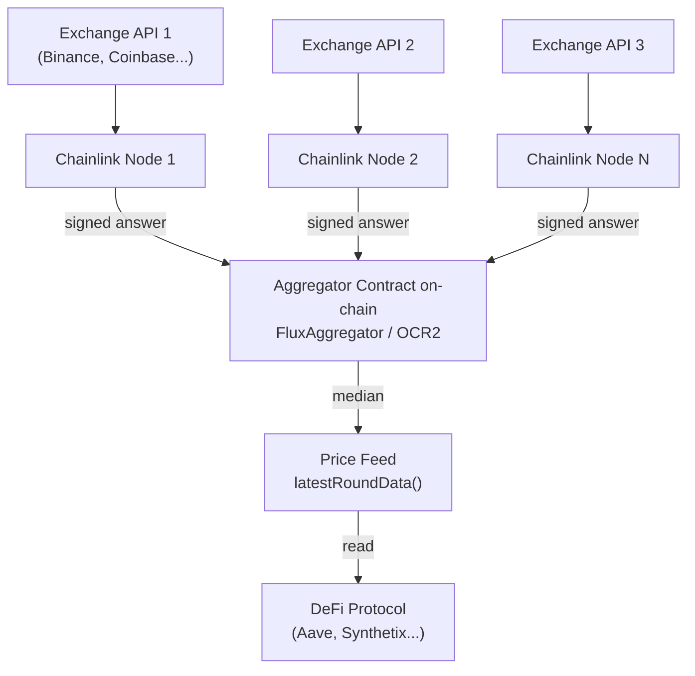

> **Prerequisites**: [[09-smart-contracts-abi-logs|09. Smart Contracts, ABI & Logs]], [[11-json-rpc-external-interaction|11. JSON-RPC & External Interaction]]
> **Objectives**:
> - Hiểu Oracle Problem — tại sao smart contract không thể tự lấy dữ liệu ngoài
> - Phân biệt push oracle, pull oracle, request-response oracle
> - Hiểu kiến trúc Chainlink Price Feeds hoạt động như thế nào
> - Biết 5 loại bridge với trust model và trade-off khác nhau
> - Hiểu rủi ro bảo mật của bridges — tại sao chúng là mục tiêu hack lớn nhất

---

## Motivation

Smart contract trên Ethereum là **deterministic** — cùng input luôn cho cùng output trên mọi node. Điều này tạo ra một vấn đề cơ bản: **contract không thể tự lấy dữ liệu từ thế giới bên ngoài** (giá ETH/USD, kết quả bầu cử, tỷ giá ngoại tệ) vì dữ liệu đó là non-deterministic — mỗi node sẽ nhận kết quả khác nhau.

Đây là **Oracle Problem** — và giải quyết nó là điều kiện tiên quyết để DeFi (Decentralized Finance) tồn tại. Đồng thời, khi Ethereum mở rộng sang nhiều L2 và chains, **cross-chain bridges** trở thành cơ sở hạ tầng thiết yếu — và cũng là mục tiêu của những vụ hack tốn kém nhất trong lịch sử crypto.

---

## Concept: Oracle Problem

> [!definition] Definition 15.1 — Oracle Problem
> **Smart contracts không thể thực hiện HTTP requests** hay truy cập bất kỳ dữ liệu nào ngoài blockchain. Lý do: mọi node phải re-execute mọi transaction và cho cùng kết quả. Nếu transaction gọi `https://api.coingecko.com/price/ETH`, mỗi node sẽ nhận kết quả khác nhau tại thời điểm khác nhau → không có đồng thuận.
>
> **Oracle** là giải pháp: một bên thứ ba (trusted hoặc decentralized) **đưa dữ liệu từ ngoài vào on-chain** thông qua transactions thông thường.

Dữ liệu oracle phổ biến trong DeFi:

| Loại dữ liệu | Ứng dụng |
|---|---|
| Giá token (ETH/USD, BTC/USD) | Lending protocols, perpetuals, options |
| Randomness (VRF) | NFT minting, games, lotteries |
| Tỷ giá fiat | Stablecoin collateral |
| Kết quả sự kiện | Prediction markets |
| Dữ liệu on-chain từ chain khác | Cross-chain DeFi |

---

## Concept: Ba Mô Hình Oracle

> [!definition] Definition 15.2 — Push Oracle
> **Push oracle**: Data providers **chủ động đẩy** dữ liệu on-chain theo lịch định kỳ hoặc khi dữ liệu thay đổi vượt ngưỡng (deviation threshold).
>
> - Dữ liệu luôn sẵn sàng on-chain → contract đọc ngay, không cần chờ
> - Tốn gas để update thường xuyên
> - Ví dụ: **Chainlink Price Feeds**, Uniswap v3 TWAP

> [!definition] Definition 15.3 — Pull Oracle
> **Pull oracle**: Dữ liệu được **ký off-chain** bởi data providers, người dùng tự **pull và verify** on-chain khi cần giao dịch.
>
> - Tiết kiệm gas hơn push (không phải update liên tục)
> - Dữ liệu fresh hơn vì không bị ràng buộc bởi update frequency
> - Ví dụ: **Pyth Network** (confidence intervals + signed prices), **Chronicle**
>
> Flow: User nhận signed price từ Pyth API → Submit kèm transaction → Contract verify signature on-chain → Dùng price

> [!definition] Definition 15.4 — Request-Response Oracle
> **Request-Response**: Contract gửi yêu cầu, oracle node thực hiện công việc ngoài chain, sau đó gọi lại contract với kết quả.
>
> - Phù hợp với dữ liệu theo yêu cầu (on-demand), không cần cập nhật liên tục
> - Ví dụ: **Chainlink VRF** (random numbers), **Chainlink Functions** (arbitrary computation), **Chainlink Any API**

---

## Concept: Chainlink Price Feeds — Kiến Trúc Chi Tiết

Chainlink là oracle network phi tập trung lớn nhất. Hãy trace kiến trúc của **Chainlink Price Feeds** (ETH/USD):



**Cơ chế OCR (Off-Chain Reporting)**:

Thay vì mỗi node submit on-chain riêng (tốn nhiều gas), **OCR2** dùng:
1. Các nodes trao đổi với nhau off-chain, tính median
2. Chỉ **một node** submit aggregated answer + chữ ký tập thể (threshold signature)
3. Aggregator contract verify aggregate signature → chấp nhận kết quả
4. Tiết kiệm gas hơn ~90% so với mô hình cũ

**Cập nhật khi nào?**
- **Deviation trigger**: Giá thay đổi ≥ 0.5% so với last on-chain price → update ngay
- **Heartbeat**: Dù giá không đổi, update sau mỗi 1 giờ (tùy feed)

### Đọc Chainlink Price Feed từ Solidity

```solidity
interface AggregatorV3Interface {
    function latestRoundData() external view returns (
        uint80 roundId,
        int256 answer,        // giá × 10^decimals
        uint256 startedAt,
        uint256 updatedAt,    // timestamp lần update cuối
        uint80 answeredInRound
    );
    function decimals() external view returns (uint8);
}

contract PriceConsumer {
    AggregatorV3Interface internal priceFeed;

    constructor() {
        // ETH/USD feed trên Ethereum mainnet
        priceFeed = AggregatorV3Interface(
            0x5f4eC3Df9cbd43714FE2740f5E3616155c5b8419
        );
    }

    function getETHPrice() public view returns (int256) {
        (, int256 price, , uint256 updatedAt, ) = priceFeed.latestRoundData();
        require(block.timestamp - updatedAt < 3600, "Stale price");
        return price / 10**8;  // ETH/USD feed có 8 decimals
    }
}
```

> [!warning] Stale price attack
> Nếu oracle không update trong một thời gian dài (network issue, oracle downtime), `updatedAt` sẽ lỗi thời. **Luôn kiểm tra `updatedAt`** trước khi dùng giá. Nhiều protocol bị hack vì dùng stale price.

---

## Concept: Cross-chain Bridges

> [!definition] Definition 15.5 — Cross-chain Bridge
> **Bridge** là hệ thống cho phép chuyển assets hoặc messages giữa hai blockchain độc lập. Thách thức: hai chain không biết về trạng thái của nhau — cần một cơ chế thứ ba để verify.

### 5 Mô Hình Bridge Theo Trust Level

**1. Native/Canonical Bridge — Trustless (chậm)**

Dùng cryptographic proofs (Merkle proof, ZK proof) để verify trạng thái của source chain trực tiếp trên destination chain.

```text
Deposit ETH to L1 → L1 lock contract
     ↓ (Merkle proof hoặc ZK proof của event)
L2 bridge contract verify proof → Mint ETH on L2
```

Ví dụ: Optimism Official Bridge (7-day withdrawal), Arbitrum Bridge, zkSync canonical bridge. Trustless nhất nhưng chậm nhất.

**2. Multisig Bridge — Trusted Committee**

Một ủy ban N-of-M validators ký xác nhận rằng một sự kiện đã xảy ra trên source chain:

```text
Lock ETH on Ethereum → M validators observe → N of M ký xác nhận → Release on destination
```

Rủi ro: Nếu N validators bị compromise → toàn bộ funds bị mất. Vụ Ronin Bridge ($625M, 2022) là ví dụ điển hình: 5/9 validators bị hack.

**3. Optimistic Bridge — Watchers**

Tương tự Optimistic Rollup: assume valid, có challenge period.

```text
Relayer post message → 7-day window → Watchers check
   → No fraud: Release on destination
   → Fraud found: Relayer slashed, message invalidated
```

Ví dụ: Connext, Hop Protocol (với AMM liquidity).

**4. ZK Light Client Bridge — Trustless + Fast**

Dùng ZK proof để verify consensus của source chain on-chain:

```text
Source chain block header + validator signatures
     ↓ ZK proof: "These signatures are valid for this chain"
Destination chain verifier → Accept state update
```

Ví dụ: Succinct's SP1, Polymer, zkBridge. Trustless như canonical bridge nhưng nhanh hơn nhiều. Đây là hướng phát triển tương lai.

**5. Liquidity Network — Instant (Trust Routers)**

Không lock-mint — dùng liquidity providers:

```text
User wants ETH on Arbitrum →
   Router advance-pays on Arbitrum immediately
   → User's ETH locked on Ethereum
   → Router rebalances asynchronously
```

Ví dụ: Across Protocol, Stargate. Nhanh nhất (~1 phút), nhưng phụ thuộc vào router solvency.

### So Sánh Bridges

| Bridge Type | Trust | Speed | Security |
|---|---|---|---|
| Native/Canonical | Trustless | Chậm (7 ngày) | Highest |
| ZK Light Client | Trustless | Nhanh (~mins) | Highest (crypto) |
| Optimistic | Semi-trust | Trung bình | High |
| Multisig | Trusted committee | Nhanh | Medium (N-of-M) |
| Liquidity Network | Trust routers | Rất nhanh | Medium |

---

## Concept: Tại Sao Bridges Bị Hack Nhiều?

Bridges bảo vệ một lượng lớn TVL (Total Value Locked) — đây là honeypot hấp dẫn nhất trong crypto:

> [!warning] Các vụ bridge hack lớn nhất
>
> | Bridge | Year | Amount | Exploit type |
> |--------|------|--------|-------------|
> | Ronin (Axie) | 2022 | $625M | 5/9 validator compromise |
> | Wormhole | 2022 | $320M | Signature verification bug |
> | Nomad | 2022 | $190M | Merkle proof validation bug |
> | Horizon (Harmony) | 2022 | $100M | 2/5 multisig compromise |

**Lý do bridge dễ bị hack:**
1. **Phức tạp**: Bridge code verify trạng thái của nhiều chains — mỗi chain có đặc điểm khác nhau
2. **Giá trị cao**: Một exploit duy nhất có thể rút toàn bộ TVL
3. **Trusted components**: Multisig, relayers, oracles — mỗi điểm tin tưởng là attack surface
4. **Cross-chain messaging bugs**: Verify signature off-chain, parse message format sai → attacker forge messages

**Nguyên tắc vàng**: Minimize trust assumptions. Dùng ZK proof hoặc canonical bridge khi có thể. Không bridge số tiền lớn qua multisig bridge.

---

## Worked Example — Đọc Chainlink Aggregator với Python

```python
from web3 import Web3
from eth_abi import decode

ETH_USD_FEED = "0x5f4eC3Df9cbd43714FE2740f5E3616155c5b8419"
AGGREGATOR_ABI_FRAGMENT = [
    {"name": "latestRoundData", "type": "function",
     "inputs": [], "outputs": [
         {"name": "roundId",         "type": "uint80"},
         {"name": "answer",          "type": "int256"},
         {"name": "startedAt",       "type": "uint256"},
         {"name": "updatedAt",       "type": "uint256"},
         {"name": "answeredInRound", "type": "uint80"},
     ], "stateMutability": "view"},
    {"name": "decimals", "type": "function",
     "inputs": [], "outputs": [{"name": "", "type": "uint8"}],
     "stateMutability": "view"},
]

w3 = Web3(Web3.HTTPProvider("https://eth.llamarpc.com"))
feed = w3.eth.contract(address=ETH_USD_FEED, abi=AGGREGATOR_ABI_FRAGMENT)

# Đọc giá ETH/USD
round_id, answer, started_at, updated_at, answered_in = feed.functions.latestRoundData().call()
decimals = feed.functions.decimals().call()

price_usd = answer / 10**decimals
import time
staleness = time.time() - updated_at

print(f"ETH/USD Price : ${price_usd:,.2f}")
print(f"Last updated  : {staleness:.0f}s ago")
print(f"Round ID      : {round_id}")
print(f"Stale?        : {'YES ⚠️' if staleness > 3600 else 'No'}")
```

---

## Summary / Key Takeaways

- **Oracle Problem**: Smart contract không thể đọc dữ liệu ngoài chain — cần oracle làm trung gian.
- **Push oracle** (Chainlink Feeds): Update on-chain định kỳ. Luôn check `updatedAt` để tránh stale price.
- **Pull oracle** (Pyth): Giá được ký off-chain, user submit khi cần. Fresher, rẻ hơn.
- **Request-response** (VRF, Functions): Theo yêu cầu, phù hợp randomness và arbitrary computation.
- **Bridge trust levels**: Canonical (trustless, chậm) → ZK light client (trustless, nhanh) → Optimistic → Multisig → Liquidity network (fast, trust routers).
- **Bridges là honeypot** lớn nhất — hàng tỉ USD bị hack. Ưu tiên canonical bridge và ZK bridge.

---

## References

- Chainlink docs — [docs.chain.link](https://docs.chain.link)
- ethereum.org — [Oracles](https://ethereum.org/en/developers/docs/oracles/)
- Pyth Network — [pyth.network/documentation](https://docs.pyth.network)
- L2Beat bridges — [l2beat.com/bridges](https://l2beat.com/bridges)
- ethereum.org — [Bridges](https://ethereum.org/en/bridges/)
- Vitalik — [Trust models for bridges](https://old.reddit.com/r/ethereum/comments/rwojtk/ama_we_are_the_efs_research_team_pt_7_07_january/hrngyk8/)
