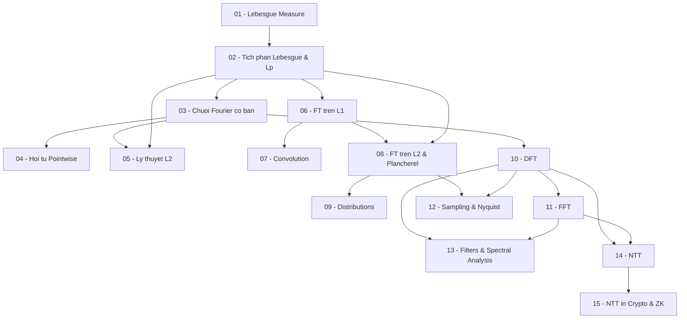

> **Level**: Graduate (Phân tích hàm, Measure Theory)
> **Background**: Giải tích 1/2, Đại số tuyến tính, Xác suất & Thống kê
> **Python/NumPy**: Có — code minh họa kèm theo mỗi lesson
> **Sources**: Stein & Shakarchi *Fourier Analysis* (Princeton); Folland *Real Analysis*; Körner *Fourier Analysis*; Rudin *Real & Complex Analysis*

---

## Modules & Lessons

### Module 0 — Nền tảng (Prerequisites)

| # | Title | Key Concepts | Prerequisites | Difficulty |
|---|-------|-------------|---------------|------------|
| 01 | Lebesgue Measure & Sigma-Algebras | σ-algebra, Borel sets, Lebesgue outer measure, measurable sets, null sets | Calculus 1/2 | ★★★☆☆ |
| 02 | Tích phân Lebesgue & Không gian L^p | Simple functions, MCT, DCT, Fatou; L^p spaces, Hölder/Minkowski, Riesz-Fischer | Lesson 01 | ★★★★☆ |

### Module 1 — Fourier Series (Lý thuyết cổ điển)

| # | Title | Key Concepts | Prerequisites | Difficulty |
|---|-------|-------------|---------------|------------|
| 03 | Chuỗi Fourier — Định nghĩa & Ví dụ | Hàm tuần hoàn, hệ số Fourier, complex exponentials, sóng vuông/tam giác, Python FFT | Lesson 02 | ★★☆☆☆ |
| 04 | Hội tụ Pointwise & Đồng đều | Dirichlet kernel, Fejér kernel, Gibbs phenomenon, Cesàro summability, Dirichlet-Jordan | Lesson 03 | ★★★★☆ |
| 05 | Lý thuyết L² của Chuỗi Fourier | Hilbert space L²([0,2π]), trực giao, Parseval's identity, completeness, best approximation | Lessons 02, 03 | ★★★☆☆ |

### Module 2 — Fourier Transform (Liên tục)

| # | Title | Key Concepts | Prerequisites | Difficulty |
|---|-------|-------------|---------------|------------|
| 06 | Fourier Transform trên L¹(ℝ) | Định nghĩa, shift/scale/modulation, Riemann-Lebesgue lemma, inversion theorem | Lesson 02 | ★★★☆☆ |
| 07 | Convolution & Phép biến đổi | Convolution theorem, approximate identities, Gaussian kernel, ứng dụng PDE | Lesson 06 | ★★★☆☆ |
| 08 | Fourier Transform trên L² & Plancherel | Schwartz space S(R), mở rộng sang L², Plancherel theorem, Paley-Wiener | Lessons 02, 06 | ★★★★☆ |
| 09 | Distributions & Không gian Tempered | Tempered distributions S'(R), Dirac delta, FT của distributions, principal value | Lesson 08 | ★★★★☆ |

### Module 3 — Discrete Fourier Transform & FFT

| # | Title | Key Concepts | Prerequisites | Difficulty |
|---|-------|-------------|---------------|------------|
| 10 | Discrete Fourier Transform (DFT) | Định nghĩa DFT/IDFT, Vandermonde, circular convolution, DFT properties, numpy.fft | Lesson 03 | ★★☆☆☆ |
| 11 | Fast Fourier Transform (FFT) | Cooley-Tukey algorithm, butterfly diagram, bit-reversal, O(n log n), Python từ đầu | Lesson 10 | ★★★☆☆ |

### Module 4 — Ứng dụng DSP

| # | Title | Key Concepts | Prerequisites | Difficulty |
|---|-------|-------------|---------------|------------|
| 12 | Sampling & Nyquist-Shannon Theorem | Ideal sampling, aliasing, Nyquist rate, reconstruction, Shannon proof via FT, Python demo | Lessons 08, 10 | ★★★☆☆ |
| 13 | Filters & Spectral Analysis | FIR/IIR filters, frequency response, STFT, spectrogram, windowing, audio DSP demo | Lessons 10, 11 | ★★★☆☆ |

### Module 5 — Ứng dụng Cryptography & ZK

| # | Title | Key Concepts | Prerequisites | Difficulty |
|---|-------|-------------|---------------|------------|
| 14 | Number Theoretic Transform (NTT) | DFT over F_q, primitive root of unity mod q, NTT/INTT, negacyclic NTT, fast NTT, Python | Lessons 10, 11 | ★★★★☆ |
| 15 | NTT trong Lattice Crypto & ZK Proofs | Polynomial multiplication via NTT, Ring-LWE, Kyber/Dilithium, NTT in PLONK/FRI/STARKs | Lesson 14 | ★★★★★ |

---

## Appendix Candidates

| ID | Theorem | Related Lesson | Notes |
|----|---------|----------------|-------|
| A0 | Riemann-Lebesgue Lemma | 06 | Chứng minh đầy đủ qua dense subsets |
| A1 | Plancherel Theorem | 08 | Full proof via Schwartz space extension + isometry |
| A2 | Fejér's Theorem | 04 | Hội tụ Cesàro của chuỗi Fourier — chứng minh chi tiết |
| A3 | Cooley-Tukey FFT Derivation | 11 | Từng bước divide-and-conquer, correctness proof |

---

## Dependency Graph

---

## Progress Tracker

- [ ] [[00-roadmap|00. Roadmap]]
- [ ] [[01-lebesgue-measure|01. Lebesgue Measure & Sigma-Algebras]]
- [ ] [[02-lebesgue-integral-lp|02. Tích phân Lebesgue & Không gian L^p]]
- [ ] [[03-fourier-series-intro|03. Chuỗi Fourier — Định nghĩa & Ví dụ]]
- [ ] [[04-pointwise-convergence|04. Hội tụ Pointwise & Đồng đều]]
- [ ] [[05-l2-theory|05. Lý thuyết L² của Chuỗi Fourier]]
- [ ] [[06-fourier-transform-l1|06. Fourier Transform trên L¹(ℝ)]]
- [ ] [[07-convolution|07. Convolution & Phép biến đổi]]
- [ ] [[08-fourier-transform-l2|08. Fourier Transform trên L² & Plancherel]]
- [ ] [[09-distributions|09. Distributions & Không gian Tempered]]
- [ ] [[10-dft|10. Discrete Fourier Transform (DFT)]]
- [ ] [[11-fft|11. Fast Fourier Transform (FFT)]]
- [ ] [[12-sampling|12. Sampling & Nyquist-Shannon Theorem]]
- [ ] [[13-filters|13. Filters & Spectral Analysis]]
- [ ] [[14-ntt|14. Number Theoretic Transform (NTT)]]
- [ ] [[15-ntt-crypto|15. NTT trong Lattice Crypto & ZK Proofs]]
