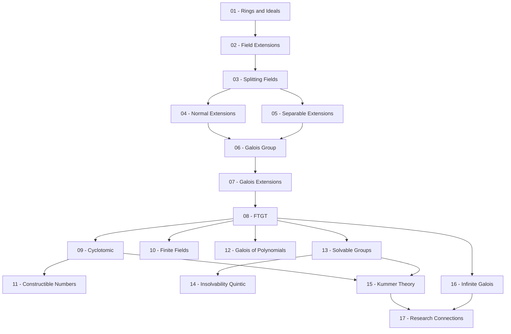

> **Level**: Research-adjacent
> **Background**: Group Theory, Linear Algebra, Ring/Field cơ bản (không có Ideal)
> **SageMath**: Có
> **Plugin Theorem**: Không
> **Nguồn chính**: Dummit & Foote *Abstract Algebra* (Chương 13–14), J.S. Milne *Fields and Galois Theory*, Ian Stewart *Galois Theory* (4th ed.)

---

## Module 0 — Nền tảng Ring & Field *(2 bài)*

| # | Tiêu đề | Key Concepts | Prerequisites | Độ khó |
|---|---------|-------------|---------------|--------|
| 01 | Rings, Ideals và Polynomial Rings | Ring, ideal, quotient ring $R/I$, $F[x]$, irreducible polynomial, Eisenstein, UFD/PID/ED | — | ★★☆☆☆ |
| 02 | Field Extensions — Cấu trúc Đại số | Field extension $L/K$, degree $[L:K]$, algebraic/transcendental, minimal polynomial, $K(\alpha) \cong K[x]/(p)$, Tower Law | 01 | ★★★☆☆ |

## Module 1 — Xây dựng Splitting Fields *(3 bài)*

| # | Tiêu đề | Key Concepts | Prerequisites | Độ khó |
|---|---------|-------------|---------------|--------|
| 03 | Splitting Fields và Algebraic Closure | Splitting field, tính tồn tại & duy nhất, algebraic closure $\bar{K}$, Kronecker's theorem | 02 | ★★★☆☆ |
| 04 | Normal Extensions | Normal extension, đặc trưng tương đương, Galois closure | 03 | ★★★☆☆ |
| 05 | Separable Extensions | Multiple roots, formal derivative, separable polynomial/extension, perfect fields, characteristic $p$ | 03, 04 | ★★★★☆ |

## Module 2 — Lý thuyết Galois Cốt lõi *(3 bài)*

| # | Tiêu đề | Key Concepts | Prerequisites | Độ khó |
|---|---------|-------------|---------------|--------|
| 06 | Nhóm Galois và Fixed Fields | $K$-automorphism, $\operatorname{Aut}(L/K)$, fixed field $L^H$, Artin's theorem, linear independence of characters | 04, 05 | ★★★★☆ |
| 07 | Galois Extensions | Định nghĩa tương đương (normal + separable), $\lvert\operatorname{Gal}(L/K)\rvert = [L:K]$, ví dụ | 06 | ★★★★☆ |
| 08 | Fundamental Theorem of Galois Theory | Galois correspondence, order-reversing bijection, normal subgroup $\leftrightarrow$ normal extension, $\operatorname{Gal}(L^H/K) \cong G/H$ | 07 | ★★★★★ |

## Module 3 — Ứng dụng Cổ điển *(4 bài)*

| # | Tiêu đề | Key Concepts | Prerequisites | Độ khó |
|---|---------|-------------|---------------|--------|
| 09 | Cyclotomic Extensions | Roots of unity $\zeta_n$, cyclotomic polynomial $\Phi_n(x)$, $\operatorname{Gal}(\mathbb{Q}(\zeta_n)/\mathbb{Q}) \cong (\mathbb{Z}/n\mathbb{Z})^\times$ | 08 | ★★★★☆ |
| 10 | Finite Fields và Frobenius | $\mathbb{F}_{p^n}$ tồn tại & duy nhất, $\operatorname{Gal}(\mathbb{F}_{p^n}/\mathbb{F}_p) \cong \mathbb{Z}/n\mathbb{Z}$, Frobenius automorphism | 08 | ★★★☆☆ |
| 11 | Constructible Numbers | Constructible coordinates, ruler-and-compass impossibilities, regular $n$-gon, định lý Gauss-Wantzel | 09 | ★★★★☆ |
| 12 | Galois Groups của Polynomials | Discriminant, resolvent cubic, tính $\operatorname{Gal}(f)$ bậc 2–4, symmetric functions, $\operatorname{Gal}(f) \hookrightarrow S_n$ | 08, 09 | ★★★★☆ |

## Module 4 — Solvability và Abel–Ruffini *(2 bài)*

| # | Tiêu đề | Key Concepts | Prerequisites | Độ khó |
|---|---------|-------------|---------------|--------|
| 13 | Solvable Groups và Radical Extensions | Solvable group, derived series, radical tower, radical extension | 08 (+ Group Theory: composition series) | ★★★★☆ |
| 14 | Insolvability of the Quintic | Galois solvability criterion, $A_5$ simple, $S_5$ không solvable, Abel–Ruffini theorem, ví dụ $x^5 - 6x + 3$ | 13 | ★★★★★ |

## Module 5 — Nâng cao / Research-Adjacent *(3 bài)*

| # | Tiêu đề | Key Concepts | Prerequisites | Độ khó |
|---|---------|-------------|---------------|--------|
| 15 | Kummer Theory | Kummer extension, cyclic extensions of degree $n$, $\mu_n \subset K$, duality với abelian extensions | 09, 13 | ★★★★★ |
| 16 | Infinite Galois Extensions | Profinite groups, Krull topology, inverse limit, absolute Galois group $\operatorname{Gal}(\bar{\mathbb{Q}}/\mathbb{Q})$ | 08 | ★★★★★ |
| 17 | Kết nối Research | Inverse Galois problem, Kronecker–Weber theorem, glimpse vào Class Field Theory | 09, 15, 16 | ★★★★★ |

---

## Appendix Candidates

| ID | Định lý | Bài liên quan | Ghi chú |
|----|---------|--------------|---------|
| A0 | Artin's Theorem — Linear Independence of Characters | 06 | Chứng minh kỹ thuật, dài |
| A1 | Proof of the Fundamental Theorem of Galois Theory | 08 | Cả hai chiều, đầy đủ |
| A2 | Primitive Element Theorem | 07 | Kỹ thuật hữu ích, độc lập |
| A3 | Galois Solvability Criterion — Full Proof | 13, 14 | Phần kỹ thuật nhất của Module 4 |

---

## Dependency Graph

*Sơ đồ phụ thuộc: mũi tên nghĩa là "lesson đầu là prerequisite cho lesson sau".*

---

## Progress Tracker

- [ ] [[00-roadmap|00. Roadmap]]
- [ ] [[01-rings-ideals-polynomial-rings|01. Rings, Ideals và Polynomial Rings]]
- [ ] [[02-field-extensions|02. Field Extensions]]
- [ ] [[03-splitting-fields|03. Splitting Fields và Algebraic Closure]]
- [ ] [[04-normal-extensions|04. Normal Extensions]]
- [ ] [[05-separable-extensions|05. Separable Extensions]]
- [ ] [[06-galois-group-fixed-fields|06. Nhóm Galois và Fixed Fields]]
- [ ] [[07-galois-extensions|07. Galois Extensions]]
- [ ] [[08-fundamental-theorem|08. Fundamental Theorem of Galois Theory]]
- [ ] [[09-cyclotomic-extensions|09. Cyclotomic Extensions]]
- [ ] [[10-finite-fields-frobenius|10. Finite Fields và Frobenius]]
- [ ] [[11-constructible-numbers|11. Constructible Numbers]]
- [ ] [[12-galois-groups-polynomials|12. Galois Groups của Polynomials]]
- [ ] [[13-solvable-groups-radical-extensions|13. Solvable Groups và Radical Extensions]]
- [ ] [[14-insolvability-quintic|14. Insolvability of the Quintic]]
- [ ] [[15-kummer-theory|15. Kummer Theory]]
- [ ] [[16-infinite-galois-extensions|16. Infinite Galois Extensions]]
- [ ] [[17-research-connections|17. Kết nối Research]]
