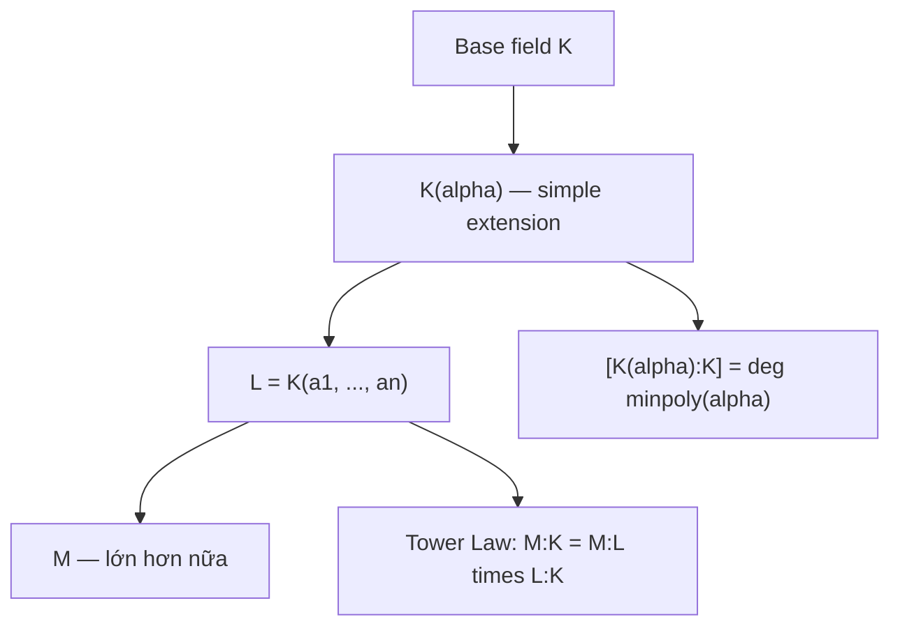

> **Prerequisites**: [[01-rings-ideals-polynomial-rings|01. Rings, Ideals và Polynomial Rings]]
> **Objectives**:
> - Hiểu field extension $L/K$ là gì và degree $[L:K]$ đo điều gì
> - Phân biệt phần tử đại số (algebraic) và siêu việt (transcendental)
> - Nắm vững minimal polynomial và tính bất khả quy của nó
> - Chứng minh đẳng cấu $K(\alpha) \cong K[x]/(p_\alpha)$
> - Áp dụng Tower Law tính degree của các extension lồng nhau

---

## Motivation / Intuition

Bài toán Galois Theory bắt đầu từ một câu hỏi rất cụ thể: đa thức $x^2 - 2$ không có nghiệm trong $\mathbb{Q}$. Làm sao ta "mở rộng" $\mathbb{Q}$ để nó có nghiệm?

Ý tưởng: bước vào field lớn hơn — một **extension** của $\mathbb{Q}$. Kết quả là $\mathbb{Q}(\sqrt{2}) = \{a + b\sqrt{2} \mid a, b \in \mathbb{Q}\}$, một field chứa $\mathbb{Q}$ và có $\sqrt{2}$ là nghiệm của $x^2 - 2$.

Câu hỏi tiếp theo: extension này "lớn" cỡ nào? Cách đo lường tự nhiên là xem $\mathbb{Q}(\sqrt{2})$ như một **vector space** trên $\mathbb{Q}$. Dimension của vector space này, gọi là **degree** $[\mathbb{Q}(\sqrt{2}):\mathbb{Q}] = 2$, mã hóa thông tin cốt lõi về extension.

Đây là chìa khóa: *Galois Theory dịch câu hỏi về field extensions thành câu hỏi về nhóm*. Nhưng trước tiên, ta cần hiểu field extensions là gì.

---

## Field Extensions

### Definition

> [!definition] Definition 2.1 — Field Extension
> Cho $K$ và $L$ là các field. Ta nói $L$ là một **field extension** (mở rộng field) của $K$, ký hiệu $L/K$ hoặc $K \hookrightarrow L$, nếu $K$ là subfield của $L$ (tức là $K \subseteq L$ và phép toán của $K$ tương thích với $L$).
>
> Trong trường hợp đó, $K$ được gọi là **base field** (field cơ sở) và $L$ được gọi là **extension field**.

> [!note] Remark 2.2
> Ký hiệu $L/K$ **không** phải là quotient! Đây chỉ là ký hiệu tiện lợi, đọc là "$L$ over $K$" hay "$L$ trên $K$". Nó nhấn mạnh rằng $L$ chứa $K$ và ta đang quan tâm đến mối quan hệ giữa hai field này.

### Degree của một Extension

Khi $L/K$ là field extension, ta có thể xem $L$ như một $K$-vector space: nhân vô hướng là phép nhân trong $L$ với các "hệ số" trong $K$.

> [!definition] Definition 2.3 — Degree (Bậc) của Extension
> **Degree** (bậc) của field extension $L/K$, ký hiệu $[L:K]$, là dimension của $L$ như một $K$-vector space:
>
> $$
> [L:K] = \dim_K L
> $$
>
> Nếu $[L:K] < \infty$, ta nói $L/K$ là **finite extension** (extension hữu hạn). Nếu $[L:K] = \infty$, đó là **infinite extension**.

> [!example] Example 2.4 — Degree của các extension quen thuộc
> - $[\mathbb{C}:\mathbb{R}] = 2$. Cơ sở: $\{1, i\}$, vì mọi $z \in \mathbb{C}$ viết được dạng $a + bi$ với $a, b \in \mathbb{R}$.
> - $[\mathbb{R}:\mathbb{Q}] = \infty$. $\mathbb{R}$ là vô hạn chiều trên $\mathbb{Q}$.
> - $[\mathbb{Q}(\sqrt{2}):\mathbb{Q}] = 2$. Cơ sở: $\{1, \sqrt{2}\}$.
> - $[\mathbb{Q}(\sqrt[3]{2}):\mathbb{Q}] = 3$. Cơ sở: $\{1, \sqrt[3]{2}, \sqrt[3]{4}\}$.

---

## Algebraic và Transcendental Elements

### Definition

> [!definition] Definition 2.5 — Algebraic và Transcendental
> Cho $L/K$ là field extension và $\alpha \in L$. Ta nói:
>
> - $\alpha$ là **algebraic** (đại số) **over $K$** nếu tồn tại đa thức $f(x) \in K[x]$, $f \neq 0$, sao cho $f(\alpha) = 0$.
> - $\alpha$ là **transcendental** (siêu việt) **over $K$** nếu không tồn tại đa thức khác không trong $K[x]$ nhận $\alpha$ là nghiệm.
>
> Nếu mọi $\alpha \in L$ đều algebraic over $K$, ta nói $L/K$ là **algebraic extension**.

> [!example] Example 2.6
> - $\sqrt{2}$ là algebraic over $\mathbb{Q}$: là nghiệm của $x^2 - 2 \in \mathbb{Q}[x]$.
> - $\sqrt[3]{2}$ là algebraic over $\mathbb{Q}$: là nghiệm của $x^3 - 2$.
> - $i = \sqrt{-1}$ là algebraic over $\mathbb{R}$: là nghiệm của $x^2 + 1$.
> - $\pi$ là transcendental over $\mathbb{Q}$ (Lindemann, 1882) — khó chứng minh!
> - $e$ là transcendental over $\mathbb{Q}$ (Hermite, 1873).

---

## Minimal Polynomial

Khi $\alpha$ là algebraic over $K$, tồn tại rất nhiều đa thức trong $K[x]$ nhận $\alpha$ là nghiệm. Trong số đó, ta quan tâm đến đa thức "nhỏ nhất" và "chuẩn nhất".

### Định nghĩa và Tính chất

> [!definition] Definition 2.7 — Minimal Polynomial
> Cho $\alpha$ algebraic over $K$. **Minimal polynomial** (đa thức tối tiểu) của $\alpha$ trên $K$, ký hiệu $\operatorname{Irr}(\alpha, K)$ hoặc $\operatorname{minpoly}(\alpha, K)$, là đa thức monic (hệ số bậc cao nhất bằng 1) bậc nhỏ nhất trong $K[x]$ nhận $\alpha$ làm nghiệm.

> [!abstract] Theorem 2.8 — Tính chất của Minimal Polynomial
> Cho $\alpha$ algebraic over $K$ và $p(x) = \operatorname{Irr}(\alpha, K)$. Khi đó:
>
> 1. $p(x)$ là **irreducible** trên $K$.
> 2. $p(x)$ là **duy nhất**: nếu $q(x) \in K[x]$ monic irreducible và $q(\alpha) = 0$ thì $q = p$.
> 3. Nếu $f(\alpha) = 0$ với $f \in K[x]$, thì $p(x) \mid f(x)$ trong $K[x]$.

**Proof.**
(1) Giả sử $p = gh$ với $\deg g, \deg h \geq 1$. Khi đó $p(\alpha) = g(\alpha)h(\alpha) = 0$. Vì $L$ là field (nên là integral domain), $g(\alpha) = 0$ hoặc $h(\alpha) = 0$. Điều này cho đa thức có nghiệm $\alpha$ với degree nhỏ hơn $\deg p$, mâu thuẫn với tính tối tiểu.

(2) Gọi $p$ và $q$ đều thỏa điều kiện. Chia: $p = q \cdot s + r$ với $\deg r < \deg q$. Vì $p(\alpha) = q(\alpha) = 0$, ta có $r(\alpha) = 0$. Từ tính tối tiểu của $q$, $r = 0$, tức $q \mid p$. Vì cả hai monic irreducible và $q \mid p$, $p = q$.

(3) Chia $f = p \cdot q + r$ với $\deg r < \deg p$. Thay $\alpha$: $0 = 0 + r(\alpha)$, nên $r(\alpha) = 0$. Từ tính tối tiểu của $p$, $r = 0$. $\blacksquare$

> [!tip] Key Insight 2.9
> Minimal polynomial của $\alpha$ chính là **generator** của ideal $\{f \in K[x] \mid f(\alpha) = 0\}$. Ideal này là $(p(x))$ trong $K[x]$ — điều này hợp lý vì $K[x]$ là PID!

---

## Simple Algebraic Extension: $K(\alpha)$

### Xây dựng và Đẳng cấu Cơ bản

Khi $\alpha$ algebraic over $K$, ta định nghĩa $K(\alpha)$ là field nhỏ nhất chứa $K$ và $\alpha$. Định lý sau đây là cầu nối quan trọng nhất của bài này.

> [!abstract] Theorem 2.10 — $K(\alpha) \cong K[x]/(p(x))$
> Cho $\alpha$ algebraic over $K$ với minimal polynomial $p(x) = \operatorname{Irr}(\alpha, K)$. Khi đó:
>
> 1. **Đẳng cấu field**: $K(\alpha) \cong K[x]/(p(x))$.
> 2. **Cơ sở**: $\left\{1, \alpha, \alpha^2, \ldots, \alpha^{n-1}\right\}$ là một $K$-basis của $K(\alpha)$, với $n = \deg p$.
> 3. **Degree**: $[K(\alpha):K] = \deg p = n$.
> 4. Mọi phần tử của $K(\alpha)$ viết được dạng $a_0 + a_1\alpha + \cdots + a_{n-1}\alpha^{n-1}$ với $a_i \in K$, **duy nhất**.

**Proof.**
Xét **evaluation homomorphism** (đồng cấu định giá trị):

$$
\varphi: K[x] \to K(\alpha), \quad f(x) \mapsto f(\alpha)
$$

Đây là ring homomorphism, với $\ker\varphi = \{f \in K[x] \mid f(\alpha) = 0\} = (p(x))$ (từ Theorem 2.8).

Theo First Isomorphism Theorem cho rings: $K[x]/(p(x)) \cong \operatorname{Im}(\varphi)$.

Vì $p(x)$ irreducible, $K[x]/(p(x))$ là field (Theorem 1.10 từ Lesson 01). Field con của $K(\alpha)$ chứa $K$ và $\alpha$ phải là $K(\alpha)$ (theo tính "nhỏ nhất"). Vậy $\operatorname{Im}(\varphi) = K(\alpha)$.

Phần (2)–(4): mọi $f(\alpha) \in K(\alpha)$ với $f$ có degree $\geq n$ có thể reduce bằng $p(\alpha) = 0$ để đưa về bậc $< n$. Cơ sở $\{1, \alpha, \ldots, \alpha^{n-1}\}$ độc lập tuyến tính vì $p$ là polynomial bậc tối tiểu. $\blacksquare$

> [!example] Example 2.11 — $\mathbb{Q}(\sqrt{2})$
> $p(x) = x^2 - 2 = \operatorname{Irr}(\sqrt{2}, \mathbb{Q})$ (irreducible trên $\mathbb{Q}$ vì không có nghiệm hữu tỉ).
>
> Theo Theorem 2.10: $\mathbb{Q}(\sqrt{2}) \cong \mathbb{Q}[x]/(x^2 - 2)$, với $[\mathbb{Q}(\sqrt{2}):\mathbb{Q}] = 2$.
>
> Cơ sở: $\{1, \sqrt{2}\}$. Mọi phần tử dạng $a + b\sqrt{2}$, $a, b \in \mathbb{Q}$.
>
> Nhân: $(a + b\sqrt{2})(c + d\sqrt{2}) = (ac + 2bd) + (ad + bc)\sqrt{2}$.

> [!example] Example 2.12 — $\mathbb{Q}(\sqrt[3]{2})$
> $p(x) = x^3 - 2 = \operatorname{Irr}(\sqrt[3]{2}, \mathbb{Q})$ (irreducible bởi Eisenstein với $p=2$, hoặc vì không có nghiệm hữu tỉ).
>
> $[\mathbb{Q}(\sqrt[3]{2}):\mathbb{Q}] = 3$. Cơ sở: $\{1, \sqrt[3]{2}, \sqrt[3]{4}\}$.
>
> Phần tử tổng quát: $a + b\sqrt[3]{2} + c\sqrt[3]{4}$ với $a, b, c \in \mathbb{Q}$.

> [!example] Example 2.13 — $\mathbb{F}_2(\alpha)$ với $\alpha^2 + \alpha + 1 = 0$
> Trên $\mathbb{F}_2 = \{0, 1\}$: $p(x) = x^2 + x + 1$ là irreducible (kiểm tra: $p(0) = 1 \neq 0$, $p(1) = 1 \neq 0$).
>
> $\mathbb{F}_2(\alpha) \cong \mathbb{F}_2[x]/(x^2 + x + 1)$ có $[\mathbb{F}_2(\alpha):\mathbb{F}_2] = 2$, tức có $2^2 = 4$ phần tử: $\{0, 1, \alpha, \alpha+1\}$.
>
> Đây chính là $\mathbb{F}_4$, field hữu hạn 4 phần tử!

---

## Tower Law

Nếu ta có "tháp" các extensions $K \subseteq L \subseteq M$, degree nhân theo quy tắc đẹp:

> [!abstract] Theorem 2.14 — Tower Law (Định lý Tháp)
> Cho $K \subseteq L \subseteq M$ là các field extensions hữu hạn. Khi đó:
>
> $$
> [M:K] = [M:L] \cdot [L:K]
> $$

**Proof.**
Đặt $[L:K] = m$, $[M:L] = n$. Gọi $\{e_1, \ldots, e_m\}$ là $K$-basis của $L$ và $\{f_1, \ldots, f_n\}$ là $L$-basis của $M$.

Ta chứng minh $\{e_i f_j \mid 1 \leq i \leq m, 1 \leq j \leq n\}$ là $K$-basis của $M$.

**Sinh**: Mọi $x \in M$ viết $x = \sum_j b_j f_j$ với $b_j \in L$ (vì $f_j$ là $L$-basis). Mỗi $b_j = \sum_i a_{ij} e_i$ với $a_{ij} \in K$. Suy ra $x = \sum_{i,j} a_{ij} e_i f_j$.

**Độc lập tuyến tính**: Giả sử $\sum_{i,j} a_{ij} e_i f_j = 0$ với $a_{ij} \in K$. Viết lại: $\sum_j \left(\sum_i a_{ij} e_i\right) f_j = 0$. Vì $f_j$ độc lập tuyến tính trên $L$, $\sum_i a_{ij} e_i = 0$ với mọi $j$. Vì $e_i$ độc lập tuyến tính trên $K$, $a_{ij} = 0$ với mọi $i, j$. $\blacksquare$

> [!example] Example 2.15 — Áp dụng Tower Law
> Xét tháp $\mathbb{Q} \subseteq \mathbb{Q}(\sqrt{2}) \subseteq \mathbb{Q}(\sqrt{2}, \sqrt{3})$.
>
> Ta đã biết $[\mathbb{Q}(\sqrt{2}):\mathbb{Q}] = 2$. Bây giờ $[\mathbb{Q}(\sqrt{2},\sqrt{3}):\mathbb{Q}(\sqrt{2})]$?
>
> Cần kiểm tra xem $\sqrt{3} \in \mathbb{Q}(\sqrt{2})$ hay không. Nếu $\sqrt{3} = a + b\sqrt{2}$ với $a,b \in \mathbb{Q}$, bình phương hai vế: $3 = a^2 + 2b^2 + 2ab\sqrt{2}$. Do $\sqrt{2} \notin \mathbb{Q}$, ta cần $ab = 0$. Nếu $b = 0$: $a^2 = 3$, vô nghiệm hữu tỉ. Nếu $a = 0$: $2b^2 = 3$, vô nghiệm hữu tỉ. Mâu thuẫn.
>
> Vậy $\sqrt{3} \notin \mathbb{Q}(\sqrt{2})$, nên $\operatorname{Irr}(\sqrt{3}, \mathbb{Q}(\sqrt{2})) = x^2 - 3$, và $[\mathbb{Q}(\sqrt{2},\sqrt{3}):\mathbb{Q}(\sqrt{2})] = 2$.
>
> **Tower Law**: $[\mathbb{Q}(\sqrt{2},\sqrt{3}):\mathbb{Q}] = 2 \times 2 = 4$.
>
> Cơ sở của $\mathbb{Q}(\sqrt{2},\sqrt{3})$ trên $\mathbb{Q}$: $\{1, \sqrt{2}, \sqrt{3}, \sqrt{6}\}$.

> [!abstract] Corollary 2.16 — Degree chia hết
> Nếu $[M:K] = n$ thì $[L:K] \mid n$ với mọi intermediate field $K \subseteq L \subseteq M$.

**Proof.** Từ Tower Law: $n = [M:L] \cdot [L:K]$, nên $[L:K] \mid n$. $\blacksquare$

Hệ quả này rất mạnh: nó đặt ra **ràng buộc mạnh** về các intermediate fields có thể tồn tại!

---

## Finite Extensions là Algebraic Extensions

> [!abstract] Theorem 2.17 — Finite $\implies$ Algebraic
> Mọi finite extension $L/K$ đều là algebraic.

**Proof.**
Giả sử $[L:K] = n$. Lấy $\alpha \in L$ bất kỳ. Xét các phần tử $1, \alpha, \alpha^2, \ldots, \alpha^n \in L$ — đây là $n+1$ phần tử trong không gian $n$ chiều $L$ (trên $K$), nên phải **phụ thuộc tuyến tính** trên $K$. Tức tồn tại $c_0, \ldots, c_n \in K$ không đồng thời bằng 0 sao cho $c_0 + c_1\alpha + \cdots + c_n\alpha^n = 0$. Đây chính là một đa thức trong $K[x]$ nhận $\alpha$ làm nghiệm. $\blacksquare$

> [!warning] Counterexample 2.18 — Algebraic không kéo theo finite
> $\bar{\mathbb{Q}} = \{z \in \mathbb{C} \mid z \text{ algebraic over } \mathbb{Q}\}$ là algebraic closure của $\mathbb{Q}$. Extension $\bar{\mathbb{Q}}/\mathbb{Q}$ là **algebraic** (theo định nghĩa) nhưng **infinite**: $[\bar{\mathbb{Q}}:\mathbb{Q}] = \infty$, vì $\mathbb{Q}(\sqrt[n]{2})$ có degree $n$ và $n$ có thể tùy ý lớn.

---

## Sơ đồ tóm tắt



*Sơ đồ: quan hệ giữa extensions và degree.*

---

## SageMath Cheatsheet

```sage
K = QQ
Kx.<x> = PolynomialRing(K)
p = x^2 - 2
print(p.is_irreducible())

L.<a> = NumberField(p)
print(L)
print(L.degree())
print(L.basis())

f = a^3 + a - 1
print(f)

M.<b> = L.extension(x^2 - 3)
print(M.absolute_degree())

alpha = QQ[2^(1/3)]
print(alpha.minpoly())
print(alpha.degree())
```

---

## Summary / Key Takeaways

- **Field extension** $L/K$: $K$ là subfield của $L$; ký hiệu $L/K$ không phải quotient.
- **Degree** $[L:K] = \dim_K L$: số chiều của $L$ như $K$-vector space.
- **Algebraic**: $\alpha \in L$ algebraic over $K$ nếu $f(\alpha) = 0$ cho một $f \in K[x] \setminus \{0\}$.
- **Minimal polynomial** $\operatorname{Irr}(\alpha, K)$: monic, irreducible, unique; chia hết mọi đa thức nhận $\alpha$ làm nghiệm.
- **Đẳng cấu cơ bản**: $K(\alpha) \cong K[x]/(\operatorname{Irr}(\alpha,K))$ với $[K(\alpha):K] = \deg \operatorname{Irr}(\alpha,K)$.
- **Tower Law**: $[M:K] = [M:L] \cdot [L:K]$ — nhân degrees lại khi qua các tầng extension.
- Finite extension $\implies$ algebraic extension. Chiều ngược không đúng.

---

## References

- Dummit, D. S. & Foote, R. M. *Abstract Algebra* (3rd ed.), Chapter 13.1–13.2.
- Milne, J. S. *Fields and Galois Theory*, §§2–3. Có tại https://www.jmilne.org/math/CourseNotes/FT.pdf
- Stewart, I. *Galois Theory* (4th ed.), Chapters 4–6.
- Lang, S. *Algebra* (3rd ed.), Chapter V.
