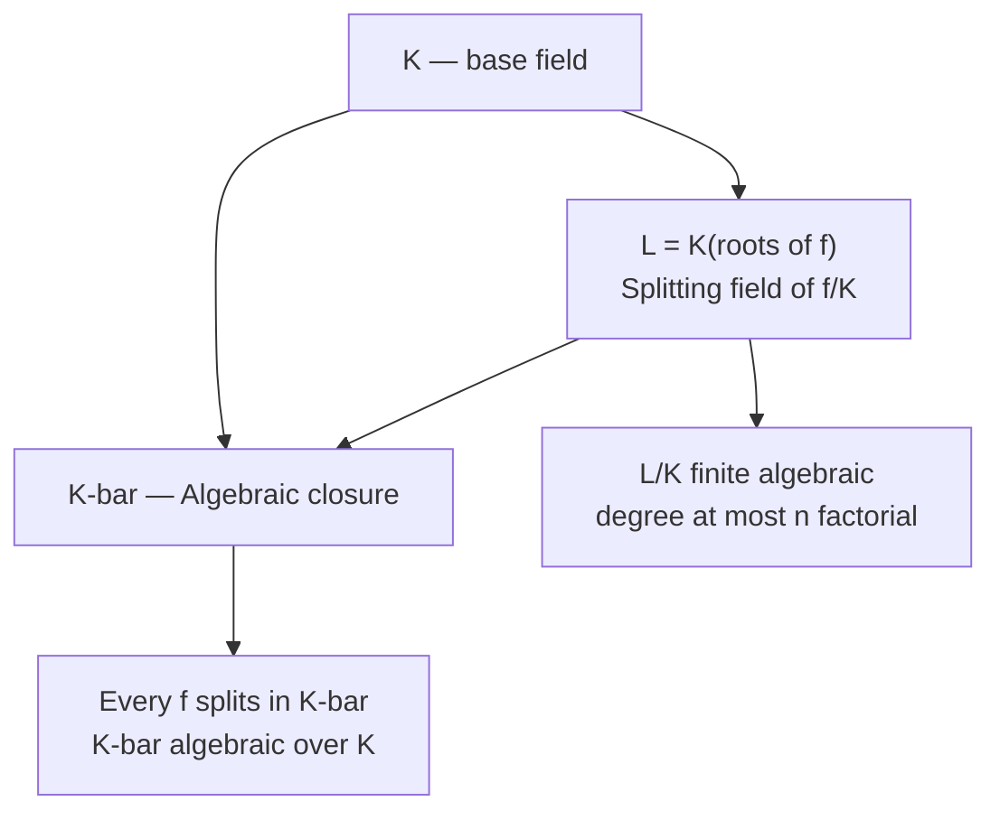

> **Prerequisites**: [[02-field-extensions|02. Field Extensions]]
> **Objectives**:
> - Định nghĩa splitting field và hiểu tại sao nó là extension "nhỏ nhất" chứa tất cả nghiệm
> - Chứng minh splitting field tồn tại và duy nhất (up to isomorphism)
> - Hiểu algebraic closure $\bar{K}$ là gì và tại sao nó tồn tại
> - Nhận diện tính chất đặc trưng của algebraically closed fields
> - Tính splitting field và degree của các ví dụ cụ thể

---

## Motivation / Intuition

Ở Lesson 02, ta học cách "thêm vào" một nghiệm $\alpha$ của $f(x)$ bằng cách lấy extension $K(\alpha) \cong K[x]/(f)$. Nhưng $K(\alpha)$ chỉ chứa **một** nghiệm của $f$ — các nghiệm khác có thể vẫn nằm bên ngoài.

Ví dụ: $f(x) = x^3 - 2$. Trong $\mathbb{Q}(\sqrt[3]{2})$, đa thức $f$ có một nghiệm thực $\sqrt[3]{2}$, nhưng hai nghiệm phức $\sqrt[3]{2}\omega$ và $\sqrt[3]{2}\omega^2$ (với $\omega = e^{2\pi i/3}$) vẫn không có trong $\mathbb{Q}(\sqrt[3]{2}) \subset \mathbb{R}$.

Galois Theory yêu cầu ta làm việc với field chứa **tất cả** nghiệm của $f(x)$. Đó chính là **splitting field** (trường phân rã): extension nhỏ nhất trong đó $f$ phân tích hoàn toàn thành các nhân tử tuyến tính.

Trực giác: splitting field là "sân khấu" đúng để Galois group — nhóm đối xứng giữa các nghiệm — hoạt động.

---

## Splitting Fields

### Definition

> [!definition] Definition 3.1 — Splitting Field
> Cho $K$ là field và $f(x) \in K[x]$ có degree $\geq 1$. Một field extension $L/K$ được gọi là **splitting field** (trường phân rã) của $f$ trên $K$ nếu:
>
> 1. $f$ **phân rã hoàn toàn** trong $L[x]$, tức là:
>
> $$
> f(x) = c(x - \alpha_1)(x - \alpha_2) \cdots (x - \alpha_n), \quad \alpha_i \in L,\ c \in K
> $$
>
> 2. $L$ là **extension nhỏ nhất** với tính chất trên, tức là $L = K(\alpha_1, \alpha_2, \ldots, \alpha_n)$.

> [!note] Remark 3.2
> Điều kiện (2) là thiết yếu: không phải mọi extension chứa tất cả nghiệm đều là splitting field. Ví dụ, $\mathbb{C}$ chứa tất cả nghiệm của $x^2 - 2$, nhưng splitting field là $\mathbb{Q}(\sqrt{2})$, nhỏ hơn nhiều. Splitting field là extension **minimal** với tính chất phân rã hoàn toàn.

### Ví dụ tính Splitting Field

> [!example] Example 3.3 — Splitting field của $x^2 - 2$ trên $\mathbb{Q}$
> Nghiệm: $\pm\sqrt{2}$. Khi ta thêm $\sqrt{2}$, thì $-\sqrt{2} = 0 - \sqrt{2} \in \mathbb{Q}(\sqrt{2})$ cũng tự có.
>
> Vậy splitting field là $\mathbb{Q}(\sqrt{2})$, với $[\mathbb{Q}(\sqrt{2}):\mathbb{Q}] = 2$.
>
> Phân rã: $x^2 - 2 = (x - \sqrt{2})(x + \sqrt{2})$ trong $\mathbb{Q}(\sqrt{2})[x]$.

> [!example] Example 3.4 — Splitting field của $x^3 - 2$ trên $\mathbb{Q}$
> Ba nghiệm: $\alpha_1 = \sqrt[3]{2}$, $\alpha_2 = \sqrt[3]{2}\,\omega$, $\alpha_3 = \sqrt[3]{2}\,\omega^2$,
> với $\omega = e^{2\pi i/3} = \frac{-1 + i\sqrt{3}}{2}$.
>
> Splitting field: $L = \mathbb{Q}(\sqrt[3]{2}, \omega)$.
>
> **Tính degree**: Ta dùng Tower Law qua tháp $\mathbb{Q} \subseteq \mathbb{Q}(\sqrt[3]{2}) \subseteq L$.
>
> - $[\mathbb{Q}(\sqrt[3]{2}):\mathbb{Q}] = 3$ vì $\operatorname{Irr}(\sqrt[3]{2},\mathbb{Q}) = x^3 - 2$.
> - Cần tính $[L:\mathbb{Q}(\sqrt[3]{2})]$. Ta thêm $\omega$ vào $\mathbb{Q}(\sqrt[3]{2})$. Minimal polynomial của $\omega$ trên $\mathbb{Q}$ là $\Phi_3(x) = x^2 + x + 1$ (bậc 2, irreducible). Vì $\mathbb{Q}(\sqrt[3]{2}) \subset \mathbb{R}$ và $\omega \notin \mathbb{R}$, $\omega \notin \mathbb{Q}(\sqrt[3]{2})$, nên $[L:\mathbb{Q}(\sqrt[3]{2})] = 2$.
>
> **Tower Law**: $[L:\mathbb{Q}] = 3 \times 2 = 6$.

> [!example] Example 3.5 — Splitting field của $x^4 - 2$ trên $\mathbb{Q}$
> Bốn nghiệm: $\pm\sqrt[4]{2}$ và $\pm i\sqrt[4]{2}$.
>
> Splitting field: $L = \mathbb{Q}(\sqrt[4]{2}, i)$.
>
> **Degree**: $[\mathbb{Q}(\sqrt[4]{2}):\mathbb{Q}] = 4$. Vì $i \notin \mathbb{Q}(\sqrt[4]{2}) \subset \mathbb{R}$, ta có $[L:\mathbb{Q}(\sqrt[4]{2})] = 2$.
>
> Vậy $[L:\mathbb{Q}] = 4 \times 2 = 8$.

> [!example] Example 3.6 — Splitting field của đa thức đã có đủ nghiệm
> Đôi khi splitting field không cần mở rộng thêm. $f(x) = x^2 - x \in \mathbb{Q}[x]$: nghiệm là $0$ và $1$, đều thuộc $\mathbb{Q}$.
>
> Splitting field là $\mathbb{Q}$ chính nó — không cần extension! $f = x(x-1)$ đã phân rã trong $\mathbb{Q}[x]$.

---

## Tồn tại và Duy nhất của Splitting Field

Hai câu hỏi cơ bản: Splitting field có **luôn tồn tại** không? Nếu có, nó có **duy nhất** không?

### Tồn tại

> [!abstract] Theorem 3.7 — Splitting Field Tồn tại
> Cho $K$ là field và $f(x) \in K[x]$ có degree $n \geq 1$. Khi đó splitting field của $f$ trên $K$ tồn tại và có degree $[L:K] \leq n!$ trên $K$.

**Proof.**
Quy nạp theo $n = \deg f$.

Nếu $f$ phân rã hoàn toàn trong $K[x]$ (tất cả nghiệm đã có trong $K$), thì $L = K$ và $[L:K] = 1 \leq n!$.

Nếu không, lấy một nhân tử irreducible $p(x)$ của $f$ với $\deg p = d \geq 2$. Theo Kronecker's Theorem (từ Lesson 02), tồn tại $K_1 = K[x]/(p(x))$ là field extension chứa một nghiệm $\alpha$ của $p$ (và của $f$). Khi đó $[K_1:K] = d \leq n$.

Trong $K_1[x]$, viết $f(x) = (x - \alpha)g(x)$ với $g \in K_1[x]$ có $\deg g = n - 1$.

Theo giả thuyết quy nạp áp dụng cho $g$ trên $K_1$, tồn tại splitting field $L$ của $g$ trên $K_1$ với $[L:K_1] \leq (n-1)!$.

Khi đó $L$ chứa tất cả nghiệm của $f = (x-\alpha)g$, và $L = K_1(\text{nghiệm của } g) = K(\alpha_1, \ldots, \alpha_n)$.

Tower Law: $[L:K] = [L:K_1] \cdot [K_1:K] \leq (n-1)! \cdot n = n!$. $\blacksquare$

### Duy nhất

Định lý dưới đây là kỹ thuật hơn — nó nói splitting field là **duy nhất up to $K$-isomorphism**: mọi hai splitting field của cùng một đa thức trên $K$ đều đẳng cấu qua isomorphism cố định $K$.

> [!abstract] Theorem 3.8 — Splitting Field Duy nhất up to Isomorphism
> Cho $\sigma: K \xrightarrow{\sim} K'$ là field isomorphism, $f(x) \in K[x]$ và $f'(x) = \sigma(f) \in K'[x]$ (áp $\sigma$ vào các hệ số). Nếu $L$ là splitting field của $f$ trên $K$ và $L'$ là splitting field của $f'$ trên $K'$, thì $\sigma$ mở rộng thành isomorphism $\tilde{\sigma}: L \xrightarrow{\sim} L'$.

**Proof (sketch).** Quy nạp theo $[L:K]$. Nếu $[L:K] = 1$ thì $f$ đã split trong $K$ và $L = K$, tương tự $L' = K'$, và $\tilde{\sigma} = \sigma$. Trong bước quy nạp: lấy $p(x)$ là nhân tử irreducible của $f$ trong $K[x]$ với $\deg p \geq 2$, chọn nghiệm $\alpha \in L$ của $p$ và $\beta \in L'$ của $\sigma(p)$. Bằng Lemma mở rộng isomorphism đơn giản (từ đẳng cấu $K(\alpha) \cong K[x]/(p) \cong K'[x]/(\sigma p) \cong K'(\beta)$), $\sigma$ mở rộng thành $\sigma_1: K(\alpha) \to K'(\beta)$. Áp quy nạp cho splitting field của $f/(x-\alpha)$ trên $K(\alpha)$. $\blacksquare$

> [!abstract] Corollary 3.9
> Splitting field của $f(x) \in K[x]$ là **duy nhất up to $K$-isomorphism**: nếu $L_1$ và $L_2$ đều là splitting field của $f$ trên $K$, thì tồn tại $K$-isomorphism $L_1 \cong L_2$.

Từ đây ta dùng ký hiệu "**the** splitting field" (trường phân rã) mà không lo mơ hồ.

---

## Algebraic Closure

Splitting field giải quyết được cho **một** đa thức. Câu hỏi tự nhiên: có field nào chứa tất cả nghiệm của **mọi** đa thức trên $K$ không?

### Definition

> [!definition] Definition 3.10 — Algebraically Closed Field
> Field $\Omega$ được gọi là **algebraically closed** (đóng đại số) nếu mọi đa thức không hằng $f(x) \in \Omega[x]$ đều có ít nhất một nghiệm trong $\Omega$.

Tương đương: mọi đa thức không hằng trong $\Omega[x]$ đều phân rã thành nhân tử tuyến tính.

> [!example] Example 3.11
> - $\mathbb{C}$ là algebraically closed (Định lý Cơ bản Đại số).
> - $\mathbb{R}$ **không** algebraically closed: $x^2 + 1$ không có nghiệm thực.
> - $\mathbb{Q}$ **không** algebraically closed: $x^2 - 2$ không có nghiệm hữu tỉ.
> - Mọi finite field $\mathbb{F}_q$ **không** algebraically closed: đa thức $\prod_{a \in \mathbb{F}_q}(x - a) + 1$ không có nghiệm.

> [!definition] Definition 3.12 — Algebraic Closure
> Cho $K$ là field. **Algebraic closure** (bao đóng đại số) của $K$, ký hiệu $\bar{K}$, là một algebraic extension của $K$ mà đồng thời là algebraically closed.
>
> Tương đương: $\bar{K}/K$ là algebraic extension và mọi $f(x) \in K[x]$ đều phân rã hoàn toàn trong $\bar{K}$.

> [!abstract] Theorem 3.13 — Tồn tại và Duy nhất của Algebraic Closure
> Mọi field $K$ đều có algebraic closure $\bar{K}$, và $\bar{K}$ là duy nhất up to $K$-isomorphism.

**Proof (sketch — tồn tại).** Chứng minh dùng **Zorn's Lemma**: xét tập hợp tất cả algebraic extensions của $K$ được sắp thứ tự bởi inclusion (với một số kỹ thuật tập hợp để tránh "too large"). Bằng Zorn's Lemma, tồn tại phần tử cực đại $\bar{K}$. Nếu có $f \in \bar{K}[x]$ không có nghiệm trong $\bar{K}$, ta có thể mở rộng thêm — mâu thuẫn với tính cực đại. Vậy $\bar{K}$ algebraically closed và algebraic over $K$. Duy nhất up to $K$-isomorphism bằng Theorem 3.8 (mở rộng cho vô hạn nhiều đa thức). $\blacksquare$

> [!note] Remark 3.14 — Vai trò của $\bar{K}$ trong Galois Theory
> Algebraic closure cung cấp một "vũ trụ" cố định $\bar{K}$ chứa tất cả algebraic extensions của $K$. Từ đây, splitting field của bất kỳ $f \in K[x]$ nào đều là subfield của $\bar{K}$, và Galois group $\operatorname{Gal}(L/K)$ sẽ được định nghĩa là nhóm các $K$-automorphisms của $L \subseteq \bar{K}$.
>
> Thực tế: khi làm việc trên $\mathbb{Q}$, ta ngầm định mọi algebraic extension đều là subfield của $\mathbb{C}$ (hoặc $\bar{\mathbb{Q}} \subset \mathbb{C}$).

---

## Splitting Field là Algebraic Extension Hữu hạn

> [!abstract] Theorem 3.15
> Splitting field của $f(x) \in K[x]$ là **algebraic và finite** over $K$. Cụ thể, nếu $\deg f = n$, thì $[L:K] \leq n!$.

**Proof.** Từ chứng minh tồn tại (Theorem 3.7): $L = K(\alpha_1, \ldots, \alpha_k)$ với $\alpha_i$ là các nghiệm của $f$ — mỗi $\alpha_i$ algebraic over $K$, nên $L/K$ algebraic (mở rộng hữu hạn của phần tử algebraic). $\blacksquare$

---

## Sơ đồ tóm tắt



*Quan hệ giữa splitting field, algebraic closure và base field.*

---

## SageMath Cheatsheet

```sage
K = QQ
Kx.<x> = PolynomialRing(K)

f = x^3 - 2
print(f.splitting_field('a'))

K1.<a> = K.extension(x^3 - 2)
K1x.<y> = PolynomialRing(K1)
L.<b> = K1.extension(y^2 + y + 1)
print(L.absolute_degree())

f2 = x^2 - 2
L2 = f2.splitting_field('s')
print(L2, L2.degree())

K3 = GF(5)
K3x.<t> = PolynomialRing(K3)
g = t^4 - 1
print(g.splitting_field('r'))
```

---

## Summary / Key Takeaways

- **Splitting field** của $f$ trên $K$: extension nhỏ nhất $L/K$ trong đó $f$ phân rã hoàn toàn; $L = K(\alpha_1,\ldots,\alpha_n)$.
- Splitting field **luôn tồn tại** (quy nạp theo degree) và **duy nhất up to $K$-isomorphism** (Theorem 3.8).
- Degree ước lượng: $[L:K] \leq n!$ với $n = \deg f$. Giới hạn này đôi khi đúng bằng dấu bằng (ví dụ $x^3 - 2$ cho degree $6 = 3!$).
- **Algebraically closed field** $\Omega$: mọi đa thức không hằng có nghiệm trong $\Omega$. Ví dụ: $\mathbb{C}$.
- **Algebraic closure** $\bar{K}$: algebraic extension của $K$ mà algebraically closed. Tồn tại và duy nhất up to $K$-isomorphism (dùng Zorn's Lemma).
- Trong thực hành: mọi algebraic extension của $\mathbb{Q}$ được xem là subfield của $\mathbb{C}$.

---

## References

- Dummit, D. S. & Foote, R. M. *Abstract Algebra* (3rd ed.), §13.4.
- Milne, J. S. *Fields and Galois Theory*, §§6–7. Có tại https://www.jmilne.org/math/CourseNotes/FT.pdf
- Stewart, I. *Galois Theory* (4th ed.), Chapters 10–11.
- Lang, S. *Algebra* (3rd ed.), Chapter V §2–3.
