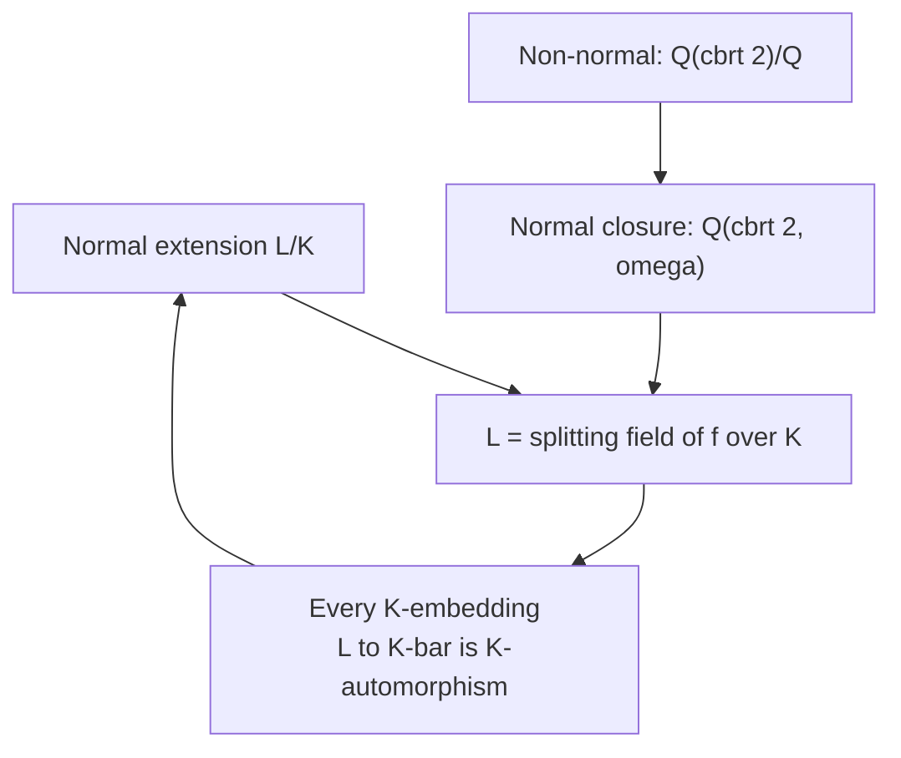

> **Prerequisites**: [[03-splitting-fields|03. Splitting Fields và Algebraic Closure]]
> **Objectives**:
> - Hiểu định nghĩa normal extension và ý nghĩa trực giác của nó
> - Nắm vững định lý tương đương: normal $\iff$ splitting field
> - Nhận biết một extension có normal hay không qua các ví dụ cụ thể
> - Hiểu automorphism đặc trưng hóa normal extension như thế nào
> - Xác định Galois closure (normal closure) của một extension

---

## Motivation / Intuition

Ở bài trước, ta xây dựng splitting field — extension chứa **tất cả** nghiệm của một đa thức. Nhưng tại sao splitting field lại đặc biệt quan trọng với Galois Theory?

Hãy xét $\mathbb{Q}(\sqrt[3]{2})/\mathbb{Q}$. Extension này chứa $\alpha = \sqrt[3]{2}$, một nghiệm của $f(x) = x^3 - 2$. Nhưng hai nghiệm phức $\alpha\omega$ và $\alpha\omega^2$ (với $\omega = e^{2\pi i/3}$) không nằm trong $\mathbb{Q}(\sqrt[3]{2}) \subset \mathbb{R}$.

Điều này gây ra vấn đề: nếu ta muốn định nghĩa một "automorphism" $\sigma: \mathbb{Q}(\sqrt[3]{2}) \to \mathbb{Q}(\sqrt[3]{2})$ gửi $\alpha \mapsto \alpha\omega$, thì $\alpha\omega \notin \mathbb{Q}(\sqrt[3]{2})$ — map đó không tồn tại trong extension này!

**Normal extension** là điều kiện chính xác để ngăn chặn tình huống này: trong normal extension, mọi $K$-automorphism đều được đảm bảo hoạt động bên trong extension, không "nhảy ra ngoài". Đây là điều kiện cần để Galois group hoạt động tốt.

---

## Normal Extension

### Definition

> [!definition] Definition 4.1 — Normal Extension
> Algebraic extension $L/K$ được gọi là **normal** nếu: với mọi đa thức $f(x) \in K[x]$ irreducible, nếu $f$ có **ít nhất một** nghiệm trong $L$, thì $f$ **phân rã hoàn toàn** trong $L[x]$.
>
> Nói gọn: *"Khi nào một conjugate (nghiệm của minimal polynomial) của $\alpha \in L$ nằm trong $L$, thì **tất cả** conjugates đều nằm trong $L$."*

> [!note] Remark 4.2
> Điều kiện **algebraic** trong định nghĩa là quan trọng. Người ta chỉ nói đến "normal extension" cho algebraic extensions. Tổng quát hơn (infinite algebraic normal extensions) cũng tồn tại, nhưng trong phần lớn khóa học, ta làm việc với **finite normal extensions**.

### Các ví dụ cơ bản

> [!example] Example 4.3 — Normal extensions
> - $\mathbb{Q}(\sqrt{2})/\mathbb{Q}$: nghiệm của $\operatorname{Irr}(\sqrt{2},\mathbb{Q}) = x^2 - 2$ là $\pm\sqrt{2}$. Cả hai đều trong $\mathbb{Q}(\sqrt{2})$. **Normal.** ✓
> - $\mathbb{Q}(i)/\mathbb{Q}$: nghiệm của $x^2 + 1$ là $\pm i$. Cả hai đều trong $\mathbb{Q}(i)$. **Normal.** ✓
> - $\mathbb{Q}(\sqrt{2}, \sqrt{3})/\mathbb{Q}$: splitting field của $(x^2-2)(x^2-3)$. **Normal.** ✓
> - $\mathbb{F}_{p^n}/\mathbb{F}_p$: finite fields — sẽ thấy ở Lesson 10. **Normal.** ✓

> [!warning] Counterexample 4.4 — $\mathbb{Q}(\sqrt[3]{2})/\mathbb{Q}$ **không** normal
> Xét $\alpha = \sqrt[3]{2}$ và $\operatorname{Irr}(\alpha, \mathbb{Q}) = x^3 - 2$.
>
> Ba nghiệm của $x^3 - 2$: $\sqrt[3]{2}$, $\sqrt[3]{2}\omega$, $\sqrt[3]{2}\omega^2$ với $\omega = e^{2\pi i/3}$.
>
> $\mathbb{Q}(\sqrt[3]{2}) \subset \mathbb{R}$, nên $\sqrt[3]{2}\omega \notin \mathbb{Q}(\sqrt[3]{2})$.
>
> Vậy $x^3 - 2$ có một nghiệm trong $\mathbb{Q}(\sqrt[3]{2})$ nhưng **không** phân rã hoàn toàn trong đó. Đây là ví dụ chuẩn của extension **không normal**.

> [!tip] Key Insight 4.5
> Một extension $K(\alpha)/K$ bậc 2 **luôn normal**: $\operatorname{Irr}(\alpha,K)$ có bậc 2, nên nếu $\alpha$ là một nghiệm, nghiệm kia là $-\alpha - (\text{hệ số bậc 1})$, tự nằm trong $K(\alpha)$ theo Vieta.

---

## Định lý Tương đương — Normal $\iff$ Splitting Field

Đây là kết quả đẹp nhất của bài này: nó kết nối hai khái niệm tưởng như khác nhau.

> [!abstract] Theorem 4.6 — Normal Extension $\iff$ Splitting Field
> Cho $L/K$ là finite extension. Các điều kiện sau **tương đương**:
>
> 1. $L/K$ là normal.
> 2. $L$ là splitting field của một đa thức $f(x) \in K[x]$ nào đó.
> 3. Mọi $K$-embedding $\sigma: L \hookrightarrow \bar{K}$ (vào algebraic closure) đều thỏa $\sigma(L) = L$, tức là $\sigma$ là $K$-automorphism của $L$.

**Proof.**
$(1) \Rightarrow (2)$: Giả sử $L/K$ finite và normal. Vì $L/K$ finite algebraic, viết $L = K(\alpha_1, \ldots, \alpha_r)$. Đặt $f_i = \operatorname{Irr}(\alpha_i, K)$ và $f = f_1 f_2 \cdots f_r$.

Vì $L/K$ normal và mỗi $f_i$ có nghiệm $\alpha_i \in L$, mỗi $f_i$ phân rã hoàn toàn trong $L[x]$. Vậy $f$ phân rã hoàn toàn trong $L[x]$.

Hơn nữa, $L = K(\alpha_1, \ldots, \alpha_r)$ được sinh bởi các nghiệm của $f$, nên $L$ là splitting field của $f$ trên $K$. ✓

$(2) \Rightarrow (3)$: Giả sử $L$ là splitting field của $g(x) \in K[x]$, với $g = c(x - \alpha_1)\cdots(x - \alpha_n)$ trong $L[x]$, và $L = K(\alpha_1, \ldots, \alpha_n)$.

Cho $\sigma: L \hookrightarrow \bar{K}$ là $K$-embedding. Với mỗi $\alpha_i$, vì $\sigma$ là $K$-homomorphism và $g(\alpha_i) = 0$, ta có $g(\sigma(\alpha_i)) = \sigma(g(\alpha_i)) = \sigma(0) = 0$.

Vậy $\sigma(\alpha_i)$ cũng là nghiệm của $g$, tức $\sigma(\alpha_i) \in \{\alpha_1, \ldots, \alpha_n\} \subset L$.

Do đó $\sigma(L) = \sigma(K(\alpha_1,\ldots,\alpha_n)) = K(\sigma(\alpha_1),\ldots,\sigma(\alpha_n)) \subseteq L$.

Vì $\sigma$ là injective và $[L:K] < \infty$, từ $\sigma(L) \subseteq L$ ta suy ra $\sigma(L) = L$. ✓

$(3) \Rightarrow (1)$: Giả sử mọi $K$-embedding $L \hookrightarrow \bar{K}$ là $K$-automorphism của $L$.

Cho $f \in K[x]$ irreducible có nghiệm $\alpha \in L$. Lấy bất kỳ nghiệm $\beta \in \bar{K}$ khác của $f$.

Vì $f = \operatorname{Irr}(\alpha, K) = \operatorname{Irr}(\beta, K)$ (cả hai là nghiệm của cùng monic irreducible $f$), tồn tại $K$-isomorphism $\tau: K(\alpha) \xrightarrow{\sim} K(\beta)$ với $\tau(\alpha) = \beta$ (từ đẳng cấu $K[x]/(f)$ với cả hai).

Mở rộng $\tau$ thành $K$-embedding $\sigma: L \hookrightarrow \bar{K}$ (dùng Theorem mở rộng embedding). Theo giả thiết (3), $\sigma(L) = L$, nên $\beta = \sigma(\alpha) \in L$.

Vậy mọi nghiệm của $f$ đều nằm trong $L$, tức $f$ phân rã hoàn toàn trong $L[x]$. $\blacksquare$

> [!note] Remark 4.7 — Điều kiện (3) và Galois Group
> Điều kiện (3) chính là nói: *mọi $K$-embedding của $L$ vào $\bar{K}$ đều là $K$-automorphism của $L$*. Tập hợp các $K$-automorphisms đó chính là **Galois group** $\operatorname{Aut}(L/K)$ mà ta sẽ định nghĩa chính thức ở Lesson 06.

---

## Ví dụ phân tích chi tiết

> [!example] Example 4.8 — Splitting field của $x^3 - 2$ là normal
> Splitting field của $x^3 - 2$ trên $\mathbb{Q}$ là $L = \mathbb{Q}(\sqrt[3]{2}, \omega)$ với $[L:\mathbb{Q}] = 6$.
>
> Đây là normal extension của $\mathbb{Q}$ vì $L$ là splitting field — theo Theorem 4.6 (2)$\Rightarrow$(1). ✓
>
> Các automorphisms của $L/\mathbb{Q}$: permute ba nghiệm $\sqrt[3]{2}, \sqrt[3]{2}\omega, \sqrt[3]{2}\omega^2$ của $x^3 - 2$.

> [!example] Example 4.9 — Normal không bắc cầu
> Tính chất normal **không** bắc cầu: nếu $M/L$ normal và $L/K$ normal, $M/K$ chưa chắc normal.
>
> Ví dụ: $\mathbb{Q}(\sqrt[4]{2})/\mathbb{Q}(\sqrt{2})$ normal (vì $[\mathbb{Q}(\sqrt[4]{2}):\mathbb{Q}(\sqrt{2})] = 2$, mọi extension bậc 2 đều normal).
>
> $\mathbb{Q}(\sqrt{2})/\mathbb{Q}$ normal (splitting field của $x^2 - 2$).
>
> Nhưng $\mathbb{Q}(\sqrt[4]{2})/\mathbb{Q}$ **không** normal: $\operatorname{Irr}(\sqrt[4]{2}, \mathbb{Q}) = x^4 - 2$, có nghiệm $i\sqrt[4]{2} \notin \mathbb{Q}(\sqrt[4]{2}) \subset \mathbb{R}$.

> [!example] Example 4.10 — Normal được bảo toàn lên trên
> Nếu $L/K$ normal và $K \subseteq M \subseteq L$ (intermediate field), thì $L/M$ **vẫn normal**.
>
> **Lý do**: $L$ là splitting field của $f \in K[x]$ trên $K$, thì $f \in M[x]$ và $L$ là splitting field của $f$ trên $M$ (các nghiệm không thay đổi). Áp Theorem 4.6 $(2) \Rightarrow (1)$.
>
> Tuy nhiên, $M/K$ chưa chắc normal — đây chính là điều FTGT sẽ phân tích (khi nào $M/K$ normal $\iff$ Galois group tương ứng là normal subgroup).

---

## Normal Closure

Câu hỏi tự nhiên: Nếu $L/K$ không normal, ta có thể "mở rộng" $L$ lên extension nhỏ nhất mà normal không?

> [!definition] Definition 4.11 — Normal Closure (Galois Closure)
> Cho $L/K$ là finite algebraic extension. **Normal closure** (đóng chuẩn tắc) của $L$ trên $K$, ký hiệu $\tilde{L}$ hoặc $L^{\text{nc}}$, là extension nhỏ nhất của $K$ chứa $L$ và là normal over $K$.
>
> Tương đương: $\tilde{L}$ là splitting field của tập hợp tất cả $\operatorname{Irr}(\alpha, K)$ với $\alpha \in L$, trên $K$.

> [!abstract] Theorem 4.12 — Normal Closure Tồn tại và Hữu hạn
> Với mọi finite extension $L/K$, normal closure $\tilde{L}/K$ tồn tại, là finite extension, và là duy nhất up to $K$-isomorphism.

**Proof.** Vì $[L:K] < \infty$, viết $L = K(\alpha_1, \ldots, \alpha_r)$. Đặt $f = \prod_{i=1}^r \operatorname{Irr}(\alpha_i, K)$. Splitting field $\tilde{L}$ của $f$ trên $K$ là normal (Theorem 4.6), chứa $L$ (vì $\alpha_1,\ldots,\alpha_r \in \tilde{L}$), và là nhỏ nhất như vậy. Hữu hạn vì $[\tilde{L}:K] \leq (\deg f)!$. $\blacksquare$

> [!example] Example 4.13 — Normal closure của $\mathbb{Q}(\sqrt[3]{2})$
> $L = \mathbb{Q}(\sqrt[3]{2})$, $\operatorname{Irr}(\sqrt[3]{2}, \mathbb{Q}) = x^3 - 2$.
>
> Normal closure: $\tilde{L} = \mathbb{Q}(\sqrt[3]{2}, \omega)$ — splitting field của $x^3 - 2$.
>
> Ta đã biết $[\tilde{L}:\mathbb{Q}] = 6$, trong khi $[L:\mathbb{Q}] = 3$. Phải mở rộng gấp đôi để có normal closure.

> [!example] Example 4.14 — Normal closure của $\mathbb{Q}(\sqrt[4]{2})$
> $\operatorname{Irr}(\sqrt[4]{2}, \mathbb{Q}) = x^4 - 2$. Bốn nghiệm: $\pm\sqrt[4]{2}, \pm i\sqrt[4]{2}$.
>
> Normal closure: $\tilde{L} = \mathbb{Q}(\sqrt[4]{2}, i)$, với $[\tilde{L}:\mathbb{Q}] = 8$.

---

## Sơ đồ tóm tắt



*Ba đặc trưng tương đương của normal extension và mối quan hệ với normal closure.*

---

## Bảng tổng hợp các ví dụ

| Extension $L/K$ | Normal? | Lý do |
|-----------------|---------|-------|
| $\mathbb{Q}(\sqrt{2})/\mathbb{Q}$ | Có | Splitting field của $x^2 - 2$ |
| $\mathbb{Q}(\sqrt[3]{2})/\mathbb{Q}$ | Không | $x^3-2$ không split trong $\mathbb{Q}(\sqrt[3]{2}) \subset \mathbb{R}$ |
| $\mathbb{Q}(\sqrt[3]{2}, \omega)/\mathbb{Q}$ | Có | Splitting field của $x^3 - 2$ |
| $\mathbb{Q}(\sqrt[4]{2})/\mathbb{Q}$ | Không | $i\sqrt[4]{2} \notin \mathbb{Q}(\sqrt[4]{2})$ |
| $\mathbb{Q}(\sqrt[4]{2})/\mathbb{Q}(\sqrt{2})$ | Có | Bậc 2 — mọi extension bậc 2 đều normal |
| $\mathbb{Q}(\zeta_n)/\mathbb{Q}$ | Có | Splitting field của $x^n - 1$ |
| $\mathbb{F}_{p^n}/\mathbb{F}_p$ | Có | Splitting field của $x^{p^n} - x$ |

---

## SageMath Cheatsheet

```sage
K = QQ
Kx.<x> = PolynomialRing(K)

f = x^3 - 2
L = f.splitting_field('a')
print(L.degree())
print(L.is_galois())

f2 = x^4 - 2
K2.<a> = NumberField(x^2 - 2)
K2x.<y> = PolynomialRing(K2)
g = y^2 - a
L2.<b> = K2.extension(g)
print(L2.is_normal(K))

K3 = QQ
f3 = x^3 - 2
NF.<a> = K3.extension(f3)
print(NF.galois_closure('c').degree())
```

---

## Summary / Key Takeaways

- **Normal extension** $L/K$: với mọi irreducible $f \in K[x]$, nếu $f$ có một nghiệm trong $L$ thì $f$ phân rã hoàn toàn trong $L$.
- **Ba đặc trưng tương đương** (Theorem 4.6): normal $\iff$ splitting field $\iff$ mọi $K$-embedding vào $\bar{K}$ là automorphism.
- Mọi extension bậc 2 là normal. Mọi splitting field là normal.
- $\mathbb{Q}(\sqrt[3]{2})/\mathbb{Q}$ là ví dụ chuẩn của extension **không normal**: $x^3-2$ có một nghiệm ở đây nhưng không split hoàn toàn.
- Normal **không bắc cầu**: $M/L$ và $L/K$ normal không kéo theo $M/K$ normal.
- Normal **bảo toàn lên trên**: $L/K$ normal và $K \subseteq M \subseteq L$ thì $L/M$ normal.
- **Normal closure** $\tilde{L}$: extension normal nhỏ nhất chứa $L$ — là splitting field của tích tất cả minimal polynomials.

---

## References

- Dummit, D. S. & Foote, R. M. *Abstract Algebra* (3rd ed.), §13.4.
- Milne, J. S. *Fields and Galois Theory*, §7. Có tại https://www.jmilne.org/math/CourseNotes/FT.pdf
- Conrad, K. *The Galois Correspondence*, §3. Có tại https://kconrad.math.uconn.edu/blurbs/galoistheory/galoiscorr.pdf
- Stewart, I. *Galois Theory* (4th ed.), Chapter 12.
