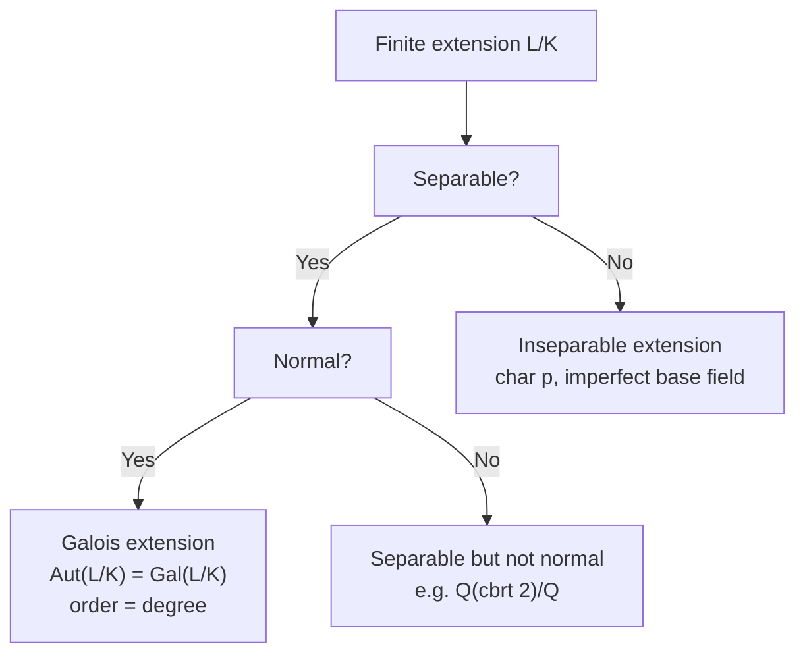

> **Prerequisites**: [[04-normal-extensions|04. Normal Extensions]]
> **Objectives**:
> - Hiểu tại sao đa thức có thể có nghiệm bội và khi nào điều đó xảy ra
> - Dùng formal derivative để kiểm tra separability
> - Định nghĩa separable polynomial, separable element, separable extension
> - Phân biệt perfect fields và imperfect fields; chứng minh $\mathbb{Q}$ và $\mathbb{F}_q$ perfect
> - Hiểu tại sao inseparability là trở ngại duy nhất để Galois Theory hoạt động tốt

---

## Motivation / Intuition

Cho đến giờ, khi nói "splitting field của $f(x)$", ta ngầm giả sử $f$ có $n = \deg f$ nghiệm **phân biệt**. Nhưng điều đó không phải lúc nào cũng đúng. Ví dụ: $f(x) = (x-1)^2 \in \mathbb{Q}[x]$ chỉ có một nghiệm (bội hai) — và splitting field là $\mathbb{Q}$, nhưng degree chỉ có 2 = 1, không phải 2.

Nguy hiểm hơn: với field có **characteristic $p > 0$**, một đa thức **irreducible** có thể có nghiệm bội. Ví dụ: trên $K = \mathbb{F}_p(t)$, đa thức $x^p - t$ là irreducible nhưng chỉ có **một** nghiệm $\alpha = t^{1/p}$ (với bội $p$). Đây là hiện tượng hoàn toàn không tồn tại khi characteristic bằng $0$.

Khi Galois group $\operatorname{Gal}(L/K)$ cố **permute các nghiệm** của một đa thức, nó cần các nghiệm phải **phân biệt** — nếu không, group quá nhỏ để mã hóa hết thông tin của extension. Điều kiện loại trừ nghiệm bội chính là **separability**.

---

## Nghiệm bội và Formal Derivative

### Formal Derivative

> [!definition] Definition 5.1 — Formal Derivative
> Cho $f(x) = a_n x^n + a_{n-1}x^{n-1} + \cdots + a_1 x + a_0 \in K[x]$. **Formal derivative** (đạo hàm hình thức) của $f$ là đa thức:
>
> $$
> f'(x) = n a_n x^{n-1} + (n-1)a_{n-1}x^{n-2} + \cdots + a_1
> $$
>
> Các hệ số $na_n$, $(n-1)a_{n-1}$, v.v. được tính trong field $K$ (tức $na_n = a_n + a_n + \cdots + a_n$, $n$ lần).

Đây là định nghĩa **thuần túy đại số** — không cần giới hạn hay phân tích.

> [!note] Remark 5.2 — Điều bất ngờ ở characteristic $p$
> Nếu $\operatorname{char}(K) = p > 0$, thì $p \cdot a = 0$ với mọi $a \in K$. Do đó:
>
> $$
> (x^p)' = p \cdot x^{p-1} = 0 \cdot x^{p-1} = 0
> $$
>
> Tổng quát hơn: $f'(x) = 0$ với mọi $f$ là đa thức trong $x^p$. Đây là nguyên nhân sâu xa của inseparability.

### Tiêu chuẩn nghiệm bội

> [!abstract] Theorem 5.3 — Nghiệm bội và GCD với đạo hàm
> Cho $f(x) \in K[x]$ có degree $\geq 1$. Phần tử $\alpha \in \bar{K}$ là **nghiệm bội** (multiple root, repeated root) của $f$ khi và chỉ khi $\alpha$ là nghiệm chung của $f$ và $f'$, tức là:
>
> $$
> \alpha \text{ là nghiệm bội của } f \iff f(\alpha) = 0 \text{ và } f'(\alpha) = 0
> $$
>
> Tương đương: $f$ **không có** nghiệm bội trong $\bar{K}$ khi và chỉ khi $\gcd(f, f') = 1$ trong $K[x]$.

**Proof.**
$(\Rightarrow)$: Nếu $\alpha$ là nghiệm bội, viết $f(x) = (x-\alpha)^2 g(x)$. Đạo hàm: $f'(x) = 2(x-\alpha)g(x) + (x-\alpha)^2 g'(x)$. Thay $x = \alpha$: $f'(\alpha) = 0$.

$(\Leftarrow)$: Ngược lại, giả sử $f(\alpha) = 0$ nhưng $\alpha$ không phải nghiệm bội. Viết $f(x) = (x-\alpha)h(x)$ với $h(\alpha) \neq 0$. Thì $f'(x) = h(x) + (x-\alpha)h'(x)$, nên $f'(\alpha) = h(\alpha) \neq 0$. Vậy $f'(\alpha) \neq 0$ — mâu thuẫn.

Phần tương đương thứ hai từ việc $\gcd(f,f') = 1$ trong $K[x]$ tương đương với $f$ và $f'$ không có nghiệm chung trong $\bar{K}$ (vì $K[x]$ là PID và $\bar{K}[x]$ là UFD). $\blacksquare$

> [!example] Example 5.4 — Dùng GCD phát hiện nghiệm bội
> $f(x) = x^3 - 3x + 2 \in \mathbb{Q}[x]$. $f'(x) = 3x^2 - 3 = 3(x^2 - 1)$.
>
> $\gcd(f, f') = \gcd(x^3 - 3x + 2,\ 3x^2 - 3)$.
>
> Chia: $x^3 - 3x + 2 = (x/3 \cdot 3x^2) + \ldots$; thực hiện thuật toán Euclid cho ra $\gcd = x - 1$.
>
> Vậy $x = 1$ là nghiệm bội. Thật vậy: $f(x) = (x-1)^2(x+2)$.

---

## Separable Polynomials

> [!definition] Definition 5.5 — Separable Polynomial
> $f(x) \in K[x]$ được gọi là **separable** (phân ly) nếu mọi nghiệm của $f$ trong $\bar{K}$ đều **phân biệt**, tức là $f$ không có nghiệm bội.
>
> Tương đương: $\gcd(f, f') = 1$ trong $K[x]$.
>
> Đa thức không separable gọi là **inseparable**.

> [!abstract] Theorem 5.6 — Irreducible separable $\iff$ $f' \neq 0$
> Cho $f(x) \in K[x]$ irreducible với $\deg f \geq 1$. Khi đó:
>
> $$
> f \text{ separable} \iff f'(x) \neq 0
> $$

**Proof.**
Nếu $f' \neq 0$: vì $\deg f' < \deg f$ và $f$ irreducible, $\gcd(f, f')$ phải là $1$ hoặc $f$ (hai khả năng duy nhất cho ước của $f$). Vì $\deg \gcd \leq \deg f' < \deg f$, nên $\gcd(f,f') = 1$, tức $f$ separable.

Nếu $f' = 0$: thì $\gcd(f, 0) = f$, nên $f \mid f'$ (trivially $f \mid 0$). Điều này cho $f$ và $f'$ không coprime, tức $f$ inseparable — thực ra mọi nghiệm của $f$ đều là nghiệm bội. $\blacksquare$

> [!abstract] Corollary 5.7 — Characteristic $0$ luôn separable
> Nếu $\operatorname{char}(K) = 0$ thì mọi irreducible polynomial $f \in K[x]$ đều separable.

**Proof.** Với char $0$: $\deg f = n \geq 1$, hệ số bậc cao nhất $a_n \neq 0$, nên $f'$ có bậc $n-1$ và hệ số dẫn đầu $na_n \neq 0$ (vì $n \neq 0$ trong $K$). Vậy $f' \neq 0$. $\blacksquare$

> [!note] Remark 5.8 — Inseparability chỉ có ở characteristic $p$
> Nếu $f$ là irreducible và inseparable, thì $f' = 0$, tức là $f$ là đa thức trong $x^p$: $f(x) = g(x^p)$ với $g \in K[x]$.
>
> Cụ thể hơn: có thể viết $f(x) = g(x^{p^k})$ với $g$ separable irreducible và $k \geq 1$. Số $p^k$ gọi là **inseparability degree** của $f$.

---

## Separable Extensions

> [!definition] Definition 5.9 — Separable Element và Separable Extension
> Cho $L/K$ algebraic extension và $\alpha \in L$.
>
> - $\alpha$ gọi là **separable over $K$** nếu $\operatorname{Irr}(\alpha, K)$ là separable.
> - $L/K$ gọi là **separable extension** nếu mọi $\alpha \in L$ đều separable over $K$.

> [!example] Example 5.10
> - Mọi $\alpha$ algebraic over $\mathbb{Q}$ đều separable over $\mathbb{Q}$: char $= 0$, dùng Corollary 5.7.
> - $\sqrt{2}$ separable over $\mathbb{Q}$: $\operatorname{Irr}(\sqrt{2},\mathbb{Q}) = x^2 - 2$, $(x^2-2)' = 2x \neq 0$. ✓
> - Mọi phần tử của $\mathbb{F}_{p^n}$ separable over $\mathbb{F}_p$ (sẽ thấy ở Corollary 5.14).

> [!warning] Counterexample 5.11 — Inseparable element
> Xét $K = \mathbb{F}_p(t)$ (rational functions in $t$ over $\mathbb{F}_p$). Đặt $\alpha$ là nghiệm của $f(x) = x^p - t \in K[x]$.
>
> $f'(x) = px^{p-1} = 0$ (vì char $= p$). Vậy $f$ inseparable.
>
> Thực ra $f(x) = (x - \alpha)^p$ trong $K(\alpha)[x]$, tức $\alpha$ là nghiệm bội $p$.
>
> $f$ irreducible nhưng inseparable. $\alpha$ là inseparable over $K$. Extension $K(\alpha)/K$ là **inseparable**.

---

## Số lượng Embeddings và Separability

Đây là kết quả quan trọng kết nối separability với cấu trúc homomorphism.

> [!abstract] Theorem 5.12 — Separability $\iff$ Số embeddings tối đa
> Cho $L/K$ finite extension. Đặt $n = [L:K]$. Khi đó số lượng $K$-embeddings $\sigma: L \hookrightarrow \bar{K}$ thỏa:
>
> $$
> |\left\{ \sigma: L \hookrightarrow \bar{K} \mid \sigma|_K = \mathrm{id}_K \right\}| \leq [L:K]
> $$
>
> và **đẳng thức xảy ra** khi và chỉ khi $L/K$ là **separable**.

**Proof sketch.** Trong trường hợp $L = K(\alpha)$: có bao nhiêu $K$-embedding $\sigma: K(\alpha) \to \bar{K}$? Mỗi $\sigma$ hoàn toàn xác định bởi $\sigma(\alpha)$, và $\sigma(\alpha)$ phải là nghiệm của $\operatorname{Irr}(\alpha, K)$ trong $\bar{K}$. Số nghiệm phân biệt của minimal polynomial trong $\bar{K}$ là $\deg \operatorname{Irr}(\alpha,K) = [K(\alpha):K]$ khi và chỉ khi $\alpha$ separable. Trường hợp tổng quát dùng quy nạp theo tháp extension. $\blacksquare$

> [!tip] Key Insight 5.13
> Đây chính là lý do separability quan trọng: **số lượng $K$-automorphisms của $L$** (= Galois group order) bị chặn bởi $[L:K]$, và đẳng thức $|\operatorname{Aut}(L/K)| = [L:K]$ — định nghĩa của Galois extension — đòi hỏi **cả normal lẫn separable**.

---

## Perfect Fields

Field nào thì **tự động** đảm bảo mọi algebraic extension đều separable?

> [!definition] Definition 5.14 — Perfect Field
> Field $K$ được gọi là **perfect** nếu mọi algebraic extension của $K$ đều separable, tương đương: mọi irreducible polynomial trong $K[x]$ đều separable.

> [!abstract] Theorem 5.15 — Các ví dụ perfect fields
> 1. Mọi field characteristic $0$ là perfect (đặc biệt: $\mathbb{Q}$, $\mathbb{R}$, $\mathbb{C}$, $\mathbb{Q}_p$).
> 2. Mọi **finite field** $\mathbb{F}_q$ là perfect.
> 3. Mọi **algebraically closed field** là perfect.

**Proof của (1).** Đã thấy trong Corollary 5.7: char $0$ thì mọi irreducible có $f' \neq 0$, tức separable. $\blacksquare$

**Proof của (2) — $\mathbb{F}_q$ là perfect.**
Cho $f \in \mathbb{F}_q[x]$ irreducible với char $= p$. Cần chứng minh $f' \neq 0$.

Giả sử ngược lại $f' = 0$, tức $f(x) = g(x^p)$ với $g \in \mathbb{F}_q[x]$. Cần chứng minh điều này mâu thuẫn với tính irreducible.

**Frobenius map** trên $\mathbb{F}_q$: ánh xạ $\varphi: a \mapsto a^p$ là field automorphism của $\mathbb{F}_q$ (tự đồng cấu, còn gọi là Frobenius). Đặc biệt, $\varphi$ là **surjective** (vì $\mathbb{F}_q$ hữu hạn, injective $\Rightarrow$ bijective).

Vậy với mọi $a_i \in \mathbb{F}_q$, tồn tại $b_i \in \mathbb{F}_q$ với $b_i^p = a_i$.

Nếu $g(x) = \sum a_i x^i$, thì $f(x) = g(x^p) = \sum a_i x^{ip} = \sum b_i^p x^{ip} = \left(\sum b_i x^i\right)^p$

(dùng $(u+v)^p = u^p + v^p$ ở char $p$). Vậy $f = h^p$ với $h(x) = \sum b_i x^i$. Nhưng khi đó $f = h \cdot h^{p-1}$ — mâu thuẫn với tính irreducible của $f$ (vì $\deg h \geq 1$ và $\deg h^{p-1} \geq 1$). $\blacksquare$

> [!warning] Counterexample 5.16 — Field không perfect
> $K = \mathbb{F}_p(t)$ (rational function field) **không** perfect: $f(x) = x^p - t$ là irreducible inseparable.
>
> Lý do Frobenius không surjective: phần tử $t \in K$ không có $p$-th root trong $K$ (không tồn tại $r(t) \in \mathbb{F}_p(t)$ với $r(t)^p = t$).
>
> Đặc trưng: $K$ không perfect $\iff$ $K$ có char $p > 0$ và Frobenius $x \mapsto x^p$ **không surjective**.

---

## Separability và Galois Theory

Bây giờ ta có đủ để phát biểu điều kiện hoàn chỉnh:

> [!abstract] Theorem 5.17 — Galois Extension = Normal + Separable
> Một finite extension $L/K$ được gọi là **Galois extension** khi và chỉ khi nó vừa **normal** vừa **separable**.
>
> Khi đó $|\operatorname{Aut}(L/K)| = [L:K]$, và ta ký hiệu $\operatorname{Aut}(L/K) = \operatorname{Gal}(L/K)$.

Đây là định nghĩa chính thức của Galois extension — ta sẽ phát triển nó đầy đủ trong Lesson 07.

> [!note] Remark 5.18 — Tại sao hầu hết textbook bỏ qua separability?
> Trong thực hành, **hầu hết các extension chúng ta gặp đều separable**, vì:
> - Characteristic $0$: tất cả algebraic extensions separable.
> - Finite fields $\mathbb{F}_q$: tất cả algebraic extensions separable.
>
> Tuy nhiên về mặt lý thuyết, phân biệt rõ normal và separable giúp ta hiểu **đúng bản chất** của từng điều kiện, và cần thiết cho các ứng dụng trong đặc trưng dương (algebraic geometry, số học).

---

## Sơ đồ phân loại



*Phân loại finite extensions theo separability và normality.*

---

## SageMath Cheatsheet

```sage
K = QQ
Kx.<x> = PolynomialRing(K)

f = x^3 - 3*x + 2
fp = f.derivative()
print(gcd(f, fp))

f2 = x^2 - 2
print(f2.is_squarefree())

Fp = GF(5)
Fpx.<t> = PolynomialRing(Fp)
g = t^2 + t + 1
print(g.is_squarefree())
print(gcd(g, g.derivative()))

L.<a> = QQ.extension(x^2 - 2)
print(L.is_galois())

M = QQ.extension(x^3 - 2, 'b')
print(M.is_galois())
```

---

## Summary / Key Takeaways

- **Formal derivative** $f'$: công cụ thuần đại số phát hiện nghiệm bội — không cần giới hạn.
- $\alpha$ là nghiệm bội của $f$ $\iff$ $f(\alpha) = f'(\alpha) = 0$.
- $f$ **separable** $\iff$ $\gcd(f, f') = 1$ $\iff$ mọi nghiệm phân biệt.
- $f$ irreducible thì **separable $\iff$ $f' \neq 0$**.
- Char $0$: mọi irreducible đều separable. Char $p$: inseparable xảy ra khi $f = g(x^p)$.
- **Perfect field**: mọi algebraic extension đều separable. $\mathbb{Q}$, $\mathbb{F}_q$, $\mathbb{C}$, $\mathbb{R}$ đều perfect.
- $\mathbb{F}_p(t)$ **không** perfect: Frobenius không surjective, $x^p - t$ là irreducible inseparable.
- **Galois extension** = normal + separable — điều kiện hoàn chỉnh để Galois correspondence hoạt động.
- Số $K$-embeddings $L \hookrightarrow \bar{K}$ bằng $[L:K]$ khi và chỉ khi $L/K$ separable.

---

## References

- Dummit, D. S. & Foote, R. M. *Abstract Algebra* (3rd ed.), §13.5.
- Conrad, K. *Separability*. Có tại https://kconrad.math.uconn.edu/blurbs/galoistheory/separable1.pdf
- Milne, J. S. *Fields and Galois Theory*, §§4–5. Có tại https://www.jmilne.org/math/CourseNotes/FT.pdf
- Lang, S. *Algebra* (3rd ed.), Chapter V §4.
