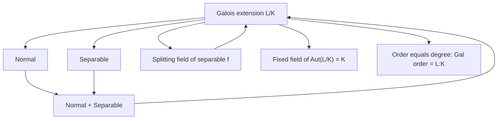

> **Prerequisites**: [[06-galois-group-fixed-fields|06. Nhóm Galois và Fixed Fields]]
> **Objectives**:
> - Nắm vững định nghĩa chính thức của Galois extension qua ba đặc trưng tương đương
> - Chứng minh $|\operatorname{Gal}(L/K)| = [L:K]$ cho Galois extensions
> - Hiểu vì sao splitting field của đa thức separable là Galois extension chuẩn mực
> - Nhận biết và phân loại Galois/non-Galois extensions qua ví dụ đa dạng
> - Hiểu tính chất kế thừa của Galois extensions qua tháp

---

## Motivation / Intuition

Sau bài 06, ta hiểu rằng: với extension $L/K$, nhóm $\operatorname{Aut}(L/K)$ luôn thỏa $|\operatorname{Aut}(L/K)| \leq [L:K]$. Bất đẳng thức này có thể nghiêm ngặt — ví dụ $|\operatorname{Aut}(\mathbb{Q}(\sqrt[3]{2})/\mathbb{Q})| = 1$ trong khi $[\mathbb{Q}(\sqrt[3]{2}):\mathbb{Q}] = 3$.

Câu hỏi: khi nào đẳng thức xảy ra? Đó chính là **Galois extension** — và đây là lớp extension mà toàn bộ lý thuyết Galois dành cho.

Ý nghĩa sâu hơn: $|\operatorname{Aut}(L/K)| = [L:K]$ là điều kiện để bộ máy correspondence hoạt động trọn vẹn — đủ automorphisms để "nhìn thấy" mọi cấu trúc của extension.

---

## Định nghĩa Galois Extension

### Ba đặc trưng tương đương

> [!abstract] Theorem 7.1 — Các đặc trưng tương đương của Galois Extension
> Cho $L/K$ là finite extension. Các điều kiện sau **tương đương**:
>
> 1. $L/K$ là **normal** và **separable**.
> 2. $|\operatorname{Aut}(L/K)| = [L:K]$.
> 3. $L^{\operatorname{Aut}(L/K)} = K$ (fixed field của toàn bộ nhóm automorphisms là đúng $K$).
> 4. $L$ là **splitting field của một đa thức separable** $f(x) \in K[x]$.

Khi một trong các điều kiện trên thỏa, ta gọi $L/K$ là **Galois extension**, đặt $\operatorname{Gal}(L/K) := \operatorname{Aut}(L/K)$, và gọi đây là **Galois group** của extension.

**Proof.**
$(1) \Leftrightarrow (2)$: Từ Theorem 5.12 (separability $\iff$ số embedding tối đa) và Theorem 4.6 (normal $\iff$ mọi embedding là automorphism): $L/K$ separable cho $|\operatorname{Aut}(L/K)| = [L:K]$ và $L/K$ normal cho mọi embedding là automorphism. Kết hợp hai điều kiện cho đẳng thức trong (2).

$(2) \Leftrightarrow (3)$: Luôn có $K \subseteq L^{\operatorname{Aut}(L/K)}$. Nếu $|\operatorname{Aut}(L/K)| = [L:K]$, đặt $F = L^{\operatorname{Aut}(L/K)}$. Từ Artin's Theorem (Bài 06): $[L:F] = |\operatorname{Aut}(L/F)| = |\operatorname{Aut}(L/K)|$ (vì $\operatorname{Aut}(L/K) \subseteq \operatorname{Aut}(L/F)$ và Tower Law). Suy ra $[F:K] = 1$, tức $F = K$.

$(1) \Leftrightarrow (4)$: Đây là Theorem 4.6 (normal $\iff$ splitting field) kết hợp với separability của splitting field khi $f$ separable. $\blacksquare$

> [!definition] Definition 7.2 — Galois Extension và Galois Group
> Finite extension $L/K$ thỏa một trong các điều kiện tương đương của Theorem 7.1 được gọi là **Galois extension**. Nhóm $\operatorname{Aut}(L/K)$ khi đó ký hiệu là $\operatorname{Gal}(L/K)$ và gọi là **Galois group** (nhóm Galois) của $L/K$.

---

## Bậc Galois Group bằng Degree

> [!abstract] Theorem 7.3 — $|\operatorname{Gal}(L/K)| = [L:K]$
> Với mọi Galois extension $L/K$: $|\operatorname{Gal}(L/K)| = [L:K]$.

Đây là hệ quả trực tiếp từ định nghĩa (điều kiện 2 của Theorem 7.1). Nó nói: **số lượng automorphisms bằng số chiều của extension** — một sự tương đồng hoàn hảo giữa hai cấu trúc.

---

## Splitting Field của Separable Polynomial là Galois

> [!abstract] Theorem 7.4 — Splitting field của separable polynomial là Galois
> Nếu $f(x) \in K[x]$ là separable và $L$ là splitting field của $f$ trên $K$, thì $L/K$ là Galois extension.

**Proof.** $L$ là splitting field $\Rightarrow$ $L/K$ normal (Theorem 4.6). $f$ separable và $L$ là splitting field của $f$ $\Rightarrow$ $L/K$ separable (vì mọi $\alpha \in L$ là nghiệm của $f$, và $\operatorname{Irr}(\alpha, K) \mid f$ là separable). Kết hợp: $L/K$ Galois. $\blacksquare$

> [!note] Remark 7.5
> Ở characteristic $0$, mọi polynomial là separable (Corollary 5.7), nên splitting field của **bất kỳ** irreducible $f \in \mathbb{Q}[x]$ nào đều cho Galois extension. Đây giải thích vì sao Galois Theory hoạt động "mượt mà" trong characteristic $0$.

---

## Ví dụ phân loại

> [!example] Example 7.6 — Bảng Galois/non-Galois
>
> | Extension $L/K$ | Galois? | Lý do |
> |---|---|---|
> | $\mathbb{Q}(\sqrt{2})/\mathbb{Q}$ | Có | SF của $x^2-2$ separable; $G \cong \mathbb{Z}/2$ |
> | $\mathbb{Q}(\sqrt[3]{2})/\mathbb{Q}$ | Không | Non-normal: $x^3-2$ không split |
> | $\mathbb{Q}(\sqrt[3]{2},\omega)/\mathbb{Q}$ | Có | SF của $x^3-2$; $G \cong S_3$ |
> | $\mathbb{Q}(\sqrt{2},\sqrt{3})/\mathbb{Q}$ | Có | SF của $(x^2-2)(x^2-3)$; $G \cong V_4$ |
> | $\mathbb{Q}(\sqrt[4]{2},i)/\mathbb{Q}$ | Có | SF của $x^4-2$; $G \cong D_4$ |
> | $\mathbb{F}_{p^n}/\mathbb{F}_p$ | Có | SF của $x^{p^n}-x$; $G \cong \mathbb{Z}/n$ |
> | $\mathbb{C}/\mathbb{R}$ | Có | $|\operatorname{Aut}| = 2 = [\mathbb{C}:\mathbb{R}]$; $G \cong \mathbb{Z}/2$ |
> | $\mathbb{Q}(\zeta_n)/\mathbb{Q}$ | Có | SF của $x^n-1$; $G \cong (\mathbb{Z}/n\mathbb{Z})^\times$ |

> [!example] Example 7.7 — Tính $\operatorname{Gal}(\mathbb{Q}(\sqrt[4]{2}, i)/\mathbb{Q})$
> $L = \mathbb{Q}(\sqrt[4]{2}, i)$, $[L:\mathbb{Q}] = 8$. Bốn nghiệm của $x^4-2$: $\pm\sqrt[4]{2}$, $\pm i\sqrt[4]{2}$.
>
> Mỗi $\sigma \in G$ xác định bởi $\sigma(\sqrt[4]{2}) \in \{\sqrt[4]{2}, i\sqrt[4]{2}, -\sqrt[4]{2}, -i\sqrt[4]{2}\}$ (4 lựa chọn) và $\sigma(i) \in \{i, -i\}$ (2 lựa chọn). Có $4 \times 2 = 8 = [L:\mathbb{Q}]$ tổ hợp, tất cả đều cho automorphism hợp lệ.
>
> Đặt $\sigma: \sqrt[4]{2} \mapsto i\sqrt[4]{2},\ i \mapsto i$ và $\tau: \sqrt[4]{2} \mapsto \sqrt[4]{2},\ i \mapsto -i$.
>
> $\sigma$ có bậc $4$, $\tau$ có bậc $2$, $\tau\sigma\tau^{-1} = \sigma^{-1}$. Vậy:
>
> $$
> \operatorname{Gal}(\mathbb{Q}(\sqrt[4]{2},i)/\mathbb{Q}) \cong D_4 \quad (\text{nhóm nhị diện bậc 8})
> $$

---

## Galois được kế thừa lên trên

> [!abstract] Theorem 7.8 — Galois bảo toàn lên trên
> Nếu $L/K$ là Galois và $K \subseteq M \subseteq L$ là intermediate field, thì $L/M$ cũng là **Galois**.

**Proof.** $L/K$ normal và $K \subseteq M$: ta đã thấy $L/M$ normal (Bài 04, Example 4.10). $L/K$ separable và $M \supseteq K$: mọi $\alpha \in L$ có $\operatorname{Irr}(\alpha,M) \mid \operatorname{Irr}(\alpha,K)$, và $\operatorname{Irr}(\alpha,K)$ separable $\Rightarrow$ $\operatorname{Irr}(\alpha,M)$ separable. Vậy $L/M$ separable, và do đó Galois. $\blacksquare$

> [!warning] Remark 7.9 — Phần dưới của tháp không nhất thiết Galois
> Nếu $L/K$ Galois và $K \subseteq M \subseteq L$, thì $M/K$ **không nhất thiết Galois**.
>
> Ví dụ: $\mathbb{Q}(\sqrt[4]{2},i)/\mathbb{Q}$ Galois, nhưng $\mathbb{Q}(\sqrt[4]{2})/\mathbb{Q}$ là intermediate extension **không Galois** (non-normal: $x^4-2$ không split trong $\mathbb{R}$).
>
> FTGT sẽ cho biết chính xác khi nào $M/K$ Galois — khi và chỉ khi subgroup $\operatorname{Gal}(L/M)$ là **normal subgroup** của $\operatorname{Gal}(L/K)$.

---

## Galois Group như Subgroup của $S_n$

Khi $f \in K[x]$ irreducible, separable, degree $n$, với splitting field $L$ và nghiệm $\alpha_1,\ldots,\alpha_n$:

> [!abstract] Theorem 7.10 — Galois group là transitive subgroup của $S_n$
> $\operatorname{Gal}(L/K) \hookrightarrow S_n$ (injective homomorphism) qua action hoán vị $\{\alpha_1,\ldots,\alpha_n\}$.
>
> Image của homomorphism này là **transitive subgroup**: với mọi $i \neq j$, tồn tại $\sigma \in G$ với $\sigma(\alpha_i) = \alpha_j$.

**Proof.** Injective: nếu $\sigma$ cố định mọi nghiệm thì $\sigma = \mathrm{id}$ (vì $L = K(\alpha_1,\ldots,\alpha_n)$). Transitive: vì $f$ irreducible, $f = \operatorname{Irr}(\alpha_i,K) = \operatorname{Irr}(\alpha_j,K)$ với mọi $i,j$. Tồn tại $K$-isomorphism $K(\alpha_i) \to K(\alpha_j)$; mở rộng lên $L$ (Theorem 3.8) cho $\sigma \in G$ với $\sigma(\alpha_i) = \alpha_j$. $\blacksquare$

> [!note] Remark 7.11 — Hệ quả quan trọng
> Vì $G$ là transitive subgroup của $S_n$ và $|G| = [L:K]$, ta có $n \mid |G|$ (từ orbit-stabilizer). Cụ thể: $[K(\alpha_i):K] = n$ chia hết $|G| = [L:K]$, điều này đúng từ Tower Law.

---

## Primitive Element Theorem

> [!abstract] Theorem 7.12 — Primitive Element Theorem
> Mọi finite separable extension $L/K$ đều là **simple extension**: tồn tại $\theta \in L$ sao cho $L = K(\theta)$.
>
> $\theta$ gọi là **primitive element** (phần tử nguyên thủy) của $L/K$.

**Proof sketch.** Nếu $K$ infinite: với $L = K(\alpha,\beta)$, đặt $\theta = \alpha + c\beta$ với $c \in K$ được chọn tránh hữu hạn nhiều giá trị tệ (để $\operatorname{Irr}(\beta,K(\theta))$ vẫn có đủ nghiệm). Quy nạp mở rộng cho nhiều generators. Nếu $K$ finite: $K^\times$ cyclic, và $L^\times$ cyclic cho $L = K(\theta)$ với $\theta$ là generator. $\blacksquare$

> [!example] Example 7.13
> $\mathbb{Q}(\sqrt{2},\sqrt{3}) = \mathbb{Q}(\sqrt{2}+\sqrt{3})$. Thật vậy: từ $\theta = \sqrt{2}+\sqrt{3}$, $\theta^3 = 2\sqrt{2} + 6\sqrt{3} + 3\sqrt{2} = 11\sqrt{2}+6\sqrt{3}$... tính được $\sqrt{2} = \frac{\theta^3 - 9\theta}{2}$ và $\sqrt{3} = \frac{11\theta - \theta^3}{2}$. Vậy $\operatorname{Irr}(\theta, \mathbb{Q}) = x^4 - 10x^2 + 1$, bậc 4.

---

## Sơ đồ tóm tắt



*Các đặc trưng tương đương của Galois extension.*

---

## SageMath Cheatsheet

```sage
K = QQ
Kx.<x> = PolynomialRing(K)

f = x^4 - 2
L = f.splitting_field('a')
print(L.degree())
print(L.is_galois())

G = L.galois_group()
print(G.order())
print(G.structure_description())

f2 = x^3 - 2
L2 = f2.splitting_field('b')
G2 = L2.galois_group()
print(G2.structure_description())

L3.<a> = QQ.extension(x^2 - 2)
print(L3.is_galois())
print(L3.galois_group().order())
```

---

## Summary / Key Takeaways

- **Galois extension** $L/K$: finite, normal, và separable — bốn đặc trưng tương đương.
- Điều kiện số học: $|\operatorname{Gal}(L/K)| = [L:K]$ — số automorphisms bằng degree.
- Điều kiện fixed field: $L^{\operatorname{Aut}(L/K)} = K$ — base field chính là fixed field của toàn bộ Galois group.
- Splitting field của separable polynomial **luôn là** Galois extension.
- Ở char $0$: mọi splitting field là Galois; ở char $p > 0$ cần thêm điều kiện separable.
- **Primitive Element Theorem**: mọi finite separable extension là simple — $L = K(\theta)$.
- Galois group embed vào $S_n$ như transitive subgroup.
- $L/M$ Galois khi $L/K$ Galois; $M/K$ không nhất thiết Galois (FTGT sẽ phân tích khi nào $M/K$ Galois).

---

## References

- Dummit, D. S. & Foote, R. M. *Abstract Algebra* (3rd ed.), §14.1–14.2.
- Conrad, K. *The Galois Correspondence*, §§3–4. Có tại https://kconrad.math.uconn.edu/blurbs/galoistheory/galoiscorr.pdf
- Milne, J. S. *Fields and Galois Theory*, §§7–8. Có tại https://www.jmilne.org/math/CourseNotes/FT.pdf
- Stewart, I. *Galois Theory* (4th ed.), Chapters 12–13.
