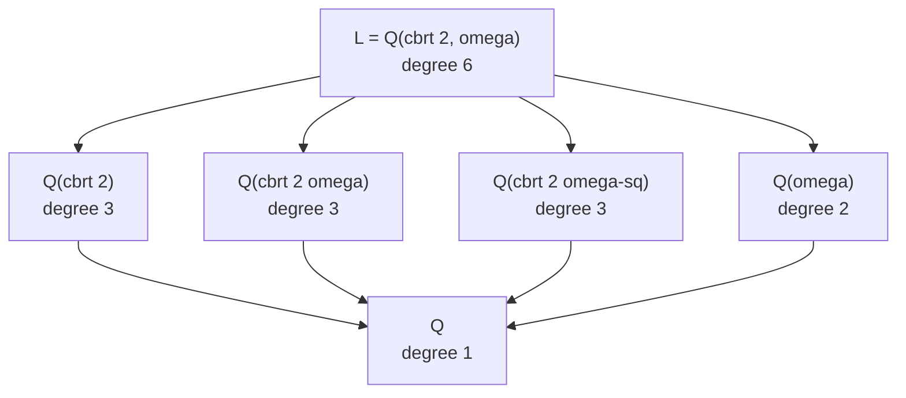

> **Prerequisites**: [[07-galois-extensions|07. Galois Extensions]]
> **Objectives**:
> - Phát biểu và hiểu Fundamental Theorem of Galois Theory (FTGT) đầy đủ
> - Nắm vững bijection order-reversing giữa subgroups và intermediate fields
> - Biết các công thức liên quan: $[L:L^H] = |H|$, $[L^H:K] = [G:H]$
> - Hiểu điều kiện normal subgroup $\leftrightarrow$ Galois intermediate extension
> - Áp dụng FTGT tính lattice đầy đủ cho các Galois extensions cụ thể

---

## Motivation / Intuition

Ta đã xây dựng tất cả các viên gạch. Bây giờ là công trình vĩ đại.

Hãy nhìn vào tình huống sau: $L/K$ là Galois extension với $G = \operatorname{Gal}(L/K)$. Có hai "lattice" (dàn) tự nhiên:
- Lattice các **intermediate fields**: tất cả $M$ với $K \subseteq M \subseteq L$, sắp xếp theo inclusion.
- Lattice các **subgroups** của $G$, sắp xếp theo inclusion.

**Fundamental Theorem of Galois Theory** nói: *hai lattice này đẳng cấu nhau, nhưng bị đảo ngược*.

Đây là điểm kỳ diệu nhất của lý thuyết: thay vì phải phân tích cấu trúc phức tạp của intermediate fields (đối tượng đại số khó), ta có thể làm việc hoàn toàn trong thế giới nhóm hữu hạn — đơn giản hơn rất nhiều.

---

## Fundamental Theorem of Galois Theory

> [!abstract] Theorem 8.1 — Fundamental Theorem of Galois Theory (FTGT)
> Cho $L/K$ là **Galois extension** với $G = \operatorname{Gal}(L/K)$.
>
> Xét hai ánh xạ:
>
> $$
> \begin{aligned}
> \Phi &: \{\text{intermediate fields } K \subseteq M \subseteq L\} \longrightarrow \{\text{subgroups of } G\}, \quad M \longmapsto \operatorname{Gal}(L/M) \\
> \Gamma &: \{\text{subgroups of } G\} \longrightarrow \{\text{intermediate fields } K \subseteq M \subseteq L\}, \quad H \longmapsto L^H
> \end{aligned}
> $$
>
> Khi đó:
>
> **(A) Bijection:** $\Phi$ và $\Gamma$ là các bijection nghịch đảo nhau:
>
> $$
> \Gamma \circ \Phi = \mathrm{id} \qquad \text{và} \qquad \Phi \circ \Gamma = \mathrm{id}
> $$
>
> **(B) Order-reversing:** Cả hai đảo chiều inclusion:
>
> $$
> M_1 \subseteq M_2 \iff \operatorname{Gal}(L/M_2) \subseteq \operatorname{Gal}(L/M_1)
> $$
>
> **(C) Degree và Index:**
>
> $$
> [M:K] = [G:\operatorname{Gal}(L/M)] \qquad \text{và} \qquad [L:M] = |\operatorname{Gal}(L/M)|
> $$
>
> **(D) Normality correspondence:**
>
> $$
> M/K \text{ là Galois extension} \iff \operatorname{Gal}(L/M) \trianglelefteq G
> $$
>
> Khi đó: $\operatorname{Gal}(M/K) \cong G/\operatorname{Gal}(L/M)$.

Xem chứng minh đầy đủ tại [[a1-proof-ftgt|A1. Proof of FTGT]].

**Proof sketch.**

**(A) Bijection:** Cần chứng minh $L^{\operatorname{Gal}(L/M)} = M$ và $\operatorname{Gal}(L/L^H) = H$.

Từ Artin's Theorem (Bài 06): $H$ là nhóm hữu hạn automorphisms $\Rightarrow$ $[L:L^H] = |H|$ và $\operatorname{Gal}(L/L^H) = H$. Đây là nửa thứ hai.

Cho nửa thứ nhất: $L/M$ Galois (vì $L/K$ Galois và $M$ intermediate — Bài 07, Theorem 7.8). Áp Artin's Theorem cho $H = \operatorname{Gal}(L/M)$: $L^H = L^{\operatorname{Gal}(L/M)} = M$.

**(B) Order-reversing:** Nếu $M_1 \subseteq M_2$, thì mọi automorphism cố định $M_2$ cũng cố định $M_1$. Vậy $\operatorname{Gal}(L/M_2) \subseteq \operatorname{Gal}(L/M_1)$.

**(C) Degree và Index:** $[L:M] = |\operatorname{Gal}(L/M)|$ từ Artin's Theorem. Từ Tower Law:

$$
[L:K] = [L:M] \cdot [M:K] \Rightarrow [M:K] = \frac{[L:K]}{[L:M]} = \frac{|G|}{|\operatorname{Gal}(L/M)|} = [G:\operatorname{Gal}(L/M)]
$$

**(D) Normality correspondence:** 

$(\Rightarrow)$: Giả sử $M/K$ Galois. Với $\sigma \in G$ và $H = \operatorname{Gal}(L/M)$: cần chứng minh $\sigma H \sigma^{-1} = H$. Với $h \in H$ và $m \in M$: $(\sigma h \sigma^{-1})(m) = \sigma(h(\sigma^{-1}(m)))$. Vì $M/K$ normal và $\sigma^{-1}|_M: M \to M$ (automorphism của $M/K$), $\sigma^{-1}(m) \in M$, nên $h(\sigma^{-1}(m)) = \sigma^{-1}(m)$, vậy $(\sigma h \sigma^{-1})(m) = m$. Vậy $\sigma H \sigma^{-1} \subseteq H$, và vì $|G|$ finite, $\sigma H \sigma^{-1} = H$.

$(\Leftarrow)$: Nếu $H \trianglelefteq G$, đặt $M = L^H$. Với $\sigma \in G$ và $m \in M$: $h(\sigma(m)) = \sigma(\sigma^{-1}h\sigma)(m) = \sigma(m)$ vì $\sigma^{-1}h\sigma \in H$ (do $H$ normal) cố định $m \in M = L^H$. Vậy $\sigma(m) \in L^H = M$, tức $\sigma(M) \subseteq M$. Vì $\sigma$ injective trên field finite-dimensional, $\sigma|_M: M \to M$ là automorphism. Điều này cho $M/K$ normal.

Cho bijection $G/H \cong \operatorname{Gal}(M/K)$: map $\sigma H \mapsto \sigma|_M$ là well-defined (vì $H$ normal) và isomorphism nhóm. $\blacksquare$

---

## Ví dụ chi tiết

### Ví dụ 1: $G = V_4$ — $\mathbb{Q}(\sqrt{2},\sqrt{3})/\mathbb{Q}$

> [!example] Example 8.2 — FTGT cho $\mathbb{Q}(\sqrt{2},\sqrt{3})/\mathbb{Q}$
> $G = \operatorname{Gal}(L/\mathbb{Q}) \cong V_4 = \{1, \sigma, \tau, \sigma\tau\}$ với:
> - $\sigma: \sqrt{2} \mapsto -\sqrt{2},\ \sqrt{3} \mapsto \sqrt{3}$
> - $\tau: \sqrt{2} \mapsto \sqrt{2},\ \sqrt{3} \mapsto -\sqrt{3}$
>
> **Subgroups của $V_4$**: $\{1\}$, $\langle\sigma\rangle$, $\langle\tau\rangle$, $\langle\sigma\tau\rangle$, $V_4$ — tổng cộng 5 subgroups.
>
> **Correspondence theo FTGT** (nhớ: đảo chiều!):
>
> | Subgroup $H$ | $[G:H]$ | Fixed field $L^H$ | $[L^H:\mathbb{Q}]$ |
> |---|---|---|---|
> | $\{1\}$ | $4$ | $L = \mathbb{Q}(\sqrt{2},\sqrt{3})$ | $4$ |
> | $\langle\sigma\rangle = \{1,\sigma\}$ | $2$ | $\mathbb{Q}(\sqrt{3})$ | $2$ |
> | $\langle\tau\rangle = \{1,\tau\}$ | $2$ | $\mathbb{Q}(\sqrt{2})$ | $2$ |
> | $\langle\sigma\tau\rangle = \{1,\sigma\tau\}$ | $2$ | $\mathbb{Q}(\sqrt{6})$ | $2$ |
> | $V_4$ | $1$ | $\mathbb{Q}$ | $1$ |
>
> Kiểm tra: $\sigma\tau$ gửi $\sqrt{2}\mapsto -\sqrt{2}$, $\sqrt{3}\mapsto -\sqrt{3}$, nên $\sqrt{6} = \sqrt{2}\cdot\sqrt{3} \mapsto (-\sqrt{2})(-\sqrt{3}) = \sqrt{6}$. ✓
>
> Mọi subgroup của $V_4$ đều normal (vì $V_4$ abelian), nên mọi intermediate field Galois over $\mathbb{Q}$. Điều này có nghĩa là $\mathbb{Q}(\sqrt{2})$, $\mathbb{Q}(\sqrt{3})$, $\mathbb{Q}(\sqrt{6})$ đều là Galois extensions của $\mathbb{Q}$. ✓

### Ví dụ 2: $G = S_3$ — Splitting field của $x^3 - 2$

> [!example] Example 8.3 — FTGT cho splitting field của $x^3 - 2$
> $L = \mathbb{Q}(\sqrt[3]{2}, \omega)$, $G \cong S_3 = \{e, (12), (13), (23), (123), (132)\}$, $|G| = 6$.
>
> Ký hiệu: nhãn nghiệm $\alpha_1 = \sqrt[3]{2}$, $\alpha_2 = \sqrt[3]{2}\omega$, $\alpha_3 = \sqrt[3]{2}\omega^2$.
>
> **Subgroups của $S_3$**: 6 subgroups — $\{e\}$, ba nhóm con bậc 2 ($\langle(12)\rangle$, $\langle(13)\rangle$, $\langle(23)\rangle$), một nhóm con bậc 3 ($A_3 = \langle(123)\rangle$), và $S_3$.
>
> **Correspondence:**
>
> | Subgroup $H$ | $|H|$ | $[G:H]$ | Fixed field $L^H$ | $[L^H:\mathbb{Q}]$ |
> |---|---|---|---|---|
> | $\{e\}$ | $1$ | $6$ | $L = \mathbb{Q}(\sqrt[3]{2},\omega)$ | $6$ |
> | $\langle(23)\rangle$ | $2$ | $3$ | $\mathbb{Q}(\sqrt[3]{2})$ | $3$ |
> | $\langle(13)\rangle$ | $2$ | $3$ | $\mathbb{Q}(\sqrt[3]{2}\omega)$ | $3$ |
> | $\langle(12)\rangle$ | $2$ | $3$ | $\mathbb{Q}(\sqrt[3]{2}\omega^2)$ | $3$ |
> | $A_3 = \langle(123)\rangle$ | $3$ | $2$ | $\mathbb{Q}(\omega)$ | $2$ |
> | $S_3$ | $6$ | $1$ | $\mathbb{Q}$ | $1$ |
>
> **Normality check:**
> - $A_3 \trianglelefteq S_3$ (index 2 nên normal). Theo FTGT: $\mathbb{Q}(\omega)/\mathbb{Q}$ là **Galois** với $\operatorname{Gal}(\mathbb{Q}(\omega)/\mathbb{Q}) \cong S_3/A_3 \cong \mathbb{Z}/2$.
> - Các subgroups bậc 2 **không normal** trong $S_3$ (conjugate nhau). Nên $\mathbb{Q}(\sqrt[3]{2})/\mathbb{Q}$ **không Galois**. ✓ (Đúng như ta đã biết!)

### Sơ đồ lattice



*Lattice của intermediate fields, tương ứng ngược chiều với lattice subgroups của $S_3$.*

---

## Các tính chất bổ sung

> [!abstract] Theorem 8.4 — Galois correspondence với composite và intersection
> Cho $L/K$ Galois, $G = \operatorname{Gal}(L/K)$. Với các intermediate fields $M_1, M_2$ tương ứng subgroups $H_1, H_2$:
>
> - $M_1 M_2$ (compositum) $\leftrightarrow$ $H_1 \cap H_2$
> - $M_1 \cap M_2$ $\leftrightarrow$ $\langle H_1, H_2 \rangle$ (subgroup sinh bởi $H_1 \cup H_2$)

**Proof.** $M_1 M_2$ là intermediate field nhỏ nhất chứa cả $M_1$ và $M_2$. Automorphism cố định $M_1 M_2$ khi và chỉ khi cố định cả $M_1$ lẫn $M_2$, tức thuộc $H_1 \cap H_2$. Tương tự cho phần kia. $\blacksquare$

> [!example] Example 8.5 — Dùng Theorem 8.4
> Trong $G = V_4$: $H_1 = \langle\sigma\rangle$, $H_2 = \langle\tau\rangle$.
>
> $H_1 \cap H_2 = \{1\} \leftrightarrow M_1 M_2 = L$. ✓ ($\mathbb{Q}(\sqrt{3}) \cdot \mathbb{Q}(\sqrt{2}) = L$.)
>
> $\langle H_1, H_2 \rangle = V_4 \leftrightarrow M_1 \cap M_2 = \mathbb{Q}$. ✓

---

## Ứng dụng: Đếm intermediate fields

> [!abstract] Corollary 8.6
> Số lượng intermediate fields $K \subseteq M \subseteq L$ của Galois extension $L/K$ bằng số lượng subgroups của $G = \operatorname{Gal}(L/K)$.

Điều này có ý nghĩa thực tiễn lớn: thay vì phân tích không gian các intermediate fields (phức tạp), ta chỉ cần liệt kê subgroups của nhóm hữu hạn $G$.

---

## SageMath Cheatsheet

```sage
K = QQ
f = K['x']('x^3 - 2')
L = f.splitting_field('a')
G = L.galois_group()
print(G.order(), G.structure_description())

for H in G.subgroups():
    F = H.fixed_field()[0]
    print(f"Subgroup order {H.order()} -> Fixed field degree {F.absolute_degree()}")

f2 = K['x']('x^4 - 5*x^2 + 6')
L2 = f2.splitting_field('b')
G2 = L2.galois_group()
print(G2.structure_description())

L3.<a,b> = QQ.extension([K['x']('x^2 - 2'), K['x']('x^2 - 3')])
G3 = L3.galois_group()
for H in G3.subgroups():
    print(H.order(), H.is_normal(G3))
```

---

## Summary / Key Takeaways

- **FTGT**: bijection order-reversing giữa intermediate fields và subgroups của $G = \operatorname{Gal}(L/K)$.
- Công thức: $[M:K] = [G:\operatorname{Gal}(L/M)]$ và $[L:M] = |\operatorname{Gal}(L/M)|$.
- **Normal subgroup $\leftrightarrow$ Galois intermediate extension**: $M/K$ Galois $\iff$ $\operatorname{Gal}(L/M) \trianglelefteq G$, với $\operatorname{Gal}(M/K) \cong G/\operatorname{Gal}(L/M)$.
- Đây là "bản dịch" cấu trúc field sang cấu trúc nhóm: đơn giản hóa các bài toán khó.
- $V_4$: mọi subgroup normal $\Rightarrow$ mọi intermediate field Galois over $\mathbb{Q}$.
- $S_3$: subgroup $A_3$ normal $\Rightarrow$ $\mathbb{Q}(\omega)/\mathbb{Q}$ Galois; subgroup bậc 2 không normal $\Rightarrow$ $\mathbb{Q}(\sqrt[3]{2})/\mathbb{Q}$ không Galois.
- Compositum $M_1 M_2 \leftrightarrow H_1 \cap H_2$; intersection $M_1 \cap M_2 \leftrightarrow \langle H_1, H_2 \rangle$.

---

## References

- Dummit, D. S. & Foote, R. M. *Abstract Algebra* (3rd ed.), §14.2.
- Milne, J. S. *Fields and Galois Theory*, §§8–9. Có tại https://www.jmilne.org/math/CourseNotes/FT.pdf
- Conrad, K. *The Galois Correspondence*, §5. Có tại https://kconrad.math.uconn.edu/blurbs/galoistheory/galoiscorr.pdf
- Lang, S. *Algebra* (3rd ed.), Chapter VI §1.
