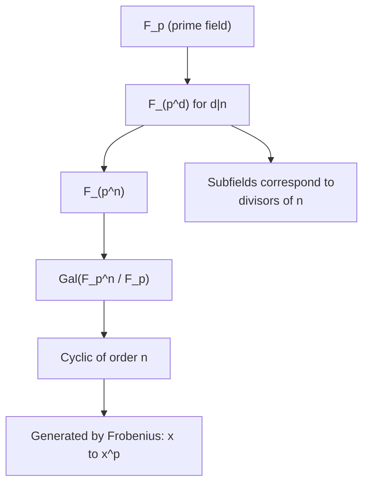

> **Prerequisites**: [[08-fundamental-theorem|08. Fundamental Theorem of Galois Theory]]
> **Objectives**:
> - Chứng minh $\mathbb{F}_{p^n}$ tồn tại duy nhất cho mọi prime power $p^n$
> - Hiểu $\mathbb{F}_{p^n}$ là splitting field của $x^{p^n} - x$ trên $\mathbb{F}_p$
> - Định nghĩa Frobenius automorphism và chứng minh nó generate Galois group
> - Tính $\operatorname{Gal}(\mathbb{F}_{p^n}/\mathbb{F}_p) \cong \mathbb{Z}/n\mathbb{Z}$ (cyclic)
> - Phân loại các subfields của $\mathbb{F}_{p^n}$ qua divisors của $n$

---

## Motivation / Intuition

Finite fields (trường hữu hạn) là một trong những ví dụ đẹp và đơn giản nhất của Galois extensions — đơn giản đến mức toàn bộ cấu trúc có thể mô tả hoàn toàn bằng một automorphism duy nhất.

Điểm kỳ diệu: **Frobenius map** $\varphi: x \mapsto x^p$ — phép lũy thừa đơn giản nhất — tự động là field automorphism và **generate toàn bộ Galois group**. Không cần bất kỳ tính toán phức tạp nào.

Ứng dụng: finite fields là nền tảng của mọi mật mã hiện đại (AES dùng $\mathbb{F}_{2^8}$, elliptic curve cryptography dùng $\mathbb{F}_p$ và $\mathbb{F}_{2^n}$, LWE-based cryptography dùng $\mathbb{F}_q$).

---

## Tồn tại và Duy nhất của Finite Fields

> [!abstract] Theorem 10.1 — Phân loại Finite Fields
> 1. **Order**: Mọi finite field có $p^n$ phần tử với $p$ nguyên tố và $n \geq 1$.
> 2. **Tồn tại**: Với mọi prime power $p^n$, tồn tại một field có đúng $p^n$ phần tử.
> 3. **Duy nhất**: Hai fields có cùng số phần tử đều đẳng cấu.
>
> Field hữu hạn có $p^n$ phần tử ký hiệu $\mathbb{F}_{p^n}$ hoặc $\operatorname{GF}(p^n)$.

**Proof.**
*(1) Order:* Nếu $|F| = q < \infty$, prime subfield của $F$ là $\mathbb{F}_p$ với $p = \operatorname{char}(F)$. Xem $F$ như $\mathbb{F}_p$-vector space của dimension $n = [F:\mathbb{F}_p]$, thì $|F| = p^n$.

*(2) Tồn tại:* Xét $\mathbb{F}_{p^n}$ là splitting field của $f(x) = x^{p^n} - x$ trên $\mathbb{F}_p$.

Tập nghiệm $S = \{\alpha \in \bar{\mathbb{F}}_p \mid \alpha^{p^n} = \alpha\}$.

$f'(x) = p^n x^{p^n - 1} - 1 = -1 \neq 0$ (vì $p^n \equiv 0$ trong char $p$, nên $p^n x^{p^n-1} = 0$, và $f'(x) = -1$).

Vậy $\gcd(f, f') = 1$: $f$ có đúng $p^n$ nghiệm phân biệt, tức $|S| = p^n$.

$S$ là field: nếu $\alpha, \beta \in S$, thì $(\alpha + \beta)^{p^n} = \alpha^{p^n} + \beta^{p^n} = \alpha + \beta$ ✓ và $(\alpha\beta)^{p^n} = \alpha^{p^n}\beta^{p^n} = \alpha\beta$ ✓. Vậy $S$ là subfield của $\bar{\mathbb{F}}_p$ có $p^n$ phần tử, chính là splitting field của $f$.

*(3) Duy nhất:* Mọi field $F$ với $|F| = p^n$ đều thỏa $\alpha^{p^n} = \alpha$ với mọi $\alpha \in F$ (vì $|F^\times| = p^n - 1$ và $\alpha^{p^n-1} = 1$, nên $\alpha^{p^n} = \alpha$). Vậy $F \subseteq S$ là splitting field của $x^{p^n} - x$, và splitting field là duy nhất up to isomorphism. $\blacksquare$

> [!note] Remark 10.2
> Điểm then chốt: $\mathbb{F}_{p^n}$ là splitting field của $x^{p^n} - x$ trên $\mathbb{F}_p$, nên theo Theorem 7.4, $\mathbb{F}_{p^n}/\mathbb{F}_p$ là **Galois extension**.

---

## Frobenius Automorphism

> [!definition] Definition 10.3 — Frobenius Automorphism
> Cho $\mathbb{F}_{p^n}/\mathbb{F}_p$. **Frobenius automorphism** là ánh xạ:
>
> $$
> \varphi: \mathbb{F}_{p^n} \to \mathbb{F}_{p^n}, \quad \varphi(x) = x^p
> $$

> [!abstract] Theorem 10.4 — $\varphi$ là $\mathbb{F}_p$-automorphism
> Frobenius map $\varphi$ là field automorphism của $\mathbb{F}_{p^n}$ cố định $\mathbb{F}_p$.

**Proof.** $\varphi$ là ring homomorphism: $\varphi(xy) = (xy)^p = x^p y^p = \varphi(x)\varphi(y)$ và $\varphi(x+y) = (x+y)^p = x^p + y^p = \varphi(x) + \varphi(y)$ (Freshman's dream / char $p$). Injective (field homomorphism), và $\mathbb{F}_{p^n}$ finite nên surjective. Cố định $\mathbb{F}_p$: với $a \in \mathbb{F}_p$, Fermat's little theorem cho $a^p = a$. $\blacksquare$

> [!abstract] Theorem 10.5 — Frobenius có bậc $n$ trong Galois group
> $\varphi$ có bậc $n$ trong $\operatorname{Gal}(\mathbb{F}_{p^n}/\mathbb{F}_p)$.

**Proof.** $\varphi^k(x) = x^{p^k}$. Cần $\varphi^k = \mathrm{id}$ $\iff$ $x^{p^k} = x$ với mọi $x \in \mathbb{F}_{p^n}$ $\iff$ mọi $x$ là nghiệm của $x^{p^k} - x$. Nhưng đa thức này có nhiều nhất $p^k$ nghiệm. Vì $|\mathbb{F}_{p^n}| = p^n$, ta cần $p^n \leq p^k$, tức $k \geq n$. Vậy bậc tối thiểu là $n$ (và $\varphi^n(x) = x^{p^n} = x$ với mọi $x \in \mathbb{F}_{p^n}$). $\blacksquare$

---

## Galois Group của Finite Fields

> [!abstract] Theorem 10.6 — $\operatorname{Gal}(\mathbb{F}_{p^n}/\mathbb{F}_p) \cong \mathbb{Z}/n\mathbb{Z}$
> $\operatorname{Gal}(\mathbb{F}_{p^n}/\mathbb{F}_p)$ là **cyclic group bậc $n$**, generated bởi Frobenius automorphism $\varphi$:
>
> $$
> \operatorname{Gal}(\mathbb{F}_{p^n}/\mathbb{F}_p) = \langle \varphi \rangle = \{1, \varphi, \varphi^2, \ldots, \varphi^{n-1}\} \cong \mathbb{Z}/n\mathbb{Z}
> $$

**Proof.** $|\operatorname{Gal}(\mathbb{F}_{p^n}/\mathbb{F}_p)| = [\mathbb{F}_{p^n}:\mathbb{F}_p] = n$ (Galois extension). $\varphi \in \operatorname{Gal}$ có bậc $n$ (Theorem 10.5). Subgroup $\langle\varphi\rangle$ có bậc $n = |\operatorname{Gal}|$, vậy $\operatorname{Gal} = \langle\varphi\rangle$. $\blacksquare$

> [!note] Remark 10.7 — Frobenius tổng quát hơn
> Với extension $\mathbb{F}_{q^n}/\mathbb{F}_q$ ($q = p^m$): Galois group vẫn cyclic bậc $n$, generated bởi $\varphi_q: x \mapsto x^q$.

---

## Subfields và Divisors

FTGT + $G \cong \mathbb{Z}/n\mathbb{Z}$ cyclic cho ta phân loại hoàn toàn subfields:

> [!abstract] Theorem 10.8 — Subfields của $\mathbb{F}_{p^n}$ tương ứng với divisors của $n$
> Subfields của $\mathbb{F}_{p^n}$ chính là các $\mathbb{F}_{p^d}$ với $d \mid n$, và chỉ có chúng. Bijection:
>
> $$
> \left\{\text{subfields của } \mathbb{F}_{p^n}\right\} \longleftrightarrow \left\{d \in \mathbb{Z} \mid d > 0,\ d \mid n\right\}
> $$

**Proof.** Subgroups của $\mathbb{Z}/n\mathbb{Z}$ là $\langle n/d \rangle$ với $d \mid n$, bậc $d$. Theo FTGT:
- Subgroup $H = \langle \varphi^d \rangle$ (bậc $n/d$) $\leftrightarrow$ fixed field $(\mathbb{F}_{p^n})^H$.
- $(\mathbb{F}_{p^n})^H = \{x \mid \varphi^d(x) = x\} = \{x \mid x^{p^d} = x\} = \mathbb{F}_{p^d}$.

Vậy mỗi $d \mid n$ cho đúng một subfield $\mathbb{F}_{p^d}$, và không có subfield nào khác. $\blacksquare$

> [!example] Example 10.9 — Subfields của $\mathbb{F}_{2^{12}}$
> Divisors của $12$: $1, 2, 3, 4, 6, 12$.
>
> Subfields: $\mathbb{F}_2, \mathbb{F}_4, \mathbb{F}_8, \mathbb{F}_{16}, \mathbb{F}_{64}, \mathbb{F}_{4096}$.
>
> Lattice subfields (đảo ngược so với lattice subgroups):
>
> $$
> \mathbb{F}_2 \subset \mathbb{F}_4 \subset \mathbb{F}_{16} \subset \mathbb{F}_{4096}
> $$
> $$
> \mathbb{F}_2 \subset \mathbb{F}_4 \subset \mathbb{F}_{64} \subset \mathbb{F}_{4096}
> $$
> $$
> \mathbb{F}_2 \subset \mathbb{F}_8 \subset \mathbb{F}_{64} \subset \mathbb{F}_{4096}
> $$

---

## Minimal Polynomials và Irreducible Polynomials over Finite Fields

> [!abstract] Corollary 10.10 — Minimal polynomial và Frobenius orbit
> Cho $\alpha \in \mathbb{F}_{p^n}$ với $\operatorname{Irr}(\alpha, \mathbb{F}_p)$ có degree $d$. Khi đó:
>
> - $d \mid n$ (vì $[\mathbb{F}_p(\alpha):\mathbb{F}_p] = d$ phải chia $n = [\mathbb{F}_{p^n}:\mathbb{F}_p]$).
> - Các nghiệm của $\operatorname{Irr}(\alpha, \mathbb{F}_p)$ chính là **Frobenius orbit** của $\alpha$: $\left\{\alpha, \alpha^p, \alpha^{p^2}, \ldots, \alpha^{p^{d-1}}\right\}$.

**Proof.** $\operatorname{Gal}(\mathbb{F}_{p^n}/\mathbb{F}_p) = \langle\varphi\rangle$ tác động lên $\alpha$ qua orbit $\{\alpha, \varphi(\alpha), \ldots\} = \{\alpha, \alpha^p, \alpha^{p^2},\ldots\}$. Minimal polynomial của $\alpha$ là product của $(x - \beta)$ trên orbit (từ Galois theory). Orbit có bậc $= \operatorname{ord}_{G}(\text{stabilizer})$... Cụ thể: orbit có $d$ phần tử phân biệt với $d = [\mathbb{F}_p(\alpha):\mathbb{F}_p]$. $\blacksquare$

> [!example] Example 10.11 — Irreducible polynomials over $\mathbb{F}_2$
> $\alpha \in \mathbb{F}_{2^4}$ có $\operatorname{Irr}(\alpha, \mathbb{F}_2) = x^4 + x + 1$ (degree 4, irreducible over $\mathbb{F}_2$).
>
> Frobenius orbit: $\{\alpha, \alpha^2, \alpha^4, \alpha^8\}$ — đây là bốn nghiệm của $x^4 + x + 1$ trong $\mathbb{F}_{2^4}$.
>
> Ứng dụng: $\mathbb{F}_{2^8}$ (dùng trong AES) được xây dựng là $\mathbb{F}_2[x]/(x^8 + x^4 + x^3 + x + 1)$ — đây là quotient ring bởi irreducible polynomial bậc 8 trên $\mathbb{F}_2$.

---

## Sơ đồ: Galois theory của finite fields



*Toàn bộ cấu trúc Galois theory của finite fields được điều khiển bởi Frobenius.*

---

## SageMath Cheatsheet

```sage
F = GF(2^12, 'a')
print(F.cardinality())
print(F.is_field())

G = F.galois_group()
print(G.order(), G.structure_description())

frob = G.gen()
a = F.gen()
print(frob(a) == a^2)

for d in divisors(12):
    Fd = GF(2^d)
    print(f"d={d}: GF(2^{d}) has {Fd.cardinality()} elements")

K = GF(2^4, 'b')
b = K.gen()
print(b.minpoly())

Kx.<x> = PolynomialRing(GF(2))
print(factor(x^12 - 1))
```

---

## Summary / Key Takeaways

- $\mathbb{F}_{p^n}$ là splitting field của $x^{p^n} - x$ trên $\mathbb{F}_p$ — tồn tại và duy nhất up to isomorphism.
- $x^{p^n} - x$ có đúng $p^n$ nghiệm phân biệt — không có nghiệm bội.
- **Frobenius** $\varphi: x \mapsto x^p$ là automorphism, cố định $\mathbb{F}_p$, có bậc $n$.
- $\operatorname{Gal}(\mathbb{F}_{p^n}/\mathbb{F}_p) = \langle\varphi\rangle \cong \mathbb{Z}/n\mathbb{Z}$ — cyclic, generator là Frobenius.
- **Subfields** của $\mathbb{F}_{p^n}$: chính xác là $\{\mathbb{F}_{p^d} \mid d \mid n\}$ — biject với divisors của $n$.
- Minimal polynomial của $\alpha \in \mathbb{F}_{p^n}$ có nghiệm là Frobenius orbit $\{\alpha, \alpha^p, \alpha^{p^2}, \ldots\}$.
- Finite fields là ví dụ hoàn hảo để áp dụng FTGT: group $\mathbb{Z}/n\mathbb{Z}$ cho structure hoàn toàn tường minh.

---

## References

- Dummit, D. S. & Foote, R. M. *Abstract Algebra* (3rd ed.), §14.3.
- Conrad, K. *Finite Fields*. Có tại https://kconrad.math.uconn.edu/blurbs/galoistheory/finitefields.pdf
- Milne, J. S. *Fields and Galois Theory*, §11.
- Lidl, R. & Niederreiter, H. *Finite Fields*, Cambridge University Press.
