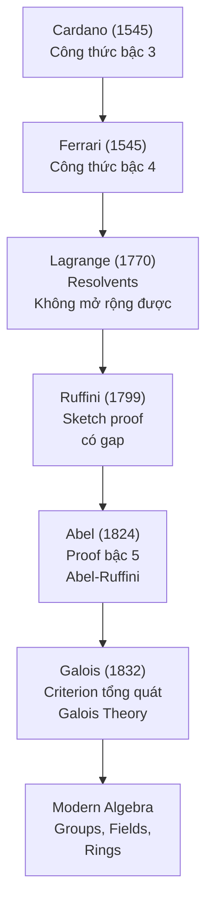

> **Prerequisites**: [[13-solvable-groups-radical-extensions|13. Solvable Groups và Radical Extensions]]
> **Objectives**:
> - Chứng minh $A_5$ là nhóm đơn (simple) — bước then chốt
> - Chứng minh $S_5$ không solvable
> - Xây dựng ví dụ cụ thể quintic không giải được: $x^5 - 6x + 3$
> - Phát biểu đầy đủ **Abel-Ruffini Theorem**: không có công thức nghiệm tổng quát cho bậc $\geq 5$
> - Hiểu "general polynomial" và ý nghĩa của kết quả

---

## Motivation / Intuition

Đây là định lý vĩ đại nhất của Galois Theory và là câu trả lời cho câu hỏi 300 năm.

**Tóm tắt logic:**
1. $f$ giải được bằng căn thức $\iff$ $\operatorname{Gal}(f)$ là solvable group (Bài 13).
2. $A_5$ không solvable (vì $A_5$ simple và non-abelian).
3. $S_5$ không solvable (vì chứa $A_5$ như normal subgroup).
4. Có những quintic $f \in \mathbb{Q}[x]$ với $\operatorname{Gal}(f) \cong S_5$.
5. Vậy những quintic đó không giải được bằng căn thức.

Kết quả thậm chí mạnh hơn: **"general polynomial" bậc $n \geq 5$ có Galois group $S_n$**, nên **không có công thức tổng quát** giống Cardano/Ferrari cho bậc cao hơn.

---

## $A_5$ là Simple Group

Đây là bước kỹ thuật then chốt. Ta cần chứng minh $A_5$ không có normal subgroup nào khác $\{e\}$ và $A_5$.

> [!abstract] Theorem 14.1 — $A_5$ là Simple Group
> Nhóm luân phiên $A_5$ (bậc 60) không có normal subgroup thực sự nào (ngoài $\{e\}$ và $A_5$).

**Proof.**
Ta phân $A_5$ theo các cycle types (tất cả đều là even permutations):

| Cycle type | Số lượng | Ví dụ |
|---|---|---|
| $(1)$ | $1$ | $e$ |
| $(12)(34)$ | $15$ | $(12)(34)$ |
| $(123)$ | $20$ | $(123)$ |
| $(12345)$ | $24$ | $(12345)$ |

Tổng: $1 + 15 + 20 + 24 = 60$ ✓

Mọi normal subgroup $N \trianglelefteq A_5$ phải là **union của các conjugacy classes** (vì $N$ đóng dưới conjugation). Hơn nữa, $|N|$ phải chia $|A_5| = 60$, và $N$ phải chứa $e$.

Kiểm tra tất cả tập union của conjugacy classes có thể chia 60 và chứa $\{e\}$:
- $\{e\}$: bậc $1$.
- $\{e\} \cup \{(12)(34)\text{-type}\}$: bậc $1 + 15 = 16$. Không chia $60$.
- $\{e\} \cup \{(123)\text{-type}\}$: bậc $1 + 20 = 21$. Không chia $60$.
- $\{e\} \cup \{(12345)\text{-type}\}$: bậc $1 + 24 = 25$. Không chia $60$.
- $\{e\} \cup \{(12)(34)\text{-type}\} \cup \{(123)\text{-type}\}$: bậc $36$. Không chia $60$.
- $\{e\} \cup \{(12)(34)\text{-type}\} \cup \{(12345)\text{-type}\}$: bậc $40$. Không chia $60$.
- $\{e\} \cup \{(123)\text{-type}\} \cup \{(12345)\text{-type}\}$: bậc $45$. Không chia $60$.
- Tất cả: bậc $60 = A_5$.

Không có tập nào (ngoài $\{e\}$ và $A_5$) có bậc chia $60$. Vậy $A_5$ simple. $\blacksquare$

> [!note] Remark 14.2 — Conjugacy classes trong $A_5$
> **Cẩn thận**: trong $S_5$, loại $(12345)$ tạo thành một conjugacy class duy nhất. Nhưng trong $A_5$, lớp này **tách thành hai** conjugacy class bậc 12 mỗi loại. Tuy nhiên với mục đích của bài toán, điều này không thay đổi kết quả (bậc 12 cũng không chia 60 cho normal subgroup).

---

## $S_n$ Không Solvable Với $n \geq 5$

> [!abstract] Theorem 14.3 — $S_n$ không solvable với $n \geq 5$
> Với $n \geq 5$: $S_n$ không phải solvable group.

**Proof.** Ta chứng minh $S_n^{(k)} \supseteq A_n$ với mọi $k$.

- $S_n^{(1)} = [S_n, S_n] = A_n$: vì $A_n$ là duy nhất subgroup index 2 của $S_n$ (nên $S_n/A_n \cong \mathbb{Z}/2$, abelian; và $A_n$ là kernel của sign homomorphism).
- $A_n^{(1)} = [A_n, A_n] = A_n$ với $n \geq 5$: vì $A_n$ simple và non-abelian nên $A_n' = A_n$ (nếu $A_n' \neq A_n$ thì $A_n' \trianglelefteq A_n$ và $A_n/A_n'$ abelian, mâu thuẫn với simplicity trừ khi $A_n' = \{e\}$, nhưng $A_n$ non-abelian loại trừ điều này).

Vậy $S_n^{(k)} \supseteq A_n \neq \{e\}$ với mọi $k$. Derived series không đạt $\{e\}$. $\blacksquare$

---

## Xây dựng Quintic không giải được

Để hoàn thành bài toán, ta cần một quintic cụ thể $f \in \mathbb{Q}[x]$ với $\operatorname{Gal}(f) \cong S_5$.

> [!abstract] Theorem 14.4 — Tiêu chuẩn để $\operatorname{Gal}(f) = S_5$
> Cho $f \in \mathbb{Q}[x]$ irreducible bậc 5. Nếu:
> 1. $\operatorname{Gal}(f)$ chứa một **5-cycle** (tương đương $f$ irreducible bậc 5), và
> 2. $\operatorname{Gal}(f)$ chứa một **transposition** (2-cycle),
>
> thì $\operatorname{Gal}(f) = S_5$.

**Proof.** Theo **Lemma**: nếu $G \leq S_p$ (với $p$ nguyên tố) là transitive và chứa transposition thì $G = S_p$.

Lý do: transitive cho $G$ chứa $p$-cycle (từ Sylow + transitive). Subgroup của $S_p$ chứa $p$-cycle và transposition là $S_p$ (Abel's lemma, hay chứng minh trực tiếp bằng quy nạp). $\blacksquare$

> [!abstract] Lemma 14.5 — Complex roots → transposition
> Nếu $f \in \mathbb{Q}[x]$ irreducible bậc $p$ (nguyên tố) có **đúng 2 nghiệm phức không thực** (và $p-2$ nghiệm thực), thì $\operatorname{Gal}(f) = S_p$.

**Proof.** $f$ irreducible bậc nguyên tố $p$ $\Rightarrow$ $G$ chứa $p$-cycle (từ Sylow: $p \mid |G|$, và có phần tử bậc $p$ trong $S_p$ là $p$-cycle). Complex conjugation $z \mapsto \bar{z}$ hoán đổi hai nghiệm phức và cố định $p-2$ nghiệm thực → tương ứng một transposition trong $G$. Áp Theorem 14.4. $\blacksquare$

> [!example] Example 14.6 — $f(x) = x^5 - 6x + 3$ không giải được bằng căn thức
> **Bước 1: Irreducibility.** Eisenstein với $p = 3$: $3 \nmid 1$ (hệ số $x^5$), $3 \mid -6$ và $3 \mid 3$, $9 \nmid 3$. Vậy $f$ irreducible over $\mathbb{Q}$.
>
> **Bước 2: Đếm nghiệm thực.** Phân tích $f'(x) = 5x^4 - 6$. Điểm tới hạn: $x^4 = 6/5$, tức $x = \pm (6/5)^{1/4} \approx \pm 1.047$.
>
> $f(0) = 3 > 0$. $f(-2) = -32 + 12 + 3 = -17 < 0$. $f(2) = 32 - 12 + 3 = 23 > 0$. $f(1.047) \approx 1.1 - 6.3 + 3 \approx -2.2 < 0$. $f(-1.047) \approx -1.1 + 6.3 + 3 \approx 8.2 > 0$.
>
> Phân tích dấu: $f$ thay đổi dấu trên $(-\infty, -2)$, $(-2, -1)$ và $(1, 2)$ → **đúng 3 nghiệm thực** và **2 nghiệm phức không thực**.
>
> **Bước 3: Áp Lemma 14.5.** $f$ irreducible bậc nguyên tố 5, có 2 nghiệm phức → $\operatorname{Gal}(f) = S_5$.
>
> **Bước 4: Kết luận.** $S_5$ không solvable (Theorem 14.3). Theo Galois Solvability Criterion, $f(x) = x^5 - 6x + 3$ **không giải được bằng căn thức**. $\blacksquare$

> [!example] Example 14.7 — Thêm ví dụ: $f(x) = 2x^5 - 5x^4 + 5$
> Eisenstein ($p=5$): irreducible. $f' = 10x^4 - 20x^3 = 10x^3(x-2)$. Nghiệm tới hạn: $x=0$ (local min, $f(0)=5>0$) và $x=2$ (local min, $f(2) = 64 - 80 + 5 = -11 < 0$). Vì $f(x) \to +\infty$ khi $x \to \pm\infty$ và local min âm, có đúng 2 nghiệm thực. Nhưng bậc 5 lẻ, $f(-\infty) \to -\infty$, $f(+\infty) \to +\infty$... thực ra có 3 nhánh thay đổi dấu → 3 nghiệm thực, 2 nghiệm phức. Áp Lemma 14.5: $\operatorname{Gal}(f) = S_5$.

---

## Abel-Ruffini Theorem: Phát biểu đầy đủ

> [!abstract] Theorem 14.8 — Abel-Ruffini Theorem
> **Không tồn tại** công thức tổng quát bằng căn thức (radical formula) để giải phương trình bậc $n \geq 5$ với hệ số tùy ý.
>
> Chính xác hơn: "General polynomial" bậc $n$ (với $n \geq 5$) — tức đa thức $x^n - s_1 x^{n-1} + s_2 x^{n-2} - \cdots + (-1)^n s_n$ với $s_1,\ldots,s_n$ là hàm đối xứng độc lập — có Galois group $S_n$ trên $\mathbb{Q}(s_1,\ldots,s_n)$, và $S_n$ không solvable.

> [!note] Remark 14.9 — Phân biệt hai điều:
> 1. **Có những quintic cụ thể** giải được: ví dụ $x^5 - 1 = 0$ (cyclotomic), $x^5 - 2 = 0$ (Galois group $F_{20}$ solvable order 20). Bài toán Abel-Ruffini nói về **hầu hết** quintics — hoặc chính xác hơn: nói về general quintic.
>
> 2. **Không có công thức tổng quát** đúng cho mọi quintic, không phải "không có quintic nào giải được".

### Ví dụ quintic GIẢI ĐƯỢC

> [!example] Example 14.10 — $x^5 - 2$ giải được
> $\operatorname{Gal}(x^5 - 2/\mathbb{Q}) \cong F_{20}$ (Frobenius group bậc 20).
>
> $F_{20} \cong \mathbb{Z}/5 \rtimes \mathbb{Z}/4$: có derived series $F_{20} \trianglerighteq \mathbb{Z}/5 \trianglerighteq \{e\}$ với factors $\mathbb{Z}/4$ và $\mathbb{Z}/5$ — đều cyclic, abelian. Vậy $F_{20}$ solvable.
>
> Vậy $x^5 - 2 = 0$ **giải được bằng căn thức**: nghiệm là $\sqrt[5]{2} \cdot \zeta_5^k$ với $k = 0,1,2,3,4$ — đây chính là biểu diễn bằng căn!

---

## Lịch sử và Ý nghĩa



*Dòng lịch sử từ công thức Cardano đến Galois Theory.*

---

## SageMath Cheatsheet

```sage
Kx.<x> = QQ[]

f = x^5 - 6*x + 3
print(f.is_irreducible())

L = f.splitting_field('a')
G = L.galois_group()
print(G.order())
print(G.structure_description())
print(G.is_solvable())

print(f.roots(CC, multiplicities=False))

g = x^5 - 2
Lg = g.splitting_field('b')
Gg = Lg.galois_group()
print(Gg.structure_description())
print(Gg.is_solvable())

A5 = AlternatingGroup(5)
print(A5.is_simple())
print(A5.is_solvable())
print(SymmetricGroup(5).is_solvable())
```

---

## Summary / Key Takeaways

- $A_5$ **simple**: không có normal subgroup khác $\{e\}$ và $A_5$; chứng minh bằng phân tích conjugacy classes.
- $A_n$ simple với $n \geq 5$; $S_n$ không solvable với $n \geq 5$.
- **Tiêu chuẩn $S_p$**: $f$ irreducible bậc nguyên tố $p$ có đúng 2 nghiệm phức $\Rightarrow$ $\operatorname{Gal}(f) = S_p$.
- **$x^5 - 6x + 3$**: irreducible (Eisenstein), 3 nghiệm thực + 2 phức, $\operatorname{Gal} = S_5$, không solvable → **không giải được bằng căn thức**.
- **Abel-Ruffini**: không có công thức tổng quát bằng căn thức cho bậc $\geq 5$.
- Phân biệt: có những quintic giải được ($x^5 - 2$ với $\operatorname{Gal} = F_{20}$ solvable), nhưng không có công thức chung.
- Đây là đỉnh cao của Galois Theory: group theory (solvability) $\leftrightarrow$ field theory (radical extensions).

---

## References

- Dummit, D. S. & Foote, R. M. *Abstract Algebra* (3rd ed.), §§14.8, 14.9.
- Milne, J. S. *Fields and Galois Theory*, §14. Có tại https://www.jmilne.org/math/CourseNotes/FT.pdf
- Stewart, I. *Galois Theory* (4th ed.), Chapters 19–21.
- Abel, N. H. *Mémoire sur les équations algébriques* (1824).
