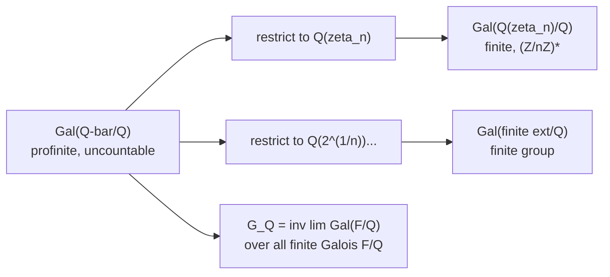

> **Prerequisites**: [[08-fundamental-theorem|08. Fundamental Theorem of Galois Theory]], [[09-cyclotomic-extensions|09. Cyclotomic Extensions]]
> **Objectives**:
> - Hiểu tại sao FTGT không trực tiếp mở rộng cho infinite extensions
> - Xây dựng Krull topology trên Galois group vô hạn
> - Định nghĩa và nhận diện profinite groups
> - Phát biểu **Krull's Theorem**: FTGT mở rộng với **closed subgroups**
> - Tính $\operatorname{Gal}(\bar{\mathbb{Q}}/\mathbb{Q})$ và $\operatorname{Gal}(\bar{\mathbb{F}}_p/\mathbb{F}_p)$

---

## Motivation / Intuition

Cho đến giờ ta chỉ làm việc với **finite** Galois extensions. Nhưng nhiều extensions tự nhiên và quan trọng là **vô hạn**:

- $\bar{\mathbb{Q}}/\mathbb{Q}$: algebraic closure, chứa tất cả algebraic extensions.
- $\mathbb{Q}(\zeta_\infty)/\mathbb{Q}$: compositum của tất cả cyclotomic extensions.
- $\bar{\mathbb{F}}_p/\mathbb{F}_p$: algebraic closure của finite field.

Vấn đề: với $L = \bar{\mathbb{Q}}$, nhóm $G = \operatorname{Gal}(\bar{\mathbb{Q}}/\mathbb{Q})$ (gọi là **absolute Galois group** của $\mathbb{Q}$) là **vô hạn** và cực kỳ phức tạp. FTGT như đã phát biểu **không còn đúng** — có quá nhiều subgroups so với intermediate fields.

Krull (1928) phát hiện ra giải pháp: trang bị $G$ với **topology** sao cho Galois correspondence chỉ cần xét **closed subgroups**.

---

## Tại sao FTGT Hỏng với Infinite Extensions?

> [!warning] Counterexample 16.1 — Subgroup không closed không cho intermediate field
> Xét $L = \bar{\mathbb{F}}_p$, $K = \mathbb{F}_p$. $G = \operatorname{Gal}(\bar{\mathbb{F}}_p/\mathbb{F}_p)$.
>
> Ta biết $G \cong \hat{\mathbb{Z}}$ (profinite integers), với generator là Frobenius $\varphi: x \mapsto x^p$.
>
> Xét subgroup $H = \langle \varphi \rangle \cong \mathbb{Z}$ (các lũy thừa nguyên của Frobenius). Đây là subgroup **không closed** trong topology.
>
> Nếu FTGT đúng: fixed field của $H$ sẽ là $F$ với $\varphi^k(x) = x$ $\forall k \in \mathbb{Z}$, tức $x^{p^k} = x$ $\forall k$. Nhưng điều này chỉ đúng khi $x = 0$ hoặc $|x|$ chia tất cả $p^k - 1$... không có field nào thỏa!
>
> $\Rightarrow$ Nếu chỉ xét **closed subgroups**, Galois correspondence vẫn đúng.

---

## Krull Topology

> [!definition] Definition 16.2 — Krull Topology
> Cho $L/K$ là Galois extension (có thể vô hạn). **Krull topology** trên $G = \operatorname{Gal}(L/K)$ được định nghĩa bằng cách lấy cơ sở tập mở:
>
> $$
> \sigma \cdot \operatorname{Gal}(L/F) = \{\tau \in G \mid \tau|_F = \sigma|_F\}
> $$
>
> với $\sigma \in G$ và $F$ chạy qua tất cả **finite Galois extensions** của $K$ trong $L$.
>
> Tương đương: hai automorphism $\sigma, \tau$ "gần nhau" nếu chúng đồng ý trên một finite subextension lớn.

> [!abstract] Theorem 16.3 — Tính chất topo của $G$
> Với Krull topology, $G = \operatorname{Gal}(L/K)$ là:
>
> 1. **Hausdorff** và **compact**.
> 2. **Totally disconnected** (mọi thành phần liên thông là $\{$một điểm$\}$).
> 3. **Profinite group**: $G \cong \varprojlim_{F/K \text{ finite Galois}} \operatorname{Gal}(F/K)$ (inverse limit).

**Proof sketch.**
*Hausdorff:* Nếu $\sigma \neq \tau$, có $\alpha \in L$ với $\sigma(\alpha) \neq \tau(\alpha)$. Lấy finite subextension $K(\alpha)/K$: nhóm $\operatorname{Gal}(L/K(\alpha))$ là open nhỏ tách $\sigma$ và $\tau$.

*Compact:* $G$ là closed subgroup của $\prod_{F/K} \operatorname{Gal}(F/K)$ (product của các nhóm finite/discrete), compact theo Tychonoff.

*Inverse limit:* Map $G \to \varprojlim \operatorname{Gal}(F/K)$ qua restriction — injective (Hausdorff) và surjective (extension of automorphisms). $\blacksquare$

---

## Profinite Groups

> [!definition] Definition 16.4 — Profinite Group
> **Profinite group** là topological group isomorphic với inverse limit của một hệ hướng của finite groups (với discrete topology):
>
> $$
> G = \varprojlim_{i \in I} G_i
> $$
>
> với $G_i$ hữu hạn và $\phi_{ij}: G_j \to G_i$ là homomorphisms (khi $i \leq j$).

> [!abstract] Theorem 16.5 — Đặc trưng Profinite Groups
> Topological group $G$ là profinite khi và chỉ khi $G$ là Hausdorff, compact, và totally disconnected.

> [!example] Example 16.6 — Các profinite groups tiêu chuẩn
> - $\mathbb{Z}/n\mathbb{Z}$: finite, trivially profinite.
> - $\mathbb{Z}_p = \varprojlim \mathbb{Z}/p^n\mathbb{Z}$: **$p$-adic integers** — profinite, infinite.
> - $\hat{\mathbb{Z}} = \varprojlim \mathbb{Z}/n\mathbb{Z} \cong \prod_p \mathbb{Z}_p$: **profinite integers**.
> - $\operatorname{Gal}(\bar{\mathbb{F}}_p/\mathbb{F}_p) \cong \hat{\mathbb{Z}}$: generated by Frobenius.
> - $\operatorname{Gal}(\mathbb{Q}(\zeta_\infty)/\mathbb{Q}) \cong \hat{\mathbb{Z}}^\times$ (invertible profinite integers).

---

## Krull's Theorem (Infinite FTGT)

> [!abstract] Theorem 16.7 — Krull's Theorem (1928)
> Cho $L/K$ là Galois extension (infinite OK) với $G = \operatorname{Gal}(L/K)$ trang bị Krull topology. Khi đó:
>
> **(A) Bijection:** Có bijection order-reversing giữa **intermediate fields** $K \subseteq M \subseteq L$ và **closed subgroups** của $G$:
>
> $$
> M \longmapsto \operatorname{Gal}(L/M), \qquad H \longmapsto L^H
> $$
>
> **(B) Tính chất:** Subgroup $H$ **open** $\iff$ $L^H/K$ là **finite** extension.
>
> Subgroup $H$ **normal** và closed $\iff$ $L^H/K$ là **Galois**, với $\operatorname{Gal}(L^H/K) \cong G/H$.

> [!warning] Remark 16.8 — Subgroup dense không cho intermediate field tốt
> Với infinite $G$, một subgroup $H$ **không closed** thỏa $L^H = K$ ngay cả khi $H \neq G$! Ví dụ: $H = \langle\varphi\rangle \cong \mathbb{Z}$ trong $\hat{\mathbb{Z}} = \operatorname{Gal}(\bar{\mathbb{F}}_p/\mathbb{F}_p)$ là dense nhưng không closed, và $(\bar{\mathbb{F}}_p)^H = \mathbb{F}_p = (\bar{\mathbb{F}}_p)^G$.

---

## Ví dụ: $\operatorname{Gal}(\bar{\mathbb{F}}_p/\mathbb{F}_p) \cong \hat{\mathbb{Z}}$

> [!example] Example 16.9 — Absolute Galois group của $\mathbb{F}_p$
> $\operatorname{Gal}(\bar{\mathbb{F}}_p/\mathbb{F}_p) \cong \hat{\mathbb{Z}} = \varprojlim \mathbb{Z}/n\mathbb{Z}$, generator là Frobenius $\varphi: x \mapsto x^p$.
>
> **Closed subgroups** của $\hat{\mathbb{Z}}$: chính xác là $\{n\hat{\mathbb{Z}} \mid n \geq 1\} \cup \{0\}$.
>
> Theo Krull's Theorem: **intermediate fields** của $\bar{\mathbb{F}}_p/\mathbb{F}_p$ là $\{\mathbb{F}_{p^n} \mid n \geq 1\} \cup \{\bar{\mathbb{F}}_p\}$.
>
> Tương ứng: $\operatorname{Gal}(\bar{\mathbb{F}}_p/\mathbb{F}_{p^n}) = n\hat{\mathbb{Z}}$, và $(\bar{\mathbb{F}}_p)^{n\hat{\mathbb{Z}}} = \mathbb{F}_{p^n}$. ✓
>
> Dense subgroup $\mathbb{Z} \subset \hat{\mathbb{Z}}$ không tương ứng intermediate field.

---

## Glimpse: Absolute Galois Group $\operatorname{Gal}(\bar{\mathbb{Q}}/\mathbb{Q})$

> [!note] Remark 16.10 — $\operatorname{Gal}(\bar{\mathbb{Q}}/\mathbb{Q})$ — Bài toán mở lớn nhất Algebra
> **Absolute Galois group** $G_\mathbb{Q} = \operatorname{Gal}(\bar{\mathbb{Q}}/\mathbb{Q})$ là một trong những đối tượng bí ẩn nhất toán học. Một số sự kiện đã biết:
>
> - $G_\mathbb{Q}$ là profinite group, **uncountably infinite**.
> - $G_\mathbb{Q}$ tác động lên $\bar{\mathbb{Q}}$, nên tác động lên tất cả algebraic varieties over $\mathbb{Q}$.
> - **Inverse Galois Problem**: Mọi finite group có phải là quotient của $G_\mathbb{Q}$ không? (Tức là Galois group của một extension hữu hạn của $\mathbb{Q}$ không?) — vẫn **mở**.
> - Được biết: mọi abelian finite group là quotient của $G_\mathbb{Q}$ (Kronecker-Weber). Nhiều non-abelian groups cũng đã được chứng minh (Shafarevich: mọi solvable finite group).
> - **Langlands Program**: kết nối representations của $G_\mathbb{Q}$ với automorphic forms — hiện là trung tâm nghiên cứu số học.

> [!example] Example 16.11 — Cyclotomic character
> $G_\mathbb{Q}$ tác động lên tất cả $\mu_n = \{\zeta_n^k\}$, cho character:
>
> $$
> \chi: G_\mathbb{Q} \to \hat{\mathbb{Z}}^\times, \quad \sigma(\zeta_n) = \zeta_n^{\chi(\sigma) \bmod n}
> $$
>
> **Cyclotomic character** $\chi$ là công cụ cơ bản để gắn số học với topology của $G_\mathbb{Q}$.

---

## Sơ đồ Inverse Limit



*$G_\mathbb{Q}$ là inverse limit của tất cả Galois groups hữu hạn, gắn kết qua restriction maps.*

---

## SageMath Cheatsheet

```sage
p = 2
K = GF(p)

for n in [1, 2, 3, 4, 6]:
    Kn = GF(p^n)
    print(f"F_{p^n}: Gal(F_{p^n}/F_p) = Z/{n}Z")

Kx.<x> = PolynomialRing(QQ)
f_list = [x^2 - 2, x^3 - 2, x^4 - 2, x^5 - 2]
for f in f_list:
    L = f.splitting_field('a')
    print(f.degree(), L.galois_group().structure_description())

from sage.groups.profinite.profinite_integers import ProfiniteIntegers
Zhat = ProfiniteIntegers(ZZ)
print(Zhat)
```

---

## Summary / Key Takeaways

- Với infinite Galois extension $L/K$, FTGT cần topology: bijection chỉ với **closed subgroups**.
- **Krull topology**: $\sigma, \tau$ gần nhau $\iff$ đồng ý trên finite subextension lớn.
- $G = \operatorname{Gal}(L/K)$ là **profinite**: Hausdorff, compact, totally disconnected, $= \varprojlim \operatorname{Gal}(F/K)$.
- **Krull's Theorem**: closed subgroups $\leftrightarrow$ intermediate fields; open closed subgroups $\leftrightarrow$ finite extensions.
- $\operatorname{Gal}(\bar{\mathbb{F}}_p/\mathbb{F}_p) \cong \hat{\mathbb{Z}}$, generated by Frobenius.
- **$G_\mathbb{Q} = \operatorname{Gal}(\bar{\mathbb{Q}}/\mathbb{Q})$**: profinite, tác động lên mọi algebraic variety — trung tâm của số học hiện đại.

---

## References

- Milne, J. S. *Fields and Galois Theory*, §§14–15. Có tại https://www.jmilne.org/math/CourseNotes/FT.pdf
- Neukirch, J. *Algebraic Number Theory*, Chapter II §10.
- Serre, J.-P. *Galois Cohomology*, Chapter I.
- Kedlaya, K. *Class Field Theory notes*. Có tại https://kskedlaya.org/cft/
