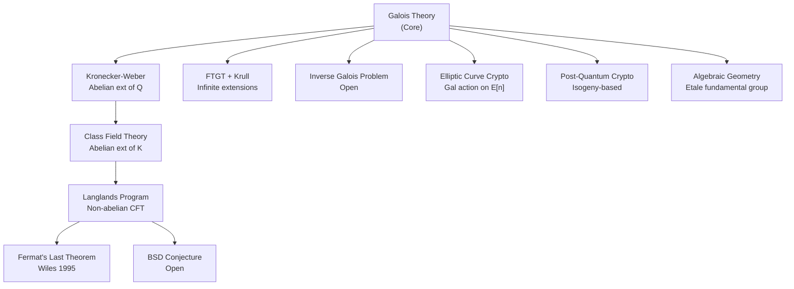

> **Prerequisites**: [[09-cyclotomic-extensions|09. Cyclotomic Extensions]], [[15-kummer-theory|15. Kummer Theory]], [[16-infinite-galois-extensions|16. Infinite Galois Extensions]]
> **Objectives**:
> - Phát biểu và hiểu **Kronecker-Weber Theorem** — đỉnh cao của abelian extensions over $\mathbb{Q}$
> - Nắm ý tưởng của **Class Field Theory** — tổng quát hóa cho number fields tùy ý
> - Hiểu **Inverse Galois Problem** — bài toán mở lớn nhất Galois Theory
> - Có cái nhìn tổng quan về các hướng nghiên cứu hiện đại kế thừa Galois Theory

---

## Bức tranh toàn cảnh

Sau 17 bài học, ta đã xây dựng Galois Theory từ nền tảng đến đỉnh cao. Bài này mở cửa ra thế giới nghiên cứu hiện đại — nơi Galois Theory trở thành công cụ trung tâm của số học, hình học, và mật mã học.

Ba câu hỏi lớn sẽ định hướng bài này:

1. **Kronecker-Weber**: Galois group abelian $\Rightarrow$ nằm trong cyclotomic extension. Tại sao $\mathbb{Q}$ đặc biệt?
2. **Class Field Theory**: Với number fields $K \neq \mathbb{Q}$, "cyclotomic extensions" được thay thế bởi gì?
3. **Inverse Galois Problem**: Mọi finite group có thể là Galois group của một extension của $\mathbb{Q}$ không?

---

## Kronecker-Weber Theorem

### Phát biểu và ý nghĩa

> [!abstract] Theorem 17.1 — Kronecker-Weber Theorem
> Mọi finite abelian extension của $\mathbb{Q}$ được chứa trong một cyclotomic extension. Cụ thể: nếu $K/\mathbb{Q}$ là Galois với $\operatorname{Gal}(K/\mathbb{Q})$ abelian, thì tồn tại $n \geq 1$ sao cho:
>
> $$
> K \subseteq \mathbb{Q}(\zeta_n)
> $$

**Ý nghĩa:** Cyclotomic fields ($= $ splitting fields của $x^n - 1$) không chỉ là ví dụ của abelian extensions — chúng là **tất cả** abelian extensions của $\mathbb{Q}$. Không có abelian extension nào "thoát khỏi" thế giới của roots of unity.

Nói cách khác: maximal abelian extension của $\mathbb{Q}$, ký hiệu $\mathbb{Q}^{\mathrm{ab}}$, chính là:

$$
\mathbb{Q}^{\mathrm{ab}} = \mathbb{Q}(\zeta_\infty) = \bigcup_{n=1}^\infty \mathbb{Q}(\zeta_n)
$$

> [!example] Example 17.2 — Ứng dụng cụ thể
> - Mọi quadratic extension $\mathbb{Q}(\sqrt{d})/\mathbb{Q}$: $G \cong \mathbb{Z}/2$, abelian. Vậy $\mathbb{Q}(\sqrt{d}) \subseteq \mathbb{Q}(\zeta_n)$ với $n$ nào đó.
>   - $\mathbb{Q}(\sqrt{-1}) = \mathbb{Q}(i) \subseteq \mathbb{Q}(\zeta_4)$. ✓
>   - $\mathbb{Q}(\sqrt{-3}) \subseteq \mathbb{Q}(\zeta_3)$. ✓
>   - $\mathbb{Q}(\sqrt{5}) \subseteq \mathbb{Q}(\zeta_5)$ (Bài 09, Example 9.10). ✓
> - $\mathbb{Q}(\zeta_8) = \mathbb{Q}(i, \sqrt{2})$: abelian ($G \cong V_4$). ✓
> - $\mathbb{Q}(\sqrt[3]{2})/\mathbb{Q}$: **không abelian** ($G \cong S_3$) → không nằm trong cyclotomic field. ✓

### Ý tưởng chứng minh

Proof hiện đại của Kronecker-Weber dùng **ramification theory** và **local class field theory**:

> [!note] Remark 17.3 — Sketch proof strategy
> **Bước 1 (Global → Local).** Mỗi prime $p$ ramified trong $K/\mathbb{Q}$ cho inertia group $I_p \leq G = \operatorname{Gal}(K/\mathbb{Q})$. Vì $G$ abelian, các inertia groups commute.
>
> **Bước 2 (Local Kronecker-Weber).** Với mỗi prime $p$, completion $K_p/\mathbb{Q}_p$ là finite abelian extension của $p$-adic field → nằm trong cyclotomic extension $\mathbb{Q}_p(\zeta_{p^r})/\mathbb{Q}_p$ (Local KW, dùng Kummer theory + structure của $\mathbb{Q}_p^\times$).
>
> **Bước 3 (Global assembly).** Đặt $m = \prod_p p^{e_p}$ với $p^{e_p}$ lấy từ local data. Thì $K \cdot \mathbb{Q}(\zeta_m) = \mathbb{Q}(\zeta_m)$ (vì locally đúng tại mọi prime), nên $K \subseteq \mathbb{Q}(\zeta_m)$.
>
> **Minkowski's theorem** (không có unramified extension của $\mathbb{Q}$) đảm bảo $m$ hữu hạn.

### Conductor

> [!definition] Definition 17.4 — Conductor của Abelian Extension
> Với $K/\mathbb{Q}$ abelian, **conductor** (chỉ số) $f_K$ là số nguyên dương nhỏ nhất sao cho $K \subseteq \mathbb{Q}(\zeta_{f_K})$.

> [!example] Example 17.5
> - $\mathbb{Q}(\sqrt{-4}) = \mathbb{Q}(i)$: conductor $= 4$.
> - $\mathbb{Q}(\sqrt{-3})$: conductor $= 3$.
> - $\mathbb{Q}(\sqrt{5})$: conductor $= 5$.
> - $\mathbb{Q}(\sqrt{8}) = \mathbb{Q}(\sqrt{2})$: conductor $= 8$.
>
> Quy luật chung: conductor của quadratic extension $\mathbb{Q}(\sqrt{d})$ bằng $|d_K|$ — **discriminant** của $K$. Đây là trường hợp đặc biệt của Führerdiskriminantenformel trong Class Field Theory.

---

## Class Field Theory

### Vấn đề tổng quát hóa

Kronecker-Weber trả lời cho $\mathbb{Q}$: abelian extensions $\leftrightarrow$ cyclotomic extensions. Nhưng với number field $K$ tùy ý (e.g., $K = \mathbb{Q}(\sqrt{-5})$), ta có câu hỏi tương tự:

*Abelian extensions của $K$ được phân loại bởi gì?*

Câu trả lời là **Class Field Theory** — một trong những thành tựu vĩ đại nhất của thế kỷ 20.

> [!abstract] Theorem 17.6 — Global Class Field Theory (phiên bản thô)
> Cho $K$ là number field. Có một bijection chính tắc (canonical bijection) giữa:
>
> $$
> \left\{\text{Finite abelian extensions } L/K\right\} \longleftrightarrow \left\{\text{Open subgroups của finite index trong } \mathbb{A}_K^\times/K^\times\right\}
> $$
>
> trong đó $\mathbb{A}_K^\times$ là nhóm **idèle** của $K$.

Với $K = \mathbb{Q}$: $\mathbb{A}_\mathbb{Q}^\times/\mathbb{Q}^\times \cong \hat{\mathbb{Z}}^\times \times \mathbb{R}_{>0}$. Open subgroups tương ứng với các level $n$ trong $(\mathbb{Z}/n\mathbb{Z})^\times$, và đây chính là Galois groups của cyclotomic extensions — phục hồi Kronecker-Weber.

> [!note] Remark 17.7 — Hilbert's 12th Problem
> Hilbert (1900) đặt câu hỏi: *Tìm "special values" (tương tự roots of unity $= e^{2\pi i/n}$) để generate mọi abelian extension của $K$.*
>
> - Với $K = \mathbb{Q}$: $\zeta_n = e^{2\pi i/n}$ (values của $e^{2\pi i z}$ tại $z = 1/n$).
> - Với $K = \mathbb{Q}(\sqrt{-d})$ (imaginary quadratic): **CM theory** — values của modular $j$-function và elliptic functions tại CM points. (Partially solved by Kronecker, completed by Shimura-Taniyama-Weil.)
> - Với $K$ general: **vẫn mở** (Hilbert's 12th problem chưa giải).

---

## Inverse Galois Problem

### Phát biểu

> [!definition] Definition 17.8 — Inverse Galois Problem
> **Inverse Galois Problem**: Cho $G$ là finite group tùy ý. Có tồn tại Galois extension $K/\mathbb{Q}$ với $\operatorname{Gal}(K/\mathbb{Q}) \cong G$ không?

Nói cách khác: mọi finite group có phải là Galois group của một extension hữu hạn của $\mathbb{Q}$ không?

> [!note] Remark 17.9 — Hiện trạng
> - **Biết là có**: mọi abelian finite group (Kronecker-Weber), mọi solvable group (Shafarevich 1954), nhiều simple groups cụ thể ($A_n$ (Hilbert), $S_n$ (classical), nhiều sporadic groups).
> - **Chưa biết**: liệu đúng cho **mọi** finite group — đây là bài toán mở.
> - Mọi finite group là Galois group over $\mathbb{C}(t)$ (Riemann, toán học phức).
> - Mọi finite group là Galois group over $K(t)$ với $K$ algebraically closed (Riemann's existence theorem).

> [!example] Example 17.10 — $S_n$ là Galois group over $\mathbb{Q}$
> Với mọi $n$: tồn tại $f \in \mathbb{Q}[x]$ bậc $n$ với $\operatorname{Gal}(f) = S_n$.
>
> **Ví dụ cụ thể**: $f(x) = x^n - x - 1$ (theo một định lý của Selmer, 1956) có Galois group $S_n$ với hầu hết $n$.

> [!example] Example 17.11 — Monster Group là Galois group!
> **Thompson (1984)**: Monster group $\mathbb{M}$ (finite simple group lớn nhất, bậc $\approx 8 \times 10^{53}$) là Galois group của một extension của $\mathbb{Q}(t)$. Được xây dựng qua **moonshine theory** — kết nối với modular forms và string theory.

---

## Các Hướng Nghiên cứu Hiện đại



### Langlands Program

> [!note] Remark 17.12 — Langlands Program
> **Langlands Program** (Robert Langlands, 1967) là tổng quát hóa sâu sắc nhất của Class Field Theory: thay vì chỉ abelian Galois representations, nó liên hệ **arbitrary Galois representations** với **automorphic forms** (tổng quát của modular forms).
>
> - **Fermat's Last Theorem (Wiles, 1995)**: Dùng một trường hợp đặc biệt (modularity of elliptic curves).
> - **Sato-Tate Conjecture (proved 2011)**: Dùng potential automorphy techniques.
> - Hầu hết các trường hợp tổng quát vẫn **chưa chứng minh**.

### Galois Theory trong Cryptography

> [!note] Remark 17.13 — Mật mã học và Galois Theory
> Galois Theory trực tiếp ứng dụng trong:
>
> - **Elliptic Curve Cryptography (ECC)**: Galois module $E[n]$ (các $n$-torsion points) là nền tảng của ECDLP và many protocols.
> - **Pairing-based cryptography**: Weil/Tate/Ate pairings — maps $E[n] \times E[n] \to \mu_n$ — dùng trong BLS signatures, KZG commitments, Groth16 ZK-proofs.
> - **Isogeny-based cryptography (CSIDH, SQISign)**: Galois action trên supersingular isogeny graphs.
> - **Lattice-based cryptography**: Cyclotomic polynomials $\Phi_n(x)$ định nghĩa ring $\mathbb{Z}[x]/\Phi_n(x)$ dùng trong RLWE/NTRU.

### Étale Fundamental Group

> [!note] Remark 17.14 — Étale Fundamental Group (Grothendieck)
> Grothendieck (1960s) xây dựng **étale fundamental group** $\pi_1^{\text{ét}}(X)$ của một algebraic variety $X$ — tổng quát hóa Galois group sang hình học đại số. Với $X = \operatorname{Spec}(K)$, $\pi_1^{\text{ét}}(X) = \operatorname{Gal}(\bar{K}/K)$.
>
> Đây là nền tảng của: Weil conjectures (chứng minh bởi Deligne 1974), $l$-adic cohomology, và chương trình Langlands hình học.

---

## Bài tập Suy nghĩ

> [!tip] Exercise 17.1 — Confirm Kronecker-Weber in small cases
> Chứng minh mọi quadratic extension $\mathbb{Q}(\sqrt{d})/\mathbb{Q}$ nằm trong $\mathbb{Q}(\zeta_n)$ với $n = |d_K|$ (discriminant của $\mathbb{Q}(\sqrt{d})$).

> [!tip] Exercise 17.2 — Maximal abelian extension
> Chứng minh $\operatorname{Gal}(\mathbb{Q}^{\mathrm{ab}}/\mathbb{Q}) \cong \hat{\mathbb{Z}}^\times = \varprojlim (\mathbb{Z}/n\mathbb{Z})^\times$, và cyclotomic character $\chi: G_\mathbb{Q} \to \hat{\mathbb{Z}}^\times$ surjects onto $\hat{\mathbb{Z}}^\times$.

> [!tip] Exercise 17.3 — Frobenius elements
> Cho $K/\mathbb{Q}$ finite Galois abelian extension và $p$ unramified prime. Định nghĩa **Frobenius element** $\operatorname{Frob}_p \in \operatorname{Gal}(K/\mathbb{Q})$ bởi $\operatorname{Frob}_p(x) \equiv x^p \pmod{\mathfrak{p}}$ cho prime $\mathfrak{p}$ của $K$ trên $p$.
>
> Chứng minh rằng $p$ splits completely trong $K/\mathbb{Q}$ khi và chỉ khi $\operatorname{Frob}_p = \mathrm{id}$.

---

## Summary / Key Takeaways

- **Kronecker-Weber**: Mọi abelian extension của $\mathbb{Q}$ $\subseteq$ $\mathbb{Q}(\zeta_n)$. Maximal abelian extension $\mathbb{Q}^{\mathrm{ab}} = \mathbb{Q}(\zeta_\infty)$.
- **Conductor**: $K \subseteq \mathbb{Q}(\zeta_n)$ với $n$ nhỏ nhất là $n = f_K$ (conductor). Với quadratic fields: conductor = $|$discriminant$|$.
- **Class Field Theory**: tổng quát Kronecker-Weber cho number fields tùy ý, dùng idèle groups.
- **Inverse Galois Problem**: mọi finite group là Galois group over $\mathbb{Q}$? — **chưa biết**. Đã giải cho: abelian, solvable (Shafarevich), nhiều simple groups.
- **Langlands Program**: tổng quát hóa sâu sắc nhất, kết nối Galois representations với automorphic forms.
- **Mật mã học**: Galois Theory hiện diện trong ECC, pairing-based crypto, isogeny-based crypto, lattice-based crypto.
- **Étale fundamental group** (Grothendieck): Galois theory → hình học đại số hiện đại.

---

## SageMath Cheatsheet

```sage
K = QQ
Kx.<x> = PolynomialRing(K)

for n in [1, 2, 3, 4, 5, 6, 7, 8, 10, 12, 15, 17]:
    print(f"n={n}: phi={euler_phi(n)}, Q(zeta_{n}) abelian")

for d in [-3, -1, 2, 5, -5, 6]:
    L = QQ.extension(x^2 - d, 'sqrtd')
    disc = L.discriminant()
    print(f"Q(sqrt({d})): disc={disc}, conductor={abs(disc)}")

G_Z5 = (ZZ/5).unit_group()
print("Gal(Q(zeta_5)/Q) ~=", G_Z5)

L17 = CyclotomicField(17)
G17 = L17.galois_group()
print("Gal(Q(zeta_17)/Q):", G17.structure_description())
print("Degree:", L17.degree(), "= phi(17) =", euler_phi(17))

for G in [SymmetricGroup(n) for n in [2,3,4,5]]:
    print(f"S_{G.degree()}: solvable={G.is_solvable()}")
```

## References

- Dummit, D. S. & Foote, R. M. *Abstract Algebra* (3rd ed.), §14.5 (Kronecker-Weber).
- Kedlaya, K. *Class Field Theory notes*. Có tại https://kskedlaya.org/cft/
- Conrad, K. *History of Class Field Theory*. Có tại https://kconrad.math.uconn.edu/blurbs/gradnumthy/cfthistory.pdf
- Neukirch, J. *Algebraic Number Theory*, Chapter VI (Class Field Theory).
- Milne, J. S. *Class Field Theory*. Có tại https://www.jmilne.org/math/CourseNotes/CFT.pdf
- Serre, J.-P. *Topics in Galois Theory*.
- Langlands, R. *Problems in the Theory of Automorphic Forms* (1967).
