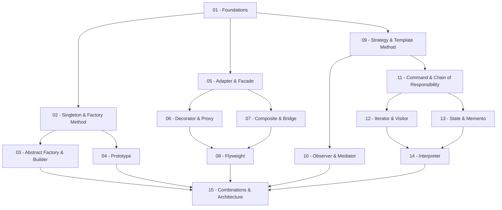

> **Topic**: GoF Design Patterns
> **Domain**: IT / Software Engineering
> **Level**: Intermediate
> **Background**: OOP cơ bản (class, interface, inheritance), kinh nghiệm làm việc thực tế với OOP
> **Tools / Code**: Python 3.10+
> **Sources**: GoF — *Design Patterns: Elements of Reusable Object-Oriented Software* (Gamma et al.), Refactoring.Guru, Python docs

---

## Lessons

| # | Title | Patterns | Prerequisites | Difficulty |
|---|-------|----------|---------------|------------|
| 01 | Foundations — SOLID & OOP nâng cao | *(prerequisites)* | — | ★★☆☆☆ |
| 02 | Singleton & Factory Method | Singleton, Factory Method | 01 | ★★☆☆☆ |
| 03 | Abstract Factory & Builder | Abstract Factory, Builder | 01, 02 | ★★★☆☆ |
| 04 | Prototype | Prototype | 01, 02 | ★★☆☆☆ |
| 05 | Adapter & Facade | Adapter, Facade | 01 | ★★☆☆☆ |
| 06 | Decorator & Proxy | Decorator, Proxy | 01, 05 | ★★★☆☆ |
| 07 | Composite & Bridge | Composite, Bridge | 01, 05 | ★★★☆☆ |
| 08 | Flyweight | Flyweight | 01, 06, 07 | ★★★★☆ |
| 09 | Strategy & Template Method | Strategy, Template Method | 01 | ★★☆☆☆ |
| 10 | Observer & Mediator | Observer, Mediator | 01, 09 | ★★★☆☆ |
| 11 | Command & Chain of Responsibility | Command, Chain of Responsibility | 01, 09 | ★★★☆☆ |
| 12 | Iterator & Visitor | Iterator, Visitor | 01, 09, 11 | ★★★★☆ |
| 13 | State & Memento | State, Memento | 01, 09, 11 | ★★★☆☆ |
| 14 | Interpreter | Interpreter | 01, 09–13 | ★★★★★ |
| 15 | Pattern Combinations & Real-world Architecture | Mixed | 02–14 | ★★★★☆ |

## Appendix Candidates

| ID | Content | Related Lesson | Notes |
|----|---------|----------------|-------|
| A0 | Pattern Quick Reference Cheatsheet | All | Tổng hợp UML mini, khi nào dùng, Python snippet ngắn |
| A1 | Anti-patterns & Common Pitfalls | All | Overengineering, Pattern Abuse, God Object, Spaghetti |

---

## Dependency Graph

---

## Progress Tracker

- [ ] [[00-roadmap|00. Roadmap]]
- [ ] [[01-foundations|01. Foundations — SOLID & OOP nâng cao]]
- [ ] [[02-singleton-factory-method|02. Singleton & Factory Method]]
- [ ] [[03-abstract-factory-builder|03. Abstract Factory & Builder]]
- [ ] [[04-prototype|04. Prototype]]
- [ ] [[05-adapter-facade|05. Adapter & Facade]]
- [ ] [[06-decorator-proxy|06. Decorator & Proxy]]
- [ ] [[07-composite-bridge|07. Composite & Bridge]]
- [ ] [[08-flyweight|08. Flyweight]]
- [ ] [[09-strategy-template-method|09. Strategy & Template Method]]
- [ ] [[10-observer-mediator|10. Observer & Mediator]]
- [ ] [[11-command-chain-of-responsibility|11. Command & Chain of Responsibility]]
- [ ] [[12-iterator-visitor|12. Iterator & Visitor]]
- [ ] [[13-state-memento|13. State & Memento]]
- [ ] [[14-interpreter|14. Interpreter]]
- [ ] [[15-combinations-architecture|15. Pattern Combinations & Real-world Architecture]]
- [ ] [[a0-pattern-cheatsheet|A0. Pattern Quick Reference Cheatsheet]]
- [ ] [[a1-anti-patterns|A1. Anti-patterns & Common Pitfalls]]
