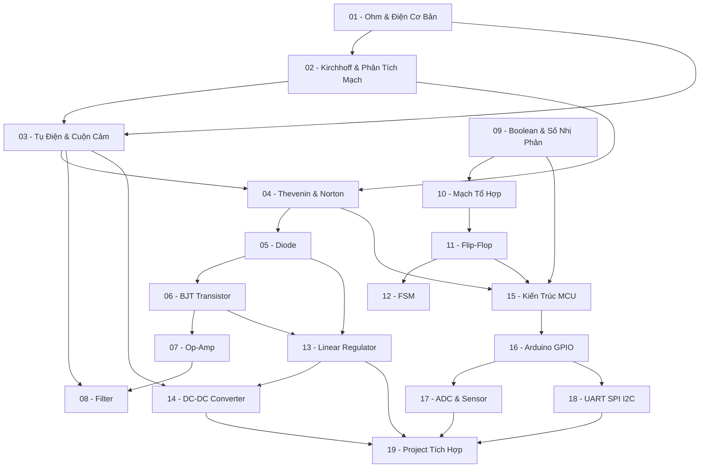

> **Topic**: Electronics — Từ Nền Tảng đến Embedded Systems
> **Domain**: Electronics Engineering
> **Level**: Beginner
> **Background**: Vật lý phổ thông (điện, từ), Toán cơ bản (vi phân, tích phân)
> **Tools / Code**: LTspice (mô phỏng), Arduino IDE (C/C++), Falstad Circuit Simulator (web)
> **Sources**: MIT OCW 6.002, The Art of Electronics (Horowitz & Hill), Arduino Official Docs

---

## Tổng Quan Lộ Trình

Khóa học được chia thành **5 module** theo thứ tự từ nền tảng đến ứng dụng thực tế. Mỗi module xây dựng trên module trước, nên cần học theo thứ tự.

```
Module 0 → Module 1 → Module 2 → Module 3
                  ↘                ↙
                   Module 4 (Embedded)
```

---

## Module 0 — Nền Tảng Mạch Điện (Circuit Fundamentals)

| # | Title | Key Concepts | Prerequisites | Difficulty |
|---|-------|-------------|---------------|------------|
| 01 | Điện Áp, Dòng Điện & Định Luật Ohm | Voltage, current, resistance, định luật Ohm | Vật lý phổ thông | ★☆☆☆☆ |
| 02 | Định Luật Kirchhoff & Phân Tích Mạch | KVL, KCL, nút, vòng, phân tích mạch nhánh | 01 | ★★☆☆☆ |
| 03 | Tụ Điện, Cuộn Cảm & Mạch RC/RL | Capacitor, inductor, mạch bậc nhất, hằng số thời gian τ | 01, 02 | ★★☆☆☆ |
| 04 | Định Lý Thevenin, Norton & Superposition | Mạch tương đương, nguồn thực, phân tích mạch phức tạp | 01, 02 | ★★★☆☆ |

## Module 1 — Analog Electronics

| # | Title | Key Concepts | Prerequisites | Difficulty |
|---|-------|-------------|---------------|------------|
| 05 | Diode — Đặc Tuyến & Ứng Dụng | P-N junction, đặc tuyến V-I, chỉnh lưu, Zener regulator | 01–04 | ★★☆☆☆ |
| 06 | Transistor BJT — Khuếch Đại & Switch | NPN/PNP, phân cực, vùng hoạt động, common-emitter amplifier | 05 | ★★★☆☆ |
| 07 | Op-Amp — Mạch Khuếch Đại & Ứng Dụng | Ideal op-amp, inverting/non-inverting, summing amp, comparator | 06 | ★★★☆☆ |
| 08 | Bộ Lọc Tần Số (Filter) | Low-pass, high-pass, band-pass, frequency response, Bode plot | 03, 07 | ★★★★☆ |

## Module 2 — Digital Electronics

| # | Title | Key Concepts | Prerequisites | Difficulty |
|---|-------|-------------|---------------|------------|
| 09 | Hệ Số Đếm & Đại Số Boolean | Binary, hex, octal, cổng logic cơ bản, bảng chân trị, De Morgan | — | ★☆☆☆☆ |
| 10 | Mạch Tổ Hợp (Combinational Logic) | Adder, subtractor, MUX, decoder, encoder, Karnaugh map | 09 | ★★★☆☆ |
| 11 | Flip-Flop & Mạch Tuần Tự | SR, D, JK, T flip-flop, register, counter (đồng bộ/bất đồng bộ) | 09, 10 | ★★★☆☆ |
| 12 | Finite State Machine (FSM) | Moore machine, Mealy machine, state diagram, state table, thiết kế FSM | 11 | ★★★★☆ |

## Module 3 — Power Electronics

| # | Title | Key Concepts | Prerequisites | Difficulty |
|---|-------|-------------|---------------|------------|
| 13 | Nguồn Cấp Điện Tuyến Tính | Linear regulator, LDO, dropout voltage, 78xx series, heat dissipation | 05, 06 | ★★☆☆☆ |
| 14 | DC-DC Converter — Buck & Boost | Switching regulator, Buck (step-down), Boost (step-up), duty cycle, efficiency | 03, 13 | ★★★★☆ |

## Module 4 — Embedded / Microcontroller

| # | Title | Key Concepts | Prerequisites | Difficulty |
|---|-------|-------------|---------------|------------|
| 15 | Kiến Trúc Microcontroller | CPU, memory (Flash/RAM/EEPROM), GPIO, clock, datasheet | Module 0–2 | ★★☆☆☆ |
| 16 | Arduino — Lập Trình C Cơ Bản & GPIO | setup/loop, digitalWrite, digitalRead, analogWrite (PWM), Serial | 15 | ★★☆☆☆ |
| 17 | ADC, Sensor & Ngắt (Interrupt) | analogRead, ADC resolution, sensor interfacing, interrupt service routine | 16 | ★★★☆☆ |
| 18 | Giao Tiếp Nối Tiếp — UART, SPI, I2C | Giao thức truyền thông, master/slave, cấu hình Arduino | 16 | ★★★☆☆ |
| 19 | Project Tích Hợp — Trạm Đo Môi Trường | DHT22, LCD I2C, UART logging, FSM, thiết kế hệ thống end-to-end | 13–18 | ★★★★☆ |

---

## Appendix Candidates

| ID | Content | Related Lesson | Notes |
|----|---------|----------------|-------|
| A0 | Hướng Dẫn Sử Dụng LTspice & Falstad | Tất cả | Cài đặt, vẽ mạch, chạy simulation |
| A1 | Đọc Datasheet — Hướng Dẫn Thực Tế | 05, 06, 13, 15 | Cách tra thông số, absolute max ratings |
| A2 | Bảng Tóm Tắt Công Thức | Tất cả | Quick reference toàn bộ khóa học |

---

## Dependency Graph



---

## Progress Tracker

**Module 0 — Circuit Fundamentals**
- [ ] [[00-roadmap|00. Roadmap]]
- [ ] [[01-voltage-current-ohm|01. Điện Áp, Dòng Điện & Định Luật Ohm]]
- [ ] [[02-kirchhoff-circuit-analysis|02. Định Luật Kirchhoff & Phân Tích Mạch]]
- [ ] [[03-capacitor-inductor-rc-rl|03. Tụ Điện, Cuộn Cảm & Mạch RC/RL]]
- [ ] [[04-thevenin-norton-superposition|04. Định Lý Thevenin, Norton & Superposition]]

**Module 1 — Analog Electronics**
- [ ] [[05-diode-characteristics-applications|05. Diode — Đặc Tuyến & Ứng Dụng]]
- [ ] [[06-bjt-transistor-amplifier-switch|06. Transistor BJT — Khuếch Đại & Switch]]
- [ ] [[07-opamp-amplifier-applications|07. Op-Amp — Mạch Khuếch Đại & Ứng Dụng]]
- [ ] [[08-frequency-filter|08. Bộ Lọc Tần Số (Filter)]]

**Module 2 — Digital Electronics**
- [ ] [[09-number-systems-boolean-algebra|09. Hệ Số Đếm & Đại Số Boolean]]
- [ ] [[10-combinational-logic|10. Mạch Tổ Hợp (Combinational Logic)]]
- [ ] [[11-flip-flop-sequential-logic|11. Flip-Flop & Mạch Tuần Tự]]
- [ ] [[12-finite-state-machine|12. Finite State Machine (FSM)]]

**Module 3 — Power Electronics**
- [ ] [[13-linear-regulator|13. Nguồn Cấp Điện Tuyến Tính]]
- [ ] [[14-dc-dc-converter|14. DC-DC Converter — Buck & Boost]]

**Module 4 — Embedded / Microcontroller**
- [ ] [[15-microcontroller-architecture|15. Kiến Trúc Microcontroller]]
- [ ] [[16-arduino-gpio-programming|16. Arduino — Lập Trình C Cơ Bản & GPIO]]
- [ ] [[17-adc-sensor-interrupt|17. ADC, Sensor & Ngắt (Interrupt)]]
- [ ] [[18-uart-spi-i2c|18. Giao Tiếp Nối Tiếp — UART, SPI, I2C]]
- [ ] [[19-integration-project|19. Project Tích Hợp — Trạm Đo Môi Trường]]

**Appendix**
- [ ] [[a0-ltspice-falstad-guide|A0. Hướng Dẫn Sử Dụng LTspice & Falstad]]
- [ ] [[a1-datasheet-reading|A1. Đọc Datasheet — Hướng Dẫn Thực Tế]]
- [ ] [[a2-formula-reference|A2. Bảng Tóm Tắt Công Thức]]
