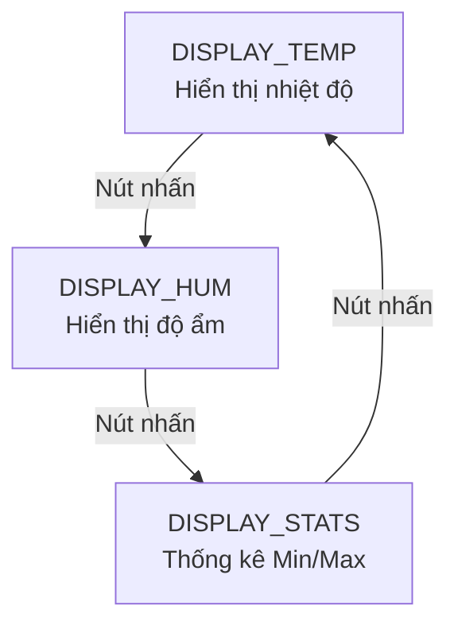

> **Prerequisites**: [[13-linear-regulator|13. Linear Regulator]], [[16-arduino-gpio-programming|16. Arduino GPIO]], [[17-adc-sensor-interrupt|17. ADC & Sensor]], [[18-uart-spi-i2c|18. UART SPI I2C]]
> **Objectives**:
> - Thiết kế và xây dựng hệ thống nhúng hoàn chỉnh từ đầu đến cuối
> - Kết hợp sensor DHT22 (I2C), OLED SSD1306 (I2C), nút nhấn, LED báo
> - Thiết kế firmware bằng FSM (Finite State Machine)
> - Logging dữ liệu qua UART
> - Thiết kế nguồn cấp điện thực tế từ 12V → 5V → 3.3V

---

## Tổng Quan Dự Án

Xây dựng **Trạm Đo Môi Trường** (Environmental Monitor Station) — thiết bị đo và hiển thị nhiệt độ, độ ẩm theo thời gian thực, với cảnh báo khi vượt ngưỡng.

**Chức năng**:
- Đo nhiệt độ và độ ẩm mỗi 2 giây (DHT22 hoặc DHT11)
- Hiển thị trên màn hình OLED 128×64
- LED xanh: bình thường; LED đỏ: cảnh báo (nhiệt độ > 35°C hoặc độ ẩm > 80%)
- Nút nhấn để chuyển màn hình (hiển thị nhiệt độ / độ ẩm / thống kê)
- UART logging: ghi dữ liệu mỗi 10 giây với timestamp millis()

**Danh sách linh kiện**:

| Linh Kiện | Số Lượng | Ghi Chú |
|-----------|---------|---------|
| Arduino Uno | 1 | MCU chính |
| DHT22 (hoặc DHT11) | 1 | Cảm biến nhiệt độ/độ ẩm |
| OLED 0.96" SSD1306 128×64 | 1 | Màn hình I2C |
| LED xanh + đỏ | 2 | Báo trạng thái |
| Điện trở 220 Ω | 2 | Hạn dòng LED |
| Điện trở 10 kΩ | 1 | Pull-up DHT22 |
| Nút nhấn | 1 | Chuyển chế độ hiển thị |
| 7805 TO-220 | 1 | Ổn áp 5V |
| Tụ 33 μF, 0.1 μF | 2 | Lọc nguồn 7805 |
| Breadboard + dây | — | |

---

## Sơ Đồ Kết Nối

```
        Arduino Uno
        ┌──────────┐
  5V ───┤VCC    GND├─── GND
        │          │
   A4 ──┤SDA       │
   A5 ──┤SCL       │── [OLED SSD1306]
        │          │      (I2C, 0x3C)
   D4 ──┤      D2  ├─── [Nút nhấn] ─── GND
        │          │
   D7 ──┤      D8  ├─── [R220Ω] ─── LED Xanh ─── GND
        │          ├─── [R220Ω] ─── LED Đỏ ─── GND
        └──────────┘
        D4 ─── [R10kΩ] ─── 5V (pull-up)
        D4 ─── DHT22 Data ─── GND (pin 4)

Nguồn:
        12V adapter → [7805] → 5V → Arduino 5V pin
```

---

## Thiết Kế FSM

Firmware được thiết kế theo FSM 3 trạng thái:



Ngoài FSM màn hình, có **hai timer song song** (non-blocking):
- Đọc sensor: mỗi 2 giây
- UART log: mỗi 10 giây

---

## Code Firmware Đầy Đủ

```cpp
#include <Wire.h>
#include <Adafruit_GFX.h>
#include <Adafruit_SSD1306.h>
#include <DHT.h>

// ── Pin định nghĩa ─────────────────────────────────────────────────
#define DHT_PIN       4
#define DHT_TYPE      DHT22
#define BTN_PIN       2
#define LED_GREEN     7
#define LED_RED       8

// ── Ngưỡng cảnh báo ────────────────────────────────────────────────
#define TEMP_WARN     35.0
#define HUM_WARN      80.0

// ── Khoảng thời gian (ms) ──────────────────────────────────────────
#define READ_INTERVAL    2000
#define LOG_INTERVAL    10000

// ── Đối tượng ──────────────────────────────────────────────────────
DHT dht(DHT_PIN, DHT_TYPE);
Adafruit_SSD1306 display(128, 64, &Wire, -1);

// ── Trạng thái FSM ─────────────────────────────────────────────────
enum DisplayState { SHOW_TEMP, SHOW_HUM, SHOW_STATS };
DisplayState currentState = SHOW_TEMP;

// ── Biến dữ liệu ───────────────────────────────────────────────────
float temperature = 0;
float humidity = 0;
float tempMin = 999, tempMax = -999;
float humMin = 999, humMax = -999;

// ── Biến timing ────────────────────────────────────────────────────
unsigned long lastReadTime = 0;
unsigned long lastLogTime = 0;

// ── Biến debounce ──────────────────────────────────────────────────
int lastBtnState = HIGH;
unsigned long lastDebounceTime = 0;
bool btnPressed = false;

// ─────────────────────────────────────────────────────────────────
void setup() {
    Serial.begin(9600);
    
    pinMode(LED_GREEN, OUTPUT);
    pinMode(LED_RED, OUTPUT);
    pinMode(BTN_PIN, INPUT_PULLUP);
    
    dht.begin();
    
    if (!display.begin(SSD1306_SWITCHCAPVCC, 0x3C)) {
        Serial.println("SSD1306 not found!");
        while (true);
    }
    
    display.clearDisplay();
    display.setTextSize(1);
    display.setTextColor(SSD1306_WHITE);
    display.setCursor(0, 0);
    display.println("EnvMonitor v1.0");
    display.println("Initializing...");
    display.display();
    delay(1000);
    
    Serial.println("millis,temp_C,hum_pct");
}

// ─────────────────────────────────────────────────────────────────
void readSensor() {
    float t = dht.readTemperature();
    float h = dht.readHumidity();
    
    if (!isnan(t) && !isnan(h)) {
        temperature = t;
        humidity = h;
        if (t < tempMin) tempMin = t;
        if (t > tempMax) tempMax = t;
        if (h < humMin) humMin = h;
        if (h > humMax) humMax = h;
    }
}

void updateLEDs() {
    bool warning = (temperature > TEMP_WARN || humidity > HUM_WARN);
    digitalWrite(LED_GREEN, warning ? LOW : HIGH);
    digitalWrite(LED_RED, warning ? HIGH : LOW);
}

void updateDisplay() {
    display.clearDisplay();
    display.setCursor(0, 0);
    
    switch (currentState) {
        case SHOW_TEMP:
            display.setTextSize(1);
            display.println("-- Temperature --");
            display.setTextSize(3);
            display.setCursor(10, 20);
            display.print(temperature, 1);
            display.print(" C");
            if (temperature > TEMP_WARN) {
                display.setTextSize(1);
                display.setCursor(0, 56);
                display.println("!!! WARNING HIGH !!!");
            }
            break;
        
        case SHOW_HUM:
            display.setTextSize(1);
            display.println("--- Humidity ---");
            display.setTextSize(3);
            display.setCursor(10, 20);
            display.print(humidity, 1);
            display.print(" %");
            if (humidity > HUM_WARN) {
                display.setTextSize(1);
                display.setCursor(0, 56);
                display.println("!!! WARNING HIGH !!!");
            }
            break;
        
        case SHOW_STATS:
            display.setTextSize(1);
            display.println("--- Statistics ---");
            display.print("T: ");
            display.print(tempMin, 1);
            display.print(" ~ ");
            display.print(tempMax, 1);
            display.println(" C");
            display.print("H: ");
            display.print(humMin, 1);
            display.print(" ~ ");
            display.print(humMax, 1);
            display.println(" %");
            break;
    }
    
    display.display();
}

void handleButton() {
    int reading = digitalRead(BTN_PIN);
    
    if (reading != lastBtnState) {
        lastDebounceTime = millis();
    }
    
    if (millis() - lastDebounceTime > 50) {
        if (reading == LOW && lastBtnState == HIGH) {
            // Nhấn xuống → chuyển trạng thái FSM
            switch (currentState) {
                case SHOW_TEMP:  currentState = SHOW_HUM;   break;
                case SHOW_HUM:   currentState = SHOW_STATS; break;
                case SHOW_STATS: currentState = SHOW_TEMP;  break;
            }
        }
    }
    
    lastBtnState = reading;
}

// ─────────────────────────────────────────────────────────────────
void loop() {
    unsigned long now = millis();
    
    // ── Đọc sensor mỗi READ_INTERVAL ms
    if (now - lastReadTime >= READ_INTERVAL) {
        lastReadTime = now;
        readSensor();
        updateLEDs();
        updateDisplay();
    }
    
    // ── UART log mỗi LOG_INTERVAL ms
    if (now - lastLogTime >= LOG_INTERVAL) {
        lastLogTime = now;
        Serial.print(now);
        Serial.print(",");
        Serial.print(temperature, 2);
        Serial.print(",");
        Serial.println(humidity, 2);
    }
    
    // ── Đọc nút nhấn (luôn luôn)
    handleButton();
}
```

---

## Hướng Dẫn Cài Đặt Thư Viện

```
Arduino IDE → Tools → Manage Libraries:
1. Tìm "DHT sensor library" → cài "DHT sensor library by Adafruit"
2. Tìm "Adafruit SSD1306" → cài
3. Tìm "Adafruit GFX Library" → cài (dependency)
```

---

## Phân Tích Thiết Kế Nguồn

```
Adapter 12V DC
    │
    ├── [0.33 μF ceramic] ── GND  (lọc input)
    │
    [7805 TO-220]
    │   │
    │  GND
    │
    [0.1 μF ceramic] ── GND  (lọc output)
    │
    ├── Arduino VIN hoặc 5V pin
    ├── DHT22 VCC
    └── OLED VCC (module thường có onboard LDO 3.3V)
```

$P_{diss} = (12 - 5) \times I_{total}$. Với Arduino (~50 mA) + OLED (~20 mA) + DHT22 (~2 mA) + LEDs (~20 mA) = ~92 mA → $P_{diss} = 7 \times 0{,}092 = 0{,}64\,\text{W}$ — không cần heatsink.

---

## Mở Rộng Dự Án

Sau khi hoàn thành baseline, có thể mở rộng:

1. **Thêm buzzer**: cảnh báo âm thanh khi vượt ngưỡng
2. **SD card logging**: lưu dữ liệu vào file `.csv` trên thẻ SD (SPI)
3. **Thêm BMP280**: đo áp suất khí quyển và độ cao (I2C)
4. **Wifi module ESP8266**: gửi dữ liệu lên ThingSpeak/MQTT qua WiFi
5. **RTC DS3231**: thêm timestamp thực (giờ/phút/giây) vào log (I2C)
6. **Pin + charging**: thêm TP4056 charger + boost MT3608 → thiết bị chạy pin

---

## Summary / Key Takeaways

Dự án này tích hợp **toàn bộ kiến thức** 4 module:
- **Circuit fundamentals**: Voltage divider cho pull-up DHT22
- **Analog**: LDO/Linear regulator cho nguồn
- **Digital**: FSM điều khiển màn hình, debounce nút nhấn
- **Embedded**: I2C OLED + DHT22, UART logging, millis() non-blocking, FSM firmware

Thiết kế firmware tốt = **FSM rõ ràng + non-blocking timer** thay vì delay() + code phân tách trách nhiệm.

---

## References

- DHT sensor library (Adafruit) — https://github.com/adafruit/DHT-sensor-library
- Adafruit SSD1306 library — https://github.com/adafruit/Adafruit_SSD1306
- DHT22 Datasheet — https://www.sparkfun.com/datasheets/Sensors/Temperature/DHT22.pdf
- Tinkercad Circuits — mô phỏng mạch + code Arduino online (tinkercad.com)
