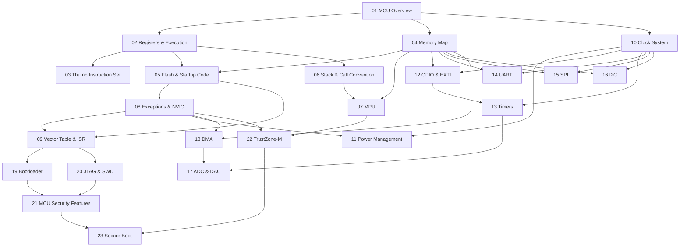

> **Topic**: Microcontroller Architecture (ARM Cortex-M)
> **Domain**: Embedded Systems / Hardware Security
> **Level**: Advanced
> **Background**: C/C++ cơ bản, kiến trúc máy tính (CPU/RAM/bus), đã dùng Arduino/STM32/ESP32
> **Tools / Code**: C bare-metal, ARM Assembly (Thumb-2), GDB + OpenOCD, STM32 làm platform tham chiếu
> **Sources**: ARM Architecture Reference Manual, STM32 Reference Manual, The Hardware Hacking Handbook, Embedded Systems Security and TrustZone

---

## Lessons

| # | Title | Key Concepts | Prerequisites | Difficulty |
|---|-------|-------------|---------------|------------|
| 01 | MCU Overview & Cortex-M Family | MCU vs CPU vs SoC, Harvard arch, pipeline, so sánh M0/M3/M4/M7/M33 | — | ★★☆☆☆ |
| 02 | Registers & Execution Model | R0–R15, xPSR, CONTROL, privilege mode, Thread/Handler, MSP/PSP | 01 | ★★★☆☆ |
| 03 | Instruction Set — Thumb & Thumb-2 | Thumb vs Thumb-2 encoding, key instructions, inline Assembly, disassembly | 01, 02 | ★★★☆☆ |
| 04 | Memory Map & Memory-Mapped I/O | 4GB address space, regions, MMIO concept, `volatile` | 01 | ★★★☆☆ |
| 05 | Flash, SRAM & Startup Code | Flash wait states, .text/.data/.bss, vector table, reset handler, linker script | 02, 04 | ★★★★☆ |
| 06 | Stack, Heap & Call Convention | MSP vs PSP, stack frame, AAPCS, heap, stack overflow detection | 02, 05 | ★★★☆☆ |
| 07 | MPU — Memory Protection Unit | Regions, permissions, background region, OS/security use cases, bypass | 04, 06 | ★★★★☆ |
| 08 | Exception Model & NVIC | 16 system exceptions, 240 IRQ, priority, preemption, tail-chaining | 02, 05 | ★★★★☆ |
| 09 | Vector Table & ISR Mechanics | Stacking/unstacking, EXC_RETURN, VTOR relocation, fault handlers | 05, 08 | ★★★★☆ |
| 10 | Clock System (RCC & PLL) | HSI/HSE/LSI/LSE, PLL, clock tree, AHB/APB prescalers, CSS | 01, 04 | ★★★☆☆ |
| 11 | Power Management | Sleep/Stop/Standby modes, power domains, wakeup sources, power side-channel intro | 08, 10 | ★★★☆☆ |
| 12 | GPIO & EXTI | Modes, ODR/IDR/BSRR registers, EXTI, bit-banding | 04, 10 | ★★☆☆☆ |
| 13 | Timers & SysTick | Basic/general/advanced timers, PWM, input capture, output compare | 10, 12 | ★★★☆☆ |
| 14 | UART/USART | Framing, baud rate, parity, DMA mode, hardware flow control, UART sniffing | 04, 10 | ★★★☆☆ |
| 15 | SPI | 4 modes (CPOL/CPHA), NSS management, SPI flash, logic analyzer analysis | 04, 10 | ★★★☆☆ |
| 16 | I2C | 7-bit/10-bit addressing, clock stretching, arbitration, ACK/NACK, I2C scanning | 04, 10 | ★★★☆☆ |
| 17 | ADC & DAC | SAR principle, sampling time, DMA circular mode, reference voltage, signal tampering | 13, 18 | ★★★☆☆ |
| 18 | DMA Controller | Channels/streams, priority, M2M/M2P/P2M, double-buffer, DMA race conditions | 04, 08 | ★★★★☆ |
| 19 | Bootloader & Boot Process | Boot pins, ROM bootloader, custom bootloader, jump-to-app, firmware update qua UART | 05, 09, 14 | ★★★★☆ |
| 20 | Debug Interfaces — JTAG & SWD | DAP, CoreSight, SWD protocol, OpenOCD, GDB remote, firmware dumping | 04, 09 | ★★★★☆ |
| 21 | MCU Security Features | RDP (level 0/1/2), WRP, PCROP, option bytes, secure JTAG, readout protection bypass | 07, 19, 20 | ★★★★★ |
| 22 | TrustZone-M (ARMv8-M) | Secure/Non-secure worlds, SAU, IDAU, NSC functions, TrustZone attack surface | 07, 08 | ★★★★★ |
| 23 | Secure Boot & Firmware Integrity | Hash/signature check, anti-rollback, secure update, fault injection vs secure boot | 19, 21, 22 | ★★★★★ |

## Appendix Candidates

| ID | Content | Related Lesson | Notes |
|----|---------|----------------|-------|
| A0 | Datasheet Reading Guide | 01–23 | Cách đọc ARM TRM, STM32 RM, register map navigation |
| A1 | Toolchain Setup | 01 | GCC ARM Embedded, OpenOCD, GDB, ST-Link, Makefile |
| A2 | Register Quick Reference | 05, 07, 08, 09 | Bảng tra nhanh: NVIC, SCB, SysTick, MPU, DMA registers |
| A3 | Hardware Hacking Toolkit | 20, 21, 23 | Logic analyzer, oscilloscope, J-Link, glitcher, ChipWhisperer intro |

---

## Dependency Graph

---

## Progress Tracker

- [ ] [[00-roadmap|00. Roadmap]]
- [ ] [[01-mcu-overview-cortex-m-family|01. MCU Overview & Cortex-M Family]]
- [ ] [[02-registers-execution-model|02. Registers & Execution Model]]
- [ ] [[03-thumb-instruction-set|03. Instruction Set — Thumb & Thumb-2]]
- [ ] [[04-memory-map-mmio|04. Memory Map & Memory-Mapped I/O]]
- [ ] [[05-flash-sram-startup|05. Flash, SRAM & Startup Code]]
- [ ] [[06-stack-heap-call-convention|06. Stack, Heap & Call Convention]]
- [ ] [[07-mpu-memory-protection|07. MPU — Memory Protection Unit]]
- [ ] [[08-exception-model-nvic|08. Exception Model & NVIC]]
- [ ] [[09-vector-table-isr|09. Vector Table & ISR Mechanics]]
- [ ] [[10-clock-system-rcc-pll|10. Clock System (RCC & PLL)]]
- [ ] [[11-power-management|11. Power Management]]
- [ ] [[12-gpio-exti|12. GPIO & EXTI]]
- [ ] [[13-timers-systick|13. Timers & SysTick]]
- [ ] [[14-uart-usart|14. UART/USART]]
- [ ] [[15-spi|15. SPI]]
- [ ] [[16-i2c|16. I2C]]
- [ ] [[17-adc-dac|17. ADC & DAC]]
- [ ] [[18-dma-controller|18. DMA Controller]]
- [ ] [[19-bootloader-boot-process|19. Bootloader & Boot Process]]
- [ ] [[20-jtag-swd-debug|20. Debug Interfaces — JTAG & SWD]]
- [ ] [[21-mcu-security-features|21. MCU Security Features]]
- [ ] [[22-trustzone-m|22. TrustZone-M (ARMv8-M)]]
- [ ] [[23-secure-boot-firmware-integrity|23. Secure Boot & Firmware Integrity]]
- [ ] [[a0-datasheet-reading-guide|A0. Datasheet Reading Guide]]
- [ ] [[a1-toolchain-setup|A1. Toolchain Setup]]
- [ ] [[a2-register-quick-reference|A2. Register Quick Reference]]
- [ ] [[a3-hardware-hacking-toolkit|A3. Hardware Hacking Toolkit]]
