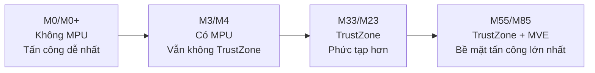
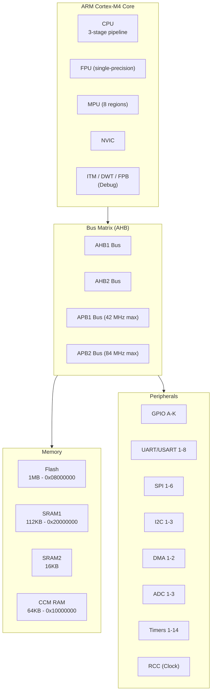

> **Prerequisites**: Kiến thức cơ bản về máy tính (CPU, RAM, bus), lập trình C cơ bản
> **Objectives**:
> - Phân biệt MCU, CPU, SoC và hiểu vì sao MCU phổ biến trong hệ thống nhúng
> - Nắm kiến trúc Harvard và von Neumann, biết MCU thuộc loại nào
> - Hiểu pipeline ARM Cortex-M và ảnh hưởng đến timing
> - So sánh các dòng Cortex-M0/M0+/M3/M4/M7/M33 để chọn đúng chip
> - Nhận diện security surface của từng dòng chip — nền tảng cho hardware hacking

---

## Motivation

Khi bạn lập trình trên Arduino hay STM32, bạn đang tương tác với một **vi điều khiển** (microcontroller — MCU). Nhưng "MCU" thực sự là gì? Tại sao nó khác với CPU trong laptop? Và tại sao từ góc độ bảo mật, MCU lại là mục tiêu hấp dẫn đến vậy?

Khác với laptop có CPU + RAM + storage tách biệt, MCU tích hợp tất cả trên **một chip duy nhất**: processor core, flash, SRAM, và hàng chục peripheral. Điều này giúp MCU nhỏ gọn, tiêu thụ điện thấp, chi phí rẻ — nhưng cũng có nghĩa là khi một thành phần bị tấn công, kẻ tấn công có thể tiếp cận toàn bộ hệ thống.

MCU có mặt trong **mọi thứ**: xe hơi, thiết bị y tế, smartcard, khóa cửa thông minh, thiết bị công nghiệp. Hiểu sâu kiến trúc của chúng là bước đầu tiên để tấn công hay bảo vệ các hệ thống này.

---

## MCU, CPU và SoC — Phân biệt cốt lõi

### Vi điều khiển (Microcontroller — MCU)

> [!definition] Definition 1.1 — Microcontroller (MCU)
> MCU là một **integrated circuit** (IC) tích hợp trên một chip duy nhất:
> - **Processor core** (CPU): thực thi instruction
> - **Flash memory**: lưu chương trình (non-volatile)
> - **SRAM**: lưu dữ liệu runtime (volatile)
> - **Peripherals**: GPIO, UART, SPI, I2C, ADC, Timer, v.v.
> - **Clock và power management**: PLL, oscillator, voltage regulator
>
> MCU thiết kế để **điều khiển** (control) — chạy firmware loop, phản ứng với sensor/actuator — không phải để xử lý đa nhiệm phức tạp.

### So sánh MCU / CPU / SoC / MPU

| | MCU | CPU (PC) | SoC | MPU (Microprocessor) |
|--|-----|---------|-----|---------------------|
| Flash/ROM | Tích hợp trong chip | Tách biệt (SSD) | Có thể tích hợp hoặc ngoài | Không có (cần external) |
| RAM | Tích hợp (vài KB–MB) | Tách biệt (DIMM) | Tích hợp hoặc external | External DRAM |
| Peripheral | Tích hợp đầy đủ | External (PCIe) | Tích hợp | Ít hoặc không có |
| OS | Thường không (bare-metal hoặc RTOS nhẹ) | Linux/Windows | Linux thường gặp | Linux hoặc RTOS |
| Ví dụ | STM32F4, ESP32, nRF52 | Intel Core i7 | Raspberry Pi's BCM2837 | NXP i.MX |
| Tiêu thụ điện | µA–mA | Watt | Watt | mW–Watt |

> [!note] Lưu ý cho hardware hacking
> MCU không có MMU (Memory Management Unit) → không có virtual memory → tất cả địa chỉ là **physical address**. Đây là điểm khác biệt quan trọng so với khai thác trên Linux: không có ASLR, không có page protection mặc định (trừ khi có MPU). Firmware thường chạy hoàn toàn privileged.

---

## Kiến trúc Harvard vs Von Neumann

MCU ARM Cortex-M dùng **kiến trúc Harvard biến thể** (modified Harvard architecture).

> [!definition] Definition 1.2 — Kiến trúc Von Neumann vs Harvard
>
> **Von Neumann**: Instruction và data dùng chung một bus và một address space.
>
> $$\text{CPU} \xleftrightarrow{\text{một bus}} \text{Unified Memory (code + data)}$$
>
> **Harvard**: Instruction và data có bus riêng biệt — có thể fetch instruction và đọc data **đồng thời**.
>
> $$\text{CPU} \xleftrightarrow{\text{I-bus}} \text{Flash (code)}$$
>
> $$\text{CPU} \xleftrightarrow{\text{D-bus}} \text{SRAM (data)}$$

**Modified Harvard trên Cortex-M**: Về mặt **bus vật lý**, Cortex-M có I-Code bus (fetch instruction từ flash) và D-Code bus (đọc data từ flash) song song. Nhưng về mặt **address space**, code và data dùng chung một không gian địa chỉ 4GB thống nhất — lập trình viên dùng pointer thông thường để truy cập cả hai.

Điều này có ý nghĩa bảo mật quan trọng: vì code và data dùng chung address space, nếu không có MPU, **không có gì ngăn firmware ghi đè lên vùng flash** (hardware có thể ngăn, nhưng không phải mặc định).

---

## ARM Cortex-M Pipeline

Pipeline là cơ chế cho phép processor thực hiện nhiều instruction **chồng nhau** theo thời gian.

> [!definition] Definition 1.3 — Pipeline
> Pipeline chia việc thực thi một instruction thành nhiều **stage** (giai đoạn), mỗi stage thực hiện song song với stage khác của instruction tiếp theo.

### Pipeline các dòng Cortex-M

```text
Cortex-M0/M0+: 2-stage pipeline
┌─────────┬──────────────┐
│  Fetch  │   Execute    │
└─────────┴──────────────┘

Cortex-M3/M4: 3-stage pipeline
┌─────────┬──────────────┬───────────┐
│  Fetch  │   Decode     │  Execute  │
└─────────┴──────────────┴───────────┘

Cortex-M7: 6-stage superscalar pipeline (dual-issue)
┌───────┬────────┬────────┬────────┬────────┬────────┐
│ Fetch │ Decode │ Issue  │ Exec1  │ Exec2  │  WB    │
└───────┴────────┴────────┴────────┴────────┴────────┘
```

**Branch penalty**: Khi có lệnh nhảy (branch), pipeline phải flush các instruction đang được fetch/decode. Cortex-M3/M4 có branch penalty 1–3 cycle, Cortex-M7 lên tới vài cycle. Điều này ảnh hưởng đến **timing-based side-channel attacks** — thời gian thực thi loop phụ thuộc vào bao nhiêu lần branch xảy ra.

---

## Dòng Cortex-M — So sánh chi tiết

ARM thiết kế nhiều dòng Cortex-M cho các use case khác nhau, cùng dựa trên **ARMv6-M** hoặc **ARMv7-M** hoặc **ARMv8-M** ISA.

> [!definition] Definition 1.4 — Cortex-M Family Overview

| Core | ISA | Pipeline | FPU | MPU | TrustZone | Điển hình |
|------|-----|---------|-----|-----|-----------|---------|
| M0 | ARMv6-M | 2-stage | Không | Không | Không | STM32F0, nRF51 |
| M0+ | ARMv6-M | 2-stage | Không | Tùy chọn | Không | STM32L0, SAMD21 |
| M3 | ARMv7-M | 3-stage | Không | Có | Không | STM32F1/F2/L1, LPC1700 |
| M4 | ARMv7E-M | 3-stage | Tùy chọn (SP) | Có | Không | STM32F3/F4/L4, nRF52 |
| M7 | ARMv7E-M | 6-stage dual | Có (SP+DP) | Có | Không | STM32F7/H7, i.MX RT |
| M23 | ARMv8-M.base | 2-stage | Không | Có | Có | STM32L5 (NS core) |
| M33 | ARMv8-M.main | 3-stage | Tùy chọn | Có | Có | STM32L5, nRF9160 |
| M55 | ARMv8.1-M | — | Có + MVE | Có | Có | i.MX RT1170 |
| M85 | ARMv8.1-M | — | Có + MVE | Có | Có | RA8 series |

**Chú thích cột**:
- **FPU** (Floating-Point Unit): SP = single-precision, DP = double-precision
- **MPU** (Memory Protection Unit): phân vùng bảo vệ bộ nhớ — quan trọng cho OS và security
- **TrustZone**: tạo hai "thế giới" Secure/Non-secure — ARMv8-M trở lên

### Security surface theo dòng chip



> [!warning] Hardware Hacking Note
> Cortex-M0/M0+ **không có MPU** — không có hardware memory protection mặc định. Bất kỳ code nào cũng có thể đọc/ghi bất kỳ địa chỉ nào (trừ khi chip vendor thêm protection riêng). Đây là lý do M0-based device thường dễ tấn công hơn qua software exploit.
>
> Cortex-M3/M4 **có MPU** nhưng firmware phải cấu hình nó — nhiều firmware thực tế **không dùng MPU** vì lý do tương thích hoặc đơn giản hóa code. Kiểm tra MPU có được enable không là bước quan trọng khi phân tích target.

---

## MCU Anatomy — Bên trong một chip STM32

Lấy STM32F4 (Cortex-M4) làm ví dụ điển hình:



**Điểm quan trọng**: Tất cả peripheral registers đều có địa chỉ cố định trong address space. Ví dụ GPIOA base address là `0x40020000`, UART1 base là `0x40011000`. Đây là **Memory-Mapped I/O** — sẽ đi sâu ở Bài 04.

---

## Đọc Datasheet — Nhận diện thông tin quan trọng

Khi gặp một MCU target, bước đầu tiên của hardware hacker là đọc datasheet để trả lời:

1. **Core là gì?** → Biết ISA, có MPU/TrustZone không
2. **Flash và SRAM bao nhiêu?** → Biết giới hạn firmware size, attack surface
3. **Debug interface nào?** → JTAG? SWD? Có thể bị disable không?
4. **Boot mode nào?** → Có ROM bootloader không? Có thể force DFU không?
5. **Security features?** → RDP level, option bytes, code protection

> [!example] Example 1.5 — Nhận diện thông tin từ STM32F407 Datasheet
> Từ STM32F407 datasheet (DS8626):
> - **Core**: ARM 32-bit Cortex-M4 CPU with FPU, 168 MHz
> - **Flash**: 1 MB (có thể write-protect theo sector)
> - **SRAM**: 192 KB (bao gồm 64 KB CCM)
> - **Debug**: SWD + JTAG (2 pin hoặc 5 pin)
> - **RDP**: Level 0 (unprotected), Level 1 (no debug access to flash), Level 2 (permanent lock)
> - **Boot modes**: Boot từ Flash / System Memory (ROM bootloader) / SRAM — chọn bằng pin BOOT0/BOOT1
>
> Ngay từ thông tin này, attacker đã biết: nếu RDP = Level 0 → có thể dump toàn bộ flash qua SWD.

---

## Thumb vs ARM Instruction Set — Sơ lược

Một chi tiết quan trọng: Cortex-M **không thực thi ARM 32-bit instruction set** truyền thống. Thay vào đó, nó chỉ thực thi **Thumb/Thumb-2 instruction set**.

> [!definition] Definition 1.6 — Thumb Instruction Set
> **Thumb**: Tập lệnh 16-bit được thiết kế để tăng mật độ code (code density) — cùng một chức năng nhưng dùng ít byte hơn ARM 32-bit.
>
> **Thumb-2** (ARMv7-M trở lên): Hỗn hợp lệnh 16-bit và 32-bit trong cùng một execution mode — không cần switch mode như ARM/Thumb cũ.
>
> Cortex-M **chỉ chạy Thumb state**. Không có ARM state.

Điều này quan trọng khi reverse engineering firmware hoặc viết shellcode cho MCU: địa chỉ hàm trong vector table luôn có **bit 0 = 1** (Thumb mode indicator), nhưng địa chỉ thực tế là địa chỉ đó trừ 1.

---

## Summary

- **MCU** tích hợp core + flash + SRAM + peripheral trên một chip — không có OS, không có virtual memory mặc định, thường chạy fully privileged.
- Cortex-M dùng **modified Harvard architecture**: bus vật lý tách biệt cho code/data, nhưng address space thống nhất 4GB.
- **Pipeline**: M0 = 2-stage, M3/M4 = 3-stage, M7 = 6-stage superscalar. Pipeline ảnh hưởng timing, liên quan đến side-channel.
- Các dòng chip khác nhau về **security capability**: M0 (không MPU) → M3/M4 (có MPU) → M33 (TrustZone). Nhiều firmware thực tế không cấu hình đầy đủ các tính năng bảo mật này.
- Khi tiếp cận target MCU: đọc datasheet để xác định core, debug interface, RDP level, và boot mode.

---

## References

- ARM — *Cortex-M for Beginners*, ARM Limited (community.arm.com)
- ARM — *ARMv7-M Architecture Reference Manual* (ARM DDI 0403)
- STMicroelectronics — *STM32F407 Datasheet* (DS8626)
- Jasper van Woudenberg, Colin O'Flynn — *The Hardware Hacking Handbook*, No Starch Press, 2021 — Ch. 1
- embeddedsecurity.io — *Embedded Systems Security and TrustZone*
