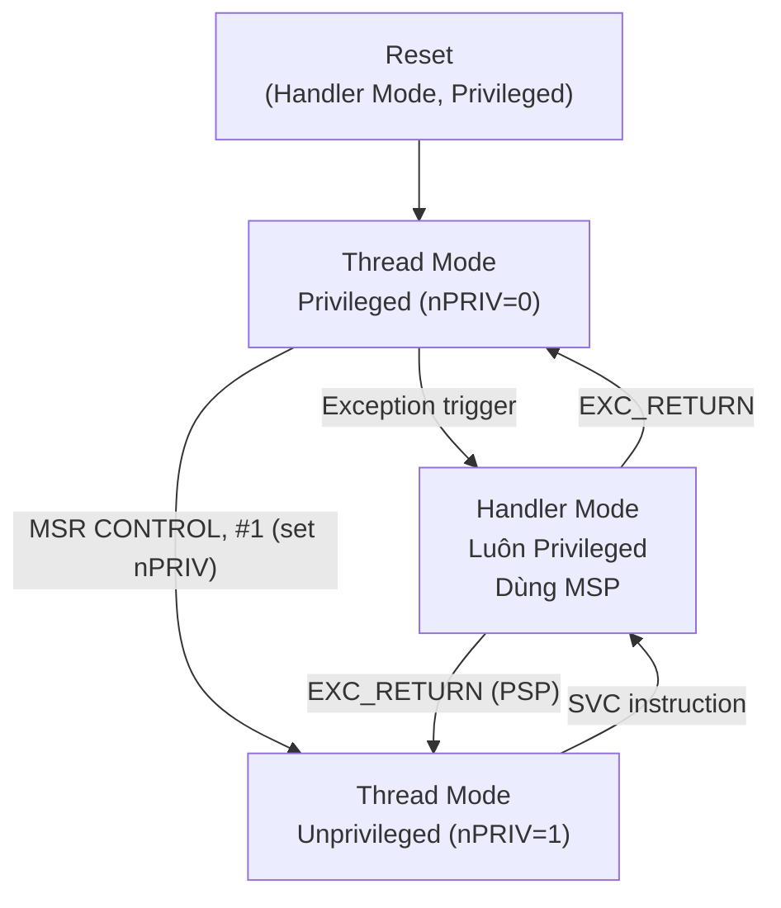

> **Prerequisites**: [[01-mcu-overview-cortex-m-family|01. MCU Overview & Cortex-M Family]]
> **Objectives**:
> - Nắm toàn bộ register file của ARM Cortex-M: R0–R15, xPSR, CONTROL, PRIMASK, v.v.
> - Phân biệt Thread mode / Handler mode và Privileged / Unprivileged execution
> - Hiểu MSP và PSP — khi nào dùng cái nào và tại sao quan trọng cho bảo mật
> - Đọc và giải thích giá trị xPSR, CONTROL register từ GDB
> - Nhận biết các điểm yếu trong execution model khi firmware không cấu hình đúng

---

## Motivation

Register là "bộ nhớ làm việc" tốc độ cao nhất của CPU — mọi tính toán đều phải đi qua register. Nhưng trên ARM Cortex-M, register không chỉ lưu giá trị tạm thời: một số register đặc biệt kiểm soát **quyền thực thi**, **stack pointer** nào đang dùng, và **CPU đang ở mode nào**. Nắm vững các register này là điều kiện cần để hiểu interrupt handling, stack exploitation, và privilege escalation trên embedded systems.

---

## Register File Tổng quan

Cortex-M có **16 general-purpose registers** (R0–R15) và một tập **special-purpose registers**.

```text
Registers R0 – R15:
┌────────┬────────────────────────────────────────────────┐
│  R0    │  General purpose — argument / return value 1   │
│  R1    │  General purpose — argument / return value 2   │
│  R2    │  General purpose — argument 3                  │
│  R3    │  General purpose — argument 4                  │
│  R4    │  General purpose — callee-saved                │
│  R5    │  General purpose — callee-saved                │
│  R6    │  General purpose — callee-saved                │
│  R7    │  General purpose — callee-saved                │
│  R8    │  General purpose — callee-saved                │
│  R9    │  General purpose — callee-saved / platform reg │
│  R10   │  General purpose — callee-saved                │
│  R11   │  General purpose — callee-saved (frame pointer)│
│  R12   │  General purpose — caller-saved (intra-call)   │
│  R13   │  SP — Stack Pointer (MSP hoặc PSP)             │
│  R14   │  LR — Link Register (return address)           │
│  R15   │  PC — Program Counter                          │
└────────┴────────────────────────────────────────────────┘
```

> [!definition] Definition 2.1 — Các Register Đặc biệt (R13–R15)
>
> **R13 — Stack Pointer (SP)**: Trỏ đến đỉnh stack. Cortex-M có **hai** SP vật lý:
> - `MSP` (Main Stack Pointer): dùng trong privileged code và interrupt handler
> - `PSP` (Process Stack Pointer): dùng cho unprivileged task trong RTOS
>
> Bit SPSEL trong CONTROL register quyết định SP nào được bank vào R13.
>
> **R14 — Link Register (LR)**: Lưu địa chỉ trả về khi gọi hàm bằng `BL` (Branch with Link). Khi vào exception, LR được nạp giá trị `EXC_RETURN` đặc biệt (sẽ học ở Bài 09).
>
> **R15 — Program Counter (PC)**: Địa chỉ instruction **tiếp theo** sẽ thực thi. Do pipeline, PC thường trỏ trước instruction hiện tại 4 byte (M0/M0+) hoặc 4 byte (M3/M4).

---

## Program Status Register — xPSR

`xPSR` là tên gọi tổng hợp của ba register chồng nhau trong cùng một địa chỉ 32-bit:

> [!definition] Definition 2.2 — xPSR Breakdown
>
> ```
> Bit: 31 30 29 28 27  26:25  24  23:20  19:16  15:10   9    8    7    6    5    4:0
>      N  Z  C  V  Q  IT[1:0]  T   --    GE[3:0] IT[7:2] --   --   --   --   --  ISR_NUMBER
>      └──────────────── APSR ──┘   └─ EPSR ─┘          └──────────── IPSR ──────────────┘
> ```
>
> - **APSR** (Application PSR): Condition flags — N (negative), Z (zero), C (carry), V (overflow), Q (saturation), GE (SIMD)
> - **IPSR** (Interrupt PSR): Exception number hiện tại (0 = Thread mode, 1–15 = system exception, 16+ = IRQ)
> - **EPSR** (Execution PSR): Bit **T** (Thumb state) — **luôn phải = 1** trên Cortex-M; IT bits cho if-then block

> [!warning] Security Note — Thumb Bit (T bit)
> Bit T trong EPSR **luôn = 1** trên Cortex-M. Nếu T = 0, processor sẽ trigger **UsageFault** (hoặc HardFault nếu UsageFault chưa enable). Điều này có nghĩa: địa chỉ trong vector table phải có **bit 0 = 1** để chỉ định Thumb mode. Khi viết exploit hay shellcode cho MCU, địa chỉ hàm phải được set bit 0, nhưng PC thực tế = địa chỉ đó AND `~1`.

**Đọc xPSR bằng GDB**:

```gdb
(gdb) info registers
r0             0x0                 0
...
xpsr           0x61000000          1627389952
```

Giá trị `0x61000000` = `0110 0001 0000 ... 0000`:
- Bit 30 (Z) = 1 → Zero flag set
- Bit 29 (C) = 1 → Carry set
- Bit 24 (T) = 1 → Thumb mode (luôn đúng)

---

## Special-Purpose Registers

Ngoài xPSR, Cortex-M có thêm các register đặc biệt sau:

> [!definition] Definition 2.3 — Special-Purpose Registers

| Register | Địa chỉ (MRS/MSR) | Chức năng |
|----------|-------------------|-----------|
| `PRIMASK` | — | Bit 0 = 1 → mask tất cả configurable exceptions (disable interrupt) |
| `FAULTMASK` | — | Bit 0 = 1 → mask tất cả exceptions kể cả HardFault (trừ NMI) |
| `BASEPRI` | — | Mask tất cả exception có priority ≥ giá trị này (0 = disable masking) |
| `CONTROL` | — | Kiểm soát privilege level và stack pointer selection |

**Truy cập bằng Assembly**:

```asm
; Đọc CONTROL register vào R0
MRS R0, CONTROL

; Ghi R0 vào PRIMASK (disable interrupts)
MSR PRIMASK, R0

; Shortcut: CPSID I = set PRIMASK bit 0 (disable interrupts)
CPSID I

; CPSIE I = clear PRIMASK bit 0 (enable interrupts)
CPSIE I
```

### CONTROL Register — Chi tiết

CONTROL register là 3-bit (ARMv7-M) hoặc 4-bit (ARMv8-M với FPCA) kiểm soát execution model:

```text
CONTROL[31:3] = Reserved
CONTROL[2]    = FPCA  — FP Context Active (ARMv7E-M với FPU)
CONTROL[1]    = SPSEL — Stack Pointer Selection: 0=MSP, 1=PSP
CONTROL[0]    = nPRIV — 0=Privileged Thread mode, 1=Unprivileged Thread mode
```

> [!definition] Definition 2.4 — CONTROL Register
>
> - **nPRIV = 0**: Thread mode chạy **privileged** — có thể truy cập tất cả registers, MSR/MRS, v.v.
> - **nPRIV = 1**: Thread mode chạy **unprivileged** — bị giới hạn, không thể ghi một số registers, bị MPU restrict
> - **SPSEL = 0**: R13 = MSP (Main Stack Pointer)
> - **SPSEL = 1**: R13 = PSP (Process Stack Pointer) — thường dùng cho user task trong RTOS

> [!warning] Security Note — CONTROL và Privilege Escalation
> **Chuyển từ privileged → unprivileged**: firmware ghi `nPRIV = 1` vào CONTROL.
>
> **Chuyển ngược unprivileged → privileged**: code unprivileged **không thể tự ghi CONTROL** để lấy lại privilege. Cách duy nhất là trigger exception (SVC instruction) và để privileged handler nâng quyền.
>
> Nếu firmware không bao giờ set `nPRIV = 1`, toàn bộ code chạy privileged — không có sự phân tách. Đây là trường hợp phổ biến nhất trong bare-metal firmware không dùng RTOS: mọi thứ đều có thể ghi đè mọi thứ.

---

## Execution Modes

Cortex-M có hai execution mode hoàn toàn tách biệt:

> [!definition] Definition 2.5 — Thread Mode và Handler Mode
>
> **Thread Mode**: Mode mặc định khi CPU chạy code thông thường (main loop, RTOS task).
> - Có thể là privileged hoặc unprivileged (tùy CONTROL.nPRIV)
> - Dùng MSP hoặc PSP (tùy CONTROL.SPSEL)
>
> **Handler Mode**: Mode khi CPU đang xử lý exception hoặc interrupt.
> - **Luôn privileged** — không thể unprivileged
> - **Luôn dùng MSP** — CONTROL.SPSEL bị ignore
> - IPSR ≠ 0 khi ở Handler mode



**Xác định mode hiện tại trong C**:

```c
#include <stdint.h>

static inline uint32_t get_ipsr(void) {
    uint32_t ipsr;
    __asm volatile ("MRS %0, IPSR" : "=r" (ipsr));
    return ipsr;
}

static inline uint32_t get_control(void) {
    uint32_t ctrl;
    __asm volatile ("MRS %0, CONTROL" : "=r" (ctrl));
    return ctrl;
}

void check_execution_context(void) {
    uint32_t ipsr    = get_ipsr();
    uint32_t control = get_control();

    if (ipsr != 0) {
        /* Đang ở Handler Mode — đang xử lý exception số (ipsr & 0xFF) */
    } else if (control & 0x1) {
        /* Thread Mode — Unprivileged */
    } else {
        /* Thread Mode — Privileged */
    }
}
```

---

## MSP và PSP — Hai Stack Pointer

Đây là một trong những điểm phân biệt rõ nhất giữa MCU bare-metal đơn giản và hệ thống có RTOS:

> [!definition] Definition 2.6 — MSP và PSP
>
> **MSP (Main Stack Pointer)**: Stack "hệ thống". Dùng cho:
> - Reset handler và startup code
> - Exception/interrupt handler (Handler mode luôn dùng MSP)
> - Firmware bare-metal không dùng PSP
>
> **PSP (Process Stack Pointer)**: Stack "task". Dùng cho:
> - User task trong RTOS (FreeRTOS, Zephyr, v.v.)
> - Unprivileged Thread mode
>
> Khi processor ở Thread mode với `CONTROL.SPSEL = 1`, R13 = PSP.
> Khi processor ở Handler mode, R13 = MSP bất kể SPSEL.

**Mục đích phân tách MSP/PSP**:

Tách MSP và PSP có hai lợi ích quan trọng:

1. **Stack isolation**: Nếu task stack (PSP) tràn (stack overflow), nó không thể ghi đè interrupt stack (MSP) — tránh crash hệ thống
2. **Security separation**: MPU có thể cấu hình để PSP region không overlap MSP — ngăn task user-space leo lên kernel stack

> [!example] Example 2.7 — RTOS Stack Setup (FreeRTOS Pattern)
> ```c
> /*
>  * FreeRTOS context switch (simplified):
>  * - Khi task bắt đầu chạy, CONTROL được set: SPSEL=1, nPRIV=1
>  * - PSP trỏ vào stack của task đó
>  * - Khi PendSV interrupt xảy ra (context switch), handler dùng MSP
>  *   để lưu context, sau đó load PSP của task mới
>  */
>
> /* Set PSP và switch sang dùng PSP */
> static inline void start_first_task(uint32_t task_stack_top) {
>     __asm volatile (
>         "MSR PSP, %0        \n"  /* Set PSP = task stack top */
>         "MOV R0, #0x3       \n"  /* CONTROL = nPRIV=1, SPSEL=1 */
>         "MSR CONTROL, R0    \n"
>         "ISB                \n"  /* Instruction Sync Barrier — bắt buộc sau MSR CONTROL */
>         :: "r" (task_stack_top)
>     );
> }
> ```

---

## Stack Frame khi Exception

Khi exception xảy ra, hardware **tự động** push một set register lên stack hiện tại (MSP hoặc PSP tùy context). Đây là **exception frame** hay **stack frame**:

```text
Stack (growing downward):
          ┌──────────────┐  ← SP trước exception (aligned to 8 bytes)
          │     xPSR     │  +28 (giá trị xPSR trước exception)
          │     PC       │  +24 (return address — instruction tiếp theo)
          │     LR       │  +20 (link register)
          │     R12      │  +16
          │     R3       │  +12
          │     R2       │  +8
          │     R1       │  +4
          │     R0       │  +0
          └──────────────┘  ← SP sau khi hardware push (SP = SP_old - 32)
```

> [!note] Tại sao cần biết điều này?
> Đây là nền tảng của **ROP (Return-Oriented Programming) trên ARM MCU**. Nếu attacker có thể ghi đè stack, họ có thể kiểm soát PC (return address tại offset +24 trong frame) và LR — dẫn đến arbitrary code execution. Sẽ học chi tiết ở Bài 09.

---

## Đọc Register State với GDB + OpenOCD

Trong thực tế hardware hacking, bạn thường kết nối GDB qua SWD/JTAG để đọc register state:

```gdb
# Kết nối target (sau khi OpenOCD đã chạy)
(gdb) target remote :3333

# Xem tất cả registers
(gdb) info registers

# Xem register cụ thể
(gdb) p/x $r0
(gdb) p/x $pc
(gdb) p/x $sp

# Xem CONTROL, PRIMASK (special registers)
(gdb) p/x $control
(gdb) p/x $primask

# Xem xPSR
(gdb) p/x $xpsr

# Disassemble quanh PC hiện tại
(gdb) x/10i $pc
```

**Phân tích CONTROL từ GDB**:

```gdb
(gdb) p/x $control
$1 = 0x2
```

Giá trị `0x2` = `0b010`:
- Bit 0 (nPRIV) = 0 → Privileged Thread mode
- Bit 1 (SPSEL) = 1 → Đang dùng PSP
- Bit 2 (FPCA) = 0 → Không có FP context active

---

## Summary

- Cortex-M có 16 register (R0–R15): R13=SP, R14=LR, R15=PC; R0–R12 là general-purpose.
- **xPSR** = APSR (flags) + IPSR (exception number) + EPSR (Thumb bit, IT state). Thumb bit **luôn = 1**.
- **CONTROL register** kiểm soát hai thứ quan trọng: privilege level (nPRIV) và stack pointer selection (SPSEL).
- **Thread mode** có thể privileged hoặc unprivileged. **Handler mode** luôn privileged.
- **MSP** dùng cho handler và bare-metal code; **PSP** dùng cho RTOS task. Tách biệt để bảo vệ stack.
- Bare-metal firmware thường không set `nPRIV = 1` → toàn bộ code privileged → không có privilege separation.
- Khi exception: hardware tự push {R0–R3, R12, LR, PC, xPSR} lên stack — đây là nền tảng của exploit technique trên MCU.

---

## References

- ARM — *ARMv7-M Architecture Reference Manual* (ARM DDI 0403), Section B1 (Programmers Model)
- ARM — *Cortex-M4 Technical Reference Manual* (ARM DDI 0439)
- Joseph Yiu — *The Definitive Guide to ARM Cortex-M3 and Cortex-M4 Processors*, 3rd Ed., Elsevier
- interrupt.memfault.com — *A Practical guide to ARM Cortex-M Exception Handling*
- embeddedsecurity.io — *Embedded Systems Security and TrustZone*, Ch. 3
