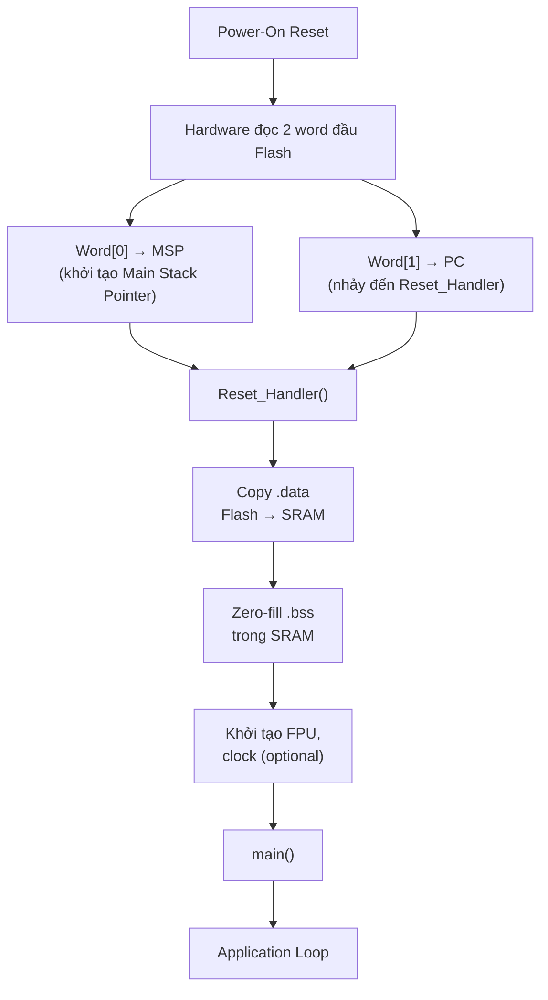

> **Prerequisites**: [[02-registers-execution-model|02. Registers & Execution Model]], [[04-memory-map-mmio|04. Memory Map & Memory-Mapped I/O]]
> **Objectives**:
> - Hiểu cấu trúc vật lý Flash và SRAM trên MCU — page, sector, wait states
> - Phân tích linker script: các section .text, .data, .bss, .rodata, heap, stack
> - Đọc và viết được startup code từ đầu — từ reset vector đến `main()`
> - Hiểu vector table layout và cách ARM boot từ address 0
> - Nhận diện các điểm tấn công trong quá trình boot: corrupt .data init, hijack vector table

---

## Motivation

Khi bạn nhấn nút Reset trên board STM32, điều gì xảy ra trước khi `main()` chạy? Không có OS loader, không có dynamic linker — chỉ có phần cứng và một vài instruction trong ROM. Hiểu quá trình này là nền tảng để hiểu bootloader, secure boot, và các kỹ thuật tấn công firmware như corrupt startup, vector table hijacking.

---

## Flash Memory — Cấu trúc Vật lý

> [!definition] Definition 5.1 — Flash Memory trên MCU
> Flash là bộ nhớ **non-volatile** lưu firmware (code + constant data). Đặc điểm:
> - **Đọc**: nhanh, random access, byte-level
> - **Ghi (program)**: chỉ ghi **từ 1 → 0** (flip bit), phải ghi theo đơn vị nhỏ nhất (8/16/32-bit tùy chip)
> - **Xóa (erase)**: chỉ xóa **từ 0 → 1**, phải xóa theo **page** hoặc **sector** (không thể xóa từng byte)
>
> **STM32F4** chia Flash thành **sector** có kích thước khác nhau:
>
> | Sector | Địa chỉ | Kích thước |
> |--------|---------|-----------|
> | Sector 0 | `0x08000000` | 16 KB |
> | Sector 1 | `0x08004000` | 16 KB |
> | Sector 2 | `0x08008000` | 16 KB |
> | Sector 3 | `0x0800C000` | 16 KB |
> | Sector 4 | `0x08010000` | 64 KB |
> | Sector 5 | `0x08020000` | 128 KB |
> | ... | ... | 128 KB mỗi sector |
> | Sector 11 | `0x080E0000` | 128 KB |

**Flash Wait States**: Flash chậm hơn CPU. Ở 168 MHz (STM32F4), cần **5 wait states** — mỗi lần fetch instruction, CPU phải chờ 5 cycle. Flash Accelerator / Prefetch Buffer giảm thiểu penalty này bằng cách fetch trước (prefetch) và cache instruction vào ART cache.

```c
/* Cấu hình flash wait states trước khi tăng clock (bắt buộc) */
FLASH->ACR |= FLASH_ACR_LATENCY_5WS;    /* 5 wait states cho 168 MHz */
FLASH->ACR |= FLASH_ACR_PRFTEN;         /* Enable prefetch */
FLASH->ACR |= FLASH_ACR_ICEN;           /* Enable instruction cache */
FLASH->ACR |= FLASH_ACR_DCEN;           /* Enable data cache */
```

> [!warning] Security Note — Flash Write Protection
> Flash sector có thể được **write-protect** qua option bytes (WRP bits). Sector 0 thường chứa vector table và bootloader — nên luôn write-protect. Nếu không protect, attacker có thể (qua arbitrary write hoặc debug interface) ghi đè firmware.

---

## Linker Script — Bố cục Firmware trong Memory

**Linker script** (file `.ld`) là "bản đồ" cho linker biết đặt từng phần của firmware vào địa chỉ nào.

> [!definition] Definition 5.2 — Các Section Chuẩn của Firmware
>
> | Section | Nội dung | Vị trí | Ghi chú |
> |---------|---------|--------|---------|
> | `.text` | Code thực thi (machine code) | Flash | Read-only khi chạy |
> | `.rodata` | Constant data (string literals, const arrays) | Flash | Read-only |
> | `.data` | Initialized global/static variables | SRAM (copy từ Flash) | Có bản sao trong Flash |
> | `.bss` | Uninitialized global/static variables | SRAM (zero-filled) | Không có trong Flash binary |
> | Heap | Dynamic allocation (`malloc`) | SRAM | Tăng lên (upward) |
> | Stack | Local variables, function frames | SRAM | Giảm xuống (downward) |

**Ví dụ linker script tối giản cho STM32F4**:

```ld
/* Định nghĩa memory regions */
MEMORY
{
    FLASH (rx)  : ORIGIN = 0x08000000, LENGTH = 1024K
    SRAM  (rwx) : ORIGIN = 0x20000000, LENGTH = 128K
}

/* Entry point — symbol đầu tiên thực thi */
ENTRY(Reset_Handler)

SECTIONS
{
    /* .text: code + vector table — nằm trong Flash */
    .text :
    {
        KEEP(*(.isr_vector))   /* Vector table — PHẢI đứng đầu */
        *(.text*)              /* Code của tất cả .o files */
        *(.rodata*)            /* Constant data */
        _etext = .;            /* Symbol đánh dấu cuối .text trong Flash */
    } > FLASH

    /* .data: initialized variables — lưu trong Flash, copy vào SRAM khi boot */
    .data :
    {
        _sdata = .;            /* Đầu .data trong SRAM */
        *(.data*)
        _edata = .;            /* Cuối .data trong SRAM */
    } > SRAM AT > FLASH        /* "AT > FLASH" = load address trong Flash */

    /* _sidata: địa chỉ Flash nơi .data được lưu (load address) */
    _sidata = LOADADDR(.data);

    /* .bss: uninitialized variables — chỉ trong SRAM, zero-filled */
    .bss :
    {
        _sbss = .;
        *(.bss*)
        *(COMMON)
        _ebss = .;
    } > SRAM

    /* Heap và Stack */
    _heap_start = _ebss;
    _stack_top  = ORIGIN(SRAM) + LENGTH(SRAM);   /* Top của SRAM = đỉnh stack */
}
```

**Quan hệ Flash ↔ SRAM cho .data**:

```text
FLASH (0x08000000):                  SRAM (0x20000000):
┌──────────────────┐                 ┌──────────────────┐
│  Vector Table    │                 │                  │
│  .text (code)    │                 │  .data (copy)    │◄── startup code copy
│  .rodata         │                 │  .bss (zeroed)   │◄── startup code zero
│  .data (origin)  │──copy on boot──►│  Heap ↑          │
└──────────────────┘                 │  ...             │
                                     │  Stack ↓         │
                                     └──────────────────┘
```

---

## Vector Table — Cổng vào của Firmware

Đây là cấu trúc **quan trọng nhất** trong firmware ARM Cortex-M. Vector table nằm ở đầu Flash (hoặc nơi VTOR trỏ tới) và chứa địa chỉ của tất cả handler.

> [!definition] Definition 5.3 — Vector Table Layout (Cortex-M4)
>
> ```
> Offset  | Exception #  | Nội dung
> --------|-------------|------------------------------------------
> 0x0000  | —           | Initial MSP value (không phải địa chỉ hàm)
> 0x0004  | 1 (Reset)   | Reset_Handler — điểm vào đầu tiên
> 0x0008  | 2 (NMI)     | NMI_Handler
> 0x000C  | 3 (HardFault)| HardFault_Handler
> 0x0010  | 4 (MemManage)| MemManage_Handler
> 0x0014  | 5 (BusFault) | BusFault_Handler
> 0x0018  | 6 (UsageFault)| UsageFault_Handler
> 0x001C  | 7–10        | Reserved (= 0)
> 0x002C  | 11 (SVCall) | SVC_Handler
> 0x0030  | 12 (DebugMon)| DebugMon_Handler
> 0x0034  | 13          | Reserved
> 0x0038  | 14 (PendSV) | PendSV_Handler
> 0x003C  | 15 (SysTick)| SysTick_Handler
> 0x0040  | 16 (IRQ0)   | IRQ0_Handler (vendor-specific)
> 0x0044  | 17 (IRQ1)   | IRQ1_Handler
> ...     | ...          | ...
> 0x0130  | 81 (IRQ65)  | (STM32F4 có 82 external IRQ)
> ```
>
> **Lưu ý**: Mọi entry (trừ offset 0x0000) là **địa chỉ hàm với bit 0 = 1** (Thumb mode indicator).

**Định nghĩa vector table trong C**:

```c
/* startup_stm32f4.c */
#include <stdint.h>

extern uint32_t _stack_top;      /* Symbol từ linker script */

/* Khai báo forward */
void Reset_Handler(void);
void Default_Handler(void);      /* Handler mặc định — infinite loop */

/* Alias: nếu không định nghĩa handler cụ thể, dùng Default_Handler */
void NMI_Handler(void)       __attribute__((weak, alias("Default_Handler")));
void HardFault_Handler(void) __attribute__((weak, alias("Default_Handler")));
void MemManage_Handler(void) __attribute__((weak, alias("Default_Handler")));
void BusFault_Handler(void)  __attribute__((weak, alias("Default_Handler")));
void UsageFault_Handler(void)__attribute__((weak, alias("Default_Handler")));
void SVC_Handler(void)       __attribute__((weak, alias("Default_Handler")));
void PendSV_Handler(void)    __attribute__((weak, alias("Default_Handler")));
void SysTick_Handler(void)   __attribute__((weak, alias("Default_Handler")));

/* Vector table — đặt vào section .isr_vector */
__attribute__((section(".isr_vector")))
const uint32_t g_vector_table[] = {
    (uint32_t)&_stack_top,           /* 0x0000: Initial MSP */
    (uint32_t)Reset_Handler + 1,     /* 0x0004: Reset (+1 = Thumb) */
    (uint32_t)NMI_Handler + 1,       /* 0x0008: NMI */
    (uint32_t)HardFault_Handler + 1, /* 0x000C: HardFault */
    (uint32_t)MemManage_Handler + 1, /* 0x0010: MemManage */
    (uint32_t)BusFault_Handler + 1,  /* 0x0014: BusFault */
    (uint32_t)UsageFault_Handler + 1,/* 0x0018: UsageFault */
    0, 0, 0, 0,                       /* 0x001C–0x002B: Reserved */
    (uint32_t)SVC_Handler + 1,       /* 0x002C: SVCall */
    0,                                /* 0x0030: DebugMon (unused) */
    0,                                /* 0x0034: Reserved */
    (uint32_t)PendSV_Handler + 1,    /* 0x0038: PendSV */
    (uint32_t)SysTick_Handler + 1,   /* 0x003C: SysTick */
    /* IRQ0–IRQn: thêm vào đây theo thứ tự */
};

void Default_Handler(void) {
    while (1) { }    /* Infinite loop — dễ phát hiện qua debugger */
}
```

> [!warning] Security Note — Vector Table là Target Quan trọng
> Vector table chứa địa chỉ của **mọi handler** trong hệ thống. Nếu attacker có thể:
> - Ghi đè vector table trong Flash → redirect bất kỳ interrupt nào
> - Thay đổi `SCB_VTOR` → toàn bộ vector table bị thay thế
> - Corrupt entry 0x0004 (Reset_Handler) → kiểm soát điểm boot
>
> Write-protect sector chứa vector table là biện pháp bảo vệ cơ bản nhất.

---

## Reset Handler — Startup Code

`Reset_Handler` là hàm **đầu tiên chạy** sau khi chip power-on hoặc reset. Nó phải thực hiện 3 nhiệm vụ trước khi gọi `main()`:

1. **Copy .data** từ Flash sang SRAM
2. **Zero-fill .bss** trong SRAM
3. **Khởi tạo hệ thống** (clock, FPU nếu có) và gọi `main()`

```c
/* Reset_Handler — startup code tối giản */
void Reset_Handler(void) {
    /* Bước 1: Copy .data từ Flash sang SRAM
     * _sidata = địa chỉ Flash nơi .data được lưu
     * _sdata  = đầu .data trong SRAM
     * _edata  = cuối .data trong SRAM
     */
    extern uint32_t _sidata, _sdata, _edata;
    uint32_t *src = &_sidata;
    uint32_t *dst = &_sdata;
    while (dst < &_edata) {
        *dst++ = *src++;
    }

    /* Bước 2: Zero-fill .bss
     * _sbss = đầu .bss trong SRAM
     * _ebss = cuối .bss trong SRAM
     */
    extern uint32_t _sbss, _ebss;
    dst = &_sbss;
    while (dst < &_ebss) {
        *dst++ = 0;
    }

    /* Bước 3 (optional): Khởi tạo FPU nếu dùng (Cortex-M4/M7) */
    #if defined(__FPU_PRESENT) && __FPU_PRESENT
    SCB->CPACR |= (0xFU << 20);    /* Enable CP10 và CP11 (FPU coprocessors) */
    __DSB();
    __ISB();
    #endif

    /* Bước 4: Gọi main */
    extern int main(void);
    main();

    /* Nếu main() return (không nên xảy ra) — loop vô tận */
    while (1) { }
}
```

**Trình tự boot đầy đủ**:



---

## SRAM Layout Thực tế

Sau khi startup code chạy xong, SRAM được tổ chức như sau:

```text
SRAM (0x20000000)                       Địa chỉ tăng dần →
┌────────────────────────────────────────────────────────────┐
│ .data  │   .bss   │  Heap (↑) │  ...free...  │  Stack (↓) │
└────────────────────────────────────────────────────────────┘
0x20000000                                         0x20020000
         ↑_sdata  ↑_edata/_sbss  ↑_ebss/_heap_start  ↑_stack_top

Stack pointer (MSP) ban đầu = _stack_top = 0x20020000
```

> [!definition] Definition 5.4 — Stack và Heap Growth Direction
>
> - **Stack** tăng trưởng **xuống** (downward): PUSH giảm SP, POP tăng SP
> - **Heap** tăng trưởng **lên** (upward): `malloc()` cấp phát từ `_heap_start` lên trên
> - Nếu heap và stack gặp nhau → **stack-heap collision** → undefined behavior, thường crash

---

## Phân tích Firmware Dump — Xác định Layout

Khi có raw binary dump từ chip, xác định layout:

```bash
# Xem sections của ELF (nếu có symbol)
arm-none-eabi-objdump -h firmware.elf

# Output mẫu:
# Sections:
# Idx Name      Size      VMA        LMA
#   0 .text     00008234  08000000   08000000   (VMA=LMA → trong Flash)
#   1 .data     000001a8  20000000   08008234   (VMA≠LMA → copy Flash→SRAM)
#   2 .bss      00000c40  200001a8   200001a8

# Xem symbol addresses
arm-none-eabi-nm firmware.elf | grep -E "(_sdata|_edata|_sbss|_ebss|_stack)"

# Kích thước từng section
arm-none-eabi-size firmware.elf
# Output: text    data    bss     dec     hex
#         33332    424    3136   36892   901c
```

**Tìm vector table trong raw binary**:

```python
import struct

with open("firmware.bin", "rb") as f:
    data = f.read()

initial_msp = struct.unpack_from("<I", data, 0)[0]
reset_handler = struct.unpack_from("<I", data, 4)[0]

print(f"Initial MSP:     0x{initial_msp:08X}")
print(f"Reset_Handler:   0x{reset_handler & ~1:08X} (Thumb bit stripped)")

for i in range(16):
    entry = struct.unpack_from("<I", data, i * 4)[0]
    print(f"Vector[{i:2d}] = 0x{entry:08X}")
```

> [!example] Example 5.5 — Phát hiện Corrupt Startup
> Nếu dump firmware và thấy:
> - `Vector[0]` (Initial MSP) = `0x00000000` hoặc giá trị lạ → startup code sai hoặc chip bị lock
> - `Vector[1]` (Reset_Handler) = địa chỉ ngoài Flash range → vector table bị corrupt hoặc relocate
> - `.data` section size ≠ 0 nhưng không có copy routine trong startup → global variable sẽ có giá trị rác

---

## Summary

- **Flash** là non-volatile, read-fast, write/erase theo page/sector. Wait states bắt buộc cấu hình trước khi tăng clock.
- **Linker script** quyết định bố cục firmware: `.text`/`.rodata` trong Flash; `.data` (có bản gốc trong Flash, copy sang SRAM khi boot); `.bss` zero-filled trong SRAM.
- **Vector table** nằm đầu Flash (offset 0): word đầu = Initial MSP, word thứ hai = địa chỉ Reset_Handler. Đây là entry point của toàn bộ hệ thống.
- **Reset_Handler** thực hiện 3 việc trước `main()`: copy `.data`, zero `.bss`, khởi tạo FPU/clock.
- Stack tăng **xuống**, heap tăng **lên** — va chạm = crash.
- Từ góc độ tấn công: vector table là target cao giá trị; corrupt startup → global variable sai giá trị; VTOR redirect → toàn bộ interrupt handler bị kiểm soát.

---

## References

- ARM — *ARMv7-M Architecture Reference Manual* (ARM DDI 0403), Section B1.5 (Exception Model)
- STMicroelectronics — *STM32F4 Reference Manual* (RM0090), Ch. 3 (Embedded Flash Memory)
- Joseph Yiu — *The Definitive Guide to ARM Cortex-M3 and Cortex-M4 Processors*, Ch. 13 (Startup & Linker)
- AllThingsEmbedded — *ARM Cortex-M Startup Code for C and C++* (allthingsembedded.com)
- interrupt.memfault.com — *From Zero to main(): Demystifying Firmware Startup on Cortex-M*
