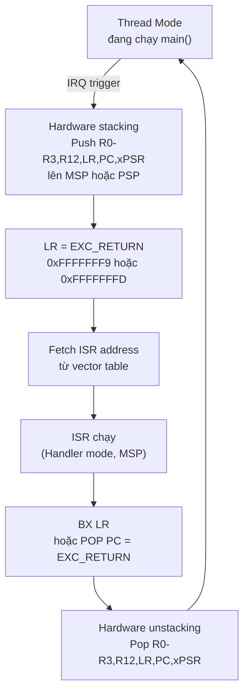

> **Prerequisites**: [[05-flash-sram-startup|05. Flash, SRAM & Startup Code]], [[08-exception-model-nvic|08. Exception Model & NVIC]]
> **Objectives**:
> - Hiểu chi tiết cơ chế hardware stacking/unstacking khi vào/ra exception
> - Giải mã các giá trị EXC_RETURN — tại sao LR có giá trị kỳ lạ trong ISR
> - Nắm VTOR relocation và ứng dụng trong bootloader
> - Phân tích stack frame exception để debug crash và xây dựng exploit
> - Hiểu tại sao kiểm soát stack frame = kiểm soát execution sau exception return

---

## Motivation

Bài 08 trình bày exception model ở mức high-level. Bài này đi sâu vào cơ chế vật lý: khi exception xảy ra, hardware làm chính xác những gì? Register nào được push lên stack nào? LR chứa giá trị gì và tại sao? Khi return, hardware biết phải quay về Thread hay Handler mode bằng cách nào?

Đây là kiến thức cốt lõi để: (1) debug HardFault từ stack trace, (2) hiểu tại sao một số ROP chain trên MCU cần giả mạo cả stack frame, (3) hiểu secure boot và RTOS context switch hoạt động như thế nào ở mức phần cứng.

---

## Exception Entry — Hardware Stacking

Khi một exception được accept (priority đủ cao, không bị mask), hardware thực hiện **automatic stacking** trước khi nhảy vào handler. Đây là quá trình hoàn toàn tự động, không cần instruction nào trong ISR.

> [!definition] Definition 9.1 — Exception Stack Frame (Cortex-M4, không FPU)
>
> Hardware push 8 register lên stack theo thứ tự sau (địa chỉ giảm dần):
>
> ```text
> Trước exception:      SP_old ──┐
>                                │
>    SP_old - 4  →  xPSR         │  (giá trị trước exception + Thumb bit)
>    SP_old - 8  →  PC           │  (địa chỉ instruction sẽ chạy tiếp sau return)
>    SP_old - 12 →  LR (R14)     │  (link register của caller)
>    SP_old - 16 →  R12          │
>    SP_old - 20 →  R3           │
>    SP_old - 24 →  R2           │
>    SP_old - 28 →  R1           │
>    SP_old - 32 →  R0           │  ← SP_new (= SP_old - 32)
>                                │
> Sau stacking:         SP_new ──┘
> ```
>
> **Quan trọng**: Stack được align về **8-byte boundary** — nếu SP_old không align sẵn, hardware tự padding thêm 4 byte và set bit STKALIGN trong stacked xPSR.

**Tại sao chỉ push R0–R3, R12, LR, PC, xPSR mà không push R4–R11?**

Vì AAPCS (Bài 06) quy định R0–R3 và R12 là **caller-saved** — người gọi hàm (tức là "code đang chạy trước exception") không cần bảo tồn chúng. Hardware push đúng set này để ISR (viết bằng C) có thể dùng R0–R3, R12 tự do mà không cần push thủ công. R4–R11 là **callee-saved** — ISR phải tự push/pop nếu dùng.

---

## EXC_RETURN — Giá trị Kỳ lạ trong LR

Khi CPU nhảy vào exception handler, **LR không còn chứa return address thông thường** nữa. Thay vào đó, hardware nạp vào LR một giá trị đặc biệt gọi là **EXC_RETURN**.

> [!definition] Definition 9.2 — EXC_RETURN
> EXC_RETURN là giá trị 32-bit với các bit cao = `0xFFFFFF__` (28 bit đầu luôn = 1), chỉ 4 bit thấp có nghĩa:
>
> ```text
> Bits [31:4] = 0xFFFFFFF (28 bit đều = 1 — dấu hiệu nhận dạng EXC_RETURN)
> Bit 3 (MODE)  : 1 = return về Thread mode, 0 = return về Handler mode
> Bit 2 (SPSEL) : 1 = dùng PSP khi return, 0 = dùng MSP khi return
> Bit 1         : Reserved (luôn = 1)
> Bit 0 (ES)    : ARMv8-M only — Secure/Non-secure (= 1 trên ARMv7-M)
> ```
>
> Các giá trị EXC_RETURN thông dụng (ARMv7-M):
>
> | Giá trị | MODE | SPSEL | Ý nghĩa |
> |---------|------|-------|---------|
> | `0xFFFFFFF1` | Handler | MSP | Return về Handler mode, dùng MSP |
> | `0xFFFFFFF9` | Thread | MSP | Return về Thread mode, dùng MSP |
> | `0xFFFFFFFD` | Thread | PSP | Return về Thread mode, dùng PSP |

**EXC_RETURN trong thực tế — đọc từ GDB**:

```gdb
(gdb) p/x $lr
$1 = 0xfffffff9
```

Giá trị `0xFFFFFFF9`: bit 3=1 (Thread mode), bit 2=0 (MSP) → sẽ return về Thread mode dùng MSP. Đây là trường hợp điển hình khi firmware bare-metal không dùng PSP.

```gdb
(gdb) p/x $lr
$2 = 0xfffffffd
```

Giá trị `0xFFFFFFFD`: bit 3=1 (Thread mode), bit 2=1 (PSP) → return về Thread mode dùng PSP. Đây là pattern của RTOS — task stack được managed bởi PSP.

---

## Exception Exit — Hardware Unstacking

Khi ISR thực hiện `BX LR` (hoặc `POP {PC}` với PC = EXC_RETURN value), hardware nhận dạng EXC_RETURN và thực hiện **automatic unstacking**:

```text
Quá trình return:
1. CPU phát hiện giá trị EXC_RETURN trong PC (bits [31:4] = 0xFFFFFFF)
2. Xác định stack pointer cần dùng: bit 2 của EXC_RETURN → MSP hoặc PSP
3. POP 8 register từ stack đó: R0, R1, R2, R3, R12, LR, PC, xPSR
4. Restore xPSR → restore Thumb bit, condition flags
5. Restore PC → tiếp tục tại địa chỉ bị ngắt
6. Xác định mode: bit 3 → Thread hay Handler
7. Cập nhật SP
```

**Toàn bộ flow một exception**:



---

## FPU Stack Frame — Lazy Stacking

Trên Cortex-M4/M7 có FPU, exception frame có thể lớn hơn nếu FPU đang active:

> [!definition] Definition 9.3 — Extended Stack Frame (với FPU)
> Nếu FPU context active (FPCA bit trong CONTROL = 1), hardware push thêm **17 FPU registers**:
>
> ```text
> SP_old - 4   → xPSR
> SP_old - 8   → PC
> SP_old - 12  → LR
> SP_old - 16  → R12
> SP_old - 20  → R3
> SP_old - 24  → R2
> SP_old - 28  → R1
> SP_old - 32  → R0
> SP_old - 36  → S15  ┐
> ...                  │ FPU registers S0–S15 + FPSCR
> SP_old - 100 → S0   │ (chỉ khi FPCA=1)
> SP_old - 104 → FPSCR┘
> SP_old - 108 → Reserved (alignment)
> ```
>
> **Lazy stacking**: Để giảm latency, ARM dùng "lazy stacking" — hardware **giữ chỗ** (giảm SP) nhưng không thực sự push FPU registers ngay. Chỉ khi ISR thực sự dùng FPU, hardware mới push. Điều này gây ra một edge case quan trọng trong security analysis.

> [!warning] Security Note — FPU Lazy Stacking Attack
> Với lazy stacking, FPU register content vẫn "treo lơ lửng" chưa được flush khi ISR bắt đầu chạy. Nếu ISR thuộc security domain khác (ví dụ Non-secure ISR trên TrustZone), nó có thể đọc FPU registers của Secure code qua lazy stacking window. Đây là một side-channel thực sự đã được nghiên cứu.

---

## VTOR — Vector Table Offset Register

`VTOR` (tại `0xE000ED08`) cho phép relocate vector table sang bất kỳ địa chỉ nào (phải align với kích thước vector table).

> [!definition] Definition 9.4 — VTOR Alignment Requirement
> Vector table phải align với lũy thừa của 2 lớn hơn hoặc bằng số entry × 4:
>
> $$\text{alignment} = 2^{\lceil \log_2(\text{number\_of\_vectors} \times 4) \rceil}$$
>
> Với STM32F4 có 82 vectors: 82 × 4 = 328 bytes → alignment tối thiểu = 512 bytes (0x200).

**Ứng dụng VTOR trong bootloader**:

```c
/* Trong bootloader: jump sang application tại 0x08008000 */
void jump_to_application(uint32_t app_address) {
    /* Đọc Initial MSP từ word đầu của application */
    uint32_t app_msp = *(volatile uint32_t *)app_address;

    /* Đọc Reset_Handler từ word thứ hai */
    uint32_t app_reset = *(volatile uint32_t *)(app_address + 4);

    /* Kiểm tra địa chỉ hợp lệ (trong Flash range) */
    if ((app_reset & 0xFF000000) != 0x08000000 &&
        (app_reset & 0xFF000000) != 0x00000000) {
        return;   /* Địa chỉ lạ — không jump */
    }

    /* Disable tất cả interrupt trước khi jump */
    __disable_irq();

    /* Relocate vector table về application */
    SCB->VTOR = app_address;

    /* Set MSP = application initial stack */
    __set_MSP(app_msp);

    /* Barrier bắt buộc */
    __DSB();
    __ISB();

    /* Jump sang application Reset_Handler */
    /* app_reset đã có bit 0 = 1 (Thumb) — dùng trực tiếp với BX */
    void (*app_entry)(void) = (void (*)(void))(app_reset);
    app_entry();
}
```

> [!warning] Security Note — VTOR Hijacking
> Nếu attacker có thể ghi vào `SCB->VTOR` (arbitrary write) hoặc kiểm soát giá trị `app_address` trong bootloader (ví dụ qua malformed firmware update), họ có thể:
> 1. Trỏ VTOR vào vùng SRAM attacker kiểm soát
> 2. Fake vector table với địa chỉ handler tùy ý
> 3. Trigger bất kỳ interrupt → nhảy vào shellcode
>
> Bootloader phải **validate địa chỉ** trước khi ghi VTOR và trước khi jump.

---

## Phân tích Stack Frame để Debug Crash

Khi firmware crash vào HardFault, đọc stack frame để tìm nguyên nhân:

```c
/* HardFault handler có thể đọc stacked registers */
void HardFault_Handler(void) {
    __asm volatile (
        /* Xác định stack nào đang dùng khi fault */
        "TST LR, #4         \n"  /* Test bit 2 của EXC_RETURN */
        "ITE EQ             \n"
        "MRSEQ R0, MSP      \n"  /* Bit 2=0 → fault từ MSP */
        "MRSNE R0, PSP      \n"  /* Bit 2=1 → fault từ PSP */
        "B hard_fault_handler_c \n"
    );
}

void hard_fault_handler_c(uint32_t *stacked_frame) {
    /* Đọc stacked registers */
    uint32_t stacked_r0   = stacked_frame[0];
    uint32_t stacked_r1   = stacked_frame[1];
    uint32_t stacked_r2   = stacked_frame[2];
    uint32_t stacked_r3   = stacked_frame[3];
    uint32_t stacked_r12  = stacked_frame[4];
    uint32_t stacked_lr   = stacked_frame[5];
    uint32_t stacked_pc   = stacked_frame[6];  /* Địa chỉ gây fault! */
    uint32_t stacked_xpsr = stacked_frame[7];

    uint32_t cfsr  = SCB->CFSR;
    uint32_t hfsr  = SCB->HFSR;
    uint32_t mmfar = SCB->MMFAR;
    uint32_t bfar  = SCB->BFAR;

    /* Log hoặc halt với thông tin debug */
    (void)stacked_r0; (void)stacked_r1; (void)stacked_r2; (void)stacked_r3;
    (void)stacked_r12; (void)stacked_lr; (void)stacked_pc; (void)stacked_xpsr;
    (void)cfsr; (void)hfsr; (void)mmfar; (void)bfar;

    while (1) { }
}
```

**Đọc stack frame trong GDB khi đang ở HardFault_Handler**:

```gdb
# Xác định SP nào đang dùng khi fault (đọc LR của HardFault handler)
(gdb) p/x $lr
$1 = 0xfffffff9    # bit 2 = 0 → fault từ MSP

# Đọc MSP
(gdb) p/x $msp
$2 = 0x2001ff20

# Dump exception frame (8 words = 32 bytes)
(gdb) x/8wx 0x2001ff20
0x2001ff20:  0x00000005   # R0
0x2001ff24:  0x20001000   # R1
0x2001ff28:  0x00000000   # R2
0x2001ff2c:  0x00000000   # R3
0x2001ff30:  0x00000000   # R12
0x2001ff34:  0x08002341   # LR — return address dalam caller
0x2001ff38:  0x08001abc   # PC — địa chỉ ĐANG gây fault!
0x2001ff3c:  0x21000000   # xPSR

# Disassemble xung quanh PC để thấy instruction gây fault
(gdb) x/5i 0x08001ab8
   0x8001ab8:  ldr  r0, [r1, #0]   # ← đọc từ địa chỉ R1=0x20001000?
   0x8001aba:  str  r0, [r2, #0]   # ← ghi vào R2=0x00000000 = NULL DEREF!
   0x8001abc:  bx   lr
```

---

## Stack Frame Forgery — Exploit Technique

Nếu attacker kiểm soát stack (qua stack overflow), họ có thể **giả mạo exception frame** để CPU "trả về" từ một exception giả:

```text
Mục tiêu: chạy shellcode tại 0x20001000 (SRAM)

Attacker tạo fake exception frame trên stack:
┌──────────────────────────────────┐ ← SP sau overflow
│ xPSR  = 0x01000000               │  +28 (bit T=1, Thumb mode)
│ PC    = 0x20001001               │  +24 (shellcode addr + 1 = Thumb)
│ LR    = 0xFFFFFFFD               │  +20 (EXC_RETURN: Thread+PSP)
│ R12   = 0x00000000               │  +16
│ R3    = 0x00000000               │  +12
│ R2    = 0x00000000               │  +8
│ R1    = 0x00000000               │  +4
│ R0    = 0x00000000               │  +0
└──────────────────────────────────┘

Sau đó trigger exception return với SP trỏ vào frame này
→ hardware unstack → PC = shellcode, mode = Thread
```

> [!warning] Điều kiện để Stack Frame Forgery hoạt động
> 1. SRAM phải executable (không có MPU với XN=1 cho SRAM)
> 2. Attacker kiểm soát SP tại thời điểm exception return
> 3. Bit T trong stacked xPSR phải = 1 (Thumb) — nếu = 0 → UsageFault ngay
>
> Trên MCU không MPU hoặc MPU không enable XN cho SRAM, điều kiện 1 thường thỏa mãn. Đây là lý do **XN=1 cho SRAM là bắt buộc** trong secure firmware.

---

## Summary

- Khi exception accept: hardware tự động push **{R0–R3, R12, LR, PC, xPSR}** lên stack (MSP hoặc PSP tùy context), rồi nhảy vào ISR.
- **EXC_RETURN** (`0xFFFFFFF1/9/D`) là giá trị đặc biệt hardware nạp vào LR — encode thông tin mode và stack pointer để dùng khi return.
- Exception return (`BX LR` với LR=EXC_RETURN): hardware unstack 8 register, restore PC và xPSR, quay về đúng mode.
- **FPU lazy stacking**: hardware giữ chỗ trên stack nhưng chỉ push FPU registers khi ISR thực sự dùng FPU — tạo side-channel window.
- **VTOR**: cho phép relocate vector table; bootloader dùng để chuyển sang application; attacker dùng để hijack interrupt nếu có arbitrary write.
- Debug crash: đọc stacked PC = địa chỉ gây fault; đọc CFSR/HFSR/MMFAR/BFAR = loại và địa chỉ fault.
- **Stack frame forgery**: attacker giả mạo exception frame để kiểm soát PC sau return — chỉ ngăn được bằng XN=1 trên SRAM.

---

## References

- ARM — *ARMv7-M Architecture Reference Manual* (ARM DDI 0403), Section B1.5.6–B1.5.8 (Exception entry/exit)
- interrupt.memfault.com — *How to debug a HardFault on an ARM Cortex-M MCU*
- interrupt.memfault.com — *ARM Cortex-M Exception Handling* (EXC_RETURN deep dive)
- Joseph Yiu — *The Definitive Guide to ARM Cortex-M3 and Cortex-M4 Processors*, Ch. 8 (Exception/Interrupt)
- AllThingsEmbedded — *Bootloaders and ARM Cortex-M microcontrollers* (VTOR relocation)
- University of Maryland — *Embedded System Hacking and Security* (ARM exploitation section)
