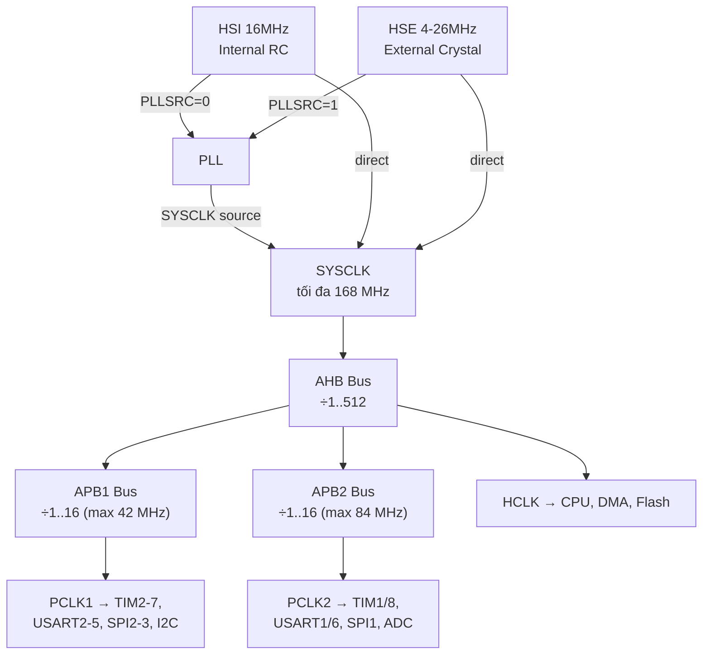

> **Prerequisites**: [[01-mcu-overview-cortex-m-family|01. MCU Overview & Cortex-M Family]], [[04-memory-map-mmio|04. Memory Map & Memory-Mapped I/O]]
> **Objectives**:
> - Phân biệt các nguồn clock: HSI, HSE, LSI, LSE và đặc điểm của từng loại
> - Hiểu PLL — cách nhân tần số clock lên từ nguồn thấp
> - Đọc và cấu hình clock tree trên STM32: AHB/APB prescaler, peripheral clock gating
> - Tính baud rate, timer period từ clock frequency
> - Nhận diện Clock Security System (CSS) và clock-based side-channel/glitching attacks

---

## Motivation

Clock là "nhịp tim" của MCU — mọi thứ đều đồng bộ theo clock. Không cấu hình đúng clock, firmware hoạt động sai hoặc không hoạt động. Quan trọng hơn, clock là attack surface cho **fault injection**: nếu attacker có thể glitch clock (tăng tần số đột ngột hoặc chèn chu kỳ lỗi), CPU thực hiện sai instruction — đây là kỹ thuật bypass secure boot và readout protection trong thực tế.

---

## Các Nguồn Clock

> [!definition] Definition 10.1 — Nguồn Clock trên STM32F4
>
> | Tên | Loại | Tần số | Đặc điểm |
> |-----|------|--------|---------|
> | **HSI** | Internal RC | 16 MHz | Không cần thạch anh ngoài, startup nhanh, kém chính xác (~1%) |
> | **HSE** | External crystal/oscillator | 4–26 MHz | Cần thạch anh ngoài, chính xác cao (ppm level) |
> | **LSI** | Internal RC (low speed) | ~32 kHz | Dùng cho RTC, IWDG — kém chính xác (~30%) |
> | **LSE** | External crystal (low speed) | 32.768 kHz | Dùng cho RTC — rất chính xác, tiêu thụ thấp |
> | **PLL** | Phase-Locked Loop | lên đến 168 MHz | Nhân tần số từ HSI hoặc HSE |
> | **PLLI2S** | PLL thứ hai | — | Dành cho I2S audio |

**Lựa chọn clock source** phụ thuộc vào yêu cầu:



---

## PLL — Phase-Locked Loop

> [!definition] Definition 10.2 — PLL Operation
> PLL nhân tần số nguồn lên để tạo clock cao hơn. Trên STM32F4, PLL có 4 tham số:
>
> $$f_{VCO} = f_{in} \times \frac{N}{M}$$
>
> $$f_{PLL\_P} = \frac{f_{VCO}}{P} \quad \text{(SYSCLK)}$$
>
> $$f_{PLL\_Q} = \frac{f_{VCO}}{Q} \quad \text{(USB/SDIO/RNG)}$$
>
> Trong đó:
> - $M$: PLLM divider (2–63) — chia input xuống ~1–2 MHz cho VCO
> - $N$: PLLN multiplier (50–432) — nhân lên trong VCO (phải: 100 MHz ≤ f_VCO ≤ 432 MHz)
> - $P$: PLLP divider (2, 4, 6, hoặc 8) — chia ra SYSCLK
> - $Q$: PLLQ divider (2–15) — chia ra USB/SDIO/RNG clock (phải = 48 MHz cho USB)

**Ví dụ tính PLL cho 168 MHz từ HSE 8 MHz**:

$$M = 8 \quad \Rightarrow \quad f_{in\_VCO} = \frac{8}{8} = 1 \text{ MHz}$$

$$N = 336 \quad \Rightarrow \quad f_{VCO} = 1 \times 336 = 336 \text{ MHz} \quad \checkmark \text{(trong 100–432 MHz)}$$

$$P = 2 \quad \Rightarrow \quad f_{SYSCLK} = \frac{336}{2} = 168 \text{ MHz} \quad \checkmark$$

$$Q = 7 \quad \Rightarrow \quad f_{USB} = \frac{336}{7} = 48 \text{ MHz} \quad \checkmark$$

---

## Cấu hình Clock — Bare-Metal từ Register

Cấu hình clock là công việc đầu tiên firmware phải làm trước khi dùng bất kỳ peripheral nào. Thứ tự bắt buộc:

```c
#include "stm32f4xx.h"

void clock_init_168mhz(void) {
    /* 1. Enable HSE */
    RCC->CR |= RCC_CR_HSEON;
    while (!(RCC->CR & RCC_CR_HSERDY)) { }   /* Chờ HSE ổn định */

    /* 2. Cấu hình Flash wait states TRƯỚC KHI tăng clock */
    FLASH->ACR = FLASH_ACR_LATENCY_5WS    /* 5 wait states cho 168 MHz */
               | FLASH_ACR_PRFTEN         /* Prefetch enable */
               | FLASH_ACR_ICEN           /* Instruction cache */
               | FLASH_ACR_DCEN;          /* Data cache */

    /* 3. Cấu hình AHB, APB1, APB2 prescalers */
    RCC->CFGR = RCC_CFGR_HPRE_DIV1       /* AHB = SYSCLK / 1 = 168 MHz */
              | RCC_CFGR_PPRE1_DIV4       /* APB1 = AHB / 4 = 42 MHz */
              | RCC_CFGR_PPRE2_DIV2;      /* APB2 = AHB / 2 = 84 MHz */

    /* 4. Cấu hình PLL: HSE=8MHz, M=8, N=336, P=2, Q=7 */
    RCC->PLLCFGR = (8U  << RCC_PLLCFGR_PLLM_Pos)   /* M = 8  */
                 | (336U << RCC_PLLCFGR_PLLN_Pos)   /* N = 336 */
                 | (0U  << RCC_PLLCFGR_PLLP_Pos)    /* P = 2 (0b00 = /2) */
                 | RCC_PLLCFGR_PLLSRC_HSE            /* Source = HSE */
                 | (7U  << RCC_PLLCFGR_PLLQ_Pos);   /* Q = 7 */

    /* 5. Enable PLL */
    RCC->CR |= RCC_CR_PLLON;
    while (!(RCC->CR & RCC_CR_PLLRDY)) { }   /* Chờ PLL lock */

    /* 6. Switch SYSCLK sang PLL */
    RCC->CFGR |= RCC_CFGR_SW_PLL;
    while ((RCC->CFGR & RCC_CFGR_SWS) != RCC_CFGR_SWS_PLL) { }

    /* 7. (Optional) Disable HSI để tiết kiệm điện */
    RCC->CR &= ~RCC_CR_HSION;
}
```

> [!warning] Thứ tự quan trọng
> **Bắt buộc** cấu hình Flash wait states TRƯỚC khi tăng tần số SYSCLK. Nếu tăng clock trước, Flash không kịp đọc instruction → CPU fetch sai → crash ngẫu nhiên rất khó debug.

---

## Peripheral Clock Gating

Trước khi dùng bất kỳ peripheral nào, phải **enable clock** cho nó qua RCC. Đây là tính năng tiết kiệm điện — peripheral tắt clock = không hoạt động và không tiêu điện.

```c
/* Enable clock cho các peripheral thường dùng */

/* GPIO */
RCC->AHB1ENR |= RCC_AHB1ENR_GPIOAEN;   /* GPIOA */
RCC->AHB1ENR |= RCC_AHB1ENR_GPIOBEN;   /* GPIOB */

/* USART */
RCC->APB2ENR |= RCC_APB2ENR_USART1EN;  /* USART1 (APB2) */
RCC->APB1ENR |= RCC_APB1ENR_USART2EN;  /* USART2 (APB1) */

/* SPI */
RCC->APB2ENR |= RCC_APB2ENR_SPI1EN;    /* SPI1 (APB2) */

/* I2C */
RCC->APB1ENR |= RCC_APB1ENR_I2C1EN;    /* I2C1 (APB1) */

/* DMA */
RCC->AHB1ENR |= RCC_AHB1ENR_DMA1EN;
RCC->AHB1ENR |= RCC_AHB1ENR_DMA2EN;

/* Timer */
RCC->APB1ENR |= RCC_APB1ENR_TIM2EN;    /* TIM2 (APB1) */
RCC->APB2ENR |= RCC_APB2ENR_TIM1EN;    /* TIM1 (APB2) */

/* ADC */
RCC->APB2ENR |= RCC_APB2ENR_ADC1EN;
```

> [!note] Peripheral Reset
> Ngoài clock gating, RCC còn có **peripheral reset** (RCC_AHB1RSTR, RCC_APB1RSTR...) để reset peripheral về trạng thái ban đầu. Hữu ích khi cần reinitialize mà không reset toàn chip.

---

## Tính Timer Period và Baud Rate từ Clock

### Timer Period

```c
/*
 * TIM2 nằm trên APB1 (42 MHz).
 * Nếu APB1 prescaler != 1, timer clock = APB1 clock × 2.
 * Với APB1 = HCLK/4 = 168/4 = 42 MHz → Timer clock = 42×2 = 84 MHz
 *
 * Timer period = (PSC + 1) × (ARR + 1) / Timer_clock
 * Để có 1 ms interrupt: period = 1 ms = 0.001 s
 *
 * Chọn PSC = 83 → divider = 84 → effective = 84MHz/84 = 1 MHz
 * Chọn ARR = 999 → overflow mỗi 1000 tick = 1 ms
 */
TIM2->PSC = 83;      /* Prescaler: chia cho (83+1)=84 → 1 MHz tick */
TIM2->ARR = 999;     /* Auto-reload: overflow sau 1000 tick = 1 ms */
TIM2->CR1 |= TIM_CR1_CEN;  /* Enable timer */
```

### UART Baud Rate

```c
/*
 * USART1 nằm trên APB2 (84 MHz).
 * BRR = f_PCLK / (16 × BaudRate)  [oversampling by 16, default]
 *
 * Với 115200 baud:
 * BRR = 84,000,000 / (16 × 115200) = 84,000,000 / 1,843,200 ≈ 45.57
 *
 * Mantissa = 45 → BRR[15:4] = 45
 * Fraction = 0.57 × 16 = 9.12 ≈ 9 → BRR[3:0] = 9
 * BRR = (45 << 4) | 9 = 0x2D9
 */
USART1->BRR = 0x2D9;
```

---

## Clock Security System (CSS)

> [!definition] Definition 10.3 — Clock Security System (CSS)
> CSS là hardware monitor theo dõi HSE clock. Nếu HSE fail (oscillator dừng), CSS:
> 1. Tự động switch SYSCLK sang HSI (16 MHz internal)
> 2. Trigger **NMI** (Non-Maskable Interrupt) để thông báo firmware
> 3. Set `CSSF` flag trong `RCC->CIR`
>
> CSS quan trọng trong ứng dụng safety-critical (xe hơi, y tế) — HSE có thể fail do nhiễu, nhiệt độ, hoặc vibration.

```c
/* Enable CSS */
RCC->CR |= RCC_CR_CSSON;

/* NMI handler xử lý CSS event */
void NMI_Handler(void) {
    if (RCC->CIR & RCC_CIR_CSSF) {
        /* HSE failed — đang chạy trên HSI 16MHz */
        RCC->CIR |= RCC_CIR_CSSC;   /* Clear CSS flag */
        /* Log lỗi, cảnh báo, hoặc safe shutdown */
    }
}
```

---

## Clock Glitching — Attack Surface

> [!warning] Security Note — Clock Fault Injection
> Clock glitching là kỹ thuật attacker **chèn xung clock bất thường** vào đường clock của MCU để làm CPU skip instruction hoặc thực hiện sai:
>
> ```text
> Clock bình thường:  ┌┐┌┐┌┐┌┐┌┐┌┐┌┐┌┐
>                     ││││││││││││││││
>
> Clock glitch:       ┌┐┌┐┌┐┌┐┌┐┌┐┌┐┌┐┌┐┌┐┌┐  ← thêm xung
>                                   ↑ extra pulse → CPU thực hiện thêm 1 bước
>                              hoặc
>                     ┌┐┌┐┌┐  ┌┐┌┐┌┐  ← bỏ xung
>                                    ↑ missing pulse → CPU skip instruction
> ```
>
> **Mục tiêu điển hình**:
> - Skip `CMP + BEQ` trong đoạn kiểm tra mật khẩu
> - Skip instruction `RDP check` trong secure boot
> - Flip kết quả của `BNE` so sánh → bypass authentication
>
> **Countermeasure**: Internal RC clock (HSI) khó glitch hơn vì không có đường clock vật lý ngoài chip để can thiệp. Dùng CSS + HSI fallback giảm nhưng không loại bỏ hoàn toàn rủi ro (glitch vẫn có thể qua supply voltage).

---

## Đọc Clock Configuration qua GDB

```gdb
# Xem RCC CR — clock sources đang enable/ready
(gdb) x/wx 0x40023800    # RCC->CR
# Bit 0: HSION, Bit 1: HSIRDY
# Bit 16: HSEON, Bit 17: HSERDY
# Bit 24: PLLON, Bit 25: PLLRDY

# Xem RCC CFGR — clock mux và prescalers
(gdb) x/wx 0x40023808    # RCC->CFGR
# Bits [1:0]: SW (clock source: 00=HSI, 01=HSE, 10=PLL)
# Bits [3:2]: SWS (actual clock source đang dùng)
# Bits [7:4]: HPRE (AHB prescaler)
# Bits [12:10]: PPRE1 (APB1 prescaler)
# Bits [15:13]: PPRE2 (APB2 prescaler)

# Xem PLL config
(gdb) x/wx 0x40023804    # RCC->PLLCFGR
# Bits [5:0]: PLLM
# Bits [14:6]: PLLN
# Bits [17:16]: PLLP
# Bit 22: PLLSRC (0=HSI, 1=HSE)
# Bits [27:24]: PLLQ
```

---

## Summary

- **Nguồn clock**: HSI (16 MHz internal RC), HSE (external crystal, 4–26 MHz), LSI (~32 kHz, low accuracy), LSE (32.768 kHz, RTC-grade).
- **PLL**: $f_{SYSCLK} = f_{in} \times N / (M \times P)$. STM32F4 max 168 MHz từ HSE/HSI qua PLL.
- **Clock tree**: SYSCLK → AHB (HCLK) → APB1/APB2 với prescaler riêng. Timer clock = APB clock × 2 nếu APB prescaler ≠ 1.
- **Clock gating**: mỗi peripheral phải được enable clock qua RCC trước khi dùng — thiếu bước này là lỗi phổ biến nhất khi init peripheral.
- **Flash wait states** phải được cấu hình TRƯỚC khi tăng clock, không phải sau.
- **CSS**: monitor HSE, fallback sang HSI khi fail, trigger NMI.
- **Clock glitching**: attack surface quan trọng — attacker inject xung clock bất thường để skip/corrupt instruction. Dùng internal clock giảm bề mặt tấn công này.

---

## References

- STMicroelectronics — *STM32F4 Reference Manual* (RM0090), Ch. 7 (Reset and Clock Control)
- Joseph Yiu — *The Definitive Guide to ARM Cortex-M3 and Cortex-M4 Processors*, Ch. 16 (Low Power)
- Jasper van Woudenberg, Colin O'Flynn — *The Hardware Hacking Handbook*, Ch. 5 (Fault Injection)
- Colin O'Flynn — *ChipWhisperer documentation* — Clock glitching tutorials (chipwhisperer.readthedocs.io)
- STMicroelectronics — *AN3988: Clock configuration tool for STM32F40x/STM32F41x*
