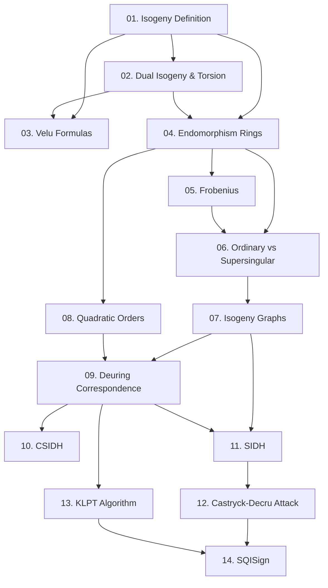

Khóa học này xây dựng nền tảng toán học đầy đủ cho **isogeny-based cryptography** ở mức research-level, đi từ định nghĩa isogeny cơ bản đến các giao thức hiện đại CSIDH, SIDH, và SQISign. Mục tiêu cuối là bạn có thể đọc paper gốc, implement bằng SageMath, và hiểu các tấn công quan trọng.

**Kiến thức nền tảng yêu cầu**: ECC (group law, scalar multiplication), finite fields & extension fields, abstract algebra (group/ring/field theory), pairings (Weil/Tate/Ate).

**Tài liệu tham khảo chính**:
- De Feo, *Mathematics of Isogeny Based Cryptography*, arXiv:1711.04062 (tài liệu chính)
- Silverman, *The Arithmetic of Elliptic Curves*, Springer GTM 106
- Kohel, *Endomorphism Rings of Elliptic Curves over Finite Fields*, PhD thesis, Berkeley 1996
- Castryck & Decru, *An efficient key recovery attack on SIDH*, EUROCRYPT 2023
- De Feo, Kohel, Leroux, Petit, Wesolowski, *SQISign: compact post-quantum signatures*, ASIACRYPT 2020

---

## Lesson Overview

| # | Title | Type | File | Dependencies |
|---|-------|------|------|-------------|
| 01 | Isogeny: Definition, Degree & Separability | Math Component | [[01-isogeny-definition\|01. Isogeny: Definition, Degree & Separability]] | — |
| 02 | Dual Isogeny & Torsion Subgroups | Math Component | [[02-dual-isogeny-torsion\|02. Dual Isogeny & Torsion Subgroups]] | 01 |
| 03 | Vélu's Formulas — Computing Isogenies from Kernels | Deep Dive | [[03-velu-formulas\|03. Vélu's Formulas]] | 01, 02 |
| 04 | Endomorphism Rings & j-invariant | Math Component | [[04-endomorphism-rings\|04. Endomorphism Rings & j-invariant]] | 01, 02 |
| 05 | Frobenius & Curves over Finite Fields | Math Component | [[05-frobenius-finite-fields\|05. Frobenius & Curves over Finite Fields]] | 04 |
| 06 | Ordinary vs Supersingular Elliptic Curves | Foundation | [[06-ordinary-supersingular\|06. Ordinary vs Supersingular Elliptic Curves]] | 04, 05 |
| 07 | Isogeny Graphs — Volcanoes & Expanders | Math Component | [[07-isogeny-graphs\|07. Isogeny Graphs: Volcanoes & Expanders]] | 06 |
| 08 | Imaginary Quadratic Orders & Ideal Class Groups | Math Component | [[08-quadratic-orders-ideal-class\|08. Imaginary Quadratic Orders & Ideal Class Groups]] | 04 |
| 09 | Deuring Correspondence — Ideal Class Group Action | Math Component | [[09-deuring-correspondence\|09. Deuring Correspondence]] | 07, 08 |
| 10 | CSIDH — Commutative Supersingular Isogeny DH | Scheme | [[10-csidh\|10. CSIDH]] | 09 |
| 11 | SIDH — Supersingular Isogeny Diffie-Hellman | Scheme | [[11-sidh\|11. SIDH]] | 07, 09 |
| 12 | Castryck-Decru Attack on SIDH | Attack | [[12-castryck-decru-attack\|12. Castryck-Decru Attack on SIDH]] | 11 |
| 13 | KLPT Algorithm & Quaternion Algebras | Deep Dive | [[13-klpt-quaternion\|13. KLPT Algorithm & Quaternion Algebras]] | 09 |
| 14 | SQISign — Compact Post-Quantum Signatures | Scheme | [[14-sqisign\|14. SQISign]] | 12, 13 |
| A0 | Proof: Vélu's Formula Derivation | — | [[a0-velu-proof\|A0. Vélu's Formula Derivation]] | — |
| A1 | SageMath Implementation Patterns | — | [[a1-sageMath-patterns\|A1. SageMath Implementation Patterns]] | — |

**Lesson types**: Foundation · Math Component · Scheme · Attack · Deep Dive

---

## Dependency Graph

---

## Module Structure

**Module 0 — Nền tảng Isogeny** (Lessons 01–03)
Xây dựng định nghĩa chính xác, tính chất cơ bản và công cụ tính toán quan trọng nhất.

**Module 1 — Endomorphisms & Cấu trúc Đường cong** (Lessons 04–06)
Endomorphism ring, j-invariant, Frobenius, và sự phân loại ordinary/supersingular.

**Module 2 — Isogeny Graphs** (Lesson 07)
Cấu trúc volcano và Ramanujan expander — xương sống của mọi giao thức isogeny.

**Module 3 — Nền tảng Đại số Số** (Lessons 08–09)
Imaginary quadratic orders, ideal class group action, Deuring correspondence — bộ máy toán học đằng sau CSIDH và SQISign.

**Module 4 — Giao thức Mật mã** (Lessons 10–11)
CSIDH và SIDH — hai hướng chính của isogeny-based crypto.

**Module 5 — Tấn công & Phân tích Bảo mật** (Lesson 12)
Castryck-Decru attack — lý do SIKE bị loại khỏi NIST PQC.

**Module 6 — SQISign** (Lessons 13–14)
KLPT algorithm, quaternion algebras, và SQISign — state-of-the-art.

---

## Progress

- [ ] [[01-isogeny-definition\|01. Isogeny: Definition, Degree & Separability]]
- [ ] [[02-dual-isogeny-torsion\|02. Dual Isogeny & Torsion Subgroups]]
- [ ] [[03-velu-formulas\|03. Vélu's Formulas]]
- [ ] [[04-endomorphism-rings\|04. Endomorphism Rings & j-invariant]]
- [ ] [[05-frobenius-finite-fields\|05. Frobenius & Curves over Finite Fields]]
- [ ] [[06-ordinary-supersingular\|06. Ordinary vs Supersingular Elliptic Curves]]
- [ ] [[07-isogeny-graphs\|07. Isogeny Graphs: Volcanoes & Expanders]]
- [ ] [[08-quadratic-orders-ideal-class\|08. Imaginary Quadratic Orders & Ideal Class Groups]]
- [ ] [[09-deuring-correspondence\|09. Deuring Correspondence]]
- [ ] [[10-csidh\|10. CSIDH]]
- [ ] [[11-sidh\|11. SIDH]]
- [ ] [[12-castryck-decru-attack\|12. Castryck-Decru Attack on SIDH]]
- [ ] [[13-klpt-quaternion\|13. KLPT Algorithm & Quaternion Algebras]]
- [ ] [[14-sqisign\|14. SQISign]]
- [ ] [[a0-velu-proof\|A0. Vélu's Formula Derivation]]
- [ ] [[a1-sageMath-patterns\|A1. SageMath Implementation Patterns]]

---

## Notes

**Thứ tự khuyến nghị**: Đi tuần tự. Lesson 08 (Quadratic Orders) có thể học song song với Lessons 05–07 nếu bạn đã quen với algebraic number theory.

**Lessons quan trọng nhất**: 01 → 03 → 06 → 07 → 09 là xương sống của toàn bộ khóa học. Không bỏ qua bất kỳ lesson nào trong chuỗi này.

**CTF notes**: Lessons 03 (Vélu), 07 (Isogeny graphs), 09 (Deuring), và 12 (Castryck-Decru) chứa các pattern thường xuất hiện trong CTF isogeny challenges.

**Sau khi hoàn thành khóa học này**, xem phần *Topic Nâng cao* ở cuối `index.md` để biết các hướng đào sâu tiếp theo.
