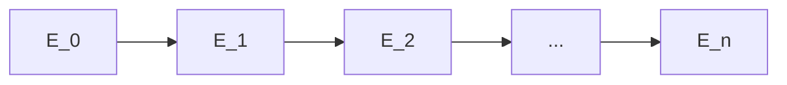

> **Prerequisites**: [[01-isogeny-definition|01. Isogeny: Definition, Degree & Separability]], [[02-dual-isogeny-torsion|02. Dual Isogeny & Torsion Subgroups]]
> **Lesson type**: Deep Dive
>
> **Notation** (ký hiệu dùng mà không định nghĩa trong bài này):
> | Ký hiệu | Ý nghĩa |
> |---------|---------|
> | $E: y^2 = x^3 + Ax + B$ | Đường cong elliptic short Weierstrass ($\text{char}(k) \neq 2, 3$) |
> | $G$ | Finite subgroup của $E(\bar{k})$, $\#G = \ell$ (số nguyên tố lẻ) |
> | $S$ | $G \setminus \{\mathcal{O}\}$ — các điểm khác $\mathcal{O}$ trong kernel |
> | $S^+$ | Một nửa của $S$: đại diện của mỗi cặp $\{Q, -Q\}$, $\#S^+ = (\ell-1)/2$ |
> | $\phi: E \to E'$ | Separable isogeny kernel $G$, degree $\ell$ |
> | $A', B'$ | Coefficients của codomain $E': y^2 = x^3 + A'x + B'$ |
> | $h(x)$ | Kernel polynomial của $\phi$ |

---

## Động lực: Từ Kernel đến Isogeny Tường minh

Lesson 01 đã chứng minh rằng với mọi finite subgroup $G \subset E(\bar{k})$, tồn tại duy nhất một separable isogeny $\phi: E \to E' = E/G$ với $\ker\phi = G$. Nhưng "tồn tại duy nhất" chưa cho ta công cụ tính toán: biết $G$, làm sao viết được $\phi$ tường minh dưới dạng rational maps? Làm sao tính được phương trình của $E'$?

Câu trả lời đến từ một bài báo ngắn (5 trang) năm 1971 của Jacques Vélu: **Vélu's formulas**. Kết quả này biến bài toán "tìm isogeny từ kernel" thành một quy trình tính toán thuần túy — tổng các biểu thức đại số trên các điểm của kernel. Đây là công cụ tính toán số một trong mọi implementation của CSIDH, SIDH, và SQISign.

---

## 1. Phát biểu Chính: Vélu's Theorem

> [!abstract] Định lý 3.1 — Vélu (1971), short Weierstrass form
> Cho $E: y^2 = x^3 + Ax + B$ trên trường $k$ với $\text{char}(k) \neq 2, 3$. Cho $G \subset E(\bar{k})$ là subgroup hữu hạn của bậc lẻ $\ell$ (nguyên tố), và $S = G \setminus \{\mathcal{O}\}$.
>
> Định nghĩa các **tham số Vélu** sau cho mỗi $Q = (x_Q, y_Q) \in S$:
>
> $$
> t_Q = 3x_Q^2 + A, \qquad w_Q = 2y_Q^2 + x_Q \cdot t_Q
> $$
>
> và tổng:
>
> $$
> v = \sum_{Q \in S} t_Q, \qquad w = \sum_{Q \in S} w_Q
> $$
>
> Khi đó tồn tại duy nhất separable isogeny chuẩn hóa $\phi: E \to E'$ với $\ker\phi = G$, trong đó:
>
> **(a) Phương trình codomain**:
>
> $$
> E': \quad y^2 = x^3 + A'x + B', \qquad A' = A - 5v, \quad B' = B - 7w
> $$
>
> **(b) Rational maps** (với $P = (x, y) \notin G$):
>
> $$
> \phi(x, y) = \Bigl(\phi_x(x),\; y \cdot \phi_x'(x) \Bigr)
> $$
>
> trong đó:
>
> $$
> \phi_x(x) = x + \sum_{Q \in S} \left( \frac{t_Q}{x - x_Q} - \frac{2y_Q^2}{(x - x_Q)^2} \right)
> $$
>
> và $\phi_x'(x) = \dfrac{d}{dx}\phi_x(x)$ là đạo hàm của $\phi_x$ theo $x$.
>
> [!tip] Cách nhớ hệ số $A - 5v$ và $B - 7w$
> Hai hệ số $5$ và $7$ xuất phát từ phép khai triển Laurent của hàm $\wp$ (Weierstrass elliptic function): $c_4 = -60G_4$ và $c_6 = -140G_6$. Trong bối cảnh Vélu, chúng xuất hiện tự nhiên khi tính invariant differential của $E'$. Không cần nhớ lý do — chỉ cần nhớ $\mathbf{5}v$ và $\mathbf{7}w$.

---

## 2. Phân tích từng Thành phần

### 2.1. Tại sao $t_Q = 3x_Q^2 + A$?

$t_Q$ chính là **đạo hàm** của $f(x) = x^3 + Ax + B$ tại $x = x_Q$:

$$
t_Q = f'(x_Q) = 3x_Q^2 + A
$$

Ý nghĩa hình học: $t_Q$ liên quan đến hệ số góc của tiếp tuyến của $E$ tại $Q$. Cụ thể, nếu $Q \neq -Q$ (tức $y_Q \neq 0$), độ dốc tiếp tuyến là $\lambda = t_Q / (2y_Q)$.

### 2.2. Tại sao $w_Q = 2y_Q^2 + x_Q t_Q$?

Khai triển:
$$
w_Q = 2y_Q^2 + x_Q(3x_Q^2 + A) = 2(x_Q^3 + Ax_Q + B) + 3x_Q^3 + Ax_Q = 5x_Q^3 + 3Ax_Q + 2B
$$

Đây là một combination đối xứng của tọa độ $Q$ — bất biến dưới $Q \mapsto -Q$ vì $y_Q^2 = y_{-Q}^2$ và $x_Q = x_{-Q}$.

> [!info] Bất biến dưới $Q \mapsto -Q$
> Vì $t_Q = t_{-Q}$ và $w_Q = w_{-Q}$, các tổng $v = \sum_{Q \in S} t_Q$ và $w = \sum_{Q \in S} w_Q$ có thể được tính dưới dạng:
>
> $$
> v = 2\sum_{Q \in S^+} t_Q, \qquad w = 2\sum_{Q \in S^+} w_Q
> $$
>
> Điều này giảm một nửa số hạng cần tính trong implementation.

### 2.3. Rational Map $\phi_x$: Góc nhìn Phân tích

Ta có thể viết lại $\phi_x$ theo một cách gợi ý hơn. Nhận thấy:

$$
\frac{t_Q}{x - x_Q} - \frac{2y_Q^2}{(x - x_Q)^2} = \frac{t_Q(x - x_Q) - 2y_Q^2}{(x-x_Q)^2}
$$

Tổng này theo $Q \in S$ tương đương với việc cộng thêm vào $x$ một "correction" phụ thuộc vào vị trí tương đối của $x$ so với các điểm kernel. Khi $x \to x_Q$, có một cực tại $x_Q$ — đây là biểu hiện của việc $\phi$ không xác định tại các điểm kernel (chúng đều map về $\mathcal{O}_{E'}$).

---

## 3. Trường hợp Đặc biệt: Kernel bậc 2

Với $\ell = 2$, kernel $G = \{\mathcal{O}, Q_0\}$ với $Q_0 = (x_0, 0)$ là điểm 2-torsion ($y = 0$ vì $-Q_0 = Q_0$).

Trong trường hợp này $S = \{Q_0\}$, và:
$$
t_{Q_0} = 3x_0^2 + A, \qquad w_{Q_0} = 0 + x_0 t_{Q_0} = x_0(3x_0^2 + A)
$$

$$
v = 3x_0^2 + A, \qquad w = x_0(3x_0^2 + A)
$$

Codomain: $A' = A - 5(3x_0^2 + A) = -15x_0^2 - 4A$, $B' = B - 7x_0(3x_0^2+A) = B - 21x_0^3 - 7Ax_0$.

Rational map: $\phi_x(x) = x + \dfrac{t_{Q_0}}{x - x_0} - \dfrac{0}{(x-x_0)^2} = x + \dfrac{3x_0^2 + A}{x - x_0}$.

Đây là 2-isogeny đơn giản nhất — sẽ xuất hiện nhiều lần trong các giao thức (SIDH dùng chuỗi 2-isogenies).

---

## 4. Ví dụ Tính Tay Đầy đủ

> [!example] Ví dụ 3.2 — 3-isogeny trên $\mathbb{F}_{7}$
>
> Cho $E: y^2 = x^3 + 1$ trên $\mathbb{F}_{7}$, tức $A = 0$, $B = 1$.
>
> Xác nhận $Q_0 = (0, 1) \in E(\mathbb{F}_7)$: $1^2 = 1 = 0^3 + 1$. ✓
>
> Xác nhận $Q_0$ có order 3: dùng công thức nhân đôi, $2Q_0 = (0, -1) = (0, 6)$, và $3Q_0 = 2Q_0 + Q_0 = (0,6)+(0,1)$; hai điểm có cùng $x$-coordinate nhưng $y$ đối nhau nên tổng là $\mathcal{O}$. ✓
>
> Kernel: $G = \{\mathcal{O},\, (0,1),\, (0,6)\}$, $\quad S^+ = \{(0,1)\}$.
>
> **Tham số Vélu** (tính tổng trên cả $S = \{(0,1),(0,6)\}$, nhưng dùng tính chất $t_Q = t_{-Q}$, $w_Q = w_{-Q}$):
>
> $$
> t_{(0,1)} = 3(0)^2 + 0 = 0 \qquad w_{(0,1)} = 2(1)^2 + (0)(0) = 2
> $$
>
> $$
> v = 2 \cdot 0 = 0, \qquad w = 2 \cdot 2 = 4
> $$
>
> **Codomain:** $A' = 0 - 5(0) = 0$, $\quad B' = 1 - 7(4) = -27 \equiv 1 \pmod{7}$
>
> Kết quả: $E' : y^2 = x^3 + 1 \cong E$ — đường cong đích isomorphic với domain. Điều này không ngẫu nhiên: $E: y^2 = x^3 + 1$ có CM bởi $\mathbb{Z}[\omega_3]$ ($\omega_3$ căn bậc ba của đơn vị), nên các 3-isogenies từ $E$ trở về các đường cong trong cùng isomorphism class.
>
> **Rational map** $x$-coordinate (hai điểm kernel đóng góp, $t_Q = 0$ cho cả hai):
>
> $$
> \phi_x(x) = x + \left(\frac{0}{x} - \frac{2}{x^2}\right) + \left(\frac{0}{x} - \frac{2}{x^2}\right) = x - \frac{4}{x^2}
> $$
>
> Kiểm tra: $\phi_x(1) = 1 - 4 = -3 \equiv 4 \pmod 7$. Điểm $(1, \sqrt{2})$ trên $E$ map tới điểm có $x$-coord $4$ trên $E'$.

---

## 5. Correctness: Tại sao Công thức này Đúng?

Ý tưởng chứng minh dựa trên **invariant differential** và **Laurent expansion**.

> [!abstract] Phác thảo Chứng minh Định lý 3.1
> Xét hàm $f: k(E) \to k(E')$ được cảm sinh bởi $\phi$. Ta cần chứng minh:
>
> **(1) $\phi^*(\omega') = \omega$**, trong đó $\omega = dx/(2y)$ là invariant differential của $E$ và $\omega' = dx'/(2y')$ của $E'$. Điều này đặc trưng isogeny là "normalized".
>
> **(2) $\ker\phi = G$**: với mỗi $Q \in G$, $\phi_x(x)$ có cực tại $x = x_Q$, tức $\phi(Q) = \mathcal{O}_{E'}$.
>
> **(3) $\phi$ là group homomorphism**: tự động từ bảo toàn $\mathcal{O}$ và định nghĩa isogeny.
>
> Để kiểm tra (1), ta khai triển $\phi_x$ theo biến địa phương $t = x/y$ tại $\mathcal{O}$:
>
> $$
> \phi_x(t) = t^{-2} - A t^2 - B t^4 - \ldots
> $$
>
> So sánh với khai triển tương tự cho $\phi_x'(x)$, ta kiểm tra được rằng $\phi_x'(x) \cdot dx / (2y)$ trên $E$ khớp với $dx'/(2y')$ trên $E'$. Xem Vélu (1971), Silverman [AEC, §III.4], hoặc Galbraith [Ch. 25] cho chứng minh đầy đủ. $\blacksquare$

---

## 6. Vélu qua Kernel Polynomial

Trong implementation, kernel thường được biểu diễn bằng **kernel polynomial** $h(x)$ (xem Định nghĩa 2.9 trong Lesson 02) thay vì liệt kê điểm. Kohel (1996) đã reformulate Vélu's formulas theo $h(x)$:

> [!note] Formulation qua Kernel Polynomial
> Cho kernel polynomial $h(x) = \prod_{Q \in S^+}(x - x_Q)$, degree $(\ell-1)/2$. Đặt:
>
> $$
> h'(x) = \frac{d}{dx} h(x), \qquad h''(x) = \frac{d^2}{dx^2} h(x)
> $$
>
> và ký hiệu $f(x) = x^3 + Ax + B$ (RHS của Weierstrass). Khi đó:
>
> $$
> v = 2\sum_{Q \in S^+} (3x_Q^2 + A) = 2\left[3 \cdot (\text{sum of squares of roots of } h) + A \cdot \deg h\right]
> $$
>
> Cụ thể hơn, dùng Newton's identities: nếu $h(x) = x^d + c_1 x^{d-1} + \ldots + c_d$ thì tổng bình phương các nghiệm $= c_1^2 - 2c_2$.
>
> Với formulation này, $\phi_x$ viết được gọn qua partial fractions của $h'(x)/h(x)$.

Công thức tổng quát (Elkies, 1992; Kohel, 1996):
$$
\phi_x(x) = \frac{f(x) h(x)^2 - f'(x) h(x) h'(x) + f(x)(h'(x)^2 - h(x)h''(x))}{h(x)^2}
$$

Đây là dạng được SageMath sử dụng bên trong hàm `E.isogeny(kernel_poly)`.

---

## 7. Chuỗi Isogenies — Chain Composition

Trong các giao thức như SIDH, ta không đi một isogeny lớn mà đi một **chuỗi isogenies nhỏ**. Vélu's formulas áp dụng lặp đi lặp lại:



Cho chuỗi $E_0 \xrightarrow{\phi_1} E_1 \xrightarrow{\phi_2} E_2 \to \cdots \xrightarrow{\phi_n} E_n$, mỗi $\phi_i$ có degree $\ell$ (nhỏ, thường $\ell = 2$ hoặc $3$). Isogeny tổng hợp $\Phi = \phi_n \circ \cdots \circ \phi_1$ có degree $\ell^n$.

**Quy trình tại mỗi bước:**

> [!note] Algorithm 3.3 — Bước Vélu đơn trong chuỗi
>
> **Input**: Đường cong hiện tại $E_i$, generator $P_i$ của kernel $G_i \subset E_i$ bậc $\ell$
>
> **Output**: Đường cong $E_{i+1}$ và hình ảnh của các điểm cần theo dõi
>
> 1. Tính $S = \{P_i, [2]P_i, \ldots, [(\ell-1)/2]P_i\}$ hoặc kernel polynomial $h(x)$
> 2. Tính $v = \sum_{Q\in S} 2t_Q$ và $w = \sum_{Q\in S} 2w_Q$
> 3. Set $A_{i+1} = A_i - 5v$, $B_{i+1} = B_i - 7w$
> 4. Tính $\phi_{i+1}$ qua rational maps Vélu
> 5. Update: $P_{i+1} = \phi_{i+1}(P')$ cho mọi điểm $P'$ cần theo dõi
> 6. Return $E_{i+1}$

---

## 8. SageMath — Vélu's Formulas

```python
p = 431
F = GF(p)
E = EllipticCurve(F, [0, 1])

P = E.lift_x(F(0))
if P.order() == 3:
    kernel_pt = P
else:
    kernel_pt = -P

phi = E.isogeny(kernel_pt)
print(phi.degree())
Eprime = phi.codomain()
print(Eprime)

print(phi.rational_maps())
```

```python
p = 431
F = GF(p)
E = EllipticCurve(F, [1, 0])

h = E.division_polynomial(3)
for factor, mult in h.factor():
    if factor.degree() == 1:
        x0 = -factor[0]
        P = E.lift_x(x0)
        if P.order() == 3:
            break

phi = E.isogeny(P)
print("Degree:", phi.degree())
print("Codomain:", phi.codomain())

Q = E.random_point()
print("phi(Q) on codomain?", phi(Q) in phi.codomain())
```

```python
p = 2**127 - 1
F = GF(p)
E0 = EllipticCurve(F, [1, 0])

chain = [E0]
current_E = E0
for _ in range(4):
    pts_of_order_2 = [P for P in current_E.torsion_points() if P.order() == 2]
    if not pts_of_order_2:
        break
    kernel_pt = pts_of_order_2[0]
    phi = current_E.isogeny(kernel_pt)
    current_E = phi.codomain()
    chain.append(current_E)

print("Chain of 2-isogenies:")
for i, E in enumerate(chain):
    print(f"  E_{i}: j = {E.j_invariant()}")
```

> [!tip] Pattern trong CTF — Recovering Image Point
> Trong CTF, bài toán điển hình: cho kernel $G = \langle P \rangle$ và một điểm $Q$ "bí mật", tìm $\phi(Q)$.
> ```python
> phi = E.isogeny(P)
> image_Q = phi(Q)
> ```
> Nếu bài cho codomain $E'$ và yêu cầu tìm preimage: dùng `phi.dual()(Q)` và chia cho degree.

---

## 9. $\sqrt{\text{élu}}$ — Tăng tốc với Degree Lớn

Vélu's formulas chuẩn có độ phức tạp $O(\ell)$ phép toán trên trường (tổng $\ell - 1$ hạng). Với $\ell$ lớn (ví dụ $\ell \approx 2^{256}$ trong các giao thức như B-SIDH), điều này quá chậm.

Bernstein, De Feo, Leroux, Smith (2020) đề xuất **$\sqrt{\text{élu}}$ algorithm** sử dụng baby-step giant-step để tính Vélu trong $O(\sqrt{\ell})$ phép toán. Đây là breakthrough về complexity cho large-degree isogenies.

> [!info] $\sqrt{\text{élu}}$ — ý tưởng cốt lõi
> Phân tách $S^+$ thành hai tập kích thước $\approx \sqrt{\ell}$:
> $S^+ = \{[i \cdot j] P_0 \mid i \in I, j \in J\}$ với $|I|, |J| \approx \sqrt{\ell}$.
> Dùng partial fraction decomposition và polynomial GCD để tránh tính từng hạng một. Độ phức tạp giảm từ $O(\ell)$ xuống $\tilde{O}(\sqrt{\ell})$.

---

## Tóm tắt

- Vélu's formulas giải quyết bài toán: **cho kernel $G$, tìm isogeny $\phi: E \to E/G$ tường minh**.
- **Tham số**: $t_Q = 3x_Q^2 + A$, $w_Q = 2y_Q^2 + x_Q t_Q$; tổng $v = \sum t_Q$, $w = \sum w_Q$ trên $S = G\setminus\{\mathcal{O}\}$.
- **Codomain**: $A' = A - 5v$, $B' = B - 7w$.
- **Rational map** $x$-coordinate: $\phi_x(x) = x + \sum_{Q \in S}\left(\frac{t_Q}{x-x_Q} - \frac{2y_Q^2}{(x-x_Q)^2}\right)$.
- Mọi giao thức isogeny-based (CSIDH, SIDH, SQISign) đều dùng Vélu's formulas hoặc các biến thể của nó.
- $\sqrt{\text{élu}}$ giảm complexity từ $O(\ell)$ xuống $\tilde{O}(\sqrt{\ell})$ — cần thiết cho degree lớn.

---

## References

- Vélu, J. — *Isogénies entre courbes elliptiques*, C.R. Acad. Sc. Paris, 273, 1971
- Silverman, J.H. — *The Arithmetic of Elliptic Curves*, GTM 106, §III.4
- Galbraith, S. — *Mathematics of Public Key Cryptography*, Ch. 25 (math.auckland.ac.nz/~sgal018)
- Sutherland, A. — *18.783 Elliptic Curves*, Lecture 6 (MIT OCW, 2025)
- Bernstein, De Feo, Leroux, Smith — *Faster computation of isogenies of large prime degree*, ANTS 2020 (arXiv:2003.10118)
- De Feo, L. — *Mathematics of Isogeny Based Cryptography*, arXiv:1711.04062, Proposition 38
