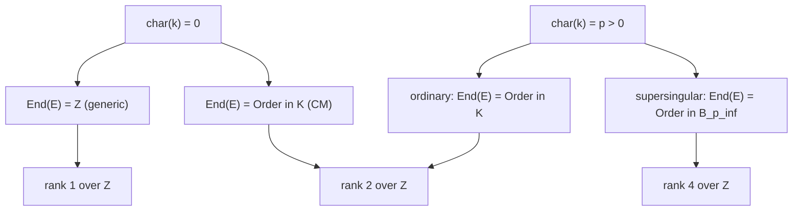

> **Prerequisites**: [[01-isogeny-definition|01. Isogeny: Definition, Degree & Separability]], [[02-dual-isogeny-torsion|02. Dual Isogeny & Torsion Subgroups]], imaginary quadratic fields cơ bản
> **Lesson type**: Math Component
>
> **Notation** (ký hiệu dùng mà không định nghĩa trong bài này):
> | Ký hiệu | Ý nghĩa |
> |---------|---------|
> | $\text{End}(E)$ | Endomorphism ring của $E$: tập tất cả endomorphisms với phép cộng pointwise và nhân theo composition |
> | $\text{End}^0(E)$ | $\text{End}(E) \otimes_{\mathbb{Z}} \mathbb{Q}$ — endomorphism algebra |
> | $j(E)$ | j-invariant của $E$ |
> | $K$ | Imaginary quadratic field $\mathbb{Q}(\sqrt{-d})$, $d > 0$ |
> | $\mathcal{O}_K$ | Ring of integers của $K$ |
> | $\mathcal{O}$ | Order trong $K$: $\mathcal{O} = \mathbb{Z} + f\mathcal{O}_K$, $f \geq 1$ |
> | $\text{disc}(\mathcal{O})$ | Discriminant của order $\mathcal{O}$ |
> | $[m]$ | Multiplication-by-$m$ endomorphism |

---

## Cấu trúc Nội tại của một Đường cong

Cho đến nay ta đã học isogeny như một *ánh xạ giữa các đường cong*. Nhưng một đường cong elliptic không chỉ là một điểm cô lập — nó mang theo một **endomorphism ring** $\text{End}(E)$ phản ánh toàn bộ cấu trúc nội tại của nó. Phần lớn sự phong phú của isogeny-based cryptography bắt nguồn từ sự khác biệt giữa các loại endomorphism ring này.

Bài học này xây dựng hai công cụ nền tảng:
- **$\text{End}(E)$**: phân loại đường cong theo cấu trúc đại số của ring endomorphisms
- **$j(E)$**: bất biến isomorphism — hai đường cong isomorphic khi và chỉ khi có cùng j-invariant

Hai đối tượng này liên kết với nhau: $j(E)$ xác định $\text{End}(E)$ (đến isomorphism), và ngược lại $\text{End}(E)$ xác định vị trí của $E$ trong isogeny graph.

---

## 1. Endomorphism Ring

> [!note] Định nghĩa 4.1 — Endomorphism Ring
> Cho $E$ là đường cong elliptic trên trường $k$. **Endomorphism ring** của $E$ là:
>
> $$
> \text{End}(E) := \text{Hom}(E, E) = \{\phi: E \to E \mid \phi \text{ là isogeny hoặc zero map}\}
> $$
>
> với phép toán: cộng pointwise $(\phi + \psi)(P) = \phi(P) + \psi(P)$, nhân theo composition $(\phi \cdot \psi) = \phi \circ \psi$.

$\text{End}(E)$ thực sự là một ring: có phần tử trung hòa phép cộng (zero map $[0]$), đơn vị nhân (identity $[1]$), và distributivity từ group homomorphism properties.

> [!abstract] Định lý 4.2 — $\text{End}(E)$ là torsion-free $\mathbb{Z}$-module không có zero divisors
> $\text{End}(E)$ là một $\mathbb{Z}$-module torsion-free (không có phần tử $\neq 0$ nào có bội số nguyên bằng 0), và là integral domain (không có zero divisors).

**Proof.** Nếu $n\phi = 0$ với $n \neq 0$ nguyên, thì $\deg(n\phi) = n^2 \deg\phi = 0$ (từ tính chất degree là quadratic form), suy ra $\deg\phi = 0$, tức $\phi = 0$. Integral domain: nếu $\phi \circ \psi = 0$ thì $\deg\phi \cdot \deg\psi = 0$, nên $\deg\phi = 0$ hoặc $\deg\psi = 0$. $\blacksquare$

Vì $\text{End}(E)$ là $\mathbb{Z}$-module torsion-free, ta có thể xét **endomorphism algebra** $\text{End}^0(E) := \text{End}(E) \otimes_\mathbb{Z} \mathbb{Q}$. Đây là một $\mathbb{Q}$-algebra hữu hạn chiều.

---

## 2. Ba Loại Endomorphism Ring

> [!abstract] Định lý 4.3 — Phân loại $\text{End}(E)$
> Cho $E$ là elliptic curve. $\text{End}^0(E)$ là một trong ba loại sau:
>
> **(1)** $\text{End}^0(E) \cong \mathbb{Q}$ — trường hợp "generic"  
> **(2)** $\text{End}^0(E) \cong K$ với $K$ là imaginary quadratic field — gọi là **complex multiplication (CM)**  
> **(3)** $\text{End}^0(E) \cong B_{p,\infty}$ với $B_{p,\infty}$ là definite quaternion algebra ramified tại $p$ và $\infty$ — chỉ xảy ra khi $\text{char}(k) = p > 0$, đây là trường hợp **supersingular**

Tương ứng, $\text{End}(E)$ (như $\mathbb{Z}$-module) có rank 1, 2, hoặc 4.

Sơ đồ tổng quan:



**Chú thích quan trọng**: Trường hợp (3) — supersingular — là trường hợp mà isogeny-based cryptography khai thác. Endomorphism ring là một order trong quaternion algebra, không giao hoán. Điều này làm cho bài toán tìm endomorphisms (hoặc isogenies) trở nên khó hơn về mặt tính toán.

---

## 3. j-invariant — Bất biến Isomorphism

> [!note] Định nghĩa 4.4 — j-invariant
> Cho $E: y^2 = x^3 + Ax + B$ trên trường $k$ với $\text{char}(k) \neq 2, 3$. **j-invariant** của $E$ là:
>
> $$
> j(E) := 1728 \cdot \frac{4A^3}{4A^3 + 27B^2} \in k
> $$
>
> (Mẫu số $4A^3 + 27B^2 \propto \Delta(E)$ là discriminant, $\neq 0$ vì $E$ non-singular.)
>
> [!abstract] Định lý 4.5 — j-invariant là Isomorphism Invariant hoàn toàn
> Hai đường cong $E_1$ và $E_2$ trên $\bar{k}$ là **isomorphic** (tồn tại isogeny degree 1 giữa chúng) khi và chỉ khi $j(E_1) = j(E_2)$.

**Proof sketch.** Mọi isomorphism giữa hai short Weierstrass curves có dạng $(x, y) \mapsto (u^2 x, u^3 y)$ với $u \in \bar{k}^*$, biến $(A, B) \mapsto (u^4 A, u^6 B)$. Một phép tính đại số đơn giản cho thấy $j$ bất biến dưới phép đổi biến này. Ngược lại, cho $j_0 \in \bar{k}$, có thể construct tường minh một curve $E$ với $j(E) = j_0$. Xem Silverman [AEC, §III.1]. $\blacksquare$

Hệ quả: ta có thể đồng nhất isomorphism class của $E$ với $j(E)$. Isogeny graph thực sự là đồ thị trên **j-invariants**, không phải trên các đường cong (Lesson 07).

> [!example] Ví dụ 4.6 — Các j-invariant đặc biệt
>
> | $j(E)$ | Ý nghĩa |
> |--------|---------|
> | $j = 0$ | $E: y^2 = x^3 + B$, $\text{Aut}(E) \cong \mathbb{Z}/6\mathbb{Z}$; CM bởi $\mathbb{Z}[\omega_3]$ |
> | $j = 1728$ | $E: y^2 = x^3 + Ax$, $\text{Aut}(E) \cong \mathbb{Z}/4\mathbb{Z}$; CM bởi $\mathbb{Z}[i]$ |
> | $j \neq 0, 1728$ | $\text{Aut}(E) \cong \mathbb{Z}/2\mathbb{Z}$ (chỉ có $P \mapsto -P$) |

---

## 4. Complex Multiplication — Định nghĩa và Cấu trúc

> [!note] Định nghĩa 4.7 — Complex Multiplication (CM)
> Đường cong $E$ được gọi là có **complex multiplication** (CM) bởi order $\mathcal{O}$ nếu $\text{End}(E) \cong \mathcal{O}$ trong một imaginary quadratic field $K = \mathbb{Q}(\sqrt{-d})$.
>
> Nếu $\text{End}(E) \cong \mathcal{O}_K$ (ring of integers, tức maximal order), ta nói $E$ có **full CM** bởi $K$.

**CM hoạt động thế nào?** Cho $E$ với $\text{End}(E) \cong \mathcal{O}$. Với mỗi $\alpha \in \mathcal{O}$, có một endomorphism $[\alpha]: E \to E$ tương ứng — "nhân bởi $\alpha$" theo nghĩa algebraic. Khi $\alpha \notin \mathbb{Z}$, đây là một endomorphism "thực sự mới", không phải chỉ là scalar multiplication.

> [!example] Ví dụ 4.8 — CM bởi $\mathbb{Z}[i]$
>
> Cho $E: y^2 = x^3 + x$ trên trường $k$ với $\text{char}(k) \neq 2$. Map $(x, y) \mapsto (-x, iy)$ (với $i^2 = -1$) là một endomorphism của $E$, gọi là $[i]$. Kiểm tra: $(-x)^3 + (-x) = -x^3 - x = -(x^3 + x)$, nên $(iy)^2 = -y^2 = -(x^3+x) = (-x)^3 + (-x)$. ✓
>
> $[i]$ có degree 1? Không, $\deg[i] = 1$ chỉ khi nó là isomorphism — thực ra $[i] \circ [i] = [-1] = [-1]$, tức $[i]^2 = -1$ trong $\text{End}(E)$. Điều này xác nhận $\text{End}(E) \supseteq \mathbb{Z}[i]$. Trên $\bar{k}$, $\text{End}(E) = \mathbb{Z}[i]$ (Gaussian integers).
>
> Với $j(E) = 1728$, đây là CM curve điển hình nhất.

---

## 5. Orders trong Imaginary Quadratic Fields

Vì endomorphism ring của CM curve là một *order* (không nhất thiết là ring of integers), ta cần hiểu cấu trúc của orders.

> [!note] Định nghĩa 4.9 — Order trong $K$
> Cho $K = \mathbb{Q}(\sqrt{-d})$ là imaginary quadratic field. Một **order** trong $K$ là subring $\mathcal{O} \subset K$ là $\mathbb{Z}$-module free rank 2 chứa $1$.
>
> Mọi order đều có dạng:
>
> $$
> \mathcal{O}_f := \mathbb{Z} + f\mathcal{O}_K, \quad f \geq 1
> $$
>
> với $f$ gọi là **conductor**. Order maximal là $\mathcal{O}_K = \mathcal{O}_1$ (ring of integers).
>
> **Discriminant** của $\mathcal{O}_f$: $\text{disc}(\mathcal{O}_f) = f^2 \cdot \text{disc}(\mathcal{O}_K) = f^2 D_K$.
>
> [!example] Ví dụ 4.10
>
> Với $K = \mathbb{Q}(i) = \mathbb{Q}(\sqrt{-1})$: $\mathcal{O}_K = \mathbb{Z}[i]$, $D_K = -4$.
> - $\mathcal{O}_1 = \mathbb{Z}[i]$, disc $= -4$
> - $\mathcal{O}_2 = \mathbb{Z} + 2\mathbb{Z}[i] = \mathbb{Z}[2i]$, disc $= -16$
> - $\mathcal{O}_f = \mathbb{Z} + f\mathbb{Z}[i]$, disc $= -4f^2$
>
> Với $K = \mathbb{Q}(\sqrt{-3})$: $\mathcal{O}_K = \mathbb{Z}[\omega_3]$ với $\omega_3 = (-1+\sqrt{-3})/2$, $D_K = -3$.

Mỗi order $\mathcal{O}$ xác định duy nhất bởi discriminant $\text{disc}(\mathcal{O})$. Trong mật mã, ta thường ký hiệu order bởi discriminant âm của nó.

---

## 6. CM Theory: j-invariant và Class Field

Đây là kết quả sâu nhất của CM theory — kết nối j-invariant với lý thuyết trường class:

> [!abstract] Định lý 4.11 — CM j-invariant và Hilbert Class Field
> Cho $K = \mathbb{Q}(\sqrt{-d})$ và $\mathcal{O}$ là order trong $K$ với conductor $f$. Gọi $H_\mathcal{O}$ là **ring class field** của $\mathcal{O}$ (abelian extension của $K$).
>
> **(a)** Tất cả các elliptic curves $E$ với $\text{End}(E) \cong \mathcal{O}$ đều có j-invariant $j(E)$ là algebraic integer.
>
> **(b)** $j(E)$ là phần tử sinh của $H_\mathcal{O}$ trên $K$: $H_\mathcal{O} = K(j(E))$.
>
> **(c)** Số j-invariants phân biệt của các đường cong CM bởi $\mathcal{O}$ bằng class number $h(\mathcal{O}) = \#\text{cl}(\mathcal{O})$.
>
> **(d)** Tất cả j-invariants này là Galois conjugates của nhau trên $K$.

Nói gọn: **tập các CM j-invariants cho order $\mathcal{O}$ bijectional với ideal class group $\text{cl}(\mathcal{O})$**. Đây là nền tảng toán học của CSIDH (sẽ trình bày ở Lesson 10).

> [!example] Ví dụ 4.12 — Class number 1
>
> Với $K = \mathbb{Q}(\sqrt{-1})$, $\mathcal{O}_K = \mathbb{Z}[i]$: $h(\mathcal{O}_K) = 1$, tức chỉ có **một** j-invariant: $j = 1728$.
>
> Với $K = \mathbb{Q}(\sqrt{-5})$, $\mathcal{O}_K$: $h(\mathcal{O}_K) = 2$, có hai j-invariants CM: $j = 1264$ và $j = \ldots$ (conjugate). Polynomial Hilbert class là $H_{-20}(x) = x^2 - 1264000x - 681472000$.

---

## 7. End(E) trên Trường Hữu hạn

Trên $\mathbb{F}_q$, mọi đường cong đều có Frobenius endomorphism $\pi_q: (x,y) \mapsto (x^q, y^q)$. Điều này làm cho bức tranh phong phú hơn.

> [!abstract] Định lý 4.13 — End(E) trên $\mathbb{F}_q$
> Cho $E/\mathbb{F}_q$ với $q = p^r$, và $t = q + 1 - \#E(\mathbb{F}_q)$ (trace of Frobenius).
>
> **(a)** $\pi_q$ thỏa phương trình đặc trưng: $\pi_q^2 - t\pi_q + q = 0$ trong $\text{End}(E)$.
>
> **(b)** Nếu $E$ là **ordinary** (tức $p \nmid t$): $\text{End}(E) \otimes \mathbb{Q} \cong \mathbb{Q}(\pi_q) \cong \mathbb{Q}(\sqrt{t^2 - 4q})$, là imaginary quadratic field (vì $|t| < 2\sqrt{q}$, nên $t^2 - 4q < 0$).
>
> **(c)** Nếu $E$ là **supersingular** (tức $p \mid t$): $\text{End}(E) \otimes \mathbb{Q} \cong B_{p,\infty}$, quaternion algebra.

Trên $\overline{\mathbb{F}}_p$ (algebraic closure), supersingular curves luôn có $\text{End}(E) \cong$ maximal order trong $B_{p,\infty}$.

> [!info] Tại sao supersingular quan trọng trong mật mã?
>
> - **Ordinary curves**: $\text{End}(E)$ là commutative (imaginary quadratic order). Group action của ideal class group là abelian — dẫn đến CSIDH.
> - **Supersingular curves**: $\text{End}(E)$ là **non-commutative** (quaternion algebra). Bài toán tìm isogeny (hoặc endomorphism) khó hơn — dẫn đến SIDH và SQISign.
>
> Nói cách khác: commutativity của endomorphism ring quyết định loại giao thức mật mã có thể xây dựng được.

---

## 8. Isogeny và Endomorphism Ring — Horizontal vs Vertical

Relation giữa isogeny và endomorphism ring là trung tâm của Lesson 07 (Isogeny Graphs), nhưng ta cần phân biệt ngay bây giờ:

> [!note] Định nghĩa 4.14 — Horizontal và Vertical Isogenies
>
> Cho $\phi: E_1 \to E_2$ là $\ell$-isogeny ($\ell$ nguyên tố). Nói $\phi$ là:
>
> - **Horizontal**: nếu $\text{End}(E_1) \cong \text{End}(E_2)$ (cùng order), tức $\phi$ không thay đổi CM discriminant
> - **Vertical** (ascending/descending): nếu $\text{End}(E_1) \not\cong \text{End}(E_2)$, tức $\phi$ di chuyển giữa các orders khác nhau trong cùng imaginary quadratic field

Trực quan: trên **ordinary** isogeny graph, horizontal isogenies nằm trên vòng (cycle) ở một độ cao nhất định, còn vertical isogenies nối các tầng khác nhau trong **volcano structure** (sẽ chi tiết ở Lesson 07).

Trên **supersingular** isogeny graph, không có phân biệt horizontal/vertical theo nghĩa này — mọi $\ell$-isogeny đều "ngang hàng".

---

## 9. SageMath — Endomorphism Ring và j-invariant

```python
p = 431
F = GF(p)
E = EllipticCurve(F, [0, 1])
print("j-invariant:", E.j_invariant())
print("#E(F_p):", E.order())
t = p + 1 - E.order()
print("trace of Frobenius t:", t)
print("t^2 - 4p =", t**2 - 4*p)
print("Ordinary?", p % t != 0)
```

```python
F = GF(431)
j_special = [F(0), F(1728)]
for j0 in j_special:
    E = EllipticCurve_from_j(j0)
    print(f"j={j0}: {E}")
    print(f"  Aut order: {len(E.automorphisms())}")
```

```python
p = 1019
F = GF(p)
for a in F:
    try:
        E = EllipticCurve(F, [a, 0])
        if E.order() == p + 1:
            print(f"Supersingular candidate: a={a}, j={E.j_invariant()}, #E={E.order()}")
            break
    except:
        pass
```

> [!tip] Pattern trong CTF
> Khi gặp một challenge isogeny và cần biết loại đường cong: tính `t = p + 1 - E.order()`. Nếu `t % p == 0` (tức $p \mid t$) thì supersingular; nếu `t == 0` (xảy ra khi $p \equiv 3 \pmod 4$) thì chắc chắn supersingular. Đây là bước đầu tiên để định hướng tấn công hoặc approach.

---

## Tóm tắt

- $\text{End}(E)$ là ring của tất cả endomorphisms; là $\mathbb{Z}$-module torsion-free, không có zero divisors.
- Ba loại: $\text{End}^0(E) \cong \mathbb{Q}$ (generic), $K$ imaginary quadratic (CM/ordinary), $B_{p,\infty}$ quaternion algebra (supersingular).
- **j-invariant** $j(E) = 1728 \cdot \frac{4A^3}{4A^3 + 27B^2}$ là bất biến isomorphism hoàn toàn.
- CM curve: $\text{End}(E) \cong \mathcal{O}$ là order trong $K$; j-invariants CM bijectional với class group $\text{cl}(\mathcal{O})$.
- Supersingular: $\text{End}(E) \otimes \mathbb{Q} \cong B_{p,\infty}$, non-commutative — là nền tảng của SIDH và SQISign.
- **Horizontal isogeny**: không đổi endomorphism ring. **Vertical isogeny**: di chuyển giữa các orders.

---

## References

- Silverman, J.H. — *The Arithmetic of Elliptic Curves*, Springer GTM 106, §III.9–10, §V.3
- Silverman, J.H. — *Advanced Topics in the Arithmetic of Elliptic Curves*, Springer GTM 151, Ch. II (CM theory)
- De Feo, L. — *Mathematics of Isogeny Based Cryptography*, arXiv:1711.04062, §3
- Sutherland, A. — *18.783 Elliptic Curves*, Lectures 10–12 (MIT OCW, 2025)
- Kohel, D. — *Endomorphism Rings of Elliptic Curves over Finite Fields*, PhD thesis, UC Berkeley, 1996
