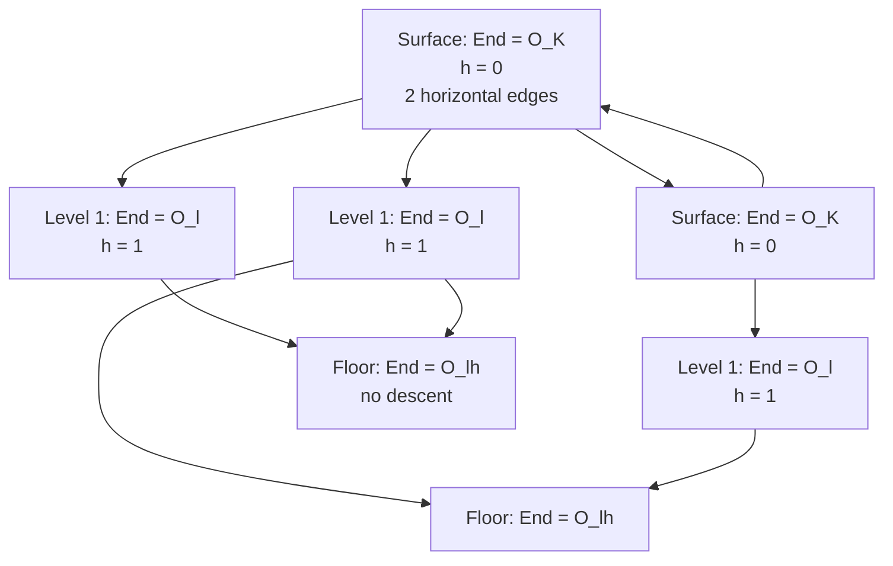

> **Prerequisites**: [[04-endomorphism-rings|04. Endomorphism Rings & j-invariant]], [[05-frobenius-finite-fields|05. Frobenius & Curves over Finite Fields]], [[06-ordinary-supersingular|06. Ordinary vs Supersingular Elliptic Curves]]
> **Lesson type**: Math Component
>
> **Notation** (ký hiệu dùng mà không định nghĩa trong bài này):
> | Ký hiệu | Ý nghĩa |
> |---------|---------|
> | $G_\ell(q)$ | $\ell$-isogeny graph trên $\mathbb{F}_q$: đỉnh là j-invariants, cạnh là $\ell$-isogenies |
> | $\mathcal{O}_K$ | Ring of integers của imaginary quadratic field $K = \mathbb{Q}(\pi)$ |
> | $\mathcal{O}_f$ | Order conductor $f$ trong $K$: $\mathcal{O}_f = \mathbb{Z} + f\mathcal{O}_K$ |
> | $\text{Ell}(\mathcal{O})$ | Tập j-invariants của curves với $\text{End}(E) \cong \mathcal{O}$ |
> | $h(\mathcal{O})$ | Class number của order $\mathcal{O}$ |
> | $\Phi_\ell(X, Y)$ | Modular polynomial bậc $\ell$: $j(E')$ là nghiệm của $\Phi_\ell(X, j(E)) = 0$ |

---

## Isogeny Graph — Không gian Hành động của Mật mã Isogeny

Thay vì nhìn một đường cong đơn lẻ, ta hãy nhìn toàn bộ **không gian** các j-invariants cùng với tất cả $\ell$-isogenies giữa chúng. Đồ thị này — **isogeny graph** — là đối tượng trung tâm của toàn bộ isogeny-based cryptography.

Có hai loại đồ thị với cấu trúc hoàn toàn khác nhau:
- **Ordinary isogeny graph**: cấu trúc **volcano** — phân tầng theo endomorphism ring, có đỉnh và sàn, giống ngọn núi lửa địa chất.
- **Supersingular isogeny graph**: cấu trúc **Ramanujan expander** — đồng đều, high connectivity, random walk trộn nhanh.

---

## 1. Định nghĩa Isogeny Graph

> [!note] Định nghĩa 7.1 — $\ell$-Isogeny Graph
> Cho số nguyên tố $\ell \neq p$ và trường $\mathbb{F}_q$. **$\ell$-isogeny graph** $G_\ell(\mathbb{F}_q)$ là đồ thị có hướng:
>
> - **Đỉnh**: tập tất cả j-invariants $j \in \mathbb{F}_q$ (mỗi j-invariant đại diện cho một isomorphism class)
> - **Cạnh**: cạnh có hướng từ $j_1$ đến $j_2$ nếu tồn tại một cyclic separable isogeny $\phi: E_1 \to E_2$ degree $\ell$ defined over $\mathbb{F}_q$ với $j(E_1) = j_1$, $j(E_2) = j_2$

Từ Hệ quả 2.5, mỗi đỉnh (j-invariant generic) có đúng $\ell + 1$ cạnh đi ra (vì $E[\ell] \cong (\mathbb{Z}/\ell\mathbb{Z})^2$ có $\ell + 1$ subgroup cyclic bậc $\ell$). Khi tính trên $\mathbb{F}_q$ thay vì $\bar{\mathbb{F}}_q$, số cạnh $\mathbb{F}_q$-rational có thể ít hơn.

**Modular polynomial**: Roots của $\Phi_\ell(X, j(E)) = 0$ chính xác là các j-invariants của các đường cong $\ell$-isogenous với $E$.

---

## 2. Ordinary Isogeny Graph — Cấu trúc Volcano

### 2.1. Phân tầng theo Endomorphism Ring

Cho $E/\mathbb{F}_q$ ordinary với $\text{End}(E) \cong \mathcal{O}_f = \mathbb{Z} + f\mathcal{O}_K$ (conductor $f$). Định nghĩa **độ cao** (height/level) của $E$ trong volcano:

$$
\text{height}(E) = v_\ell(f) = \text{số mũ của } \ell \text{ trong phân tích của } f
$$

Trong đó $v_\ell(f)$ là $\ell$-adic valuation của conductor $f$.

> [!abstract] Định lý 7.2 — Cấu trúc Volcano (Kohel 1996, Fouquet-Morain 2002)
> Cho $E/\mathbb{F}_q$ ordinary với $K = \mathbb{Q}(\pi_q)$ và $\ell$ nguyên tố với $\ell \nmid \text{disc}(K)$. Trong $\ell$-isogeny graph:
>
> **(a) Tại mỗi đỉnh $E$** với $\text{End}(E) \cong \mathcal{O}_f$, trong số $\ell+1$ isogenies degree $\ell$ đi ra:
> - Đúng **1 isogeny ascending** (đi lên tầng trên, tức codomain có conductor $f/\ell$) — trừ khi $E$ đã ở surface
> - Đúng **1 isogeny horizontal** nếu $\ell$ **split** trong $\mathcal{O}_K$ (codomain có conductor $f$, cùng order)
> - Còn lại là **isogenies descending** (đi xuống, codomain có conductor $f\ell$)
>
> **(b) Surface** (tầng trên cùng): curves với $\text{End}(E) \supseteq \mathcal{O}_K$ (conductor $f$ không chia hết bởi $\ell$). Tại đây có:
> - 2 horizontal isogenies nếu $\ell$ **split** trong $\mathcal{O}_K$
> - 0 horizontal nếu $\ell$ **inert**
> - 1 horizontal nếu $\ell$ **ramified**
>
> **(c) Floor** (tầng dưới cùng): curves ở mức thấp nhất, không có descending isogeny. Nếu volcano có chiều cao $h$, floor ở level $h$.

### 2.2. Hình dạng Volcano

Volcano $\ell$-isogenies của một ordinary isogeny class trông như sau:



**Giải thích**: surface (mặt trên) là một cycle của các j-invariants với $\text{End} = \mathcal{O}_K$ (maximal order); từ mỗi đỉnh surface có $\ell$ descending edges đi xuống; ở mỗi tầng dưới có 1 ascending và $\ell - 1$ (hoặc $\ell$) descending; floor là những đỉnh không có edge xuống nữa.

> [!info] Kích thước của Volcano
>
> - **Crater** (chu vi surface): $h(\mathcal{O}_K)$ đỉnh — số j-invariants với endomorphism ring $\mathcal{O}_K$
> - **Chiều cao**: $v_\ell(f_{\min})$ — $\ell$-adic valuation của conductor nhỏ nhất trong isogeny class
> - **Bề rộng tại level $k$**: $h(\mathcal{O}_{\ell^k}) = h(\mathcal{O}_K) \cdot \ell^{k-1}(\ell - 1)$ đỉnh (với $\ell$ split và $k \geq 1$)
> - **Tổng số đỉnh** trong một volcano: $h(\mathcal{O}_K) \cdot (1 + \ell + \ell^2 + \ldots + \ell^h) = h(\mathcal{O}_K) \cdot \frac{\ell^{h+1} - 1}{\ell - 1}$

### 2.3. Ba Loại Isogeny trong Volcano

| Loại | Thay đổi End(E) | Hướng | Điều kiện |
|------|----------------|-------|-----------|
| **Horizontal** | Không đổi (cùng order $\mathcal{O}_f$) | Ngang | $\ell$ split trong $\mathcal{O}_K$ |
| **Ascending** | Conductor $f \to f/\ell$ (lên tầng cao hơn) | Lên | Luôn có, trừ khi đã ở surface |
| **Descending** | Conductor $f \to f\ell$ (xuống tầng thấp hơn) | Xuống | Từ surface: $\ell$ đường, từ các tầng khác: $\ell - 1$ đường |

---

## 3. Supersingular Isogeny Graph — Ramanujan Expander

### 3.1. Cấu trúc Đồng đều

Trên supersingular isogeny graph, không có tầng lớp — mọi đỉnh **đều nhau**:

> [!abstract] Định lý 7.3 — Supersingular Isogeny Graph là $(\ell+1)$-Regular
> Cho $p > 3$ và $\ell \neq p$ nguyên tố. $\ell$-isogeny graph của các supersingular curves trên $\overline{\mathbb{F}}_p$ (với đỉnh là j-invariants) là đồ thị **$(\ell+1)$-regular**: mỗi đỉnh có đúng $\ell + 1$ cạnh ra và $\ell + 1$ cạnh vào (kể cả cạnh đặc biệt tại $j = 0$ và $j = 1728$).
>
> Số đỉnh là $N_{\text{ss}}(p) \approx p/12$.

**Proof sketch.** Vì mọi $E$ supersingular đều có $j(E) \in \mathbb{F}_{p^2}$ và $E[\ell] \cong (\mathbb{Z}/\ell\mathbb{Z})^2$ (với $\ell \neq p$), có đúng $\ell + 1$ subgroup cyclic bậc $\ell$, mỗi cái cho một $\ell$-isogeny. Tất cả codomain cũng supersingular (vì supersingularity là isogeny invariant theo Định lý 14.1 của Sutherland). $\blacksquare$

### 3.2. Ramanujan Property

Tính chất spectral của đồ thị quyết định tốc độ trộn của random walk:

> [!abstract] Định lý 7.4 — Supersingular Isogeny Graph là Ramanujan
> $\ell$-isogeny graph supersingular là một **Ramanujan graph**: second largest eigenvalue của adjacency matrix thỏa:
>
> $$
> |\lambda_2| \leq 2\sqrt{\ell}
> $$
>
> Đây là giới hạn tối ưu (Alon-Boppana bound) cho $(\ell+1)$-regular graphs.

**Tại sao Ramanujan quan trọng?** Ramanujan graphs là **optimal expanders**: random walk trên đồ thị trộn đều trong $O(\log N)$ bước, với $N$ là số đỉnh. Điều này có hai hệ quả mật mã:

1. **Bảo mật**: Không có đặc điểm cấu trúc để khai thác — bài toán tìm đường đi isogeny là khó.
2. **Hash function**: Charles-Lauter-Goren (2009) đề xuất dùng random walk trên supersingular isogeny graph làm cryptographic hash function — collision resistance dựa trên khó tìm đường đi.

---

## 4. So sánh Hai Loại Graph

| Tính chất | Ordinary Volcano | Supersingular Expander |
|-----------|-----------------|----------------------|
| Cấu trúc | Phân tầng (tầng lớp theo conductor) | Đồng đều ($(\ell+1)$-regular) |
| Số đỉnh | $\sum h(\mathcal{O}_{\ell^k})$ (trong 1 isogeny class) | $\approx p/12$ |
| Tính chất phổ | Asymmetric, có eigenvalue lớn | Ramanujan ($|\lambda_2| \leq 2\sqrt\ell$) |
| Random walk | Không trộn đều (ảnh hưởng cấu trúc tầng) | Trộn đều trong $O(\log N)$ bước |
| Tính có hướng | Ascending/descending/horizontal rõ ràng | Về cơ bản undirected (dual isogeny đi ngược) |
| Ứng dụng | CSIDH (horizontal walk), tính End(E) | SIDH, SQISign, hash function |

---

## 5. Modular Polynomial và Cách Đi Trên Graph

Cạnh trong isogeny graph được tính tường minh qua **modular polynomial** $\Phi_\ell(X, Y) \in \mathbb{Z}[X, Y]$:

> [!note] Định nghĩa 7.5 — Modular Polynomial
> **Modular polynomial** $\Phi_\ell(X, Y)$ là đa thức đối xứng trong $X, Y$ sao cho: với j-invariant $j_0$, các nghiệm của $\Phi_\ell(X, j_0) = 0$ chính xác là các j-invariants của các đường cong $\ell$-isogenous với $E$ (curve có $j(E) = j_0$).
>
> $\Phi_\ell$ có degree $\ell + 1$ trong $X$ (và $Y$), phản ánh đúng $\ell + 1$ isogenies.
>
> [!example] Ví dụ 7.6 — $\Phi_2(X, Y)$
>
> $$
> \Phi_2(X, Y) = X^3 - X^2(Y^2 - 1488Y + 162000) + \ldots
> $$
>
> Đây là đa thức degree 3 trong $X$ (và đối xứng trong $X, Y$) — phản ánh đúng $2 + 1 = 3$ đường cong 2-isogenous với mỗi $E$.

**Cách đi trên isogeny graph** (không dùng Vélu): Bắt đầu từ $j_0$, tính các nghiệm của $\Phi_\ell(X, j_0)$ trong $\mathbb{F}_q$ — đây là j-invariants của tất cả $\ell$-isogenous neighbors. Không cần biết tường minh isogeny, chỉ cần biết đích.

---

## 6. Ordinary Graph — Ứng dụng: Tính Endomorphism Ring (Kohel)

Một ứng dụng quan trọng của cấu trúc volcano là **Kohel's algorithm** để xác định $\text{End}(E)$:

> [!note] Algorithm 7.7 — Kohel's Algorithm (sketch)
>
> **Input**: $E/\mathbb{F}_q$ ordinary, trace $t$, số nguyên tố $\ell$
>
> **Goal**: Xác định $v_\ell(f)$ — $\ell$-adic valuation của conductor $f$ của $\text{End}(E)$
>
> 1. Tính $K = \mathbb{Q}(\sqrt{t^2 - 4q})$ — imaginary quadratic field
> 2. Từ $j(E)$, tính các $j$-neighbors qua $\Phi_\ell(X, j(E))$
> 3. **Detect ascending vs descending**: một $\ell$-isogeny $\phi: E \to E'$ là ascending nếu $\#\ker([p] \text{ trên } E') < \ell^2$; descending nếu ngược lại
> 4. Đếm số descending isogenies → xác định level trong volcano → xác định $v_\ell(f)$

Biết $v_\ell(f)$ cho mọi prime $\ell$ là biết hoàn toàn conductor $f$, suy ra $\text{End}(E) = \mathcal{O}_f$.

---

## 7. Supersingular Graph — Ứng dụng: Bài toán Isogeny

Bài toán cốt lõi trong isogeny-based crypto là **path-finding** trên supersingular isogeny graph:

> [!note] Định nghĩa 7.8 — Supersingular Isogeny Problem
>
> **Input**: Hai j-invariants supersingular $j_1, j_2 \in \mathbb{F}_{p^2}$
>
> **Goal**: Tìm một chuỗi isogenies $E_1 \xrightarrow{\phi_1} \cdots \xrightarrow{\phi_n} E_n$ với $j(E_1) = j_1$, $j(E_n) = j_2$

Độ khó của bài toán này phụ thuộc vào cấu trúc Ramanujan: không có "shortcut" qua các đặc điểm cấu trúc. Thuật toán tốt nhất hiện tại là **meet-in-the-middle BFS** với độ phức tạp $O(p^{1/2})$ bước và $O(p^{1/2})$ bộ nhớ.

> [!warning] Phân biệt: Isogeny path problem vs Endomorphism ring problem
>
> Hai bài toán này về lý thuyết có thể tương đương nhau (Wesolowski 2022 chứng minh reduction theo một chiều), nhưng trong thực hành SIDH bị phá bởi Castryck-Decru vì lý do khác — thông tin về **torsion points** được tiết lộ quá nhiều, không phải vì graph path-finding dễ. Sẽ phân tích ở Lesson 12.

---

## 8. SageMath — Xây dựng Isogeny Graph

```python
p = 107
F = GF(p)

ss_j = []
for j in F:
    try:
        E = EllipticCurve_from_j(j)
        if E.is_supersingular():
            ss_j.append(j)
    except:
        pass
print(f"Supersingular j-invariants mod {p}: {ss_j}")
print(f"Count: {len(ss_j)}, expected ~{p//12}")
```

```python
p = 107
ell = 2
R.<X, Y> = GF(p)[]

Phi = ClassicalModularPolynomialDatabase()[ell]
Phi_p = R(Phi)

for j0 in [GF(p)(0), GF(p)(1728)]:
    Phi_j0 = Phi_p(X, j0)
    neighbors = Phi_j0.univariate_polynomial().roots()
    print(f"2-isogeny neighbors of j={j0}: {[r for r,_ in neighbors]}")
```

```python
p = 431
F = GF(p)
E = EllipticCurve(F, [1, 0])
t = p + 1 - E.order()

K = QuadraticField(t**2 - 4*p, 'sqrt_D')
print(f"CM field K = Q(sqrt({t**2 - 4*p}))")
print(f"Frobenius order Z[pi]: discriminant = {t**2 - 4*p}")

phi = E.isogeny(E.lift_x(F(0)))
E2 = phi.codomain()
t2 = p + 1 - E2.order()
print(f"After 2-isogeny: t stays {t2} (isogeny preserves trace)")
```

> [!tip] Pattern trong CTF — Walking on Isogeny Graph
> Bài CTF isogeny thường yêu cầu tìm chuỗi isogenies từ $E_0$ đến $E_n$. Pattern cơ bản:
> ```python
> E_current = E0
> path = [E0.j_invariant()]
> for step in range(n_steps):
>     phi = E_current.isogeny(some_kernel_point)
>     E_current = phi.codomain()
>     path.append(E_current.j_invariant())
> ```
> Trên supersingular graph: không có cấu trúc để exploit — brute force hoặc dùng endomorphisms đã biết.

---

## Tóm tắt

- **Ordinary volcano**: phân tầng theo conductor của endomorphism ring; surface là cycle của curves với maximal order; chiều cao $h = v_\ell(f)$; mỗi đỉnh có 1 ascending, horizontal (nếu $\ell$ split), và các descending isogenies.
- **Supersingular expander**: $(\ell+1)$-regular, $N_{\text{ss}}(p) \approx p/12$ đỉnh; Ramanujan graph với $|\lambda_2| \leq 2\sqrt\ell$; random walk trộn trong $O(\log N)$ bước.
- **Modular polynomial** $\Phi_\ell$: tính neighbors trong graph không cần biết tường minh isogeny.
- **Path-finding** trên supersingular graph là bài toán hard cốt lõi của SIDH và SQISign.
- **Kohel's algorithm** dùng cấu trúc volcano để tính $\text{End}(E)$ của ordinary curves.

---

## References

- Kohel, D. — *Endomorphism Rings of Elliptic Curves over Finite Fields*, PhD thesis, UC Berkeley, 1996
- Fouquet, M., Morain, F. — *Isogeny Volcanoes and the SEA Algorithm*, ANTS-V, 2002
- De Feo, L. — *Isogeny Graphs in Cryptography*, Würzburg lecture notes, 2019 (defeo.lu/wurzburg)
- Sutherland, A. — *18.783 Elliptic Curves*, Lectures 17–18 (MIT OCW, 2025)
- Charles, Lauter, Goren — *Cryptographic Hash Functions from Expander Graphs*, J. Cryptol., 2009
