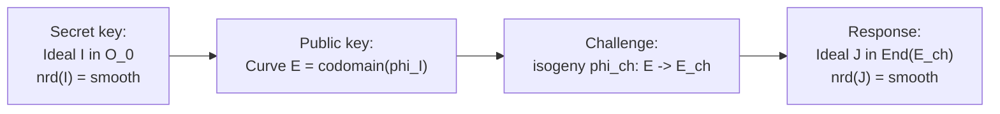

> **Prerequisites**: [[06-ordinary-supersingular|06. Ordinary vs Supersingular]], [[07-isogeny-graphs|07. Isogeny Graphs]], [[08-quadratic-orders-ideal-class|08. Imaginary Quadratic Orders & Ideal Class Groups]]
> **Lesson type**: Math Component
>
> **Notation** (ký hiệu dùng mà không định nghĩa trong bài này):
> | Ký hiệu | Ý nghĩa |
> |---------|---------|
> | $B_{p,\infty}$ | Quaternion algebra ramified tại $p$ và $\infty$ |
> | $\mathcal{O}_0$ | Maximal order cố định trong $B_{p,\infty}$, với $E_0$ là đường cong cơ sở |
> | $I, J$ | Left/right ideals trong maximal order $\mathcal{O}_0$ |
> | $\text{nrd}(I)$ | Reduced norm của ideal $I$ |
> | $O_L(I), O_R(I)$ | Left order và right order của ideal $I$ |
> | $E_0[I]$ | Kernel tương ứng với ideal $I$: $\bigcap_{\alpha \in I} \ker(\alpha)$ |
> | $\phi_I$ | Isogeny tương ứng với ideal $I$: $E_0 \to E_0/E_0[I]$ |

---

## Ngôn ngữ Thứ ba — Vượt qua Giới hạn của Elliptic Curves

Lesson 08 đã xây dựng class group action trên ordinary curves. Với supersingular curves, có một ngôn ngữ mạnh hơn: **Deuring correspondence** (1941) — một đẳng cấu phạm trù (categorical equivalence) giữa hai thế giới hoàn toàn khác nhau:

$$
\text{Supersingular elliptic curves} \quad \longleftrightarrow \quad \text{Maximal orders trong } B_{p,\infty}
$$

Và quan trọng hơn, dưới đẳng cấu này:

$$
\text{Isogenies giữa curves} \quad \longleftrightarrow \quad \text{Ideals trong maximal orders}
$$

Đây là công cụ toán học làm cho SQISign hoạt động: thay vì tìm isogeny trực tiếp (khó về mặt hình học), ta giải bài toán ideal-finding trong quaternion algebra (tractable hơn về mặt đại số), rồi dịch ngược về isogeny.

---

## 1. Quaternion Algebra $B_{p,\infty}$

> [!note] Định nghĩa 9.1 — Quaternion Algebra $B_{p,\infty}$
> Cho prime $p > 3$. **Definite quaternion algebra ramified at $p$ and $\infty$** là $\mathbb{Q}$-algebra:
>
> $$
> B_{p,\infty} = \mathbb{Q} \oplus \mathbb{Q} i \oplus \mathbb{Q} j \oplus \mathbb{Q} k
> $$
>
> với quan hệ nhân: $i^2 = -q$, $j^2 = -p$, $ij = -ji = k$ (với $q$ là một số nguyên không phải bình phương modulo $p$, thường $q = 1$ nếu $p \equiv 3 \pmod 4$).
>
> Phần tử tổng quát: $\alpha = x + yi + zj + wk$ với $x, y, z, w \in \mathbb{Q}$.
>
> **Conjugate**: $\bar\alpha = x - yi - zj - wk$.
>
> **Reduced norm**: $\text{nrd}(\alpha) = \alpha\bar\alpha = x^2 + qy^2 + pz^2 + pqw^2 \in \mathbb{Q}$.
>
> **Reduced trace**: $\text{trd}(\alpha) = \alpha + \bar\alpha = 2x \in \mathbb{Q}$.

$B_{p,\infty}$ là **definite** (norm form positive definite trên $\mathbb{Q}$) và là duy nhất đến isomorphism cho mỗi $p$.

> [!note] Định nghĩa 9.2 — Maximal Order
> Một **maximal order** $\mathcal{O} \subset B_{p,\infty}$ là subring $\mathcal{O}$ là $\mathbb{Z}$-module free rank 4, và không có subring lớn hơn với tính chất đó.
>
> Ví dụ: $\mathcal{O}_0 = \mathbb{Z} + \mathbb{Z}i + \mathbb{Z}\frac{1+j}{2} + \mathbb{Z}\frac{i(1+j)}{2}$ (với $p \equiv 3 \pmod 4$, $q = 1$).

---

## 2. Phát biểu Deuring Correspondence

> [!abstract] Định lý 9.3 — Deuring Correspondence (1941, phiên bản hiện đại)
> Cho prime $p > 3$ và $B_{p,\infty}$ như trên. Cố định một maximal order $\mathcal{O}_0 \subset B_{p,\infty}$ và một supersingular curve $E_0/\mathbb{F}_{p^2}$ với $\text{End}(E_0) \cong \mathcal{O}_0$.
>
> **(a) Bijectional — Curves ↔ Orders:**
>
> Tồn tại bijection (tự nhiên):
>
> $$
> \left\{\begin{array}{c} \text{Isomorphism classes của} \\ \text{supersingular curves trên } \overline{\mathbb{F}}_p \end{array}\right\} \longleftrightarrow \left\{\begin{array}{c} \text{Right ideal classes của } \mathcal{O}_0 \\ = \text{Left class set of } \mathcal{O}_0 \end{array}\right\}
> $$
>
> **(b) Bijectional — Isogenies ↔ Ideals:**
>
> Tồn tại bijection (đến isomorphism):
>
> $$
> \left\{\begin{array}{c} \text{Isogenies } \phi: E_0 \to E \\ \text{(up to isomorphism of } E) \end{array}\right\} \longleftrightarrow \left\{\begin{array}{c} \text{Left } \mathcal{O}_0\text{-ideals } I \\ \text{với } O_L(I) = \mathcal{O}_0 \end{array}\right\}
>
> $$
>
> Cụ thể: ideal $I$ tương ứng với isogeny $\phi_I: E_0 \to E_0/E_0[I]$ với kernel:
>
> $$
> E_0[I] = \bigcap_{\alpha \in I} \ker(\alpha: E_0 \to E_0)
> $$

Đây là phiên bản "constructive Deuring correspondence" — từ ideal ta tính được isogeny tường minh.

---

## 3. Bảng Dịch thuật Đầy đủ

Deuring correspondence dịch mọi khái niệm isogeny sang ngôn ngữ ideal, và ngược lại:

| Thế giới Elliptic Curves | Thế giới Quaternion |
|--------------------------|---------------------|
| Supersingular curve $E$ | Maximal order $\text{End}(E) \cong \mathcal{O}$ |
| Isogeny $\phi: E_0 \to E$ | Left $\mathcal{O}_0$-ideal $I$ với $O_L(I) = \mathcal{O}_0$ |
| Degree $\deg \phi = n$ | Reduced norm $\text{nrd}(I) = n$ |
| Dual isogeny $\hat\phi: E \to E_0$ | Conjugate ideal $\bar I$ (norm $n$) |
| Composition $\psi \circ \phi$ | Ideal product $J \cdot I$ |
| $\text{End}(E)$ của codomain | Right order $O_R(I)$ của $I$ |
| Endomorphism $\alpha \in \text{End}(E_0)$ | Principal ideal $\alpha \mathcal{O}_0$ |
| $E_0[\phi^{-1}]$ | Ideal $\bar I$ (dual direction) |
| Isomorphism $E \cong E'$ | Hai ideals trong cùng class: $I' = \alpha I$ |

---

## 4. Ideal-to-Isogeny: Chiều Khó

Cho ideal $I$, tính isogeny $\phi_I$ là bài toán cốt lõi của SQISign:

> [!note] Algorithm 9.4 — Ideal-to-Isogeny (phác thảo)
>
> **Input**: Maximal order $\mathcal{O}_0$, ideal $I$ với $O_L(I) = \mathcal{O}_0$, $\text{nrd}(I) = n$
>
> **Goal**: Tính isogeny $\phi_I: E_0 \to E$ degree $n$
>
> **Trường hợp $n = \ell$ (prime):**
>
> 1. Tìm generators của $E_0[\ell]$ (torsion points bậc $\ell$)
> 2. Tìm điểm $P \in E_0[\ell]$ sao cho $\alpha(P) = \mathcal{O}_{E_0}$ với mọi $\alpha \in I$ — đây là generator của $\ker\phi_I = E_0[I]$
> 3. Dùng Vélu's formulas để tính $\phi_I$ từ $\ker\phi_I = \langle P \rangle$
>
> **Trường hợp $n = \ell^e$ (prime power):** Phân tích $I = I_1 \cdot I_2 \cdots I_e$ thành tích các ideals norm $\ell$, rồi compose $e$ isogenies degree $\ell$.
>
> **Trường hợp $n$ smooth:** Phân tích $n = \ell_1^{e_1} \cdots \ell_k^{e_k}$, phân tích $I$ theo và compose.

Đây là lý do SQISign cần $n$ phải **smooth** (có nhiều nhân tố nguyên tố nhỏ).

---

## 5. Isogeny-to-Ideal: Chiều Dễ hơn

Chiều ngược — từ isogeny tính ideal — dễ hơn:

> [!note] Algorithm 9.5 — Isogeny-to-Ideal
>
> **Input**: Isogeny $\phi: E_0 \to E$ degree $n$
>
> **Output**: Left $\mathcal{O}_0$-ideal $I$ với $\text{nrd}(I) = n$
>
> Với mỗi $\alpha \in \mathcal{O}_0 = \text{End}(E_0)$, kiểm tra liệu $\alpha \in \ker(\phi_* : \text{End}(E_0) \to \text{Hom}(E_0, E))$. Tập này là một left ideal của $\mathcal{O}_0$ có norm $n$.
>
> Cụ thể: $I = \{\alpha \in \mathcal{O}_0 \mid \phi \circ \alpha = 0 \text{ trên } E_0[n]\}$.

---

## 6. Deuring Lifting Theorem

Một kết quả mạnh của Deuring là tính chất "lifting" — mối quan hệ giữa curves trên $\mathbb{C}$ và trên $\mathbb{F}_{p^2}$:

> [!abstract] Định lý 9.6 — Deuring Lifting Theorem
> Cho $E_0/\mathbb{F}_{p^2}$ supersingular và $\iota: \mathcal{O} \hookrightarrow \text{End}(E_0)$ là embedding của imaginary quadratic order $\mathcal{O}$. Thì tồn tại đường cong $\tilde{E}/\mathbb{C}$ (hay trên một ring $p$-adic) với $\text{End}(\tilde{E}) \cong \mathcal{O}$ mà reduce modulo $p$ cho $E_0$.
>
> Ngược lại, với mọi embedding $\iota: K \hookrightarrow B_{p,\infty}$ của imaginary quadratic field $K$ và maximal order $\mathcal{O}$ trong $K$, tồn tại supersingular curve $E/\mathbb{F}_{p^2}$ với embedding $\mathcal{O} \hookrightarrow \text{End}(E)$.

Đây là căn cứ lý thuyết cho **orientations** — khái niệm hiện đại của "equipped với embedding từ imaginary quadratic order".

---

## 7. Oriented Curves và CSIDH

> [!note] Định nghĩa 9.7 — Oriented Supersingular Curve
> Một **$\mathcal{O}$-oriented supersingular curve** là cặp $(E, \iota)$ với $E$ supersingular và $\iota: \mathcal{O} \hookrightarrow \text{End}(E)$ là embedding of orders.

Orientation cho phép chọn một "sub-action" abelian của $\text{cl}(\mathcal{O})$ bên trong full quaternion endomorphism ring. Đây là nền tảng lý thuyết thống nhất:

- **CSIDH**: dùng $\mathcal{O} = \mathbb{Z}[\sqrt{-p}]$ orientation qua Frobenius $\pi_p$ thỏa $\pi_p^2 + p = 0$
- **OSIDH**: orientation tổng quát hơn
- **SQISign**: dùng full quaternion structure, không cần orientation cố định

---

## 8. Ứng dụng trong SQISign — Preview

Deuring correspondence là xương sống của SQISign. Scheme hoạt động như sau (phác thảo):



Cụ thể: signing dùng KLPT algorithm để tìm ideal $J$ trong maximal order của $E_{\text{ch}}$ với norm smooth, rồi dùng ideal-to-isogeny để tính isogeny tương ứng. Verifier kiểm tra isogeny.

Bảo mật dựa trên: **không thể tìm ideal $I$ từ curve $E$** (endomorphism ring problem) — bài toán được giả định khó, tương đương với supersingular path-finding.

---

## 9. Tại sao Quaternion? So sánh với Ordinary Case

Điểm khác biệt cốt lõi giữa ordinary (CSIDH) và supersingular (SQISign):

| | Ordinary / CSIDH | Supersingular / SQISign |
|-|-----------------|------------------------|
| **Ring tác động** | Imaginary quadratic order $\mathcal{O}$ (commutative) | Maximal order $\mathcal{O}_0$ trong $B_{p,\infty}$ (non-commutative) |
| **Group action** | $\text{cl}(\mathcal{O})$ abelian — dùng thoải mái | Không có abelian group action tự nhiên |
| **Security foundation** | Vectorization (tìm ideal từ pair curves) | Endomorphism ring problem |
| **Key size** | Nhỏ (j-invariant $\in \mathbb{F}_p$) | Nhỏ hơn nhiều (SQISign có signature $\approx 177$ bytes) |
| **Performance** | Nhanh hơn | Chậm hơn (vì ideal-to-isogeny phức tạp) |

---

## 10. SageMath — Quaternion Algebras

```python
p = 83
B = QuaternionAlgebra(-1, -p)
i, j, k = B.gens()

print(f"B = quaternion algebra over Q with i^2 = {i^2}, j^2 = {j^2}")
print(f"ij = {i*j}, ji = {j*i}")

alpha = 1 + 2*i + 3*j + 4*k
print(f"alpha = {alpha}")
print(f"nrd(alpha) = {alpha.reduced_norm()}")
print(f"trd(alpha) = {alpha.reduced_trace()}")
print(f"conjugate = {alpha.conjugate()}")
```

```python
p = 83
B = QuaternionAlgebra(-1, -p)
O0 = B.maximal_order()
print(f"Maximal order O_0 generators:")
for b in O0.basis():
    print(f"  {b}, nrd = {b.reduced_norm()}")

I = O0.right_ideal([O0(b) for b in O0.basis()])
print(f"nrd(I) = {I.norm()}")
```

```python
p = 83
F = GF(p**2, 'a')
E0 = EllipticCurve(F, [1, 0])

if E0.is_supersingular():
    print(f"E0 is supersingular: j = {E0.j_invariant()}")
    print(f"#E0(F_p^2) = {E0.order()}")
    print(f"Expected (p+1)^2 = {(p+1)**2}")
```

> [!tip] Pattern trong CTF — Deuring Correspondence
> Trong CTF challenges về SQISign hoặc isogeny với endomorphism rings, pattern thường gặp:
> 1. Cho `End(E)` (hoặc generators của nó) → xác định isogeny path đến một curve target
> 2. Cho ideal trong quaternion algebra → tính isogeny bằng kernel = `E[I]`
> 3. Key insight: `E[I] = intersection of ker(alpha) for alpha in I` — tìm generators của I có norm nhỏ để tính kernel

---

## Tóm tắt

- **$B_{p,\infty}$**: unique definite quaternion algebra ramified at $p$ và $\infty$; elements $\alpha = x + yi + zj + wk$ với $\text{nrd}(\alpha) = x^2 + qy^2 + pz^2 + pqw^2$.
- **Deuring correspondence**: bijection giữa supersingular j-invariants (trên $\overline{\mathbb{F}}_p$) và right ideal classes của $\mathcal{O}_0$; isogenies ↔ ideals, degree ↔ reduced norm.
- **Ideal-to-isogeny**: với $\text{nrd}(I)$ smooth, tính $\phi_I$ bằng cách phân tích $I$ thành prime-norm ideals rồi dùng Vélu từng bước.
- **Oriented curves**: embedding $\iota: \mathcal{O} \hookrightarrow \text{End}(E)$ từ imaginary quadratic order — nền tảng thống nhất CSIDH, OSIDH, và SQISign.
- **SQISign**: sử dụng full Deuring correspondence; signing = giải bài toán ideal trong quaternion algebra, rồi dịch về isogeny.

---

## References

- Deuring, M. — *Die Typen der Multiplikatorenringe elliptischer Funktionenkörper*, Hamburg, 1941
- Kohel, Lauter, Petit, Tignol — *On the Quaternion $\ell$-Isogeny Path Problem*, LMS J. Comput. Math., 2014
- Eisenträger, Hallgren, Lauter, Morrison, Petit — *Supersingular Isogeny Graphs and Endomorphism Rings*, EUROCRYPT 2018
- De Feo, Kohel, Leroux, Petit, Wesolowski — *SQISign: Compact Post-Quantum Signatures*, ASIACRYPT 2020, eprint.iacr.org/2020/1240
- Eriksen, Panny, Sotáková, Veroni — *Deuring for the People*, LuCaNT 2023, eprint.iacr.org/2023/106
- Voight, J. — *Quaternion Algebras*, Springer GTM, 2021 (giáo trình đầy đủ nhất về quaternion algebras)
