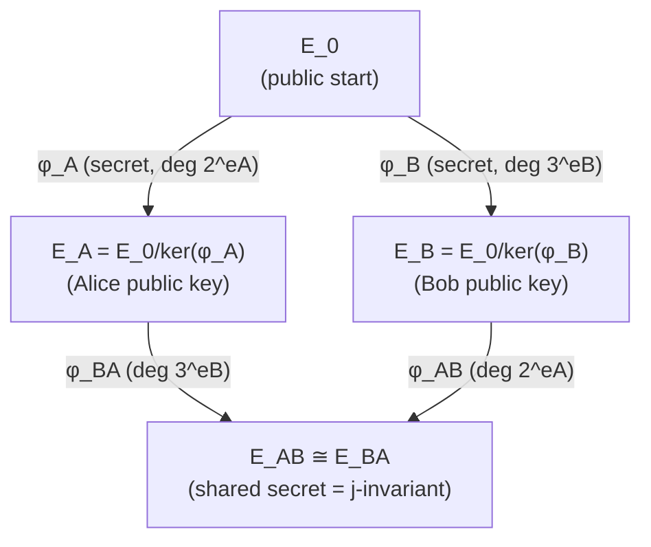

> **Prerequisites**: [[06-ordinary-supersingular|06. Ordinary vs Supersingular]], [[03-velu-formulas|03. Vélu's Formulas]], [[02-dual-isogeny-torsion|02. Dual Isogeny & Torsion Subgroups]]
> **Lesson type**: Scheme
>
> **Notation** (ký hiệu dùng mà không định nghĩa trong bài này):
> | Ký hiệu | Ý nghĩa |
> |---------|---------|
> | $p = 2^{e_A} 3^{e_B} f - 1$ | Prime đặc trưng, $2^{e_A} \approx 3^{e_B}$, $f$ là cofactor nhỏ |
> | $E_0/\mathbb{F}_{p^2}$ | Đường cong cơ sở supersingular |
> | $P_A, Q_A$ | Basis of $E_0[2^{e_A}]$: hai điểm độc lập bậc $2^{e_A}$ |
> | $P_B, Q_B$ | Basis of $E_0[3^{e_B}]$: hai điểm độc lập bậc $3^{e_B}$ |
> | $k_A \in \mathbb{Z}/2^{e_A}\mathbb{Z}$ | Secret key của Alice |
> | $\phi_A: E_0 \to E_A$ | Secret isogeny của Alice, $\ker\phi_A = \langle P_A + k_A Q_A \rangle$ |

---

## Motivation: Vượt qua Rào cản Non-Commutativity

CSIDH (Lesson 10) dựa trên **commutativity** của class group — chỉ hoạt động vì ideal class group abelian. Supersingular curves có endomorphism ring *non-commutative* (quaternion algebra), nên ta không thể dùng trực tiếp ngôn ngữ class group action.

Jao và De Feo (2011) đã giải quyết rào cản này bằng một ý tưởng khéo léo: **truyền thêm image của torsion points** để hai bên vẫn tính được cùng shared secret dù các isogenies không giao hoán. Kết quả là SIDH — scheme có bảo mật quantum tốt hơn CSIDH, nhưng sau đó bị phá vào năm 2022.

---

## 1. Mathematical Setting

> [!note] Mathematical Setting 11.1 — SIDH Parameters
>
> **Prime**: $p = 2^{e_A} \cdot 3^{e_B} \cdot f - 1$ với $2^{e_A} \approx 3^{e_B}$ và $f$ cofactor nhỏ.
>
> **Tại sao dạng này?** $\#E_0(\mathbb{F}_{p^2}) = (p+1)^2 = (2^{e_A} \cdot 3^{e_B} \cdot f)^2$, nên $2^{e_A}$ và $3^{e_B}$ đều chia $\#E_0(\mathbb{F}_{p^2})$. Điều này đảm bảo tồn tại đủ torsion points cần thiết trên $\mathbb{F}_{p^2}$.
>
> **Đường cong cơ sở**: $E_0/\mathbb{F}_{p^2}$, supersingular (thường là Montgomery curve $E_0: y^2 = x^3 + 6x^2 + x$).
>
> **Public torsion bases**:
> - $P_A, Q_A \in E_0(\mathbb{F}_{p^2})$ là basis của $E_0[2^{e_A}]$: hai điểm độc lập tuyến tính bậc $2^{e_A}$
> - $P_B, Q_B \in E_0(\mathbb{F}_{p^2})$ là basis của $E_0[3^{e_B}]$: tương tự bậc $3^{e_B}$

---

## 2. Scheme Definition

> [!note] Scheme 11.2 — SIDH Key Exchange
>
> **$\mathsf{Setup}$**: Prime $p$, curve $E_0$, bases $(P_A, Q_A, P_B, Q_B)$ — tất cả **công khai**.
>
> **$\mathsf{KeyGen}_A()$** — Alice:
> - Chọn secret $k_A \stackrel{R}{\leftarrow} \mathbb{Z}/2^{e_A}\mathbb{Z}$ (hoặc tương đương, chọn $S_A = P_A + k_A Q_A$)
> - Tính $\phi_A: E_0 \to E_A := E_0/\langle S_A \rangle$ (isogeny degree $2^{e_A}$ bằng chuỗi $e_A$ isogenies degree 2)
> - Tính images của torsion basis Bob: $\phi_A(P_B)$ và $\phi_A(Q_B)$
> - Output: $\mathsf{sk}_A = k_A$, $\mathsf{pk}_A = (E_A,\; \phi_A(P_B),\; \phi_A(Q_B))$
>
> **$\mathsf{KeyGen}_B()$** — Bob: tương tự với $3^{e_B}$ và bases $(P_B, Q_B)$:
> - Chọn $k_B \stackrel{R}{\leftarrow} \mathbb{Z}/3^{e_B}\mathbb{Z}$, $S_B = P_B + k_B Q_B$
> - Tính $\phi_B: E_0 \to E_B := E_0/\langle S_B \rangle$
> - Output: $\mathsf{pk}_B = (E_B,\; \phi_B(P_A),\; \phi_B(Q_A))$
>
> **$\mathsf{SharedSecret}(\mathsf{sk}_A, \mathsf{pk}_B)$** — Alice tính:
> - Từ $\phi_B(P_A)$ và $\phi_B(Q_A)$: recover $S_{AB} = \phi_B(P_A) + k_A \phi_B(Q_A) \in E_B$
> - Tính $\phi_{AB}: E_B \to E_{AB} := E_B/\langle S_{AB} \rangle$
> - Output: $j(E_{AB})$ — j-invariant là shared secret
>
> **$\mathsf{SharedSecret}(\mathsf{sk}_B, \mathsf{pk}_A)$** — Bob tính:
> - Recover $S_{BA} = \phi_A(P_B) + k_B \phi_A(Q_B) \in E_A$
> - Tính $\phi_{BA}: E_A \to E_{BA} := E_A/\langle S_{BA} \rangle$
> - Output: $j(E_{BA})$

---

## 3. Correctness

> [!abstract] Định lý 11.3 — Correctness của SIDH
> $j(E_{AB}) = j(E_{BA})$.

**Proof.** Ta cần chứng minh $E_{AB} \cong E_{BA}$.

Trước hết, $S_{AB} = \phi_B(P_A) + k_A \phi_B(Q_A) = \phi_B(P_A + k_A Q_A) = \phi_B(S_A)$.

Do đó $\phi_{AB}$ có kernel $\langle \phi_B(S_A) \rangle \subset E_B(\mathbb{F}_{p^2})$.

Xét sơ đồ:

$$
\begin{array}{ccc}
E_0 & \xrightarrow{\phi_A} & E_A \\
{\scriptstyle \phi_B}\downarrow & & \downarrow{\scriptstyle \phi_{BA}} \\
E_B & \xrightarrow{\phi_{AB}} & E_{AB}
\end{array}
$$

Tất cả bốn isogenies tạo thành sơ đồ giao hoán: $\phi_{BA} \circ \phi_A = \phi_{AB} \circ \phi_B$, vì cả hai composition đều có kernel $\langle S_A, S_B \rangle = E_0[2^{e_A}] \cap \ker(\phi_B \circ \phi_A^{-1})$...

Nói chính xác hơn: theo lý thuyết isogenies, hai isogenies $\psi_1 = \phi_{BA} \circ \phi_A$ và $\psi_2 = \phi_{AB} \circ \phi_B$ từ $E_0$ đều có cùng kernel $\langle S_A \rangle + \langle S_B \rangle$ (trên $\overline{\mathbb{F}}_{p^2}$), nên $\ker\psi_1 = \ker\psi_2$, suy ra hai curves codomain isomorphic: $E_{AB} \cong E_{BA}$. $\blacksquare$

---

## 4. Tại sao Phải Truyền Torsion Point Images?

Đây là điểm khác biệt cốt lõi giữa SIDH và CSIDH:

> [!info] Vấn đề Non-Commutativity và Cách Giải quyết
>
> Trong CSIDH, $[\mathfrak{a}]([\mathfrak{b}] \star E_0) = [\mathfrak{b}]([\mathfrak{a}] \star E_0)$ tự động vì $\text{cl}(\mathcal{O})$ abelian.
>
> Trong SIDH, $\text{End}(E_0) \cong \mathcal{O}_0$ là non-commutative. Alice và Bob không thể trực tiếp "swap" isogenies mà vẫn đến cùng curve.
>
> **Giải pháp**: Truyền thêm $\phi_A(P_B), \phi_A(Q_B)$ (hoặc $\phi_B(P_A), \phi_B(Q_A)$). Thông tin này cho phép mỗi bên tái tạo isogeny của bên kia **trên curve của mình** — biến diagram giao hoán mà không cần commutativity của endomorphism ring.
>
> **Cái giá phải trả**: Torsion point images này chính là thông tin bị khai thác trong **Castryck-Decru attack** (Lesson 12).

---

## 5. Diagram Giao hoán — Hình ảnh Trực quan



Alice đi theo cạnh trái rồi xuống; Bob đi theo cạnh trên rồi sang phải — cả hai gặp nhau tại $E_{AB}$.

---

## 6. Security Analysis

### 6.1. Hard Problem

> [!note] Định nghĩa 11.4 — SIDH Hard Problem (SSI-T Problem)
>
> **Supersingular Isogeny with Torsion (SSI-T)**: Cho $E_0$, $E_A$, $\phi_A(P_B)$, $\phi_A(Q_B)$, tìm isogeny $\phi_A: E_0 \to E_A$ (hoặc một isogeny đẳng cấu).
>
> Đây là bài toán *khó hơn* plain supersingular path-finding vì có thêm torsion point information — nhưng chính thông tin đó lại là điểm yếu bị Castryck-Decru khai thác.

### 6.2. Security Trước 2022

Trước Castryck-Decru attack (tháng 7/2022):
- Classical: $O(p^{1/4})$ — meet-in-the-middle trong isogeny graph
- Quantum: $O(p^{1/6})$ — Tani's quantum claw-finding

Với $p \approx 2^{752}$ (SIKE-p751): ~128-bit quantum security.

### 6.3. Castryck-Decru Attack — SIDH bị Phá

> [!danger] Tấn công 11.5 — Castryck-Decru Attack (EUROCRYPT 2023)
>
> Castryck và Decru (tháng 7/2022) chứng minh rằng biết $(E_A, \phi_A(P_B), \phi_A(Q_B))$ cho phép recover $\phi_A$ trong **thời gian đa thức** (polynomial time).
>
> **Hệ quả**: SIDH/SIKE **hoàn toàn bị phá**. NIST loại SIKE khỏi danh sách PQC standardization ngay sau đó.
>
> **Công cụ**: Kani's lemma về reducibility của isogenies trên products of elliptic curves, kết hợp với $(2,2)$-isogenies trên Jacobian of genus-2 curves.
>
> Sẽ phân tích kỹ ở Lesson 12.

---

## 7. So sánh CSIDH vs SIDH

| | CSIDH | SIDH |
|---|-------|------|
| **Torsion** | $\mathbb{F}_p$-rational, degree nhỏ | Hai loại torsion độc lập trên $\mathbb{F}_{p^2}$ |
| **Commutativity** | ✓ Group action abelian | ✗ Non-commutative; workaround qua torsion images |
| **Torsion leaked** | Không | **Có** — điểm yếu chí mạng |
| **Classical security** | $O(p^{1/4})$ | $O(p^{1/4})$ |
| **Quantum security** | Subexponential (Kuperberg) | Tốt hơn trước 2022, nhưng bị phá hoàn toàn |
| **Public key** | 64 bytes (CSIDH-512) | ~330 bytes (SIKE, compressed) |
| **Status** | Còn dùng (với lưu ý quantum) | **Bị phá** (2022) — không dùng |

---

## 8. SageMath — SIDH Proof of Concept

```python
p = 2**6 * 3**4 - 1
assert is_prime(p)
F = GF(p**2, 'i', modulus=x**2+1)
i = F.gen()

E0 = EllipticCurve(F, [1, 0])
assert E0.is_supersingular()

eA, eB = 6, 4
PA = (p**2 + 1) // 2**eA * E0.random_point()
QA = (p**2 + 1) // 2**eA * E0.random_point()
while PA.order() != 2**eA or QA.order() != 2**eA:
    PA = (p**2 + 1) // 2**eA * E0.random_point()
    QA = (p**2 + 1) // 2**eA * E0.random_point()

PB = (p**2 + 1) // 3**eB * E0.random_point()
QB = (p**2 + 1) // 3**eB * E0.random_point()

print("Torsion bases computed")
print(f"PA order: {PA.order()}, QA order: {QA.order()}")
print(f"PB order: {PB.order()}, QB order: {QB.order()}")
```

```python
import random

kA = random.randint(0, 2**eA - 1)
SA = PA + kA * QA

phiA = E0.isogeny(SA)
EA = phiA.codomain()
phiA_PB = phiA(PB)
phiA_QB = phiA(QB)
pkA = (EA, phiA_PB, phiA_QB)

kB = random.randint(0, 3**eB - 1)
SB = PB + kB * QB
phiB = E0.isogeny(SB)
EB = phiB.codomain()
phiB_PA = phiB(PA)
phiB_QA = phiB(QA)
pkB = (EB, phiB_PA, phiB_QA)

S_AB = phiB_PA + kA * phiB_QA
phiAB = EB.isogeny(S_AB)
EAB = phiAB.codomain()
shared_A = EAB.j_invariant()

S_BA = phiA_PB + kB * phiA_QB
phiBA = EA.isogeny(S_BA)
EBA = phiBA.codomain()
shared_B = EBA.j_invariant()

print(f"Shared (Alice): {shared_A}")
print(f"Shared (Bob):   {shared_B}")
print(f"Match: {shared_A == shared_B}")
```

> [!tip] Pattern trong CTF — SIDH
>
> Trong CTF SIDH challenges, thường gặp:
> 1. **Small parameters**: $p$ nhỏ → brute force secret key $k_A$
> 2. **Torsion point oracle**: biết thêm thông tin về isogeny → dùng Castryck-Decru (Lesson 12)
> 3. **Missing torsion images**: một số challenges cố tình không truyền torsion images → không bị Castryck-Decru, nhưng không verify được shared secret

---

## Tóm tắt

- SIDH dùng hai hệ torsion độc lập ($2^{e_A}$ và $3^{e_B}$) để xây dựng key exchange trên supersingular curves.
- **Scheme**: mỗi bên publish $(E, \phi(P'), \phi(Q'))$ — curve isogeny codomain cộng images của torsion basis đối phương.
- **Correctness**: diagram giao hoán $E_{AB} \cong E_{BA}$ — chứng minh bằng kernel equality.
- **Torsion images** là workaround cho non-commutativity, nhưng cũng là **điểm yếu chí mạng**.
- **Castryck-Decru (2022)**: phá SIDH trong polynomial time từ torsion images.
- SIDH đã là nền tảng của **SIKE** — candidate NIST PQC round 4 trước khi bị loại.

---

## References

- De Feo, L., Jao, D., Plût, J. — *Towards Quantum-Resistant Cryptosystems from Supersingular Elliptic Curve Isogenies*, PQCrypto 2011
- Costello, C. — *Supersingular Isogeny Key Exchange for Beginners*, eprint.iacr.org/2019/1321
- Jao et al. — *SIKE (Supersingular Isogeny Key Encapsulation)*, NIST PQC submission, 2017–2022 (sike.org)
- Castryck, W., Decru, T. — *An Efficient Key Recovery Attack on SIDH*, EUROCRYPT 2023, eprint.iacr.org/2022/975
