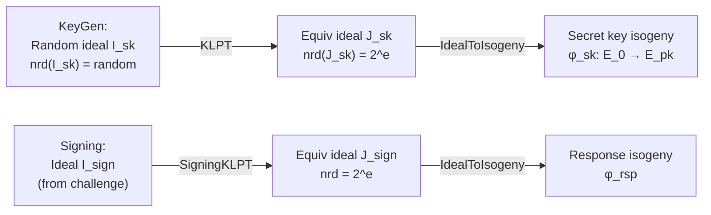

> **Prerequisites**: [[09-deuring-correspondence|09. Deuring Correspondence]], [[07-isogeny-graphs|07. Isogeny Graphs]]
> **Lesson type**: Deep Dive
>
> **Notation** (ký hiệu dùng mà không định nghĩa trong bài này):
> | Ký hiệu | Ý nghĩa |
> |---------|---------|
> | $\mathcal{O}_0$ | Special extremal maximal order trong $B_{p,\infty}$ — order cơ sở của SQISign |
> | $I, J$ | Left ideals trong maximal order; $I \sim J$ nếu $I = J\alpha$ với $\alpha \in B_{p,\infty}^*$ |
> | $\text{nrd}(I)$ | Reduced norm của ideal $I$ |
> | $\ell^e$ | Smooth norm — mục tiêu output của KLPT |
> | $O_L(I), O_R(I)$ | Left order và right order của $I$ |
> | $\text{StrongApprox}$ | Strong approximation step trong KLPT |

---

## KLPT — Cầu nối Quaternion và Isogeny

Lesson 09 giới thiệu Deuring correspondence: isogeny $\leftrightarrow$ ideal. Nhưng để *tính* isogeny trong thực tế, ta cần giải một bài toán quan trọng: **Cho ideal $I$ có norm tùy ý, tìm ideal $J \sim I$ (equivalent) với norm smooth** — tức $\text{nrd}(J) = \ell^e$ cho $\ell$ nhỏ.

Đây chính là bài toán KLPT giải (Kohel, Lauter, Petit, Tignol — ANTS 2014). KLPT là building block cốt lõi của SQISign: nó cho phép chuyển bất kỳ ideal nào thành ideal norm smooth, từ đó tính isogeny tương ứng bằng chuỗi Vélu steps.

---

## 1. Bài toán: Quaternion $\ell$-Isogeny Path Problem

> [!note] Định nghĩa 13.1 — Quaternion Path Problem
> **Input**: Hai maximal orders $\mathcal{O}_0, \mathcal{O}_1 \subset B_{p,\infty}$ (hoặc tương đương, một connecting ideal $I$ với $O_L(I) = \mathcal{O}_0$, $O_R(I) = \mathcal{O}_1$).
>
> **Goal**: Tìm left $\mathcal{O}_0$-ideal $J \sim I$ với $\text{nrd}(J) = \ell^e$ — **smooth norm** (power của số nguyên tố nhỏ).

Bài toán này là analog quaternion của bài toán tìm isogeny path — nhưng trong thế giới quaternion, nó **giải được trong polynomial time** (heuristic) nhờ cấu trúc đặc biệt của maximal orders.

---

## 2. Special Extremal Order — Điều kiện để KLPT Hoạt động

KLPT chỉ hoạt động hiệu quả khi $\mathcal{O}_0$ là **special extremal order** — order có cấu trúc đặc biệt:

> [!note] Định nghĩa 13.2 — Special Extremal Order
> Maximal order $\mathcal{O}_0 \subset B_{p,\infty}$ là **$p$-extremal** (hay special extremal) nếu tồn tại suborder $\mathbb{Z}[\omega_1, \omega_2] \subset \mathcal{O}_0$ sao cho:
> - $\text{nrd}(\omega_1) = q$ nhỏ (thường $q = 1$ hoặc $q$ nhỏ coprime với $p$)
> - $\text{nrd}(\omega_2) = p$
>
> Điều này cho phép giải **norm equations** trong $\mathcal{O}_0$ bằng thuật toán Cornacchia (tổng của hai bình phương).

Trong SQISign, đường cong cơ sở $E_0$ được chọn sao cho $\text{End}(E_0) \cong \mathcal{O}_0$ với $\mathcal{O}_0$ là special extremal. Đây là lý do KLPT hoạt động được trong SQISign.

---

## 3. KLPT Algorithm — Phát biểu và Cấu trúc

> [!note] Algorithm 13.3 — KLPT (phiên bản đơn giản hóa)
>
> **Input**: $\mathcal{O}_0$ special extremal, left $\mathcal{O}_0$-ideal $I$, target smoothness bound $T = \ell^e$
>
> **Output**: Left $\mathcal{O}_0$-ideal $J \sim I$ với $\text{nrd}(J) = \ell^e$
>
> **Bước 1 — Reduce to prime norm:**  
> Tìm $\alpha \in I$ sao cho $\text{nrd}(\alpha)/ \text{nrd}(I) = M$ là số nguyên tố ("equivalent prime norm ideal"):
> $$J' = I\bar\alpha / \text{nrd}(I) \quad\Rightarrow\quad \text{nrd}(J') = M
> $$
>
> **Bước 2 — Strong Approximation:**  
> Giải hệ congruences để tìm $\beta \in \mathcal{O}_0$ sao cho:
> - $\text{nrd}(\beta) = M \cdot \ell^e$ (điều kiện norm)
> - $\beta \equiv \gamma \pmod{M}$ với $\gamma$ nào đó đã biết (điều kiện congruence)
>
> Dùng **Cornacchia's algorithm** để giải norm equation $x^2 + qy^2 = M \cdot \ell^e$ trong $\mathbb{Z}$.
>
> **Bước 3 — Construct output:**
> $$J = J' \cdot \bar\beta / M \quad\Rightarrow\quad \text{nrd}(J) = \ell^e
> $$

Xác suất thành công mỗi lần thử: heuristically $\Omega(1/\log p)$. Số lần thử trung bình: $O(\log p)$.

---

## 4. Strong Approximation — Chi tiết Kỹ thuật

Đây là bước phức tạp nhất của KLPT:

> [!abstract] Định lý 13.4 — Strong Approximation trong $B_{p,\infty}$
> Cho $\mathcal{O}_0$ special extremal, $M$ prime, và target norm $N = M \cdot \ell^e$. Tồn tại $\beta \in \mathcal{O}_0$ với $\text{nrd}(\beta) = N$ và $\beta$ thỏa các congruences yêu cầu nếu:
>
> $$
> N \equiv a^2 + qb^2 \pmod{M} \text{ có nghiệm}
> $$
>
> với $q$ đến từ cấu trúc extremal của $\mathcal{O}_0$.

Giải norm equation này là cốt lõi: với $\mathcal{O}_0$ extremal, $\text{nrd}(\alpha) = x^2 + qy^2 + pz^2 + pqw^2$. Khi tìm $\alpha$ với $z = w = 0$, ta có norm equation $x^2 + qy^2 = N$ — đây chính là **Cornacchia's algorithm** (phân tích số thành tổng hai bình phương có trọng số).

---

## 5. Complexity của KLPT

> [!info] Phân tích Complexity
>
> - **Bước 1** (prime norm equivalent): $O((\log p)^2)$ — random sampling và kiểm tra primality
> - **Bước 2** (strong approximation): $O((\log p)^3)$ — Cornacchia
> - **Bước 3** (construct output): $O((\log p)^2)$
> - **Số lần thử**: $O(\log p)$ expected
>
> **Tổng**: $O((\log p)^4)$ heuristic polynomial time
>
> **Output size**: $\text{nrd}(J) = \ell^e$ với $\ell^e \approx p$ — tức $e \approx \log_\ell p$.

---

## 6. Signing KLPT — Variant Dùng trong SQISign

Trong SQISign, có một variant quan trọng của KLPT gọi là **SigningKLPT**:

> [!note] Variant 13.5 — SigningKLPT
>
> **Input**: Left $\mathcal{O}$-ideal $I$ (với $\mathcal{O} \neq \mathcal{O}_0$ là arbitrary maximal order), connecting ideal $\mathcal{I}$ từ $\mathcal{O}_0$ đến $\mathcal{O}$
>
> **Output**: Left $\mathcal{O}$-ideal $J \sim I$ với $\text{nrd}(J) = \ell^e$
>
> **Khác biệt**: Phải "lift" bài toán về $\mathcal{O}_0$ trước (dùng connecting ideal), sau đó chạy KLPT chuẩn, rồi "push down" về $\mathcal{O}$.

SigningKLPT là bước chậm nhất trong SQISign — chiếm phần lớn thời gian signing.

---

## 7. Norm Equation và Lattice Trick

Phiên bản hiện đại (Petit-Smith, 2018; De Feo-Leroux-Longa-Wesolowski, 2023) dùng **lattice reduction** để tìm elements norm nhỏ hơn:

> [!info] Lattice Trick cho Strong Approximation
>
> Thay vì sample ngẫu nhiên $\beta \in \mathcal{O}_0$, xây dựng lattice $L \subset \mathcal{O}_0$ gồm tất cả elements thỏa congruence conditions. Tìm shortest vector của $L$ (bằng LLL) — đây là $\beta$ với norm nhỏ nhất có thể.
>
> **Kết quả**: Norm của output $J$ giảm từ $\approx p$ xuống $\approx \sqrt{p}$ — giúp ideal-to-isogeny tính nhanh hơn đáng kể.

---

## 8. KLPT trong Context của SQISign

Toàn bộ pipeline SQISign dùng KLPT ở hai chỗ:



---

## 9. SageMath — Quaternion Operations

```python
p = 83
B = QuaternionAlgebra(-1, -p)
i, j, k = B.gens()

O0 = B.maximal_order()
print("Maximal order O0:")
print(f"  Basis: {O0.basis()}")

alpha = 1 + 2*i + 3*j
print(f"\nalpha = {alpha}")
print(f"nrd(alpha) = {alpha.reduced_norm()}")
print(f"trd(alpha) = {alpha.reduced_trace()}")

beta = alpha.conjugate()
print(f"\nbeta = conj(alpha) = {beta}")
print(f"alpha * beta = {alpha * beta} (= nrd(alpha))")
```

```python
def cornacchia(n, q=1):
    """Tìm (x, y) sao cho x^2 + q*y^2 = n"""
    from math import isqrt
    for x in range(isqrt(n), 0, -1):
        rem = n - x*x
        if rem < 0:
            continue
        if rem % q == 0:
            y2 = rem // q
            y = isqrt(y2)
            if y*y == y2:
                return (x, y)
    return None

p = 83
ell = 2
e = 10
N = ell**e

sol = cornacchia(N)
if sol:
    x, y = sol
    print(f"x^2 + y^2 = {x**2 + y**2} = {N} = 2^{e}")
    print(f"Solution: x={x}, y={y}")
```

```python
p = 83
B = QuaternionAlgebra(-1, -p)
O0 = B.maximal_order()

I = O0.right_ideal([O0(b) for b in O0.basis()])
print(f"nrd(O0 as ideal) = {I.norm()}")

alpha = 1 + 2*B.gen(0)
I2 = O0.right_ideal([alpha * O0(b) for b in O0.basis()])
print(f"Right ideal generated by alpha: nrd = {I2.norm()}")
print(f"nrd(alpha) = {alpha.reduced_norm()}")
```

> [!tip] Pattern trong CTF — KLPT Challenges
>
> CTF challenges liên quan đến SQISign hoặc KLPT thường:
> 1. Cho ideal $I$ với norm lớn, yêu cầu tìm $J \sim I$ với norm smooth → implement KLPT steps
> 2. Cho maximal order $\mathcal{O}$ và một element, verify isogeny relationship
> 3. Key insight: `J = I * alpha_conjugate / nrd(I)` dịch chuyển ideal class, không thay đổi isogeny class

---

## Tóm tắt

- **KLPT** giải bài toán: tìm ideal $J \sim I$ với norm smooth $\ell^e$, từ đó tính isogeny bằng Vélu.
- Hoạt động khi $\mathcal{O}_0$ là **special extremal order** — cho phép giải norm equations bằng Cornacchia.
- Ba bước: reduce to prime norm → strong approximation (Cornacchia) → construct output.
- Complexity: $O((\log p)^4)$ heuristic; output norm $\approx p$ (hay $\approx \sqrt{p}$ với lattice trick).
- **SigningKLPT** là variant dùng với arbitrary maximal order — building block cốt lõi của SQISign signing.
- **Lattice trick**: dùng LLL để giảm norm output từ $p$ xuống $\sqrt{p}$.

---

## References

- Kohel, D., Lauter, K., Petit, C., Tignol, J.P. — *On the Quaternion $\ell$-Isogeny Path Problem*, LMS J. Comput. Math., 2014 (ePrint 2014/505)
- De Feo, Kohel, Leroux, Petit, Wesolowski — *SQISign: Compact Post-Quantum Signatures*, ASIACRYPT 2020, eprint.iacr.org/2020/1240
- De Feo, Leroux, Longa, Wesolowski — *New Algorithms for the Deuring Correspondence*, EUROCRYPT 2023
- LearningToSQI — *SQISign-SageMath implementation*, github.com/LearningToSQI/SQISign-SageMath
