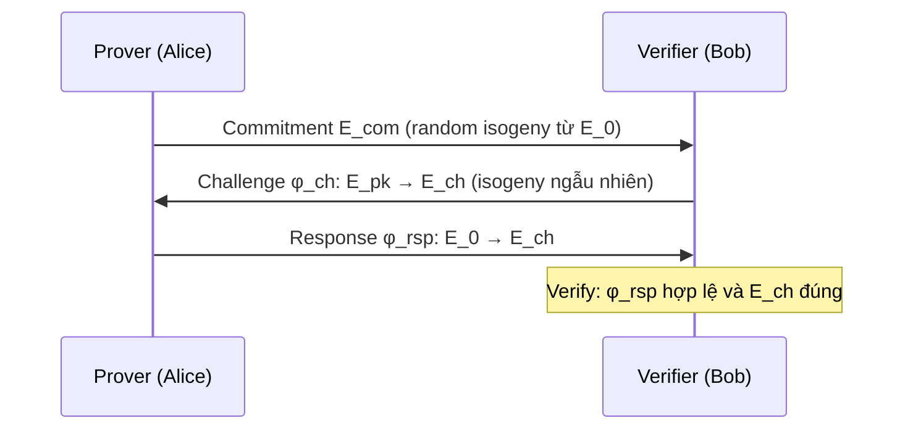

> **Prerequisites**: [[09-deuring-correspondence|09. Deuring Correspondence]], [[13-klpt-quaternion|13. KLPT Algorithm]], [[06-ordinary-supersingular|06. Ordinary vs Supersingular]]
> **Lesson type**: Scheme
>
> **Notation** (ký hiệu dùng mà không định nghĩa trong bài này):
> | Ký hiệu | Ý nghĩa |
> |---------|---------|
> | $E_0/\mathbb{F}_{p^2}$ | Đường cong cơ sở supersingular; $\text{End}(E_0) \cong \mathcal{O}_0$ special extremal |
> | $\phi_{\text{sk}}: E_0 \to E_{\text{pk}}$ | Secret key isogeny, degree smooth |
> | $E_{\text{pk}}$ | Public key — j-invariant của codomain |
> | $\phi_{\text{ch}}: E_{\text{pk}} \to E_{\text{ch}}$ | Challenge isogeny (từ hash của message) |
> | $\phi_{\text{rsp}}: E_0 \to E_{\text{ch}}$ | Response isogeny — chính là signature |
> | $D$ | Degree của response/secret isogeny: $D = \ell^e$ smooth |

---

## SQISign — Đỉnh cao Compact Signature Hậu lượng tử

SQISign (Short Quaternion and Isogeny Signature — De Feo, Kohel, Leroux, Petit, Wesolowski, ASIACRYPT 2020) là kết quả tổng hợp của toàn bộ lý thuyết Deuring correspondence + KLPT + isogeny-based crypto. Tên phát âm là *"ski-sign"*.

Điểm nổi bật so với mọi scheme post-quantum khác:

| | SQISign (NIST-1) | Dilithium | SPHINCS+ |
|--|-----------------|-----------|---------|
| Public key | **64 bytes** | 1312 bytes | 32 bytes |
| Signature | **204 bytes** | 2420 bytes | 7856 bytes |
| Verification | 50 ms | < 1 ms | < 1 ms |
| Signing | 2.5 s | < 1 ms | < 1 ms |

Sig + PK = 268 bytes — nhỏ hơn RSA-2048 và nhỏ hơn **tất cả** scheme post-quantum khác. Nhưng signing chậm — đây là đánh đổi chấp nhận được cho nhiều ứng dụng (PKI, firmware signing, certificate...).

---

## 1. Ý tưởng Cốt lõi — Sigma Protocol từ Isogenies

SQISign là một **sigma protocol** (identification scheme 3-round) được biến thành signature bằng Fiat-Shamir transform.

**Bài toán chứng minh**: Alice biết isogeny $\phi_{\text{sk}}: E_0 \to E_{\text{pk}}$. Cô muốn chứng minh điều này với Bob mà không tiết lộ $\phi_{\text{sk}}$.

Protocol ý tưởng:



Điểm kỳ diệu: nếu Alice biết $\phi_{\text{sk}}$, cô có thể tính $\phi_{\text{rsp}} = \phi_{\text{ch}} \circ \phi_{\text{sk}}$ (composition). Nhưng để làm được điều này với smooth-degree constraints, cô phải dùng KLPT.

---

## 2. Scheme Definition Đầy đủ

> [!note] Scheme 14.1 — SQISign (Interactive Protocol)
>
> **$\mathsf{Setup}$**: Prime $p$, base curve $E_0/\mathbb{F}_{p^2}$ với $\text{End}(E_0) \cong \mathcal{O}_0$ special extremal, smooth degree $D = \ell^e$.
>
> **$\mathsf{KeyGen}()$**
> - Sample random left $\mathcal{O}_0$-ideal $I_{\text{sk}}$ với $\text{nrd}(I_{\text{sk}}) = D$
> - Dùng **KLPT** để tìm equivalent ideal $J_{\text{sk}} \sim I_{\text{sk}}$ với $\text{nrd}(J_{\text{sk}}) = D$ (smooth form phù hợp hơn)
> - Dùng **IdealToIsogeny** để tính $\phi_{\text{sk}}: E_0 \to E_{\text{pk}}$ từ $J_{\text{sk}}$
> - Output: $\mathsf{sk} = (J_{\text{sk}}, \phi_{\text{sk}})$, $\mathsf{pk} = E_{\text{pk}}$ (hay $j(E_{\text{pk}}) \in \mathbb{F}_{p^2}$)
>
> **$\mathsf{Commit}()$**
> - Sample random ideal $I_{\text{com}}$ với $\text{nrd}(I_{\text{com}}) = D'$ (smooth)
> - Tính $\phi_{\text{com}}: E_0 \to E_{\text{com}}$
> - Output: $\mathsf{com} = E_{\text{com}}$; giữ $\phi_{\text{com}}$ bí mật
>
> **$\mathsf{Challenge}(\mathsf{com}, m)$** — Verifier
> - Hash message và commitment: $\phi_{\text{ch}} = H(E_{\text{pk}}, E_{\text{com}}, m)$
> - Output: $E_{\text{ch}}$ = codomain của $\phi_{\text{ch}}: E_{\text{pk}} \to E_{\text{ch}}$ degree $D''$
>
> **$\mathsf{Respond}(\mathsf{sk}, \phi_{\text{com}}, \phi_{\text{ch}})$**
> - Cần tính $\phi_{\text{rsp}}: E_0 \to E_{\text{ch}}$ degree $D$ thỏa $\phi_{\text{rsp}} = \phi_{\text{ch}} \circ \phi_{\text{sk}}$ (lên đến isomorphism)
> - Bước này dùng **SigningKLPT**: từ ideal $I_{\text{ch}} \cdot I_{\text{sk}}$ (trong $\mathcal{O}_0$), tìm equivalent ideal với norm smooth $D$
> - Dùng IdealToIsogeny để tính $\phi_{\text{rsp}}$
> - Output: $\sigma = \phi_{\text{rsp}}$ (hay kernel polynomial biểu diễn nó)
>
> **$\mathsf{Verify}(\mathsf{pk}, m, \sigma)$**
> - Tính lại $\phi_{\text{ch}}$ từ $H(\mathsf{pk}, \cdot, m)$
> - Verify $\phi_{\text{rsp}}: E_0 \to E_{\text{ch}}$ có degree đúng $D$
> - Verify codomain của $\phi_{\text{rsp}}$ khớp với $E_{\text{ch}}$
> - Output: accept/reject

---

## 3. Fiat-Shamir Transform — Signature Non-Interactive

Biến protocol interactive 3-round thành signature:

> [!note] Algorithm 14.2 — SQISign Signature (Non-Interactive)
>
> **$\mathsf{Sign}(\mathsf{sk}, m)$**:
> 1. $\phi_{\text{com}}, E_{\text{com}} \leftarrow \mathsf{Commit}()$
> 2. $\phi_{\text{ch}} \leftarrow H(E_{\text{pk}}, E_{\text{com}}, m)$ — hash thay cho random challenge
> 3. $\phi_{\text{rsp}} \leftarrow \mathsf{Respond}(\mathsf{sk}, \phi_{\text{com}}, \phi_{\text{ch}})$
> 4. Output: $\sigma = (E_{\text{com}}, \phi_{\text{rsp}})$ (hay compact encoding của hai đại lượng này)
>
> **$\mathsf{Verify}(\mathsf{pk}, m, \sigma)$**:
> 1. Recover $E_{\text{com}}$ và $\phi_{\text{rsp}}$ từ $\sigma$
> 2. Tính $\phi_{\text{ch}} \leftarrow H(E_{\text{pk}}, E_{\text{com}}, m)$ — recompute challenge
> 3. Verify: $\text{codomain}(\phi_{\text{rsp}}) = \text{codomain}(\phi_{\text{ch}})$ và $\deg(\phi_{\text{rsp}}) = D$

---

## 4. Zero-Knowledge và Soundness

> [!abstract] Định lý 14.3 — Tính chất Mật mã của SQISign
>
> **(a) Completeness**: Nếu Alice biết $\phi_{\text{sk}}$, verify luôn accept.
>
> **(b) Special soundness**: Từ hai transcripts $(E_{\text{com}}, \phi_{\text{ch}}, \phi_{\text{rsp}})$ và $(E_{\text{com}}, \phi_{\text{ch}}', \phi_{\text{rsp}}')$ với cùng commitment $E_{\text{com}}$ nhưng challenge khác nhau, có thể recover $\phi_{\text{sk}}$.
>
> **(c) Zero-knowledge**: Transcript $(E_{\text{com}}, \phi_{\text{ch}}, \phi_{\text{rsp}})$ có thể được simulate mà không cần biết $\phi_{\text{sk}}$, vì distribution của response isogenies từ $E_0$ đến $E_{\text{ch}}$ là uniform (từ tính chất Ramanujan của supersingular isogeny graph).

ZK property của SQISign phức tạp hơn ZK thông thường — cần khái niệm "Fiat-Shamir with hints" (Aardal et al., 2025) để chứng minh đầy đủ.

---

## 5. Hard Problem và Security

> [!note] Định nghĩa 14.4 — Endomorphism Ring Problem
> **Endomorphism Ring Problem (ERP)**: Cho supersingular curve $E/\mathbb{F}_{p^2}$, tính $\text{End}(E)$ (hay tương đương, tìm generators của nó).
>
> **One Endomorphism Problem (OneEP)**: Cho $E$, tìm một endomorphism không phải scalar multiplication.
>
> **Isogeny Path Problem**: Cho $E_1, E_2$ supersingular, tìm isogeny $\phi: E_1 \to E_2$.
>
> [!abstract] Định lý 14.5 — Security của SQISign (Wesolowski 2022, Aardal et al. 2025)
> Các bài toán trên đều tương đương (polynomial-time reductions theo cả hai chiều):
>
> $$
> \text{ERP} \equiv_{\text{poly}} \text{IsogenyPath} \equiv_{\text{poly}} \text{OneEP (with hints)}
> $$
>
> SQISign là **EUF-CMA secure** trong Random Oracle Model (ROM), assuming hardness của One Endomorphism Problem with hints.

Quantum hardness: Không có quantum algorithm nào tốt hơn classical $O(p^{1/4})$ cho ERP/IsogenyPath trên supersingular curves (khác với Kuperberg cho CSIDH). Đây là lợi thế lớn của SQISign so với CSIDH.

---

## 6. Tại sao SQISign Không Bị Castryck-Decru?

> [!info] SQISign Immune với Castryck-Decru
>
> Castryck-Decru attack cần **torsion point images** ($\phi(P), \phi(Q)$ công khai).
>
> Trong SQISign: signature $\phi_{\text{rsp}}$ được truyền như **kernel polynomial** hoặc chain isogenies — **không có torsion point images nào được public**.
>
> Verifier chỉ cần biết codomain và degree — không cần biết action trên torsion subgroups.
>
> **Kết luận**: SQISign architecturally immune với Castryck-Decru và mọi torsion-based attack.

---

## 7. SQISign2D-West — Cải tiến 20× Signing Speed

Sau bản gốc 2020, một cải tiến lớn xuất hiện năm 2024:

> [!info] SQISign2D-West (ASIACRYPT 2024)
>
> Thay vì dùng chuỗi $\ell$-isogenies degree 1, SQISign2D-West dùng **$(2,2)$-isogenies** trên abelian surfaces (dimension 2) — ironically cùng công cụ Castryck-Decru đã dùng để phá SIDH.
>
> **Kết quả**: Signing nhanh hơn **20×** (từ 2.5s xuống ~125ms); verification nhanh hơn **6×**; signature nhỏ hơn 14%.
>
> Parameters NIST-1: pk = 64 bytes, sig ≈ 177 bytes.
>
> Đây là ví dụ đẹp về "turning a weapon into a tool": $(2,2)$-isogenies phá SIDH, nhưng cũng tăng tốc SQISign.

---

## 8. NIST Standardization

SQISign đang trong quá trình standardization:

- **NIST PQC Round 1 on-ramp** (2023): SQISign được chọn
- **Round 2 on-ramp** (2024): SQISign tiếp tục, với cải tiến từ SQISign2D-West
- Cạnh tranh: FALCON (lattice), SLH-DSA (hash) đã được standardize; SQISign là candidate isogeny-based duy nhất còn lại
- Ưu điểm cạnh tranh: **sig + pk tổng nhỏ nhất** trong mọi scheme — critical cho bandwidth-constrained applications

---

## 9. Performance Parameters (NIST-1)

| Thông số | SQISign v1 | SQISign2D-West |
|----------|-----------|---------------|
| Prime $p$ | ~256-bit | ~256-bit |
| Public key | 64 bytes | 64 bytes |
| Signature | 204 bytes | 177 bytes |
| KeyGen | 0.6 s | ~30 ms |
| Sign | 2.5 s | ~125 ms |
| Verify | 50 ms | ~8 ms |
| Security assumption | ERP/OneEP | ERP/OneEP |
| Quantum security | ~128 bits | ~128 bits |

---

## 10. SageMath — SQISign Primitives

```python
p = 2**127 * 3**83 - 1
assert is_prime(p), "p không phải prime"

F2 = GF(p**2, 'i', modulus=x**2+1)
E0 = EllipticCurve(F2, [1, 0])
assert E0.is_supersingular()
print(f"E0 supersingular: j = {E0.j_invariant()}")
print(f"#E0(F_p^2) = (p+1)^2 = {(p+1)**2}")
```

```python
p = 83
F = GF(p**2, 'i', modulus=x**2+1)
E0 = EllipticCurve(F, [1, 0])

ell = 2
e = 4
D = ell**e

N_pts = E0.order()
P = E0.random_point()
while P.order() < D:
    P = E0.random_point()

Q = (N_pts // D) * P
print(f"Q bậc D={D}: {Q.order()}")

phi_sk = E0.isogeny(Q)
E_pk = phi_sk.codomain()
print(f"Public key: j(E_pk) = {E_pk.j_invariant()}")
print(f"Degree phi_sk = {phi_sk.degree()}")
```

```python
def sqisign_verify_sketch(E0, E_pk, E_ch, phi_rsp, D):
    """
    Sketch của verification:
    - phi_rsp: E0 -> E_ch
    - degree(phi_rsp) = D
    - codomain(phi_rsp) == E_ch
    """
    assert phi_rsp.domain().j_invariant() == E0.j_invariant(), "Domain sai"
    assert phi_rsp.degree() == D, f"Degree sai: {phi_rsp.degree()} != {D}"
    assert phi_rsp.codomain().j_invariant() == E_ch.j_invariant(), "Codomain sai"
    return True

print("Verification structure: check domain, degree, codomain")
print("Signing: find phi_rsp via KLPT + IdealToIsogeny")
```

> [!tip] Pattern trong CTF — SQISign Challenges
>
> CTF challenges về SQISign thường thuộc hai dạng:
>
> **Dạng 1 — Verification bypass**: Tìm $\phi_{\text{rsp}}': E_0 \to E_{\text{ch}}$ hợp lệ mà không biết $\phi_{\text{sk}}$. Tương đương với giải isogeny path problem — hard nếu parameters đúng.
>
> **Dạng 2 — Small parameters**: $p$ nhỏ, $D$ nhỏ → enumerate isogeny paths bằng BFS trên isogeny graph.
>
> **Key insight**: Verification chỉ kiểm tra degree và codomain — không kiểm tra thêm điều gì về cấu trúc nội bộ của $\phi_{\text{rsp}}$.

---

## 11. So sánh Tổng kết — Toàn bộ Isogeny-Based Crypto

| Scheme | Type | Basis | Quantum | Status |
|--------|------|-------|---------|--------|
| CSIDH | KEM/KEx | Abelian class group action | Subexp (Kuperberg) | Active |
| CSI-FiSh | Sig | CSIDH + class group structure | Subexp | Active |
| **SIDH** | KEx | Non-comm. torsion images | **Bị phá** (2022) | Broken |
| **SIKE** | KEM | SIDH + FO | **Bị phá** (2022) | Broken |
| **SQISign** | Sig | Deuring + KLPT | Exp ($O(p^{1/4})$) | **NIST on-ramp** |
| SQISign2D | Sig | SQISign + (2,2)-isogenies | Exp | Active, faster |

---

## Tóm tắt

- SQISign là **digital signature** post-quantum có **sig + pk nhỏ nhất** (204 + 64 = 268 bytes NIST-1).
- **Protocol**: Sigma protocol 3-round (commit → challenge → respond) + Fiat-Shamir → non-interactive signature.
- **KeyGen**: Random ideal $I_{\text{sk}}$ → KLPT → smooth ideal $J_{\text{sk}}$ → IdealToIsogeny → $\phi_{\text{sk}}: E_0 \to E_{\text{pk}}$.
- **Signing**: Challenge isogeny $\phi_{\text{ch}}$, tìm $\phi_{\text{rsp}}: E_0 \to E_{\text{ch}}$ via SigningKLPT + IdealToIsogeny.
- **Security**: EUF-CMA trong ROM, dựa trên hardness của One Endomorphism Problem. Quantum security $O(p^{1/4})$ — tốt hơn CSIDH.
- **Immune với Castryck-Decru**: không leak torsion images.
- **SQISign2D-West** (2024): 20× faster signing bằng $(2,2)$-isogenies.
- **Đang NIST standardization** (on-ramp round 2).

---

## References

- De Feo, Kohel, Leroux, Petit, Wesolowski — *SQISign: Compact Post-Quantum Signatures from Quaternions and Isogenies*, ASIACRYPT 2020, eprint.iacr.org/2020/1240
- Aardal, Basso, De Feo, Patranabis, Wesolowski — *A Complete Security Proof of SQISign*, EUROCRYPT 2025, eprint.iacr.org/2025/379
- Basso et al. — *SQIsign2D-West: The Fast, The Small, and The Safer*, ASIACRYPT 2024
- De Feo, Leroux, Longa, Wesolowski — *New Algorithms for the Deuring Correspondence*, EUROCRYPT 2023
- NIST SQISign Specification — csrc.nist.gov/csrc/media/Projects/pqc-dig-sig/documents/round-1/spec-files/sqisign-spec-web.pdf
- LearningToSQI — *SQISign-SageMath* open-source implementation, github.com/LearningToSQI/SQISign-SageMath
