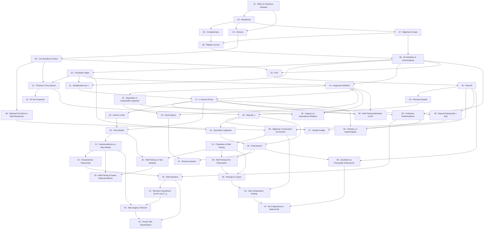

> **Level**: Graduate  
> **Background**: Đại số trừu tượng cơ bản (nhóm, vành, trường), Lý thuyết Galois cơ bản, Hình học đại số nhập môn  
> **SageMath**: Có  
> **Sources**: Mumford *Abelian Varieties*, Milne *Abelian Varieties*, van der Geer–Moonen *Abelian Varieties*, Silverman *The Arithmetic of Elliptic Curves*, Polishchuk *Abelian Varieties, Theta Functions and the Fourier Transform*

---

## Lessons

### Module 0 — Algebraic Geometry Foundations

| # | Title | Nội dung trung tâm | Prerequisites | Difficulty |
|---|-------|--------------------|---------------|------------|
| 01 | Affine and Projective Varieties | Variety là gì? Tại sao cần projective? Affine variety, projective variety, homogeneous coordinates, closed subset | — | ★★☆☆☆ |
| 02 | Morphisms of Varieties | Map giữa hai variety. Regular map, polynomial map, isomorphism, product variety | 01 | ★★☆☆☆ |
| 03 | Completeness and Proper Maps | Tại sao projective variety "đầy đủ hơn" affine? Complete variety, proper morphism, closed image theorem | 01, 02 | ★★★☆☆ |
| 04 | Divisors on Varieties | Đếm zeros và poles của rational functions. Weil divisor, Cartier divisor, principal divisor, linear equivalence | 01, 02 | ★★★☆☆ |
| 05 | Line Bundles and the Picard Group | Gói các số thành bundle. Invertible sheaf, line bundle, $\mathcal{O}(D)$, Picard group $\text{Pic}(X)$ | 04 | ★★★☆☆ |
| 06 | Rational Functions and Weil Reciprocity | Công cụ kỹ thuật cần cho Weil pairing. Rational function $f \in k(C)^\times$, divisor của $f$, Weil reciprocity | 04, 05 | ★★★☆☆ |

### Module 1 — Group Varieties and Abelian Varieties

| # | Title | Nội dung trung tâm | Prerequisites | Difficulty |
|---|-------|--------------------|---------------|------------|
| 07 | Algebraic Groups — What Are They? | Một variety vừa là group. $\mathbb{G}_m$, $\mathbb{G}_a$, $\text{GL}_n$, group variety | 01, 02 | ★★☆☆☆ |
| 08 | The Rigidity Lemma | Kết quả kỹ thuật quan trọng nhất: map từ complete variety bị "cứng" | 03, 07 | ★★★☆☆ |
| 09 | Abelian Varieties — Definition and Commutativity | Định nghĩa chính thức. Abelian variety = complete + group variety. Commutativity từ Rigidity | 07, 08 | ★★★☆☆ |
| 10 | Translation Maps and Morphisms of Abelian Varieties | Map giữa abelian variety phải tôn trọng group law. Translation map $t_a$, homomorphism, kernel | 09 | ★★★☆☆ |
| 11 | The Multiplication-by-n Map | $[n]: A \to A$ là isomorphism khi nào? $[n]$-map, separability, char$(k)$ ảnh hưởng | 09, 10 | ★★★☆☆ |
| 12 | Theorem of the Square | Kết quả nền tảng về line bundles trên AV: $t_a^* L \otimes t_{-a}^* L \cong L^{\otimes 2}$, $\phi_L: A \to \text{Pic}(A)$ | 05, 10 | ★★★★☆ |
| 13 | Abelian Varieties Are Projective | Mọi AV đều nhúng được vào projective space. Theorem of Cube, ampleness, projective embedding | 12 | ★★★★☆ |

### Module 2 — Isogenies

| # | Title | Nội dung trung tâm | Prerequisites | Difficulty |
|---|-------|--------------------|---------------|------------|
| 14 | Isogenies — Definition and Basic Examples | Isogeny = surjective homomorphism với finite kernel. Degree, ví dụ trên elliptic curve | 09, 10 | ★★☆☆☆ |
| 15 | Separable vs Inseparable Isogenies | Trong char $p > 0$, Frobenius là inseparable isogeny. Separable/inseparable degree | 14 | ★★★☆☆ |
| 16 | The Dual Isogeny | Mọi isogeny đều có "đôi": $\hat{f} \circ f = [\deg f]$, $f \circ \hat{f} = [\deg f]$ | 14, 15 | ★★★☆☆ |
| 17 | n-Torsion Points $A[n]$ | $A[n] = \ker([n])$, $A[n] \cong (\mathbb{Z}/n\mathbb{Z})^{2g}$ khi $\gcd(n, \text{char}) = 1$ | 11, 14 | ★★★☆☆ |
| 18 | Isogeny as an Equivalence Relation | Isogeny class, $\text{Hom}(A,B)$ là $\mathbb{Z}$-module tự do, $\text{End}(A)$ | 14, 17 | ★★★☆☆ |

### Module 3 — The ℓ-adic Tate Module

| # | Title | Nội dung trung tâm | Prerequisites | Difficulty |
|---|-------|--------------------|---------------|------------|
| 19 | Inverse Limits — A Gentle Introduction | Inverse system, inverse limit $\varprojlim$, $\mathbb{Z}_p$ như ví dụ | — | ★★☆☆☆ |
| 20 | The ℓ-adic Tate Module $T_\ell(A)$ | $T_\ell(A) = \varprojlim A[\ell^n]$, $V_\ell(A) = T_\ell(A) \otimes \mathbb{Q}_\ell$, free $\mathbb{Z}_\ell$-module rank $2g$ | 17, 19 | ★★★☆☆ |
| 21 | Endomorphisms on the Tate Module | $T_\ell(f): T_\ell(A) \to T_\ell(A)$, injectivity của $\text{End}(A) \hookrightarrow \text{End}(T_\ell)$ | 20 | ★★★☆☆ |
| 22 | Characteristic Polynomial of an Endomorphism | $P_f(t) \in \mathbb{Z}[t]$ bậc $2g$, $\deg f = P_f(0)$, $\text{tr}(f)$ | 21 | ★★★★☆ |

### Module 4 — Dual Abelian Variety

| # | Title | Nội dung trung tâm | Prerequisites | Difficulty |
|---|-------|--------------------|---------------|------------|
| 23 | Line Bundles Algebraically Equivalent to Zero | $\text{Pic}^0(A)$, algebraic equivalence, numerical equivalence | 05, 09 | ★★★☆☆ |
| 24 | The Dual Abelian Variety $\hat{A} = \text{Pic}^0(A)$ | $\hat{A}$ cũng là abelian variety! Universal property, $\dim \hat{A} = \dim A$ | 23 | ★★★★☆ |
| 25 | The Poincaré Line Bundle $\mathcal{P}$ | Bundle "universal" trên $A \times \hat{A}$, rigidification | 24 | ★★★★☆ |
| 26 | The Map $\phi_L: A \to \hat{A}$ | $\phi_L(a) = [t_a^* L \otimes L^{-1}]$, $\ker(\phi_L)$, $\phi_L$ là isogeny khi $L$ ample | 12, 25 | ★★★★☆ |
| 27 | Double Duality $\hat{\hat{A}} \cong A$ | Natural isomorphism $A \xrightarrow{\sim} \hat{\hat{A}}$, functoriality | 24, 26 | ★★★★☆ |

### Module 5 — The Weil Pairing

| # | Title | Nội dung trung tâm | Prerequisites | Difficulty |
|---|-------|--------------------|---------------|------------|
| 28 | Motivation: Weil Pairing on Elliptic Curves | Review Weil pairing $e_n: E[n] \times E[n] \to \mu_n$, Miller's algorithm (sketch) | 14, 17 | ★★☆☆☆ |
| 29 | The "Natural" Pairing Between $A[n]$ and $\hat{A}[n]$ | Setup pairing $e_n: A[n] \times \hat{A}[n] \to \mu_n$ | 17, 24 | ★★★☆☆ |
| 30 | Algebraic Construction via Divisors | Xây dựng $e_n$ bằng rational functions: divisor của $[n]^* L$, $e_n(P, \xi) = f(P + \cdot)/f(\cdot)$ | 06, 29 | ★★★★☆ |
| 31 | Properties of the Weil Pairing | Bilinear, non-degenerate, alternating, Galois-equivariant | 30 | ★★★★☆ |
| 32 | The Weil Pairing on Tate Modules | $e_\ell: T_\ell(A) \times T_\ell(\hat{A}) \to \mathbb{Z}_\ell(1)$, compatibility | 20, 31 | ★★★★☆ |
| 33 | Weil Pairing and Galois Representations | Galois-equivariance, cyclotomic character $\chi_\ell$, restriction trên $\text{Gal}$ | 21, 32 | ★★★★☆ |

### Module 6 — Polarizations

| # | Title | Nội dung trung tâm | Prerequisites | Difficulty |
|---|-------|--------------------|---------------|------------|
| 34 | Symmetric Isogenies $A \to \hat{A}$ | Symmetric isogeny: $\hat{\phi} = \phi$, relationship với line bundles | 10, 26 | ★★★☆☆ |
| 35 | Polarizations — Definition and Examples | Polarization = $\phi_L$ với $L$ ample. Degree, principal polarization (deg = 1) | 26, 34 | ★★★☆☆ |
| 36 | Weil Pairing from a Polarization | $e_\phi: A[n] \times A[n] \to \mu_n$, $e_\phi(P, Q) = e_n(P, \phi(Q))$, skew-symmetry | 31, 35 | ★★★☆☆ |
| 37 | The Rosati Involution | $f^\dagger = \phi^{-1} \circ \hat{f} \circ \phi$, positivity: $\text{Tr}(f f^\dagger) > 0$ | 16, 35 | ★★★★☆ |
| 38 | Jacobians as Principally Polarized AV | $J(C) = \text{Pic}^0(C)$, theta divisor $\Theta$, $J(C)$ principally polarized | 24, 35 | ★★★★☆ |

### Module 7 — Abelian Varieties over $\mathbb{F}_q$

| # | Title | Nội dung trung tâm | Prerequisites | Difficulty |
|---|-------|--------------------|---------------|------------|
| 39 | Frobenius Endomorphism $\pi_A$ | Geometric Frobenius $\pi_A: A \to A$, $\pi_A(x,y) = (x^q, y^q)$, Verschiebung | 09, 15 | ★★★☆☆ |
| 40 | Weil Numbers and Their Properties | Weil $q$-number $\pi$: $|\sigma(\pi)| = \sqrt{q}$ cho mọi embedding, char. poly. của $\pi_A$ | 22, 39 | ★★★☆☆ |
| 41 | The Riemann Hypothesis for AV over $\mathbb{F}_q$ | $|A(\mathbb{F}_q)| = \prod(1 - \alpha_i)$ với $|\alpha_i| = \sqrt{q}$, Weil conjectures context | 40 | ★★★★☆ |
| 42 | Tate's Isogeny Theorem | $\text{Hom}(A, B) \otimes \mathbb{Z}_\ell \cong \text{Hom}(T_\ell A, T_\ell B)$ — isogeny class ↔ char. poly. của $\pi_A$ | 21, 41 | ★★★★☆ |
| 43 | Honda-Tate Classification | Bijection: isogeny classes ↔ conjugacy classes of Weil numbers | 40, 42 | ★★★★★ |
| 44 | Ordinary vs Supersingular AV | ordinary: $A[p] \cong (\mathbb{Z}/p)^g$, supersingular: $A[p] = 0$, Newton polygon | 17, 39 | ★★★★☆ |

### Module 8 — Applications to Cryptography

| # | Title | Nội dung trung tâm | Prerequisites | Difficulty |
|---|-------|--------------------|---------------|------------|
| 45 | Pairings in Cryptography: From Theory to Practice | $e_n: A[n] \times \hat{A}[n] \to \mu_n$ trong crypto. MOV/FR attack | 31, 36 | ★★★☆☆ |
| 46 | Tate–Lichtenbaum Pairing | Pairing hiệu quả hơn Weil pairing. Reduced Tate pairing, Miller loop | 30, 45 | ★★★★☆ |
| 47 | BLS Signatures and Optimal Ate Pairing | BLS signature scheme, optimal Ate pairing, Jacobian of hyperelliptic curve | 38, 46 | ★★★★☆ |

---

## Appendix Candidates

| ID | Theorem | Related Lesson | Notes |
|----|---------|----------------|-------|
| A0 | Rigidity Lemma | 08 | Chứng minh đầy đủ — kết quả kỹ thuật quan trọng nhất cho AV |
| A1 | $A[n] \cong (\mathbb{Z}/n\mathbb{Z})^{2g}$ khi $\gcd(n, \text{char}) = 1$ | 17 | Chứng minh cấu trúc nhóm $n$-torsion |
| A2 | Non-Degeneracy of Weil Pairing | 31 | Chứng minh tính non-degenerate — phần khó nhất của Weil pairing |
| A3 | Tate's Isogeny Theorem | 42 | Sketch chứng minh định lý Tate |
| A4 | Weil Reciprocity | 06 | Chứng minh đầy đủ Weil reciprocity |

---

## Dependency Graph

---

## Progress Tracker

- [x] [[00-roadmap|00. Roadmap]]

### Module 0 — Algebraic Geometry Foundations
- [x] [[01-affine-and-projective-varieties|01. Affine and Projective Varieties]]
- [x] [[02-morphisms-of-varieties|02. Morphisms of Varieties]]
- [x] [[03-completeness-and-proper-maps|03. Completeness and Proper Maps]]
- [x] [[04-divisors-on-varieties|04. Divisors on Varieties]]
- [x] [[05-line-bundles-and-the-picard-group|05. Line Bundles and the Picard Group]]
- [x] [[06-rational-functions-and-weil-reciprocity|06. Rational Functions and Weil Reciprocity]]

### Module 1 — Group Varieties and Abelian Varieties
- [x] [[07-algebraic-groups|07. Algebraic Groups — What Are They?]]
- [x] [[08-the-rigidity-lemma|08. The Rigidity Lemma]]
- [x] [[09-abelian-varieties-definition-and-commutativity|09. Abelian Varieties — Definition and Commutativity]]
- [x] [[10-translation-maps-and-morphisms-of-abelian-varieties|10. Translation Maps and Morphisms of Abelian Varieties]]
- [x] [[11-the-multiplication-by-n-map|11. The Multiplication-by-n Map]]
- [x] [[12-theorem-of-the-square|12. Theorem of the Square]]
- [x] [[13-abelian-varieties-are-projective|13. Abelian Varieties Are Projective]]

### Module 2 — Isogenies
- [x] [[14-isogenies-definition-and-basic-examples|14. Isogenies — Definition and Basic Examples]]
- [x] [[15-separable-vs-inseparable-isogenies|15. Separable vs Inseparable Isogenies]]
- [x] [[16-the-dual-isogeny|16. The Dual Isogeny]]
- [x] [[17-n-torsion-points|17. n-Torsion Points A[n]]]
- [x] [[18-isogeny-as-an-equivalence-relation|18. Isogeny as an Equivalence Relation]]

### Module 3 — The ℓ-adic Tate Module
- [x] [[19-inverse-limits|19. Inverse Limits — A Gentle Introduction]]
- [x] [[20-the-l-adic-tate-module|20. The ℓ-adic Tate Module]]
- [x] [[21-endomorphisms-on-the-tate-module|21. Endomorphisms on the Tate Module]]
- [x] [[22-characteristic-polynomial-of-an-endomorphism|22. Characteristic Polynomial of an Endomorphism]]

### Module 4 — Dual Abelian Variety
- [x] [[23-line-bundles-algebraically-equivalent-to-zero|23. Line Bundles Algebraically Equivalent to Zero]]
- [x] [[24-the-dual-abelian-variety|24. The Dual Abelian Variety]]
- [x] [[25-the-poincare-line-bundle|25. The Poincaré Line Bundle]]
- [x] [[26-the-map-phi-l|26. The Map φ_L: A → Â]]
- [x] [[27-double-duality|27. Double Duality]]

### Module 5 — The Weil Pairing
- [x] [[28-motivation-weil-pairing-on-elliptic-curves|28. Motivation: Weil Pairing on Elliptic Curves]]
- [x] [[29-the-natural-pairing|29. The Natural Pairing Between A[n] and Â[n]]]
- [x] [[30-algebraic-construction-via-divisors|30. Algebraic Construction via Divisors]]
- [x] [[31-properties-of-the-weil-pairing|31. Properties of the Weil Pairing]]
- [x] [[32-the-weil-pairing-on-tate-modules|32. The Weil Pairing on Tate Modules]]
- [x] [[33-weil-pairing-and-galois-representations|33. Weil Pairing and Galois Representations]]

### Module 6 — Polarizations
- [x] [[34-symmetric-isogenies|34. Symmetric Isogenies]]
- [x] [[35-polarizations-definition-and-examples|35. Polarizations — Definition and Examples]]
- [x] [[36-weil-pairing-from-a-polarization|36. Weil Pairing from a Polarization]]
- [x] [[37-the-rosati-involution|37. The Rosati Involution]]
- [x] [[38-jacobians-as-principally-polarized-av|38. Jacobians as Principally Polarized AV]]

### Module 7 — Abelian Varieties over F_q
- [x] [[39-frobenius-endomorphism|39. Frobenius Endomorphism]]
- [x] [[40-weil-numbers-and-their-properties|40. Weil Numbers and Their Properties]]
- [x] [[41-riemann-hypothesis-for-av-over-fq|41. Riemann Hypothesis for AV over F_q]]
- [x] [[42-tates-isogeny-theorem|42. Tate's Isogeny Theorem]]
- [x] [[43-honda-tate-classification|43. Honda-Tate Classification]]
- [x] [[44-ordinary-vs-supersingular-av|44. Ordinary vs Supersingular AV]]

### Module 8 — Applications to Cryptography
- [x] [[45-pairings-in-cryptography|45. Pairings in Cryptography]]
- [x] [[46-tate-lichtenbaum-pairing|46. Tate–Lichtenbaum Pairing]]
- [x] [[47-bls-signatures-and-optimal-ate-pairing|47. BLS Signatures and Optimal Ate Pairing]]

### Appendices
- [x] [[a0-proof-of-rigidity-lemma|A0. Proof of Rigidity Lemma]]
- [x] [[a1-proof-a-n-cong-z-nz-2g|A1. Proof: A[n] ≅ (ℤ/nℤ)^{2g}]]
- [x] [[a2-proof-of-non-degeneracy-of-weil-pairing|A2. Proof of Non-Degeneracy of Weil Pairing]]
- [x] [[a3-sketch-of-tates-isogeny-theorem|A3. Sketch of Tate's Isogeny Theorem]]
- [x] [[a4-weil-reciprocity|A4. Weil Reciprocity — Chứng Minh Đầy Đủ]]
