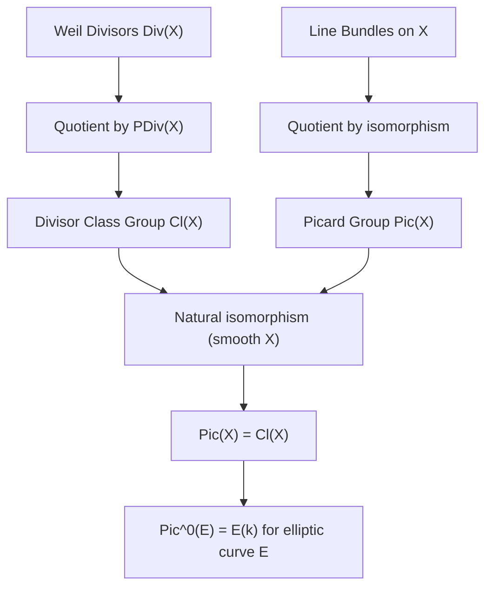

> **Prerequisites**: [[04-divisors-on-varieties|04. Divisors on Varieties]] — Weil divisor, Cartier divisor, linear equivalence, divisor class group; [[03-completeness-and-proper-maps|03. Completeness and Proper Maps]] — complete variety.
> **Objectives**:
> - Hiểu bó đường (line bundle) / bó khả nghịch (invertible sheaf) như cách "đóng gói" thông tin divisors
> - Xây dựng bó $\mathcal{O}(D)$ từ Weil divisor $D$
> - Định nghĩa nhóm Picard $\operatorname{Pic}(X)$ và đẳng cấu với $\operatorname{Cl}(X)$
> - Tính $\operatorname{Pic}(\mathbb{P}^n) \cong \mathbb{Z}$ và $\operatorname{Pic}^0(E) \cong E(k)$
> - Hiểu tại sao $\operatorname{Pic}^0(A)$ là abelian variety đối ngẫu $\hat{A}$

---

## Motivation / Intuition

Trong Bài 04, ta định nghĩa divisors như tổ hợp hình thức của subvarieties codimension 1, và nhóm lớp ước $\operatorname{Cl}(X)$. Nhưng khi nghiên cứu morphisms và cấu trúc phức tạp hơn, divisors "hình thức" không đủ mềm dẻo — ta cần đối tượng có thể **kéo lùi** (pull back) theo morphism một cách tự nhiên.

**Line bundle** (bó đường hay bó khả nghịch) là câu trả lời: một "bó" hướng trên variety, locally đẳng cấu với bundle tầm thường $X \times k$, nhưng globally có thể xoắn. Mỗi divisor $D$ sinh ra một line bundle $\mathcal{O}(D)$, và hai divisors tương đương tuyến tính khi và chỉ khi chúng sinh ra cùng line bundle.

Ý tưởng từ vật lý: line bundle trên tô-pô là bundle sợi (fiber bundle) với fiber $\mathbb{R}$ hay $\mathbb{C}$. Ví dụ: Möbius strip là line bundle không tầm thường trên $S^1$. Trong hình học đại số, ta làm điều tương tự nhưng với sheaves.

---

## Sheaves Cấu Trúc (Brief Recap)

> [!definition] Definition 5.1 — Sheaf trên tô-pô không gian
> Cho $X$ là tô-pô không gian. Một **sheaf** (bó) $\mathcal{F}$ trên $X$ là phép gán:
>
> - Với mỗi tập mở $U \subseteq X$: một nhóm Abel $\mathcal{F}(U)$ (hay module, ring, tùy bối cảnh).
> - **Restriction maps**: với $V \subseteq U$ mở: $\rho_{UV}: \mathcal{F}(U) \to \mathcal{F}(V)$.
>
> thỏa hai điều kiện:
>
> 1. **Identity**: Nếu $\{U_i\}$ phủ $U$ và $s \in \mathcal{F}(U)$ với $s|_{U_i} = 0$ với mọi $i$, thì $s = 0$.
> 2. **Gluing**: Nếu $s_i \in \mathcal{F}(U_i)$ với $s_i|_{U_i \cap U_j} = s_j|_{U_i \cap U_j}$ với mọi $i,j$, thì $\exists! s \in \mathcal{F}(U)$ với $s|_{U_i} = s_i$.

> [!definition] Definition 5.2 — Sheaf cấu trúc $\mathcal{O}_X$
> Trên variety $X$, **sheaf cấu trúc** (structure sheaf) $\mathcal{O}_X$ là sheaf gán:
>
> $$
> \mathcal{O}_X(U) = \{ f: U \to k \mid f \text{ chính quy trên } U \}.
> $$
>
> Đây là sheaf rings (ring sheaf). Stalk tại $P$: $\mathcal{O}_{X,P} = \varinjlim_{U \ni P} \mathcal{O}_X(U)$ là vành local của hàm mầm.

---

## Bó Đường (Line Bundle / Invertible Sheaf)

> [!definition] Definition 5.3 — Bó khả nghịch (Invertible Sheaf / Line Bundle)
> Một **bó khả nghịch** (invertible sheaf) hay **line bundle** trên variety $X$ là sheaf $\mathcal{O}_X$-module $\mathcal{L}$ trên $X$ sao cho tồn tại phủ mở $\{U_i\}$ của $X$ với
>
> $$
> \mathcal{L}|_{U_i} \cong \mathcal{O}_{U_i}
> $$
>
> — tức $\mathcal{L}$ locally đẳng cấu với sheaf cấu trúc tầm thường.
>
> Một line bundle được gọi là **tầm thường** (trivial) nếu $\mathcal{L} \cong \mathcal{O}_X$ globally.

**Hàm chuyển tiếp (transition functions)**: Trên $U_i \cap U_j$, isomorphisms $\mathcal{L}|_{U_i} \xrightarrow{\sim} \mathcal{O}_{U_i}$ và $\mathcal{L}|_{U_j} \xrightarrow{\sim} \mathcal{O}_{U_j}$ cho ta isomorphism $g_{ij} \in \mathcal{O}^\times_X(U_i \cap U_j)$. Đây chính là dữ liệu của một Cartier divisor!

> [!theorem] Theorem 5.4 — Bó khả nghịch tương ứng với Cartier divisors
> Trên smooth variety $X$, có đẳng cấu nhóm:
>
> $$
> \left\{ \text{Line bundles trên } X \right\} / \cong \;\; \cong \;\; \operatorname{CDiv}(X) / \operatorname{PDiv}(X) \cong \operatorname{Cl}(X).
> $$

---

## Xây Dựng $\mathcal{O}(D)$

> [!definition] Definition 5.5 — Line bundle $\mathcal{O}(D)$ từ Weil divisor
> Cho $D = \sum n_Z Z \in \operatorname{Div}(X)$ là Weil divisor trên smooth variety $X$. Định nghĩa **sheaf** $\mathcal{O}(D)$ bởi:
>
> $$
> \mathcal{O}(D)(U) = \left\{ f \in k(X)^\times \;\middle|\; \operatorname{div}(f)|_U + D|_U \geq 0 \right\} \cup \{0\}.
> $$
>
> Nói cách khác: $f \in \mathcal{O}(D)(U)$ nếu hàm hữu tỉ $f$ có poles "không tệ hơn" $D$ — cụ thể, $v_Z(f) \geq -n_Z$ với mọi prime divisor $Z$ giao $U$.

**Trực giác**: $\mathcal{O}(D)$ gồm các hàm hữu tỉ mà nếu $D$ "cho phép" pole tại $Z$ bậc $n_Z$, thì $f$ có thể có pole tại $Z$ tối đa bậc $n_Z$; nếu $D$ có zero tại $Z$ bậc $m_Z > 0$, $f$ phải có zero tại $Z$ ít nhất bậc $m_Z$.

> [!theorem] Theorem 5.6 — $\mathcal{O}(D)$ là line bundle
> $\mathcal{O}(D)$ định nghĩa ở trên là line bundle trên $X$. Hơn nữa:
>
> $$
> \mathcal{O}(D_1) \otimes \mathcal{O}(D_2) \cong \mathcal{O}(D_1 + D_2), \quad \mathcal{O}(D)^{-1} \cong \mathcal{O}(-D), \quad \mathcal{O}(0) \cong \mathcal{O}_X.
> $$

**Proof.** Locally trên $U_i$ với local equation $f_i$ của $D$: $\mathcal{O}(D)|_{U_i} \xrightarrow{\cdot f_i} \mathcal{O}_{U_i}$ là isomorphism. $\blacksquare$

> [!theorem] Theorem 5.7 — $D_1 \sim D_2 \iff \mathcal{O}(D_1) \cong \mathcal{O}(D_2)$
> Hai Weil divisors $D_1$ và $D_2$ tương đương tuyến tính khi và chỉ khi $\mathcal{O}(D_1) \cong \mathcal{O}(D_2)$ là đẳng cấu line bundles.

**Proof.** $D_1 \sim D_2 \iff D_1 - D_2 = \operatorname{div}(g)$ cho $g \in k(X)^\times$. Nhân với $g$ cho isomorphism $\mathcal{O}(D_1) \xrightarrow{\cdot g} \mathcal{O}(D_2)$. $\blacksquare$

---

## Tiết Diện Toàn Cục (Global Sections)

> [!definition] Definition 5.8 — Không gian tiết diện toàn cục
> **Tiết diện toàn cục** của $\mathcal{O}(D)$ là:
>
> $$
> H^0(X, \mathcal{O}(D)) = \mathcal{O}(D)(X) = \left\{ f \in k(X)^\times \;\middle|\; \operatorname{div}(f) + D \geq 0 \right\} \cup \{0\}.
> $$
>
> Đây là $k$-không gian vectơ. Chiều $\ell(D) = \dim_k H^0(X, \mathcal{O}(D))$ gọi là **số Riemann** (Riemann number) của $D$.

> [!theorem] Theorem 5.9 — Điều kiện cho $H^0 \neq 0$
> Nếu $D \not\sim D'$ với $D' \geq 0$ (tức không có effective divisor trong lớp của $D$), thì $H^0(X, \mathcal{O}(D)) = 0$.
>
> Nói cách khác: $H^0(X, \mathcal{O}(D)) \neq 0$ khi và chỉ khi $D$ tương đương tuyến tính với một effective divisor.

> [!example] Example 5.10 — $H^0$ trên $\mathbb{P}^1$
> Trên $\mathbb{P}^1$ với điểm $P = [1:0]$ ("vô cực"), $D = n[P]$:
>
> $$
> H^0(\mathbb{P}^1, \mathcal{O}(n[P])) = \left\{ f \in k(\mathbb{P}^1) \;\middle|\; \operatorname{div}(f) + n[P] \geq 0 \right\}.
> $$
>
> Hàm $f$ được phép có pole bậc tối đa $n$ tại $P = \infty$ và không có pole khác. Đây chính là tập đa thức bậc $\leq n$: $\{a_0 + a_1 t + \cdots + a_n t^n\}$. Vậy $\ell(n[P]) = n+1$.

---

## Tích Tensor và Nhóm Picard

> [!definition] Definition 5.11 — Tích tensor line bundles
> Với $\mathcal{L}$, $\mathcal{M}$ là line bundles trên $X$, **tích tensor** $\mathcal{L} \otimes_{\mathcal{O}_X} \mathcal{M}$ cũng là line bundle. Phép toán này biến tập line bundles thành nhóm Abel:
>
> - **Đơn vị**: $\mathcal{O}_X$ (bundle tầm thường).
> - **Nghịch đảo**: $\mathcal{L}^{-1} = \mathcal{H}om(\mathcal{L}, \mathcal{O}_X)$ (dual bundle).

> [!definition] Definition 5.12 — Nhóm Picard (Picard Group)
> **Nhóm Picard** (Picard group) của $X$ là:
>
> $$
> \operatorname{Pic}(X) = \left\{ \text{line bundles trên } X \right\} / \cong
> $$
>
> với phép toán là tích tensor $\otimes$. Đây là nhóm Abel.
>
> Bởi Theorem 5.4, $\operatorname{Pic}(X) \cong \operatorname{Cl}(X)$ với smooth $X$.

**Kéo lùi (Pullback)**: Với morphism $\phi: X \to Y$, ta có homomorphism:

$$
\phi^*: \operatorname{Pic}(Y) \to \operatorname{Pic}(X), \quad [\mathcal{L}] \mapsto [\phi^* \mathcal{L}].
$$

Đây là lý do line bundles mềm dẻo hơn divisors — chúng có tính năng pullback tự nhiên.

---

## Nhóm Picard Cụ Thể

> [!theorem] Theorem 5.13 — $\operatorname{Pic}(\mathbb{P}^n) \cong \mathbb{Z}$
> Nhóm Picard của không gian xạ ảnh là:
>
> $$
> \operatorname{Pic}(\mathbb{P}^n) \cong \mathbb{Z},
> $$
>
> sinh bởi $\mathcal{O}(1) = \mathcal{O}([H])$ với $H$ là một hyperplane bất kỳ.

**Proof (sketch).** Mọi divisor trên $\mathbb{P}^n$ là $d[H]$ với $d \in \mathbb{Z}$ (vì $H^0(\mathbb{P}^n, \mathcal{O}(d))$ là đa thức thuần nhất bậc $d$). Hai hyperplanes khác nhau tương đương tuyến tính. $\blacksquare$

> [!note] Remark 5.14 — $\mathcal{O}(1)$ và nhúng xạ ảnh
> $\mathcal{O}(1)$ trên $\mathbb{P}^n$ là "line bundle chuẩn" sinh ra bởi hyperplane. Các tiết diện toàn cục $H^0(\mathbb{P}^n, \mathcal{O}(1)) = k^{n+1}$ tương ứng với $n+1$ tọa độ thuần nhất. Line bundle $\mathcal{L}$ trên variety $X$ **ample** nếu $\mathcal{L}^{\otimes m}$ sinh ra embedding $X \hookrightarrow \mathbb{P}^N$ với $m \gg 0$.

---

## Nhóm Picard Của Elliptic Curve

Đây là kết quả trung tâm của lý thuyết:

> [!theorem] Theorem 5.15 — $\operatorname{Pic}^0(E) \cong E(k)$
> Cho $E$ là đường cong elliptic với điểm gốc $\mathcal{O} \in E(k)$. Ánh xạ:
>
> $$
> \psi: E(k) \to \operatorname{Pic}^0(E) = \operatorname{Div}^0(E)/\operatorname{PDiv}(E),
> $$
>
> $$
> P \mapsto [P] - [\mathcal{O}]
> $$
>
> là đẳng cấu nhóm.

**Proof sketch.**
- **Well-defined**: $\deg([P] - [\mathcal{O}]) = 0$, nên $[P] - [\mathcal{O}] \in \operatorname{Div}^0(E)$.
- **Injective**: Nếu $[P] - [\mathcal{O}] \sim 0$, tức $[P] - [\mathcal{O}] = \operatorname{div}(f)$, thì $f$ có pole duy nhất tại $\mathcal{O}$ bậc 1 và zero duy nhất tại $P$ — tức $f$ là hàm bậc 1. Nhưng hàm bậc 1 trên đường cong genus 1 là isomorphism $E \to \mathbb{P}^1$, không thể tồn tại (vì genus khác nhau). Trừ khi $P = \mathcal{O}$.
- **Surjective**: Mọi $D = \sum n_P [P] \in \operatorname{Div}^0(E)$ đều tương đương với $[Q] - [\mathcal{O}]$ cho một $Q$ duy nhất (Abel-Jacobi map, unique $Q$).
- **Homomorphism**: $P + Q$ trong nhóm $E(k)$ tương ứng $([P]-[\mathcal{O}]) + ([Q]-[\mathcal{O}])$ trong $\operatorname{Pic}^0(E)$. $\blacksquare$

> [!note] Remark 5.16 — Tại sao kết quả này quan trọng với abelian varieties
> Theorem 5.15 nói rằng $E$ tự đồng nhất với $\operatorname{Pic}^0(E)$ — tập line bundles bậc $0$ trên chính nó.
>
> Với abelian variety $A$ chiều $g$: **abelian variety đối ngẫu** (dual abelian variety) $\hat{A}$ được định nghĩa là $\operatorname{Pic}^0(A)$ — tức không gian moduli của line bundles bậc $0$ trên $A$. Khi $A = E$ (chiều 1), $\hat{E} \cong E$ — elliptic curve **tự đối ngẫu**.
>
> Đây là Bài 24 trong roadmap, nhưng nhóm Picard là bước đầu không thể thiếu.

---

## Ample Line Bundles Và Tiêu Chuẩn Nhúng

> [!definition] Definition 5.17 — Line bundle ample
> Một line bundle $\mathcal{L}$ trên $X$ được gọi là **ample** nếu với $m$ đủ lớn, tập tiết diện toàn cục $\{s \in H^0(X, \mathcal{L}^{\otimes m})\}$ sinh ra một **nhúng** (embedding):
>
> $$
> X \hookrightarrow \mathbb{P}(H^0(X, \mathcal{L}^{\otimes m})).
> $$

> [!theorem] Theorem 5.18 — Tiêu chuẩn ampleness trên đường cong (Nakai–Moishezon cho curves)
> Trên đường cong xạ ảnh $C$, $\mathcal{O}(D)$ ample khi và chỉ khi $\deg(D) > 0$.

> [!example] Example 5.19 — $\mathcal{O}(3\mathcal{O})$ là ample trên $E$
> $D = 3[\mathcal{O}]$ có $\deg = 3 > 0$, nên $\mathcal{O}(3[\mathcal{O}])$ ample. Tiết diện toàn cục $H^0(E, \mathcal{O}(3[\mathcal{O}]))$ có chiều $3$ (Riemann–Roch) và sinh ra nhúng $E \hookrightarrow \mathbb{P}^2$ — đây chính là dạng Weierstrass chuẩn!

---

## Tóm Tắt Mối Liên Hệ



*Sơ đồ: Quan hệ giữa Weil divisors, class group và Picard group.*

---

## SageMath Cheatsheet

```python
E = EllipticCurve(QQ, [1, 1])
print(E.picard_group())
```

```python
k = GF(97)
E = EllipticCurve(k, [2, 3])
O = E(0)
P = E.random_point()
print(P - O)
print(E.order())
```

```python
P2 = ProjectiveSpace(QQ, 2)
print(P2.picard_group())
```

---

## Summary / Key Takeaways

- **Line bundle** $\mathcal{L}$: locally $\mathcal{O}_X$, globally có thể xoắn. Tương ứng với Cartier divisors qua hàm chuyển tiếp.
- **$\mathcal{O}(D)$**: line bundle từ divisor $D$ — gồm các hàm hữu tỉ được phép có pole "theo $D$".
- **$H^0(X, \mathcal{O}(D))$**: tiết diện toàn cục, không gian vectơ chiều $\ell(D)$.
- **$\operatorname{Pic}(X)$**: nhóm line bundles modulo isomorphism, với $\otimes$. $\operatorname{Pic}(X) \cong \operatorname{Cl}(X)$ với smooth $X$.
- **$\operatorname{Pic}(\mathbb{P}^n) \cong \mathbb{Z}$**, sinh bởi $\mathcal{O}(1)$.
- **$\operatorname{Pic}^0(E) \cong E(k)$**: elliptic curve tự đồng nhất với nhóm Picard bậc $0$ của nó.
- **Ample line bundle**: sinh ra nhúng projective. Trên curve: ample $\iff \deg > 0$.
- Dual abelian variety $\hat{A} = \operatorname{Pic}^0(A)$ — nền tảng của Weil pairing (Bài 28–33).

---

## References

- Hartshorne, R. *Algebraic Geometry* (GTM 52), Chapter II §5–6.
- Silverman, J.H. *The Arithmetic of Elliptic Curves* (GTM 106), Chapter III.
- Milne, J.S. *Abelian Varieties* (v2.0), Chapter I §7–8.
- Mumford, D. *Abelian Varieties*, Chapter III.
