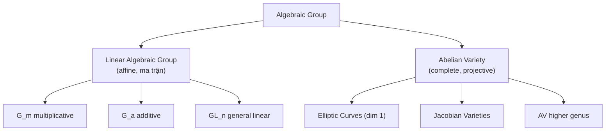

> **Prerequisites**: [[01-affine-projective-varieties|01. Affine and Projective Varieties]], [[02-morphisms-of-varieties|02. Morphisms of Varieties]], [[03-completeness-proper-maps|03. Completeness and Proper Maps]]
> **Objectives**:
> - Hiểu định nghĩa algebraic group và nhận ra ví dụ cụ thể trong tự nhiên
> - Phân biệt hai lớp lớn: linear algebraic group (affine) và abelian variety (complete)
> - Thấy elliptic curve là algebraic group chiều 1, làm ví dụ chạy xuyên suốt khoá học

---

## Motivation / Intuition

Trong toán học, cấu trúc nhóm (group) và cấu trúc hình học (geometric/algebraic variety) thường xuất hiện độc lập nhau. Nhưng trong nhiều tình huống quan trọng, chúng **cùng xuất hiện trên cùng một đối tượng**: tập hợp mang cả hai cấu trúc, và chúng tương thích với nhau. Ý tưởng trung tâm của bài này là **algebraic group** — một variety mà đồng thời là nhóm, và các phép toán nhóm đều là morphism.

Ví dụ quen thuộc nhất với bạn là **elliptic curve** $E: y^2 = x^3 + ax + b$. Tập hợp các điểm trên $E$ có một phép cộng (group law) được định nghĩa bằng công thức đại số — chính là phép cộng điểm mà bạn đã biết từ cryptography. Phép cộng này không chỉ là một phép toán trừu tượng: nó được mô tả bởi các **rational function** (hàm hữu tỉ) và do đó là một **morphism of varieties**. Đây chính xác là định nghĩa của algebraic group.

Algebraic groups xuất hiện khắp nơi trong toán học: $\operatorname{GL}_n(k)$ (nhóm ma trận khả nghịch), $(\mathbb{G}_m, \cdot) = (k^\times, \cdot)$ (nhóm nhân của trường), $(\mathbb{G}_a, +) = (k, +)$ (nhóm cộng của trường). Quan trọng hơn, chúng được phân loại thành hai lớp lớn: **linear algebraic groups** (affine — như $\operatorname{GL}_n$) và **abelian varieties** (complete — như elliptic curves). Đây là một **dichotomy** (sự phân đôi) sâu sắc và toàn bộ khoá học này nghiên cứu lớp thứ hai.

---

## Algebraic Group (Group Variety)

### Definition

> [!definition] Definition 7.1 — Algebraic Group (Group Variety)
> Một **algebraic group** (hay group variety) trên trường $k$ là một bộ $(G, m, \iota, e)$ gồm:
>
> - $G$: một $k$-variety,
> - $m: G \times G \to G$: morphism **nhân** (multiplication),
> - $\iota: G \to G$: morphism **nghịch đảo** (inversion),
> - $e: \operatorname{Spec}(k) \to G$: điểm $k$-rational là **phần tử đơn vị** (identity),
>
> sao cho các biểu đồ sau commute (tức là các tiên đề nhóm được thỏa mãn dưới dạng morphism):
>
> $$
> m \circ (m \times \operatorname{id}_G) = m \circ (\operatorname{id}_G \times m) \quad \text{(tính kết hợp)}
> $$

Điều kiện quan trọng ở đây là $m$ và $\iota$ phải là **morphisms of varieties** (không chỉ là ánh xạ tập hợp). Nói cách khác, group law được mô tả bởi các đa thức hoặc hàm hữu tỉ.

> [!note] Remark 7.2
> Trong tài liệu hiện đại, người ta thường nói "algebraic group" và ngầm hiểu là group scheme smooth và geometrically connected. Với các abelian variety, chúng ta sẽ luôn giả sử $G$ là smooth, connected, và defined over $k$.

---

### Ví dụ Cơ Bản: Ba Algebraic Group Chuẩn

Có ba ví dụ nền tảng mà mọi sinh viên cần nắm vững:

> [!example] Example 7.3 — Nhóm Nhân $\mathbb{G}_m$ (Multiplicative Group)
> Định nghĩa $\mathbb{G}_m = \operatorname{Spec}(k[t, t^{-1}])$ như là affine variety (hyperbola $xy = 1$ trong $\mathbb{A}^2$). Group law là phép nhân:
>
> $$
> m: \mathbb{G}_m \times \mathbb{G}_m \to \mathbb{G}_m, \quad m(s, t) = st
> $$
>
> Inversion: $\iota(t) = t^{-1}$. Identity: $e = 1$.
>
> Trên $k$-points: $\mathbb{G}_m(k) = k^\times$ (các phần tử khả nghịch của $k$).
>
> Ví dụ quen trong crypto: $\mathbb{G}_m(\mathbb{F}_p) = \mathbb{F}_p^\times \cong \mathbb{Z}/(p-1)\mathbb{Z}$ — nhóm cyclic cơ sở của discrete logarithm.

> [!example] Example 7.4 — Nhóm Cộng $\mathbb{G}_a$ (Additive Group)
> Định nghĩa $\mathbb{G}_a = \mathbb{A}^1 = \operatorname{Spec}(k[t])$ với group law là phép cộng:
>
> $$
> m(s, t) = s + t, \quad \iota(t) = -t, \quad e = 0
> $$
>
> Trên $k$-points: $\mathbb{G}_a(k) = (k, +)$.
>
> Đây là algebraic group "nghèo" nhất — nó hoàn toàn khác với $\mathbb{G}_m$ mặc dù cả hai đều là $\mathbb{A}^1$ như variety. Sự khác biệt nằm ở group law.

> [!example] Example 7.5 — Nhóm Tuyến Tính Tổng Quát $\operatorname{GL}_n$
> Định nghĩa $\operatorname{GL}_n = \{M \in \operatorname{Mat}_{n \times n} \mid \det(M) \neq 0\}$ là open subvariety của $\mathbb{A}^{n^2}$. Group law là phép nhân ma trận:
>
> $$
> m(A, B) = AB
> $$
>
> Tất cả các phép toán (nhân, nghịch đảo, tính định thức) đều được định nghĩa bởi đa thức hoặc hàm hữu tỉ, nên $\operatorname{GL}_n$ là algebraic group.
>
> Quan trọng: $\operatorname{GL}_n$ **không giao hoán** khi $n \geq 2$, do đó nó KHÔNG thể là abelian variety.

---

### Morphisms of Algebraic Groups

> [!definition] Definition 7.6 — Homomorphism of Algebraic Groups
> Cho $(G, m_G)$ và $(H, m_H)$ là hai algebraic group. Một **homomorphism** (hay morphism of algebraic groups) là một morphism of varieties $f: G \to H$ sao cho:
>
> $$
> f \circ m_G = m_H \circ (f \times f)
> $$
>
> Nghĩa là $f(g_1 \cdot g_2) = f(g_1) \cdot f(g_2)$ cho mọi $g_1, g_2 \in G$.

> [!example] Example 7.7 — Homomorphism cụ thể
> Ánh xạ $[n]: \mathbb{G}_m \to \mathbb{G}_m$ định nghĩa bởi $t \mapsto t^n$ là một homomorphism. Trên $k$-points, đây là phép lũy thừa $x \mapsto x^n$.
>
> Cũng vậy, $\det: \operatorname{GL}_n \to \mathbb{G}_m$ là một homomorphism (định thức tôn trọng phép nhân ma trận).

---

## Hai Lớp Lớn: Dichotomy

Một trong những kết quả phân loại sâu sắc nhất về algebraic group là:

> [!theorem] Theorem 7.8 — Dichotomy (Chevalley's Theorem)
> Mọi connected algebraic group $G$ trên trường $k$ perfect có một dãy khớp ngắn (short exact sequence):
>
> $$
> 1 \to L \to G \to A \to 0
> $$
>
> trong đó $L$ là **linear algebraic group** (affine) và $A$ là **abelian variety** (complete).

> [!definition] Definition 7.9 — Linear Algebraic Group vs. Abelian Variety
> - **Linear algebraic group**: algebraic group mà underlying variety là **affine variety**. Mọi linear algebraic group đều nhúng được vào $\operatorname{GL}_n$ cho một $n$ nào đó. Ví dụ: $\mathbb{G}_m, \mathbb{G}_a, \operatorname{GL}_n, \operatorname{SL}_n$, các nhóm ma trận tam giác, v.v.
>
> - **Abelian variety**: connected algebraic group mà underlying variety là **complete variety** (projective). Ví dụ: elliptic curves, Jacobian của curves, v.v. Chúng tự động là giao hoán (sẽ chứng minh ở Bài 09).

Đây là dichotomy cơ bản:



*Phân loại các algebraic group theo tính chất hình học của underlying variety.*

---

## Elliptic Curve Là Algebraic Group

Ví dụ quan trọng nhất và chạy xuyên suốt khoá học:

> [!example] Example 7.10 — Elliptic Curve $E$ Là Algebraic Group
> Cho $E: y^2 = x^3 + ax + b$ là elliptic curve trên $k$ (với $\operatorname{char}(k) \neq 2, 3$ và discriminant $\Delta = -16(4a^3 + 27b^2) \neq 0$). Điểm vô cực $O = [0:1:0]$ là **phần tử đơn vị** (identity).
>
> Group law được định nghĩa bởi công thức sau. Cho $P = (x_1, y_1)$ và $Q = (x_2, y_2)$ với $P \neq \pm Q$:
>
> $$
> \lambda = \frac{y_2 - y_1}{x_2 - x_1}, \quad x_3 = \lambda^2 - x_1 - x_2, \quad y_3 = \lambda(x_1 - x_3) - y_1
> $$
>
> Tất cả các phép toán này là **rational functions** trong tọa độ của $P$ và $Q$ — do đó group law $m: E \times E \to E$ là một morphism of varieties. Inversion là $\iota(x, y) = (x, -y)$ — cũng là morphism.

> [!note] Remark 7.11 — Tại Sao $O$ Là Điểm Vô Cực?
> Nhìn vào công thức cộng: $P + (-P) = O$. Điểm $O$ phải là "điểm trung tính" và phải nằm trên $E$. Trong tọa độ affine, không có điểm nào thỏa điều này, nhưng trong tọa độ projective, $O = [0:1:0]$ nằm trên đường cong projective $Y^2 Z = X^3 + aXZ^2 + bZ^3$. Đây là lý do tại sao phải làm việc với projective variety.

Chúng ta sẽ xem $E$ như là prototype của abelian variety chiều 1 và liên tục sử dụng nó để minh họa lý thuyết chung.

---

## Tính Smooth và Connectedness

> [!theorem] Theorem 7.12 — Algebraic Group Là Smooth
> Mọi algebraic group $G$ trên trường $k$ là **smooth** (non-singular tại mọi điểm).

**Proof sketch.** Do phép dịch chuyển (translation) $t_g: G \to G$, $x \mapsto gx$ là automorphism của $G$, mọi điểm của $G$ có cùng tính chất cục bộ với điểm đơn vị $e$. Nếu $G$ smooth tại $e$ thì smooth tại mọi nơi. Smooth tại $e$ được kiểm tra bằng cách nhìn vào tangent space (không gian tiếp tuyến) tại $e$ — đây là không gian tuyến tính có chiều bằng $\dim G$. $\blacksquare$

> [!note] Remark 7.13 — Ý nghĩa với Abelian Varieties
> Kết quả này quan trọng vì nhiều định lý hình học đại số đòi hỏi smooth variety. Ví dụ: trên một smooth projective variety, mọi Weil divisor đều là Cartier divisor — điều này sẽ được dùng khi làm việc với line bundles trên abelian variety.

---

## SageMath Cheatsheet

```python
k = GF(101)
E = EllipticCurve(k, [2, 3])

print(E.order())

P = E.random_point()
Q = E.random_point()
print(P + Q)
print(-P)
print(E(0))

print(E.j_invariant())

for P in E.points()[:5]:
    print(P, 2*P, 3*P)
```

---

## Summary / Key Takeaways

- Algebraic group = variety + group law (multiplication, inversion, identity đều là morphisms).
- Ba ví dụ chuẩn: $\mathbb{G}_m$ (nhóm nhân), $\mathbb{G}_a$ (nhóm cộng), $\operatorname{GL}_n$ (ma trận khả nghịch).
- Dichotomy cơ bản: linear algebraic groups (affine) vs. abelian varieties (complete/projective).
- Mọi algebraic group là smooth — mọi điểm như nhau nhờ phép dịch chuyển.
- Elliptic curve $E: y^2 = x^3 + ax + b$ với điểm $O$ tại vô cực là abelian variety chiều 1 — ví dụ nguyên mẫu chạy xuyên suốt.
- Khoá học này tập trung vào abelian varieties: complete algebraic groups — chúng tự động giao hoán và projective.

---

## References

- Milne, J.S. *Abelian Varieties* (2022), §1: Definitions. [https://www.jmilne.org/math/xnotes/AVs.pdf](https://www.jmilne.org/math/xnotes/AVs.pdf)
- Milne, J.S. *Algebraic Groups* (2017), Chapter 1–2. [https://www.jmilne.org/math/CourseNotes/iAG200.pdf](https://www.jmilne.org/math/CourseNotes/iAG200.pdf)
- van der Geer, G. & Moonen, B. *Abelian Varieties*. [http://van-der-geer.nl/~gerard/AV.pdf](http://van-der-geer.nl/~gerard/AV.pdf)
- Mumford, D. *Abelian Varieties*. Tata Institute, Oxford University Press, 1970.
- Silverman, J.H. *The Arithmetic of Elliptic Curves* (2nd ed.), Chapter III.
