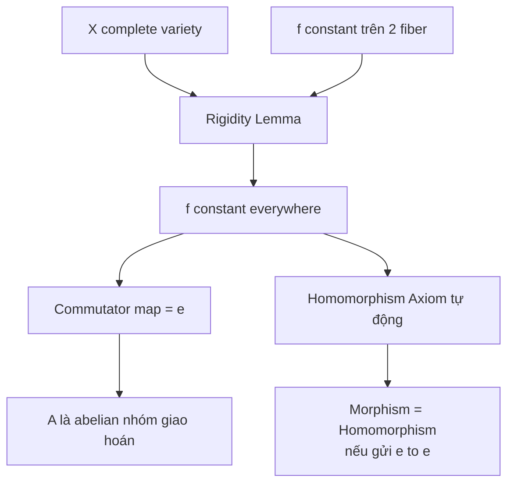

> **Prerequisites**: [[07-algebraic-groups|07. Algebraic Groups — What Are They?]], [[03-completeness-proper-maps|03. Completeness and Proper Maps]]
> **Objectives**:
> - Hiểu tại sao complete variety làm cho morphisms trở nên "cứng" (rigid)
> - Nắm vững phát biểu và chứng minh của Rigidity Lemma
> - Thấy cách Rigidity Lemma dẫn đến tính giao hoán của abelian variety

---

## Motivation / Intuition

Một trong những tính chất kỳ diệu nhất của **complete variety** là chúng "kiểm soát" morphisms một cách rất mạnh. Hãy nhớ lại: một variety $X$ là complete nếu mọi projection $X \times Y \to Y$ đều là **closed map** (ánh xạ đóng). Điều này là analog đại số của tính compact trong tô-pô: compact spaces "capture" continuous functions.

Một hàm số liên tục trên tập compact nhận cực trị và "kiểm soát được". Tương tự, trong hình học đại số, một morphism từ complete variety vào affine variety phải là **constant** (bởi vì image phải vừa là closed lại vừa là image của complete, mà affine không có closed proper subsets là complete). Điều này dẫn đến **Rigidity Lemma**: nếu một morphism $f: X \times Y \to Z$ "constant trên hai fiber", thì nó constant everywhere.

Ý nghĩa sâu xa: Rigidity Lemma nói rằng các morphisms từ complete variety không thể "biến thiên một cách liên tục" theo quá nhiều chiều. Đây là lý do tại sao abelian varieties — complete group varieties — có nhiều tính chất đặc biệt.

---

## Seesaw Lemma (Công Cụ Chuẩn Bị)

Trước khi vào Rigidity Lemma, chúng ta cần một lemma kỹ thuật về line bundles trên product của hai variety:

> [!lemma] Lemma 8.1 — Seesaw Lemma (Nguyên Lý Cái Bập Bênh)
> Cho $X$ là complete variety, $T$ là variety tùy ý, và $L$ là line bundle trên $X \times T$. Giả sử:
>
> - Tồn tại điểm đóng $t_0 \in T$ sao cho $L|_{X \times \{t_0\}} \cong \mathcal{O}_X$, và
> - Tập $S = \{t \in T \mid L|_{X \times \{t\}} \cong \mathcal{O}_X\}$ là **closed** trong $T$ (hay đóng theo nghĩa scheme).
>
> Thì tồn tại line bundle $M$ trên $T$ sao cho:
>
> $$
> L \cong p_T^* M
> $$
>
> trong đó $p_T: X \times T \to T$ là projection. Hơn nữa, $M \cong (p_T)_* L$ và $M$ là duy nhất.

**Proof sketch.** Dùng lý thuyết cohomology của sheaves. Vì $X$ complete, các higher direct images $R^i (p_T)_* L$ là coherent sheaves trên $T$. Điều kiện $L|_{X \times \{t\}} \cong \mathcal{O}_X$ đảm bảo $H^0(X, L|_{X \times \{t\}}) = k$ và $H^i(X, L|_{X \times \{t\}}) = 0$ cho $i > 0$ (bằng lý thuyết base change). Điều này cho phép kết luận $(p_T)_* L$ là line bundle $M$, và $p_T^* M \cong L$. $\blacksquare$

> [!note] Remark 8.2 — Cách đọc Seesaw Lemma
> Hình ảnh "cái bập bênh" (seesaw): nếu $L$ là trivial trên NHIỀU fibers $X \times \{t\}$, thì $L$ "phải" có dạng $p_T^* M$ — tức là nó chỉ phụ thuộc vào chiều $T$, không phụ thuộc vào chiều $X$. Điều này là "rigid" theo nghĩa: line bundle trên một product bị kiểm soát bởi một yếu tố nếu trivial trên các fiber của yếu tố kia.

---

## Rigidity Lemma

Đây là kết quả kỹ thuật quan trọng nhất trong lý thuyết abelian varieties:

> [!theorem] Theorem 8.3 — Rigidity Lemma (Mumford)
> Cho $X$ là **complete variety**, $Y$ và $Z$ là các variety tùy ý (không cần complete). Cho $f: X \times Y \to Z$ là một morphism. Giả sử tồn tại điểm $x_0 \in X(k)$ và $y_0 \in Y(k)$ sao cho:
>
> $$
> f(X \times \{y_0\}) = \{z_0\} \quad \text{và} \quad f(\{x_0\} \times Y) = \{z_0\}
> $$
>
> (tức là $f$ constant bằng $z_0$ trên cả hai fiber $X \times \{y_0\}$ và $\{x_0\} \times Y$). Thì:
>
> $$
> f(x, y) = z_0 \quad \text{cho mọi } (x, y) \in X \times Y
> $$
>
> Nghĩa là $f$ là hằng số (constant morphism).

Xem chứng minh đầy đủ tại [[a0-rigidity-lemma-proof|A0. Proof of the Rigidity Lemma]].

**Proof sketch.** (Milne, Theorem 2.1 — phiên bản ngắn gọn)

Bước 1: Chọn open affine $U_0 \subset Z$ chứa $z_0$.

Bước 2: Vì $X$ là complete, projection $q: X \times Y \to Y$ là **closed map**. Định nghĩa tập đóng:

$$
Z_{\text{bad}} = f^{-1}(Z \setminus U_0) \subset X \times Y
$$

Thì $q(Z_{\text{bad}}) \subset Y$ là closed. Mặt khác, $y_0 \notin q(Z_{\text{bad}})$ (vì $f(X \times \{y_0\}) = \{z_0\} \subset U_0$). Vậy $W = Y \setminus q(Z_{\text{bad}})$ là open dense trong $Y$.

Bước 3: Với mỗi điểm đóng $w \in W$: $f(X \times \{w\}) \subset U_0$. Vì $X$ là complete và $U_0$ là affine, image của complete variety trong affine variety phải là điểm (complete $\cap$ affine = finite $\subset$ affine, nhưng complete means image is closed in affine, and a closed subscheme of affine variety that is complete is a point). Do đó $f(X \times \{w\}) = \{z_w\}$ là một điểm.

Bước 4: Giả sử $x_0 \in X$, thì $f(x_0, w) = f(\{x_0\} \times Y)|_{y=w} = z_0$. Suy ra $z_w = z_0$.

Bước 5: Vậy $f(X \times \{w\}) = \{z_0\}$ với mọi $w$ trong open dense set $W$. Bằng continuity, $f$ constant bằng $z_0$ trên toàn bộ $X \times Y$. $\blacksquare$

---

## Hệ Quả Quan Trọng

Từ Rigidity Lemma, ta suy ra nhiều hệ quả mạnh:

> [!corollary] Corollary 8.4 — Morphism Từ Complete Variety Vào Affine
> Mọi morphism từ một **connected complete variety** $X$ vào một **affine variety** $Y$ là constant.

**Proof.** Áp dụng Rigidity Lemma với $Y = \operatorname{Spec}(k)$ (trivial) và $Z = Y$ (affine). Thực ra, trực tiếp hơn: image của $X$ complete trong $Y$ affine phải là tập đóng, nhưng đồng thời là image của connected complete, nên phải là một điểm. $\blacksquare$

> [!corollary] Corollary 8.5 — Morphism Từ Complete Group Variety
> Cho $(G, m)$ là một connected complete group variety (tức abelian variety), và $(H, n)$ là một algebraic group. Mọi morphism of varieties $f: G \to H$ thỏa $f(e_G) = e_H$ đều là một **homomorphism of algebraic groups**.

**Proof.** Xét morphism $\phi: G \times G \to H$ định nghĩa bởi:

$$
\phi(x, y) = f(x + y) \cdot f(x)^{-1} \cdot f(y)^{-1}
$$

Ta cần chứng minh $\phi \equiv e_H$. Kiểm tra: $\phi(x, e_G) = f(x) \cdot f(x)^{-1} \cdot f(e_G)^{-1} = e_H$. Tương tự $\phi(e_G, y) = e_H$. Do $G$ là complete, Rigidity Lemma cho $\phi \equiv e_H$. Suy ra $f(x+y) = f(x) \cdot f(y)$, tức $f$ là homomorphism. $\blacksquare$

> [!corollary] Corollary 8.6 — Tính Duy Nhất Của Homomorphism
> Nếu $f, g: A \to B$ là hai homomorphisms của abelian varieties thỏa $f(e_A) = g(e_A) = e_B$, và $f = g$ trên một tập con Zariski dense, thì $f = g$.

**Proof.** Xét $h = f - g: A \to B$ (phép trừ trong nhóm $B$). Thì $h(e_A) = e_B$ và $h$ trivial trên dense set. Vì $A$ connected, $h \equiv e_B$, tức $f = g$. $\blacksquare$

---

## Ứng Dụng: Chuẩn Bị Cho Commutativity

Rigidity Lemma là chìa khóa để chứng minh abelian varieties giao hoán. Hãy thấy ý tưởng:

> [!example] Example 8.7 — Commutator Map
> Cho $A$ là connected complete group variety. Xét **commutator map** (ánh xạ giao hoán tử):
>
> $$
> \phi: A \times A \to A, \quad \phi(x, y) = x + y - x - y = [x, y]
> $$
>
> (Trong ký hiệu nhóm nhân: $\phi(x,y) = xyx^{-1}y^{-1}$.)
>
> Kiểm tra: $\phi(x, e) = x + e - x - e = e$ và $\phi(e, y) = e$. Vậy $\phi$ constant bằng $e$ trên cả hai fiber.
>
> Theo Rigidity Lemma (với $X = A$ là complete), $\phi \equiv e$. Tức là:
>
> $$
> x + y - x - y = e \implies x + y = y + x \quad \text{cho mọi } x, y \in A
> $$
>
> **Vậy $A$ là giao hoán!** Đây là nội dung của Bài 09.

---

## Phạm Vi Áp Dụng và Giới Hạn

> [!warning] Counterexample 8.8 — Không Thể Bỏ Qua Điều Kiện Complete
> Giả sử $X$ KHÔNG là complete. Khi đó Rigidity Lemma có thể thất bại.
>
> Ví dụ: Xét $f: \mathbb{G}_m \times \mathbb{G}_m \to \mathbb{G}_m$ định nghĩa bởi $f(s, t) = s/t$. Thì $f(\mathbb{G}_m \times \{1\}) = \mathbb{G}_m$ (không phải constant!), mặc dù $f(1, t) = 1/t$ (cũng không constant). Điều kiện "constant trên hai fiber" không được thỏa mãn ở đây.
>
> Nhưng thậm chí nếu ta định nghĩa $f(s,t) = s \cdot t \cdot (s \cdot t)^{-2}$... mọi sự vi phạm của Rigidity đều xảy ra do $\mathbb{G}_m$ là affine, NOT complete.

> [!note] Remark 8.9 — Rigidity Trong Bối Cảnh Rộng Hơn
> Có các phiên bản tổng quát của Rigidity Lemma cho group schemes (không nhất thiết smooth), và cho morphisms của stacks. Nhưng trong khoá học này, phiên bản trên đã đủ cho mọi ứng dụng.

---

## Biểu Đồ Luận Lý



*Chuỗi suy diễn từ Rigidity Lemma đến tính giao hoán của abelian varieties.*

---

## SageMath Cheatsheet

```python
E = EllipticCurve(GF(101), [2, 3])
P = E.random_point()
Q = E.random_point()

comm = P + Q + (-P) + (-Q)
print("Commutator P+Q-P-Q =", comm)

f = lambda P, Q: P + Q
g = lambda P, Q: Q + P
print("P+Q == Q+P:", f(P, Q) == g(P, Q))
```

---

## Summary / Key Takeaways

- Rigidity Lemma: nếu $f: X \times Y \to Z$ (với $X$ complete) là constant trên $X \times \{y_0\}$ và $\{x_0\} \times Y$, thì $f$ constant everywhere.
- Chứng minh dùng tính chất "closed image" của complete variety và tính chất affine của target.
- Hệ quả 1: Mọi morphism từ connected complete variety vào affine variety là constant.
- Hệ quả 2: Morphism từ complete group variety gửi $e$ vào $e$ thì tự động là homomorphism.
- Ứng dụng chính: Commutator map trên complete group variety phải là constant, suy ra **commutativity**.
- Đây là lý do abelian varieties (= complete connected group varieties) giao hoán — không phải giả thiết, mà là kết quả của hình học!

---

## References

- Mumford, D. *Abelian Varieties*, Chapter II, §1 (Rigidity Lemma, p. 43). Oxford University Press, 1970.
- Milne, J.S. *Abelian Varieties* (2022), Theorem 2.1. [https://www.jmilne.org/math/xnotes/AVs.pdf](https://www.jmilne.org/math/xnotes/AVs.pdf)
- van der Geer, G. & Moonen, B. *Abelian Varieties*, Chapter I, §1. [http://van-der-geer.nl/~gerard/AV.pdf](http://van-der-geer.nl/~gerard/AV.pdf)
- Conrad, B. *Abelian Varieties* (Stanford Lecture Notes), Lecture 4. [http://virtualmath1.stanford.edu/~conrad/mordellsem/Notes/L02.pdf](http://virtualmath1.stanford.edu/~conrad/mordellsem/Notes/L02.pdf)
- nLab: *Abelian Variety* [https://ncatlab.org/nlab/show/abelian+variety](https://ncatlab.org/nlab/show/abelian+variety)
