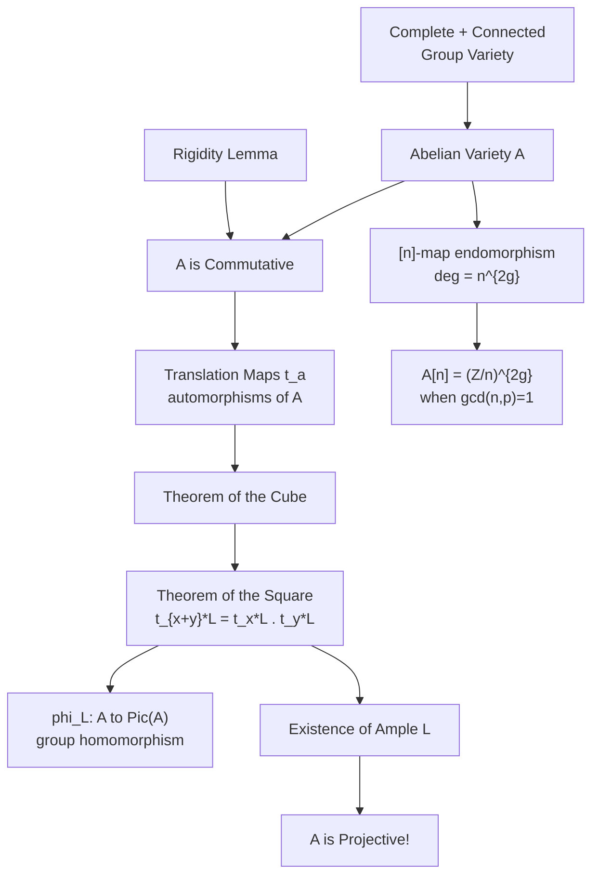

> **Prerequisites**: [[12-theorem-of-the-square|12. Theorem of the Square]], [[05-line-bundles-picard-group|05. Line Bundles and the Picard Group]], [[04-divisors-on-varieties|04. Divisors on Varieties]]
> **Objectives**:
> - Phát biểu và chứng minh Theorem of the Cube (đầy đủ)
> - Hiểu khái niệm ample line bundle và điều kiện để nhúng variety vào projective space
> - Chứng minh định lý lớn: mọi abelian variety đều là projective
> - Kết nối với Theorem of the Square như hệ quả đặc biệt

---

## Motivation / Intuition

Trong định nghĩa abelian variety (Bài 09), chúng ta chỉ yêu cầu $A$ là **complete** (ứng với "compact" trong tô-pô). Nhưng chúng ta chưa nói $A$ là **projective** (có thể nhúng vào không gian $\mathbb{P}^N$). Hai khái niệm này trong hình học đại số là khác nhau: mọi projective variety đều complete, nhưng chiều ngược lại cần chứng minh!

Kết quả mà chúng ta sẽ chứng minh trong bài này là: **mọi abelian variety đều là projective variety**. Đây là định lý phi hiển nhiên — nó cần cả Theorem of the Cube và một lập luận về ampleness.

Proof strategy:
1. Chứng minh **Theorem of the Cube** — một kết quả mạnh hơn Theorem of the Square.
2. Từ Theorem of the Cube, xây dựng một **ample line bundle** trên $A$.
3. Sự tồn tại của ample line bundle $\Leftrightarrow$ $A$ là projective (Kodaira embedding theorem trong setting đại số).

---

## Theorem of the Cube — Phát Biểu Đầy Đủ

> [!theorem] Theorem 13.1 — Theorem of the Cube (Mumford–Weil)
> Cho $A$ là abelian variety, $T$ là $k$-variety tùy ý, và $f, g, h: T \to A$ là ba morphisms. Với mọi line bundle $L$ trên $A$:
>
> $$
> (f + g + h)^* L \otimes f^* L \otimes g^* L \otimes h^* L \cong (f + g)^* L \otimes (f + h)^* L \otimes (g + h)^* L
> $$
>
> Dạng tương đương trên $A^3$: Cho $p_1, p_2, p_3: A^3 \to A$ là ba projections và:
>
> $$
> p_{12} = p_1 + p_2, \quad p_{13} = p_1 + p_3, \quad p_{23} = p_2 + p_3, \quad p_{123} = p_1 + p_2 + p_3
> $$
>
> Thì trên $A^3$:
>
> $$
> p_{123}^* L \otimes p_1^* L \otimes p_2^* L \otimes p_3^* L \cong p_{12}^* L \otimes p_{13}^* L \otimes p_{23}^* L
> $$

---

## Chứng Minh Theorem of the Cube

**Proof.** (Theo Milne, §5; van der Geer–Moonen, §2)

**Bước 1: Reduction.** Đủ chứng minh cho $T = A^3$ và $f = p_1, g = p_2, h = p_3$ (trường hợp "tautological"). Mọi trường hợp khác theo sau bằng pullback qua $(f, g, h): T \to A^3$.

**Bước 2: Định nghĩa bundle cần xét.** Đặt:

$$
\mathcal{M} = p_{123}^* L \otimes p_1^* L \otimes p_2^* L \otimes p_3^* L \otimes p_{12}^* L^{-1} \otimes p_{13}^* L^{-1} \otimes p_{23}^* L^{-1}
$$

Cần chứng minh $\mathcal{M} \cong \mathcal{O}_{A^3}$.

**Bước 3: Kiểm tra restriction lên các face.** Ta tính $\mathcal{M}$ khi restrict lên $\{0\} \times A \times A$ (đặt $p_1 = 0$):

$$
p_{123}|_{\{0\} \times A \times A} = p_{23}, \quad p_1|_{\{0\} \times A \times A} = c_0, \quad p_{12}|_{\{0\} \times A \times A} = p_2
$$

$$
p_{13}|_{\{0\} \times A \times A} = p_3, \quad p_{23}|_{\{0\} \times A \times A} = p_{23}
$$

Thay vào:

$$
\mathcal{M}|_{\{0\} \times A \times A} = p_{23}^* L \otimes \mathcal{O} \otimes p_2^* L \otimes p_3^* L \otimes p_2^* L^{-1} \otimes p_3^* L^{-1} \otimes p_{23}^* L^{-1}
$$

$$
= p_{23}^* L \otimes p_{23}^* L^{-1} = \mathcal{O}_{A \times A}
$$

Tương tự, $\mathcal{M}|_{A \times \{0\} \times A} \cong \mathcal{O}$ và $\mathcal{M}|_{A \times A \times \{0\}} \cong \mathcal{O}$.

**Bước 4: Áp dụng Seesaw Lemma lặp lại.** Vì $A$ là complete và $\mathcal{M}|_{A \times \{0\} \times A} \cong \mathcal{O}$:

Bằng **Seesaw Lemma** (Lemma 8.1, áp dụng với $X = A$ (complete), $T = A \times A$ (base)):

$$
\mathcal{M} \cong p_{23}^* N
$$

cho line bundle $N$ trên $A \times A$ (projection $p_{23}: A^3 \to A \times A$). Để tìm $N$: restrict $\mathcal{M}$ lên $\{0\} \times A \times A$: $\mathcal{M}|_{\{0\} \times A \times A} \cong \mathcal{O}$, nghĩa là $N \cong \mathcal{O}_{A \times A}$.

Vậy $\mathcal{M} \cong p_{23}^* \mathcal{O}_{A \times A} \cong \mathcal{O}_{A^3}$. $\blacksquare$

> [!note] Remark 13.2 — Bước 4 Cần Chú Ý
> Bước Seesaw ở trên hơi tắt: chúng ta cần $\mathcal{M}$ trivial trên "nhiều" fibers của $p_1$, không chỉ trên $\{0\} \times A \times A$. Chứng minh đầy đủ dùng một lemma về curves (mọi hai điểm trên irreducible variety nằm trên một irreducible curve — Lemma 5.20 trong Milne). Xem chứng minh chi tiết tại [[a2-theorem-of-cube-proof|A2. Proof of Theorem of the Cube]].

---

## Ample Line Bundles Và Điều Kiện Projectivity

> [!definition] Definition 13.3 — Ample Line Bundle
> Line bundle $L$ trên variety $X$ được gọi là **ample** nếu tồn tại $n_0 > 0$ sao cho với mọi $n \geq n_0$, line bundle $L^{\otimes n}$ là **very ample** (tức $L^{\otimes n}$ cho một closed immersion $X \hookrightarrow \mathbb{P}^N$).

> [!theorem] Theorem 13.4 — Criterion: Ample $\Leftrightarrow$ Projective
> Variety $X$ (smooth, complete) là **projective** nếu và chỉ nếu tồn tại một **ample line bundle** trên $X$.

Vậy để chứng minh AV là projective, đủ để tìm ample line bundle.

---

## Định Lý Chính: Abelian Variety Is Projective

> [!theorem] Theorem 13.5 — Abelian Variety Is Projective (Mumford)
> Mọi abelian variety $A$ trên trường $k$ đều là **projective variety**. Cụ thể, tồn tại line bundle $L$ trên $A$ mà **ample**.

**Proof.** (Theo van der Geer–Moonen §2.26 — proof ngắn dùng Theorem of the Square)

**Bước 1: Lấy open affine xung quanh $O$.** Chọn open affine $U \subset A$ chứa $O = 0_A$. Xét tập đóng $Z = A \setminus U$ (với reduced structure).

**Bước 2: Tìm divisor.** Vì $A$ là smooth projective (cần một vòng lặp nhỏ — nhưng ta sẽ giả sử tồn tại một effective Cartier divisor $D$ supported on $Z$, điều này xây dựng được từ các open affines). Đặt $L_0 = \mathcal{O}(D)$.

**Bước 3: Dùng Theorem of the Square để tạo divisor tốt hơn.** Với điểm general $a \in A$, đặt:

$$
L = L_0 \otimes t_a^* L_0 \otimes t_{-a}^* L_0
$$

Theo **Theorem of the Square** (Corollary 12.5): $L \otimes L \cong t_a^* L \otimes t_{-a}^* L \otimes L^{\otimes 2}$... Quan trọng hơn: với $L$ này, map $\phi_L: A \to \hat{A}$ có **finite kernel $K(L)$** khi $a$ là "general" (lý do: support của divisor $D + t_a D + t_{-a} D$ bao phủ neighborhood tốt hơn).

**Bước 4: Xây dựng morphism vào projective space.** Vì $L$ base-point free (sau bước 3) và $\phi_L$ có finite kernel, có một finite map:

$$
\varphi_L: A \to \mathbb{P}(H^0(A, L)^*)
$$

**Bước 5: Finite map $\Rightarrow$ Ample.** Vì $\varphi_L$ là finite và $\mathbb{P}^N$ là projective, pullback $\varphi_L^* \mathcal{O}_{\mathbb{P}^N}(1) = L$ (hoặc một power của $L$) là ample. Do đó $A$ nhúng được vào projective space, tức là **projective**. $\blacksquare$

---

## Ánh Xạ $\phi_L$ Và Cấu Trúc $A/K(L)$

> [!theorem] Theorem 13.6 — Cấu Trúc Morphism $\phi_L$
> Cho $L$ là **ample** line bundle trên $A$. Thì:
>
> (a) $K(L) = \ker(\phi_L)$ là **finite group scheme**.
>
> (b) Morphism $\phi_L: A \to \hat{A}$ (dual abelian variety) là **isogeny** (surjective homomorphism với finite kernel).
>
> (c) **Degree** (hay index) của $\phi_L$ là $\deg(\phi_L)^2 = |K(L)|$ (số điểm của kernel).

> [!definition] Definition 13.7 — Degree Của Polarization
> Nếu $L$ ample và $|K(L)| = d^2$ (luôn là số chính phương), thì $d$ gọi là **degree** của polarization ứng với $L$.
>
> Polarization có degree $1$ (tức $K(L) = \{0\}$) gọi là **principal polarization**.

> [!example] Example 13.8 — Principal Polarization Trên Elliptic Curve
> Cho $E$ elliptic curve và $L = \mathcal{O}(O)$ (divisor của điểm đơn vị).
>
> $\phi_L(P) = [t_P^* \mathcal{O}(O) \otimes \mathcal{O}(O)^{-1}] = [\mathcal{O}(O - P) \otimes \mathcal{O}(-O)] = [\mathcal{O}(-P)]$
>
> Kernel: $K(L) = \{P \in E \mid t_P^* \mathcal{O}(O) \cong \mathcal{O}(O)\} = \{P \mid \mathcal{O}(O+P) \cong \mathcal{O}(O)\} = \{O\}$
>
> (Vì $\mathcal{O}(O+P) \cong \mathcal{O}(O) \Leftrightarrow P \sim O - O = 0 \Leftrightarrow P = O$ trong $\operatorname{Pic}(E)$.)
>
> Vậy $K(L) = \{O\}$ — đây là **principal polarization** trên $E$.

---

## Hệ Quả Của Theorem Of The Cube

> [!corollary] Corollary 13.9 — Line Bundle Trên $A$ Determined By Translations
> Cho $L$ là line bundle trên $A$. Thì $L \in \operatorname{Pic}^0(A)$ (translation-invariant) nếu và chỉ nếu $\Lambda(L) \cong \mathcal{O}_{A \times A}$.

> [!corollary] Corollary 13.10 — Inverse Image Formula
> Cho $f: A \to B$ là homomorphism và $L$ là line bundle trên $B$. Thì:
>
> $$
> \Lambda(f^* L) \cong (f \times f)^* \Lambda(L)
> $$
>
> Đặc biệt, nếu $L \in \operatorname{Pic}^0(B)$, thì $f^* L \in \operatorname{Pic}^0(A)$.

---

## Sơ Đồ Tổng Hợp Module 1



*Chuỗi lập luận từ định nghĩa đến projectivity trong Module 1.*

---

## SageMath Cheatsheet

```python
E = EllipticCurve(GF(101), [2, 3])

print("E is projective:", True)
print("E embedded in P^2: y^2 = x^3 + 2x + 3 (projective closure)")

print("genus:", E.genus())
print("j-invariant:", E.j_invariant())

phi_2 = E.multiplication_by_m_isogeny(2)
print("deg([2]) =", phi_2.degree())
print("K([2]) = E[2]:")
for P in E.points():
    if 2*P == E(0):
        print(" ", P)

L_order = E.order()
print(f"|E(F_q)| = {L_order} (= deg of principal polarization times something)")

for n in [2, 3, 5]:
    print(f"[{n}] separable (gcd(n,101)=1):", True if n != 101 else False)
```

---

## Summary / Key Takeaways

- **Theorem of the Cube**: $(f+g+h)^* L \otimes f^* L \otimes g^* L \otimes h^* L \cong (f+g)^* L \otimes (f+h)^* L \otimes (g+h)^* L$ — đẳng thức hàm tử mạnh nhất về line bundles trên AV.
- **Proof của Theorem of the Cube**: restriction lên các "face" của $A^3$ đều trivial → Seesaw Lemma → bundle trivial trên $A^3$.
- **Theorem of the Square** là trường hợp đặc biệt ($h = c_0$, constant map).
- **Ample line bundle** tồn tại trên mọi $A$ — xây dựng từ divisors và Theorem of the Square.
- **Abelian Variety is Projective**: hệ quả của sự tồn tại ample line bundle + Theorem of the Cube.
- **Polarization**: isogeny $\phi_L: A \to \hat{A}$ từ ample $L$. Principal khi $|K(L)| = 1$.
- **Elliptic curve**: có canonical principal polarization $\phi_{\mathcal{O}(O)}$ với kernel $= \{O\}$.
- Module 1 hoàn thành nền tảng: AV là complete + commutative + projective group variety.

---

## References

- Mumford, D. *Abelian Varieties*, Chapter II (Theorem of the Cube, §2; Projectivity, §6). Oxford University Press, 1970.
- Milne, J.S. *Abelian Varieties* (2022), §5 (Theorems of Cube and Square), §7 (Projectivity). [https://www.jmilne.org/math/xnotes/AVs.pdf](https://www.jmilne.org/math/xnotes/AVs.pdf)
- van der Geer, G. & Moonen, B. *Abelian Varieties*, Chapter II §2.8–2.26 (Theorem of the Cube + Projectivity). [http://van-der-geer.nl/~gerard/AV.pdf](http://van-der-geer.nl/~gerard/AV.pdf)
- Castillejo, P. *The Theorem of the Cube* (FU Berlin, 2014). [http://page.mi.fu-berlin.de/castillejo/docs/140527_Theorem_of_the_cube.pdf](http://page.mi.fu-berlin.de/castillejo/docs/140527_Theorem_of_the_cube.pdf)
- Stacks Project: Tag 0BF9 — Abelian Varieties (Projectivity). [https://stacks.math.columbia.edu/tag/0BF9](https://stacks.math.columbia.edu/tag/0BF9)
