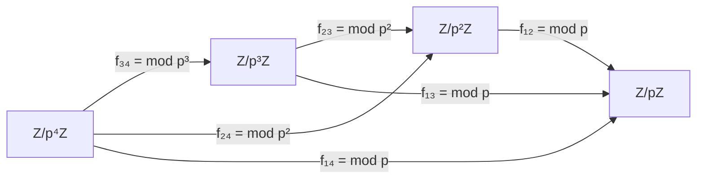

> **Prerequisites**: [[17-n-torsion-points|17. n-Torsion Points A[n]]], [[18-isogeny-equivalence-relation|18. Isogeny as an Equivalence Relation]]
> **Objectives**:
> - Hiểu khái niệm hệ nghịch đảo (inverse system) và giới hạn nghịch đảo (inverse limit) trong ngữ cảnh nhóm và vành
> - Xây dựng vành số nguyên $p$-adic $\mathbb{Z}_p$ như một inverse limit cụ thể
> - Nắm được tính chất cấu trúc của $\mathbb{Z}_p$: free, torsion-free, complete
> - Chuẩn bị nền tảng để hiểu Tate module ở bài tiếp theo

---

## Motivation / Intuition

Trong toán học, ta thường gặp tình huống: có một dãy các đối tượng $A_1, A_2, A_3, \ldots$ liên hệ với nhau qua các "phép chiếu" $A_{n+1} \to A_n$, và ta muốn tìm một đối tượng "hoàn hảo" $A_\infty$ mà từ đó ta có thể chiếu xuống bất kỳ $A_n$ nào, đồng thời thông tin từ tất cả các $A_n$ được gói gọn trong $A_\infty$.

Hãy nghĩ đến ví dụ trực quan nhất: phép tính modular. Nếu muốn giải phương trình $x^2 \equiv 2 \pmod{7}$, ta có thể thử giải với modulo tăng dần: $7, 49, 343, \ldots$ Mỗi lần ta tìm được một nghiệm xấp xỉ tốt hơn. Câu hỏi đặt ra: **liệu có thể "lấy giới hạn" của chuỗi nghiệm xấp xỉ này không?** Câu trả lời là có — và kết quả chính là số nguyên $7$-adic.

Đây chính xác là ý tưởng của **giới hạn nghịch đảo** (inverse limit): ta "gói" tất cả thông tin từ các xấp xỉ hữu hạn vào một đối tượng vô hạn duy nhất, mà từ đó có thể phục hồi lại bất kỳ xấp xỉ nào. Cấu trúc này sẽ là nền tảng cho bài sau, khi ta áp dụng cùng ý tưởng cho các điểm xoắn $A[\ell^n]$ của abelian variety — và thu được Tate module $T_\ell(A)$.

Một cách nhìn khác: inverse limit là "tích" có cấu trúc, tức là tập hợp các dãy vô hạn "nhất quán" (coherent sequences) trong tích của tất cả các $A_n$.

---

## Hệ Nghịch Đảo (Inverse System)

### Definition

> [!definition] Definition 19.1 — Hệ nghịch đảo (Inverse System)
> Cho $(I, \leq)$ là một **tập được định hướng** (directed set): là tập có quan hệ thứ tự $\leq$ sao cho với mọi $i, j \in I$, tồn tại $k \in I$ với $i \leq k$ và $j \leq k$.
>
> Một **hệ nghịch đảo** (hay **hệ chiếu** — projective system) của các nhóm Abel trên $I$ là một bộ $\bigl((A_i)_{i \in I},\, (f_{ij})_{i \leq j}\bigr)$ gồm:
>
> - Với mỗi $i \in I$: một nhóm Abel $A_i$.
> - Với mỗi cặp $i \leq j$: một đồng cấu nhóm (group homomorphism) $f_{ij} : A_j \to A_i$, gọi là **phép chiếu chuyển tiếp** (transition map).
>
> thỏa mãn hai điều kiện nhất quán:
>
> 1. **Đồng nhất**: $f_{ii} = \operatorname{id}_{A_i}$ với mọi $i$.
> 2. **Tương thích**: $f_{ij} \circ f_{jk} = f_{ik}$ với mọi $i \leq j \leq k$.

> [!note] Remark 19.1 — Chiều của mũi tên
> Chú ý: $f_{ij}: A_j \to A_i$ đi theo chiều **ngược** với thứ tự $i \leq j$ trên $I$. Đây là lý do tên gọi "nghịch đảo" (inverse): các mũi tên ngược chiều với chiều tăng của chỉ số.

**Ví dụ tiêu chuẩn quan trọng nhất:** Lấy $I = \mathbb{N}$ với thứ tự thông thường. Cho $p$ là số nguyên tố. Định nghĩa:

$$
A_n = \mathbb{Z}/p^n\mathbb{Z}, \quad f_{mn} : \mathbb{Z}/p^n\mathbb{Z} \to \mathbb{Z}/p^m\mathbb{Z} \text{ là phép lấy dư (reduction mod } p^m\text{) với } m \leq n.
$$

Cụ thể: $f_{mn}(\bar{a}) = \overline{a \bmod p^m}$. Đây là một hệ nghịch đảo vì:
- $f_{nn} = \operatorname{id}$, và
- $f_{mk} = f_{mn} \circ f_{nk}$ với $m \leq n \leq k$ (lấy dư hai lần bằng lấy dư một lần).

### Commutative Diagram

Sơ đồ giao hoán của hệ nghịch đảo $\mathbb{Z}/p^n\mathbb{Z}$:



---

## Giới Hạn Nghịch Đảo (Inverse Limit)

### Definition

> [!definition] Definition 19.2 — Giới hạn nghịch đảo (Inverse Limit)
> Cho $\bigl((A_i), (f_{ij})\bigr)$ là một hệ nghịch đảo của các nhóm Abel trên tập định hướng $I$. **Giới hạn nghịch đảo** (inverse limit hay projective limit) của hệ này, ký hiệu $\varprojlim_{i \in I} A_i$, là một nhóm Abel $A$ cùng với một bộ đồng cấu $\pi_i : A \to A_i$ (gọi là **phép chiếu**) sao cho:
>
> 1. **Nhất quán**: $f_{ij} \circ \pi_j = \pi_i$ với mọi $i \leq j$.
> 2. **Tính phổ dụng** (Universal property): Với mọi nhóm $B$ và bộ đồng cấu $\varphi_i : B \to A_i$ thỏa $f_{ij} \circ \varphi_j = \varphi_i$, tồn tại **duy nhất** đồng cấu $\varphi : B \to A$ sao cho $\pi_i \circ \varphi = \varphi_i$ với mọi $i$.

Nói cách khác, $\varprojlim A_i$ là "nhóm tốt nhất" nhận bản đồ nhất quán xuống tất cả $A_i$.

### Theorem — Xây dựng tường minh

> [!theorem] Theorem 19.1 — Biểu diễn tường minh của Inverse Limit
> Giới hạn nghịch đảo $\varprojlim_{i \in I} A_i$ tồn tại và đồng cấu với nhóm con của tích:
>
> $$
> \varprojlim_{i \in I} A_i \;\cong\; \left\{ (a_i)_{i \in I} \in \prod_{i \in I} A_i \;\middle|\; f_{ij}(a_j) = a_i \text{ với mọi } i \leq j \right\}
> $$
>
> Phép chiếu $\pi_j : \varprojlim A_i \to A_j$ là phép chiếu tọa độ: $\pi_j\bigl((a_i)\bigr) = a_j$.

**Proof.**
Gọi $A$ là tập con của $\prod_{i} A_i$ như trên. Ta kiểm tra:

**$A$ là nhóm:** Nếu $(a_i), (b_i) \in A$ thì $f_{ij}(a_j + b_j) = f_{ij}(a_j) + f_{ij}(b_j) = a_i + b_i$, nên $(a_i + b_i) \in A$. Phần tử đơn vị là $(0, 0, 0, \ldots)$ và nghịch đảo là $(-a_i)_{i \in I}$.

**Tính phổ dụng:** Với bộ $\varphi_i: B \to A_i$ nhất quán, định nghĩa $\varphi: B \to A$ bởi $\varphi(b) = (\varphi_i(b))_{i \in I}$. Đây là đồng cấu nhóm, nằm trong $A$ (do nhất quán), và thỏa $\pi_i \circ \varphi = \varphi_i$. Tính duy nhất: nếu $\psi: B \to A$ cũng thỏa thì $\pi_i \circ \psi = \varphi_i = \pi_i \circ \varphi$ với mọi $i$, suy ra $\psi = \varphi$. $\blacksquare$

> [!note] Remark 19.2 — "Dãy nhất quán"
> Phần tử của $\varprojlim A_i$ là một **dãy nhất quán** (coherent sequence): bộ $(a_1, a_2, a_3, \ldots)$ với $a_n \in A_n$ và $f_{n,n+1}(a_{n+1}) = a_n$ với mọi $n$. Mỗi số hạng $a_{n+1}$ là một "xấp xỉ tốt hơn" của cùng một "giá trị giới hạn".

---

## Số Nguyên $p$-adic $\mathbb{Z}_p$ — Ví Dụ Trung Tâm

### Definition

> [!definition] Definition 19.3 — Vành số nguyên $p$-adic ($p$-adic Integers)
> Cho $p$ là số nguyên tố. **Vành số nguyên $p$-adic**, ký hiệu $\mathbb{Z}_p$, là inverse limit:
>
> $$
> \mathbb{Z}_p \;:=\; \varprojlim_{n \geq 1} \mathbb{Z}/p^n\mathbb{Z}
> $$
>
> với phép chiếu chuyển tiếp $f_{mn}: \mathbb{Z}/p^n\mathbb{Z} \to \mathbb{Z}/p^m\mathbb{Z}$ là phép lấy dư $a \bmod p^n \mapsto a \bmod p^m$ (với $m \leq n$).

Theo Theorem 19.1, phần tử của $\mathbb{Z}_p$ là dãy:

$$
(a_1, a_2, a_3, \ldots) \quad \text{với } a_n \in \mathbb{Z}/p^n\mathbb{Z}, \quad a_n \equiv a_{n-1} \pmod{p^{n-1}}
$$

Phép cộng và nhân được thực hiện theo từng tọa độ.

### Biểu diễn bằng chuỗi $p$-adic

Mỗi phần tử của $\mathbb{Z}_p$ viết được dưới dạng chuỗi vô hạn:

$$
\alpha = b_0 + b_1 p + b_2 p^2 + b_3 p^3 + \cdots, \quad b_i \in \{0, 1, \ldots, p-1\}
$$

Kết nối với định nghĩa inverse limit: $a_n = b_0 + b_1 p + \cdots + b_{n-1} p^{n-1} \pmod{p^n}$.

> [!example] Example 19.1 — Phần tử $-1$ trong $\mathbb{Z}_7$
> Trong $\mathbb{Z}_7$, ta tìm dãy nhất quán ứng với $-1$:
>
> $$
> a_1 = -1 \bmod 7 = 6, \quad a_2 = -1 \bmod 49 = 48, \quad a_3 = -1 \bmod 343 = 342, \quad \ldots
> $$
>
> Kiểm tra nhất quán: $48 \bmod 7 = 6$ ✓, $342 \bmod 49 = 342 - 6 \cdot 49 = 48$ ✓.
>
> Viết dưới dạng chuỗi $7$-adic: $-1 = 6 + 6 \cdot 7 + 6 \cdot 7^2 + 6 \cdot 7^3 + \cdots$ (vô hạn chữ số $6$).
>
> Thật vậy, đây là "tổng hình học" $6 \cdot \frac{1}{1-7} = \frac{6}{-6} = -1$ (nhưng trong $\mathbb{Z}_7$, mọi thứ hội tụ dưới norm $7$-adic).

> [!example] Example 19.2 — Số nguyên $45$ trong hệ $7$-adic
> Xét $45 \in \mathbb{Z} \subset \mathbb{Z}_7$. Dãy nhất quán tương ứng:
>
> $$
> a_1 = 45 \bmod 7 = 3, \quad a_2 = 45 \bmod 49 = 45, \quad a_3 = 45 \bmod 343 = 45, \quad \ldots
> $$
>
> Nhúng $\mathbb{Z} \hookrightarrow \mathbb{Z}_7$: mỗi số nguyên $n$ ứng với dãy $(n \bmod p^k)_{k \geq 1}$.

### Tính chất cấu trúc của $\mathbb{Z}_p$

> [!theorem] Theorem 19.2 — Tính chất cơ bản của $\mathbb{Z}_p$
> Vành số nguyên $p$-adic $\mathbb{Z}_p$ thỏa mãn:
>
> 1. **Miền tích phân** (integral domain): không có ước không của $0$.
> 2. **Torsion-free**: $\mathbb{Z}_p$ không có phần tử torsion (không có $\alpha \neq 0$ với $n\alpha = 0$ cho $n \in \mathbb{Z}$).
> 3. **Đặc số 0**: $\operatorname{char}(\mathbb{Z}_p) = 0$, với nhúng $\mathbb{Z} \hookrightarrow \mathbb{Z}_p$.
> 4. **Vành định giá rời rạc** (discrete valuation ring — DVR): lý tưởng duy nhất khác $0$ là $(p^n)$ với $n \geq 0$. Đặc biệt, lý tưởng cực đại là $(p)$.
> 5. **Đầy đủ** (complete): mọi dãy Cauchy trong topology $p$-adic đều hội tụ.
> 6. **Nhúng**: $\mathbb{Z} \hookrightarrow \mathbb{Z}_p \subset \mathbb{Q}_p$.

**Proof (điểm 2 — torsion-free).**
Giả sử $n\alpha = 0$ trong $\mathbb{Z}_p$ với $n \in \mathbb{Z}$, $n \neq 0$. Viết $n = p^k m$ với $p \nmid m$. Khi đó $n \alpha_j = 0$ trong $\mathbb{Z}/p^j\mathbb{Z}$ với mọi $j$. Với $j$ đủ lớn ($j > k$), vì $m$ khả nghịch mod $p^{j-k}$, suy ra $\alpha_j \equiv 0 \pmod{p^{j-k}}$. Lấy $j \to \infty$, ta được $\alpha = 0$. $\blacksquare$

> [!note] Remark 19.3 — Trường số $p$-adic $\mathbb{Q}_p$
> Trường số $p$-adic $\mathbb{Q}_p$ thu được bằng cách **nội suy** $\mathbb{Z}_p$: $\mathbb{Q}_p = \mathbb{Z}_p[1/p]$. Phần tử của $\mathbb{Q}_p$ có dạng $p^{-N}(b_0 + b_1 p + b_2 p^2 + \cdots)$ với $N \geq 0$. Đây là trường hoàn hảo (complete field) với chuẩn $p$-adic $|\cdot|_p$.

---

## Compact phủ số học — $\hat{\mathbb{Z}}$

### Definition

> [!definition] Definition 19.4 — Phần bù profini $\hat{\mathbb{Z}}$ (Profinite Completion of $\mathbb{Z}$)
> **Phần bù profini** của $\mathbb{Z}$ là inverse limit:
>
> $$
> \hat{\mathbb{Z}} \;:=\; \varprojlim_{n \geq 1} \mathbb{Z}/n\mathbb{Z}
> $$
>
> với hệ chỉ số là $(\mathbb{N}, \mid)$ (thứ tự chia hết) và phép chiếu là phép lấy dư.

> [!theorem] Theorem 19.3 — Phân tích của $\hat{\mathbb{Z}}$
> Có đẳng cấu vành:
>
> $$
> \hat{\mathbb{Z}} \;\cong\; \prod_{p \text{ nguyên tố}} \mathbb{Z}_p
> $$
>
> Đây là hệ quả của Định lý Thặng Dư Trung Hoa (Chinese Remainder Theorem) áp dụng cho từng cấp $n = \prod p_i^{e_i}$.

> [!note] Remark 19.4 — Ý nghĩa của $\hat{\mathbb{Z}}$
> $\hat{\mathbb{Z}}$ xuất hiện tự nhiên trong lý thuyết Galois: nhóm Galois $\operatorname{Gal}(\bar{\mathbb{F}}_q / \mathbb{F}_q) \cong \hat{\mathbb{Z}}$, sinh bởi Frobenius. Trong bài sau, ta sẽ thấy action của $\operatorname{Gal}(\bar{k}/k)$ trên Tate module $T_\ell(A)$ đóng vai trò trung tâm.

---

## Tính Chất Phạm Trù của Inverse Limit

### Functoriality

> [!theorem] Theorem 19.4 — Functoriality của $\varprojlim$
> Cho $f = (f_i)$ là một bản đồ của hệ nghịch đảo: với mỗi $i$, có đồng cấu $f_i: A_i \to B_i$ tương thích với các phép chiếu. Khi đó tồn tại đồng cấu canonical:
>
> $$
> \varprojlim f_i : \varprojlim A_i \;\longrightarrow\; \varprojlim B_i
> $$
>
> gửi $(a_i)$ đến $(f_i(a_i))$.

**Proof.** Nếu $(a_i) \in \varprojlim A_i$ thì $f_i(a_i) \in B_i$ và $g_{ij}(f_j(a_j)) = f_i(f_{ij}(a_j)) = f_i(a_i)$, nên $(f_i(a_i)) \in \varprojlim B_i$. $\blacksquare$

### Tính chính xác (exactness)

> [!theorem] Theorem 19.5 — Left Exactness của $\varprojlim$
> Cho $0 \to (A_i) \to (B_i) \to (C_i) \to 0$ là một dãy chính xác của hệ nghịch đảo. Khi đó dãy:
>
> $$
> 0 \;\to\; \varprojlim A_i \;\to\; \varprojlim B_i \;\to\; \varprojlim C_i
> $$
>
> là chính xác. Nói chung, $\varprojlim$ không chính xác đến phải — hạng tử thiếu đo bởi $\varprojlim^1$ (Milnor).

> [!warning] Counterexample 19.1 — $\varprojlim$ không right exact
> Xét hệ $0 \to p^n\mathbb{Z} \to \mathbb{Z} \to \mathbb{Z}/p^n\mathbb{Z} \to 0$. Inverse limit của từng thành phần:
>
> $$
> 0 \;\to\; 0 \;\to\; \mathbb{Z} \;\to\; \mathbb{Z}_p
> $$
>
> Không phải dãy chính xác ở phải: chuỗi thặng dư $0 \to \mathbb{Z} \to \mathbb{Z}_p$ là injection nhưng $\mathbb{Z} \neq \mathbb{Z}_p$ (thiếu $\mathbb{Z}_p/\mathbb{Z} \neq 0$).

---

## Tại Sao Điều Này Quan Trọng Cho Bài Sau?

Trong bài 20, ta sẽ áp dụng cùng cấu trúc inverse limit cho các nhóm xoắn:

$$
\cdots \xrightarrow{[\ell]} A[\ell^3](\bar{k}) \xrightarrow{[\ell]} A[\ell^2](\bar{k}) \xrightarrow{[\ell]} A[\ell](\bar{k})
$$

Bản đồ chuyển tiếp là $[\ell]$ (nhân với $\ell$): nó gửi $A[\ell^{n+1}]$ vào $A[\ell^n]$ vì $[\ell] \circ [\ell^n] = [\ell^{n+1}]$.

Giới hạn nghịch đảo:

$$
T_\ell(A) \;=\; \varprojlim_n A[\ell^n](\bar{k})
$$

chính là **Tate module** — công cụ tuyến tính hóa mạnh nhất để nghiên cứu abelian variety.

---

## SageMath Cheatsheet

Làm việc với inverse limit và số $p$-adic trong SageMath:

```python
# Vành số p-adic Z_p (với p=7, độ chính xác 20 chữ số)
Zp7 = Zp(7, prec=20)
Zp7

# Tạo phần tử trong Z_7
alpha = Zp7(-1)
alpha   # hiển thị: 6 + 6*7 + 6*7^2 + ...

# Phần tử từ số nguyên
beta = Zp7(45)
beta.residue(1)   # 45 mod 7 = 3
beta.residue(2)   # 45 mod 49 = 45

# Vành Z/p^n Z
Zmod(7^3)   # Z/343Z

# Trường Q_p
Qp7 = Qp(7, prec=20)
Qp7(1/7)   # 7^(-1) = 7-adic expansion of 1/7
```

---

## Summary / Key Takeaways

- **Inverse system** $(A_i, f_{ij})$: họ nhóm với các đồng cấu tương thích ngược chiều chỉ số.
- **Inverse limit** $\varprojlim A_i$: tập hợp các "dãy nhất quán" $(a_i)$ với $f_{ij}(a_j) = a_i$.
- **$\mathbb{Z}_p = \varprojlim \mathbb{Z}/p^n\mathbb{Z}$**: mỗi phần tử là chuỗi $b_0 + b_1 p + b_2 p^2 + \cdots$.
- $\mathbb{Z}_p$ là **torsion-free**, **DVR**, **characteristic 0**, **complete**.
- **$\hat{\mathbb{Z}} \cong \prod_p \mathbb{Z}_p$**: phân tích theo tất cả số nguyên tố.
- $\varprojlim$ là **left exact functor** — không phải right exact.
- Bài sau: áp dụng inverse limit cho $A[\ell^n]$ để thu được $T_\ell(A)$.

---

## References

- Silverman, J. H. *The Arithmetic of Elliptic Curves* (2nd ed.), Appendix B.4 (Projective Limits).
- Neukirch, J. *Algebraic Number Theory*, Chapter II (p-adic Numbers and Completion).
- Atiyah, M. F. & Macdonald, I. G. *Introduction to Commutative Algebra*, Chapter 10 (Completions).
- Serre, J.-P. *A Course in Arithmetic*, Chapter II (p-adic Fields).
- Milne, J. S. *Abelian Varieties*, Lecture Notes, Chapter 10 (Tate Modules). Available at jmilne.org.
- Wikipedia: [Inverse limit](https://en.wikipedia.org/wiki/Inverse_limit), [p-adic integers](https://en.wikipedia.org/wiki/P-adic_integer).
