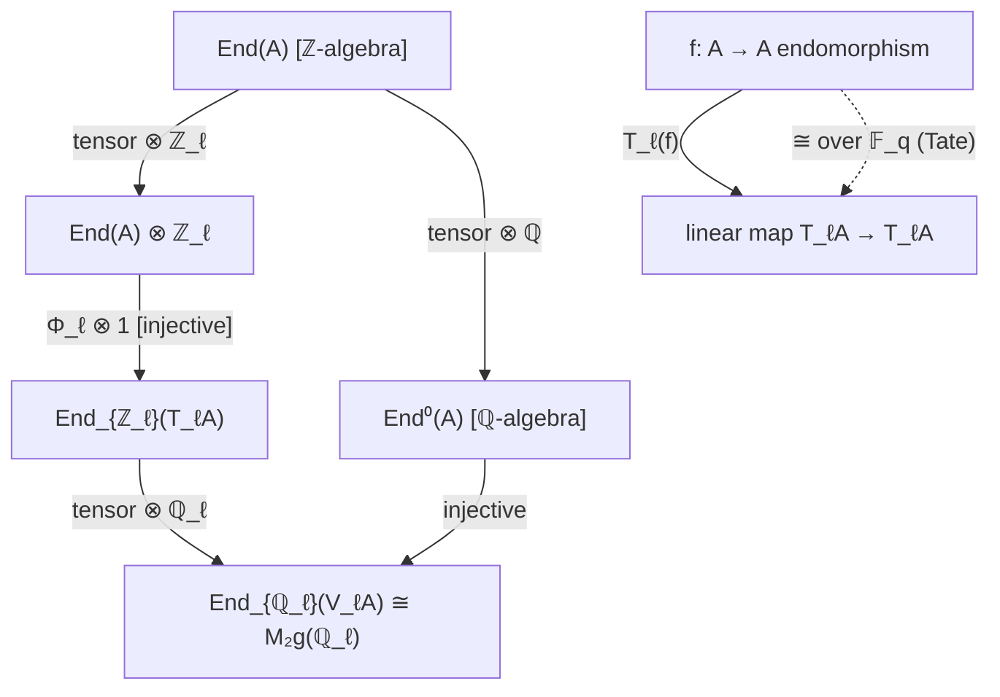

> **Prerequisites**: [[20-tate-module|20. The ℓ-adic Tate Module $T_\ell(A)$]], [[18-isogeny-equivalence-relation|18. Isogeny as an Equivalence Relation]]
> **Objectives**:
> - Hiểu cách mọi endomorphism $f \in \operatorname{End}(A)$ induced đồng cấu tuyến tính $T_\ell(f)$ trên Tate module
> - Chứng minh tính injective của $\operatorname{End}(A) \hookrightarrow \operatorname{End}_{\mathbb{Z}_\ell}(T_\ell(A))$
> - Nắm Định lý Tate (Isogeny Theorem) phát biểu đầy đủ và hiểu hệ quả
> - Tính $T_\ell(f)$ cụ thể cho Frobenius endomorphism trên elliptic curve

---

## Motivation / Intuition

Ở bài trước, ta đã thấy Tate module $T_\ell(A)$ là một $\mathbb{Z}_\ell$-module tự do hạng $2g$. Câu hỏi tự nhiên tiếp theo: **điều gì xảy ra với các endomorphism của $A$ khi ta "nhìn qua kính" Tate module?**

Mỗi endomorphism $f \in \operatorname{End}(A)$ (homomorphism $f: A \to A$) gửi điểm xoắn $A[\ell^n]$ vào chính nó, nên nó induced một **tự đồng cấu tuyến tính** $T_\ell(f): T_\ell(A) \to T_\ell(A)$. Ta thu được một ring homomorphism:

$$
\Phi_\ell: \operatorname{End}(A) \;\longrightarrow\; \operatorname{End}_{\mathbb{Z}_\ell}(T_\ell(A)) \;\cong\; M_{2g}(\mathbb{Z}_\ell)
$$

Câu hỏi: **$\Phi_\ell$ có trung thực (faithful) không — tức là có injective không?** Câu trả lời là **CÓ**, và đây là kết quả nền tảng.

Hơn nữa, **Định lý Tate** mạnh hơn nhiều: trên trường hữu hạn, $\Phi_\ell$ là isomorphism **sau khi tensor với $\mathbb{Z}_\ell$**. Điều này có nghĩa là Tate module **hoàn toàn xác định** lớp isogeny của $A$ trên trường hữu hạn.

---

## Functoriality Nhắc Lại

Từ Theorem 20.2 (bài trước), ta có functor $T_\ell$. Khi áp dụng cho $f: A \to A$ (endomorphism), ta thu được:

$$
T_\ell(f) : T_\ell(A) \;\longrightarrow\; T_\ell(A)
$$

Cụ thể: $(P_1, P_2, P_3, \ldots) \mapsto (f(P_1), f(P_2), f(P_3), \ldots)$.

Đây là đồng cấu $\mathbb{Z}_\ell$-tuyến tính, và phép gán $f \mapsto T_\ell(f)$ là **ring homomorphism**:

$$
\Phi_\ell : \operatorname{End}(A) \;\longrightarrow\; \operatorname{End}_{\mathbb{Z}_\ell}(T_\ell(A))
$$

vì $T_\ell(f + g) = T_\ell(f) + T_\ell(g)$ và $T_\ell(f \circ g) = T_\ell(f) \circ T_\ell(g)$.

---

## Injectivity: Tate Module "Nhìn Thấy Hết"

### Theorem

> [!theorem] Theorem 21.1 — Injectivity của $\operatorname{End}(A) \to \operatorname{End}(T_\ell(A))$
> Cho $A$ là abelian variety trên trường $k$ và $\ell \neq \operatorname{char}(k)$. Homomorphism:
>
> $$
> \Phi_\ell : \operatorname{End}(A) \;\hookrightarrow\; \operatorname{End}_{\mathbb{Z}_\ell}(T_\ell(A))
> $$
>
> là **injective** (đơn ánh). Tức là: nếu $T_\ell(f) = 0$ thì $f = 0$.

**Proof.**
Giả sử $T_\ell(f) = 0$, nghĩa là $f(P_n) = O$ với mọi $P_n \in A[\ell^n](\bar{k})$ và mọi $n$.

Điều này có nghĩa $A[\ell^n](\bar{k}) \subseteq \ker(f)$ với mọi $n$. Vì $\ker(f)$ là group scheme con của $A$, và $\bigcup_n A[\ell^n](\bar{k})$ Zariski dense trong $A$ (điểm xoắn dense), suy ra $\ker(f) = A$, tức $f = 0$. $\blacksquare$

> [!note] Remark 21.1 — Hệ quả: $\operatorname{End}(A)$ torsion-free
> Từ tính injective và sự kiện $\operatorname{End}_{\mathbb{Z}_\ell}(T_\ell(A))$ torsion-free (do $\mathbb{Z}_\ell$ torsion-free), suy ra $\operatorname{End}(A)$ torsion-free — không có endomorphism khác $0$ bị "giết" bởi một số nguyên $n \neq 0$.

---

## Hom Spaces và Tensor với $\mathbb{Z}_\ell$

### Definition

> [!definition] Definition 21.1 — Không gian homomorphism
> Với $A, B$ abelian variety trên $k$:
>
> $$
> \operatorname{Hom}(A, B) \;:=\; \{\text{homomorphisms} \; f: A \to B \text{ defined over } k\}
> $$
>
> Đây là $\mathbb{Z}$-module (nhóm Abel tự do hữu hạn sinh). Đặt:
>
> $$
> \operatorname{Hom}^0(A, B) \;:=\; \operatorname{Hom}(A, B) \otimes_\mathbb{Z} \mathbb{Q}, \quad \operatorname{End}^0(A) \;:=\; \operatorname{End}(A) \otimes_\mathbb{Z} \mathbb{Q}
> $$

> [!theorem] Theorem 21.2 — Embedding vào $\operatorname{Hom}$ của Tate modules
> Có embedding injective tự nhiên:
>
> $$
> \operatorname{Hom}(A, B) \otimes_\mathbb{Z} \mathbb{Z}_\ell \;\hookrightarrow\; \operatorname{Hom}_{G_k, \mathbb{Z}_\ell}(T_\ell A,\, T_\ell B)
> $$
>
> trong đó vế phải là các đồng cấu $\mathbb{Z}_\ell$-tuyến tính tương thích với action của $G_k$.

**Proof (sketch).**
Ánh xạ được định nghĩa bởi $f \otimes 1 \mapsto T_\ell(f)$. Tính $G_k$-equivariance: với $\sigma \in G_k$,

$$
T_\ell(f)(\sigma \cdot v) = T_\ell(f)(\sigma(P_n)) = f(\sigma(P_n)) = \sigma(f(P_n)) = \sigma \cdot T_\ell(f)(v)
$$

vì $f$ được định nghĩa trên $k$, nên $f \circ \sigma = \sigma \circ f$ trên các điểm $\bar{k}$. Injectivity từ Theorem 21.1. $\blacksquare$

---

## Định Lý Tate — Isogeny Theorem

Đây là kết quả sâu sắc và quan trọng nhất trong bài:

### Theorem

> [!theorem] Theorem 21.3 — Định lý Tate (Tate's Isogeny Theorem, 1966)
> Cho $A, B$ là abelian variety trên **trường hữu hạn** $k = \mathbb{F}_q$, và $\ell \neq \operatorname{char}(k)$. Khi đó embedding trong Theorem 21.2 là **isomorphism**:
>
> $$
> \operatorname{Hom}(A, B) \otimes_\mathbb{Z} \mathbb{Z}_\ell \;\xrightarrow{\;\sim\;}\; \operatorname{Hom}_{G_k, \mathbb{Z}_\ell}(T_\ell A,\, T_\ell B)
> $$
>
> Nói cách khác: mọi đồng cấu $\mathbb{Z}_\ell$-tuyến tính tương thích với $G_k$ giữa các Tate module đều đến từ một (isogeny bội của một) homomorphism thực sự giữa $A$ và $B$.

> [!note] Remark 21.2 — Ý nghĩa của Định lý Tate
> Định lý Tate có ý nghĩa sâu sắc: trên $\mathbb{F}_q$, **Tate module hoàn toàn xác định lớp isogeny**. Cụ thể:
>
> **Hệ quả**: $A$ và $B$ isogenous trên $\mathbb{F}_q$ nếu và chỉ nếu $T_\ell(A) \cong T_\ell(B)$ như $G_{\mathbb{F}_q}$-module.
>
> Điều này nói: để phân biệt các abelian variety trên $\mathbb{F}_q$ (lên đến isogeny), ta chỉ cần nhìn vào Tate module — một đối tượng tuyến tính!

> [!warning] Remark 21.3 — Không đúng trên trường tổng quát
> Định lý Tate **chỉ đúng trên trường hữu hạn** (và trường số trong một phiên bản khác). Trên trường đại số đóng $\bar{k}$, không gian $\operatorname{Hom}_{G_k}(T_\ell A, T_\ell B)$ quá lớn vì $G_k$ tầm thường, và định lý sai. Đây là lý do Frobenius (Bài 39) đóng vai trò trung tâm.

---

## Hệ Quả Cụ Thể

### Corollary

> [!corollary] Corollary 21.1 — $\operatorname{End}(A)$ là tự do hữu hạn hạng
> $\operatorname{End}(A)$ là $\mathbb{Z}$-module tự do hạng hữu hạn. Đặt:
>
> $$
> r = \operatorname{rank}_\mathbb{Z} \operatorname{End}(A)
> $$
>
> Ta có $r \leq (2g)^2 = 4g^2$ (vì $\operatorname{End}(A) \hookrightarrow M_{2g}(\mathbb{Z}_\ell)$ có hạng tối đa $(2g)^2$).

> [!corollary] Corollary 21.2 — Algebra endomorphism
> $\operatorname{End}^0(A) = \operatorname{End}(A) \otimes_\mathbb{Z} \mathbb{Q}$ là $\mathbb{Q}$-algebra hữu hạn chiều. Nhúng:
>
> $$
> \operatorname{End}^0(A) \;\hookrightarrow\; \operatorname{End}_{\mathbb{Q}_\ell}(V_\ell(A)) \;\cong\; M_{2g}(\mathbb{Q}_\ell)
> $$

> [!corollary] Corollary 21.3 — Isogeny và Tate module
> Nếu $f: A \to B$ là isogeny (trên $\mathbb{F}_q$) thì $T_\ell(f): T_\ell(A) \to T_\ell(B)$ là **injection** (đơn ánh) với cokernel hữu hạn là $\ell$-part của $\ker(f)$.

**Proof.**
$\ker(f)$ là group scheme hữu hạn. Hạng $\ell$-primary của $\ker(f)$ chính là chỉ số của $T_\ell(B)$ trong ảnh của $T_\ell(f)$. Cụ thể, có dãy chính xác:

$$
0 \;\to\; T_\ell(A) \;\xrightarrow{T_\ell(f)}\; T_\ell(B) \;\to\; \ker(f)[\ell^\infty] \;\to\; 0
$$

$\blacksquare$

---

## Frobenius trên Tate Module của Elliptic Curve

> [!example] Example 21.1 — Frobenius của $E: y^2 = x^3 - x$ trên $\mathbb{F}_5$
> Xét $E: y^2 = x^3 - x$ trên $\mathbb{F}_5$. Ta đã tính $|E(\mathbb{F}_5)| = 8$ (bài 22 sẽ tính chi tiết hơn).
>
> Frobenius $\pi: E \to E$, $(x, y) \mapsto (x^5, y^5)$, là endomorphism của $E$.
>
> Đây là phần tử đặc biệt trong $\operatorname{End}(E)$: nó không phải là đồng phân thức của $[n]$ (multiplication-by-$n$), mà là một endomorphism "hình học" thực sự.
>
> Trên $T_\ell(E) \cong \mathbb{Z}_\ell^2$ (với $\ell \neq 5$), $T_\ell(\pi)$ là một ma trận $2 \times 2$ trong $M_2(\mathbb{Z}_\ell)$.
>
> Theo lý thuyết bài 22: ma trận này có **đa thức đặc trưng** $t^2 + 2t + 5$ (với $a_5 = -2$ vì $|E(\mathbb{F}_5)| = 5 + 1 - (-2) = 8$).

> [!example] Example 21.2 — $\operatorname{End}(E)$ cho elliptic curve thông thường
> Với hầu hết elliptic curve $E$ trên $\mathbb{Q}$:
>
> $$
> \operatorname{End}(E) \cong \mathbb{Z}, \quad \operatorname{End}^0(E) \cong \mathbb{Q}
> $$
>
> Đây là trường hợp "generic": ring endomorphism chỉ gồm các bội $[n]$.
>
> Trường hợp đặc biệt (CM elliptic curve): $\operatorname{End}^0(E) \cong K$ với $K$ là trường số phức bậc $2$ (imaginary quadratic field). Khi đó $\operatorname{End}(E)$ là một order trong $K$.
>
> Kết quả từ Theorem 21.2 (qua Tate module): $\dim_\mathbb{Q} \operatorname{End}^0(E) \leq (2 \cdot 1)^2 = 4$.

---

## Tóm Tắt Sơ Đồ

Toàn bộ cấu trúc của bài có thể tóm gọn trong sơ đồ giao hoán sau:



---

## SageMath Cheatsheet

```python
# Elliptic curve và endomorphism ring
E = EllipticCurve(GF(5), [0, 0, 0, -1, 0])  # y^2 = x^3 - x

# Frobenius là endomorphism đặc biệt
# Sage không trực tiếp trả về T_ℓ(π) như matrix,
# nhưng ta có thể tra cứu qua char poly:
f_poly = E.frobenius_polynomial()
print('Char poly of Frobenius:', f_poly)
# Kết quả: t^2 + 2t + 5

# Tính |E(F_q)| từ char poly: đánh giá tại t=1
print('|E(F_5)| =', f_poly.substitute(t=1))  # = 1 + 2 + 5 = 8 ✓

# Rank endomorphism ring (với EC không CM)
# End(E) ≅ Z, tức rank = 1
# Nhúng vào M_2(Z_ℓ): map Z -> M_2(Z_ℓ) gửi n -> n*I_2
```

---

## Summary / Key Takeaways

- Mọi $f \in \operatorname{End}(A)$ induced $T_\ell(f) \in \operatorname{End}_{\mathbb{Z}_\ell}(T_\ell(A))$: phép gán này là **ring homomorphism**.
- **Injectivity**: $\operatorname{End}(A) \hookrightarrow \operatorname{End}_{\mathbb{Z}_\ell}(T_\ell(A))$ — nếu $T_\ell(f) = 0$ thì $f = 0$.
- **Hệ quả**: $\operatorname{End}(A)$ là $\mathbb{Z}$-module tự do hạng hữu hạn $\leq (2g)^2$.
- **Định lý Tate** (trên $\mathbb{F}_q$): $\operatorname{Hom}(A,B) \otimes \mathbb{Z}_\ell \xrightarrow{\sim} \operatorname{Hom}_{G_k}(T_\ell A, T_\ell B)$ — **isomorphism**.
- **Hệ quả của Định lý Tate**: $A \sim B$ (isogenous trên $\mathbb{F}_q$) $\Leftrightarrow$ $T_\ell(A) \cong T_\ell(B)$ như $G_k$-module.
- **Isogeny**: $f: A \to B$ isogeny $\Rightarrow$ $T_\ell(f)$ injective, cokernel là $\ell$-part của $\ker(f)$.
- **Frobenius** $\pi \in \operatorname{End}(A)$ trên $\mathbb{F}_q$: induced ma trận $T_\ell(\pi) \in M_{2g}(\mathbb{Z}_\ell)$.

---

## References

- Tate, J. *Endomorphisms of Abelian Varieties over Finite Fields*, Inventiones Math. **2** (1966), 134–144.
- Milne, J. S. *Abelian Varieties*, Theorem 10.9. jmilne.org.
- Silverman, J. H. *The Arithmetic of Elliptic Curves* (2nd ed.), Theorem III.7.4 (Tate module injectivity).
- Mumford, D. *Abelian Varieties* (2nd ed.), Chapter IV, Section 19.
- Conrad, B. *Lecture 2: Abelian Varieties*, Theorem 4.2. Stanford, 2004.
- Poonen, B. & Rybakov, S. *Lattices in Tate Modules*, 2021. arXiv:2107.06363.
- Frey, G. *Abelian Varieties and Cryptography*, Contemporary Math, Section 2.3.
