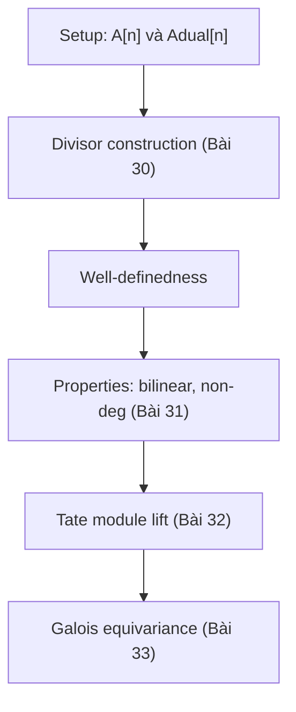

> **Prerequisites**: [[28-weil-pairing-elliptic-curves|28. Motivation — Weil Pairing on Elliptic Curves]], [[24-dual-abelian-variety|24. The Dual Abelian Variety]], [[26-map-phi-L|26. The Map φ_L: A → Â]]
> **Objectives**:
> - Hiểu $\hat{A}[n]$ là gì theo nghĩa hình học: các line bundle $L$ với $L^{\otimes n} \cong \mathcal{O}$
> - Thiết lập setup chung cho Weil pairing $e_n: A[n] \times \hat{A}[n] \to \mu_n$
> - Hiểu tại sao pairing tự nhiên này **không** là alternating (khác với trường hợp EC với polarization)
> - Thấy cách polarization biến pairing này thành pairing trên $A[n] \times A[n]$

---

## Motivation / Intuition

Trong Bài 28, ta đã thấy Weil pairing trên elliptic curve $E$ có dạng $e_n: E[n] \times E[n] \to \mu_n$. Tuy nhiên, khi nhìn kỹ hơn, ta thấy điều này có phần "không tự nhiên": cả hai slot đều là $E[n]$. Tại sao lại như vậy?

Câu trả lời là: trên elliptic curve, có một **isomorphism canonical** $E \cong \hat{E}$ (đến từ principal polarization). Điều này cho phép ta đồng nhất $\hat{E}[n]$ với $E[n]$ và viết pairing theo dạng đối xứng.

Nhưng trên abelian variety $A$ chiều $g > 1$ tổng quát, $A$ và $\hat{A}$ là **hai đối tượng khác nhau** (chỉ isomorphic nếu $A$ có principal polarization). Do đó, Weil pairing "đúng nhất" là:

$$
e_n : A[n] \times \hat{A}[n] \to \mu_n
$$

Đây là pairing **tự nhiên nhất** — nó xuất hiện từ cấu trúc của dual abelian variety mà không cần chọn thêm gì. Bài này xây dựng setup cho pairing này từ góc nhìn của line bundles.

---

## Nhắc Lại: Dual Abelian Variety Là Gì?

Ta đã biết từ Bài 24: với abelian variety $A/k$, **dual abelian variety** (đối ngẫu abelian variety) là:

$$
\hat{A} = \operatorname{Pic}^0(A) = \left\{ \text{line bundles trên } A \text{ algebraically equivalent to } \mathcal{O} \right\}
$$

với cấu trúc nhóm là tensor product. Quan trọng: $\hat{A}$ cũng là một abelian variety với $\dim \hat{A} = \dim A = g$.

### n-Torsion của Dual

> [!definition] Definition 29.1 — n-Torsion của $\hat{A}$
> Với $n \geq 1$, nhóm $n$-torsion của dual là:
>
> $$
> \hat{A}[n] = \ker\left([n]: \hat{A} \to \hat{A}\right) = \left\{ L \in \hat{A}(\bar{k}) \mid L^{\otimes n} \cong \mathcal{O}_A \right\}
> $$
>
> Phép nhân $[n]$ trên $\hat{A}$ là **tensor product $n$ lần**: $[n](L) = L^{\otimes n}$.
>
> Do đó: $\hat{A}[n]$ là tập các line bundle trong $\operatorname{Pic}^0(A)$ có **bậc $n$** (theo nghĩa tensor power là trivial).

> [!info] Tính chất song song với A[n]
> Khi $\gcd(n, \operatorname{char}(k)) = 1$:
>
> $$
> A[n] \cong (\mathbb{Z}/n\mathbb{Z})^{2g}, \qquad \hat{A}[n] \cong (\mathbb{Z}/n\mathbb{Z})^{2g}
> $$
>
> Cả hai đều có $n^{2g}$ phần tử. Đây không phải trùng hợp — thực ra $A[n]$ và $\hat{A}[n]$ dual của nhau qua Weil pairing.

---

## Xây Dựng Weil Pairing từ Universal Property

### Poincaré Bundle như công cụ chính

Từ Bài 25, ta có **Poincaré bundle** (bundle Poincaré) $\mathcal{P}$ trên $A \times \hat{A}$ với universal property:

$$
\mathcal{P}\big|_{A \times \{L\}} \cong L \quad \forall L \in \hat{A}
$$

Bundle này là linh hồn của duality. Weil pairing có thể được hiểu từ cấu trúc của $\mathcal{P}$ trên $A[n] \times \hat{A}[n]$.

### Setup cho Pairing

> [!definition] Definition 29.2 — Setup Weil Pairing Tổng Quát
> Cho $A/k$ abelian variety, $n \geq 1$ với $\gcd(n, \operatorname{char}(k)) = 1$.
>
> Ta muốn định nghĩa:
>
> $$
> e_n : A[n] \times \hat{A}[n] \to \mu_n
> $$
>
> Với $P \in A[n]$ (tức $[n]P = 0$) và $L \in \hat{A}[n]$ (tức $L^{\otimes n} \cong \mathcal{O}_A$):
>
> **Bước 1.** Vì $L^{\otimes n} \cong \mathcal{O}$, có một đẳng cấu $\phi: L^{\otimes n} \xrightarrow{\sim} \mathcal{O}$. Đây không canonical, nhưng $e_n(P, L)$ sẽ không phụ thuộc vào lựa chọn này.
>
> **Bước 2.** Nhìn $L$ như một line bundle, xét $t_P^* L \otimes L^{-1}$ (translation của $L$ dọc $P$). Vì $L \in \operatorname{Pic}^0(A)$, ta có $t_P^* L \cong L$ với mọi $P$... nhưng **đẳng cấu này không canonical**! Sự không canonical đó chính là $e_n(P, L)$.

Hãy làm rõ hơn qua cách tiếp cận divisor (sẽ đầy đủ hơn trong Bài 30).

---

## Cách Tiếp Cận Qua Divisors

### Setup thông qua rational functions

Đây là cách tiếp cận hiệu quả nhất để định nghĩa $e_n(P, L)$ cho $P \in A[n]$ và $L \in \hat{A}[n]$.

Với $L \in \hat{A}[n]$, chọn divisor $D$ trên $A$ sao cho $\mathcal{O}(D) \cong L$. Điều kiện $L \in \operatorname{Pic}^0(A)$ nghĩa là $D$ algebraically equivalent to $0$ (nhưng không nhất thiết linearly equivalent to $0$). Điều kiện $L^{\otimes n} \cong \mathcal{O}$ nghĩa là $nD$ linearly equivalent to $0$, tức tồn tại rational function $f$ với:

$$
\operatorname{div}(f) = nD
$$

Đây là rational function ta cần.

> [!definition] Definition 29.3 — Weil Pairing qua Divisors (phiên bản sơ bộ)
> Cho $P \in A[n]$, $L \in \hat{A}[n]$, và $D, f$ như trên ($\mathcal{O}(D) \cong L$, $\operatorname{div}(f) = nD$). Định nghĩa:
>
> $$
> e_n(P, L) = \frac{f(P + Q)}{f(Q)}
> $$
>
> với $Q$ là điểm tổng quát trên $A$ (sao cho $Q$ và $P + Q$ không thuộc $\operatorname{supp}(D)$).
>
> Giá trị này là một căn bậc $n$ của đơn vị vì $(f(P+Q)/f(Q))^n = f([n](P+Q))/f([n]Q) = f([n]Q)/f([n]Q) = 1$... thực ra cần cẩn thận hơn, xem Bài 30.

> [!warning] Counterexample 29.4 — Tại sao cần điều kiện kỹ thuật?
> Biểu thức $f(P+Q)/f(Q)$ có thể bằng $0/0$ nếu $Q \in \operatorname{supp}(D)$ hoặc $P+Q \in \operatorname{supp}(D)$. Do đó cần chọn $Q$ "tổng quát" — và cần chứng minh kết quả không phụ thuộc vào $Q$. Đây là nội dung chính của Bài 30.

---

## Comparison: E[n] × E[n] vs A[n] × Â[n]

Một câu hỏi tự nhiên: pairing $E[n] \times E[n] \to \mu_n$ (Bài 28) và $A[n] \times \hat{A}[n] \to \mu_n$ (bài này) liên hệ thế nào?

> [!theorem] Theorem 29.5 — Weil Pairing qua Polarization
> Cho $A/k$ là abelian variety với polarization $\phi: A \to \hat{A}$ (là isogeny $\phi_L$ từ ample $L$). Khi đó:
>
> $$
> e_n^\phi : A[n] \times A[n] \to \mu_n, \quad e_n^\phi(P, Q) = e_n(P, \phi(Q))
> $$
>
> là một bilinear pairing. Nó là **alternating** (tức $e_n^\phi(P,P) = 1$) vì $\phi$ là **symmetric** ($\hat{\phi} = \phi$).
>
> Với elliptic curve $E$: canonical principal polarization $\phi: E \xrightarrow{\sim} \hat{E}$ cho đúng $e_n: E[n] \times E[n] \to \mu_n$ mà ta định nghĩa trong Bài 28.

**Proof sketch.**
$e_n^\phi(P,P) = e_n(P, \phi(P))$. Vì $\phi = \phi_L$ là symmetric ($\hat{\phi}_L = \phi_L$), có thể chứng minh $e_n(P, \phi_L(P)) = 1$ bằng cách dùng alternating property của pairing tự nhiên $e_n: A[n] \times \hat{A}[n] \to \mu_n$ cùng với tính symmetric của $\phi_L$. Chi tiết trong Bài 36. $\blacksquare$

> [!note] Remark 29.6 — Pairing tự nhiên không alternating
> Pairing $e_n: A[n] \times \hat{A}[n] \to \mu_n$ **không alternating** — thực ra khái niệm "alternating" không áp dụng được vì hai slot có type khác nhau. Pairing này là **perfect** (non-degenerate theo cả hai chiều) và **bilinear**, nhưng không có tính đối xứng nào giữa hai slot.

---

## Cấu Trúc Tổng Quát: Pairing Modules và Duality

### Nhìn từ góc độ module

Weil pairing $e_n: A[n] \times \hat{A}[n] \to \mu_n$ định nghĩa một **perfect pairing** (cặp hoàn hảo) giữa hai $\mathbb{Z}/n\mathbb{Z}$-modules:

- $A[n] \cong (\mathbb{Z}/n\mathbb{Z})^{2g}$ — "tọa độ điểm"
- $\hat{A}[n] \cong (\mathbb{Z}/n\mathbb{Z})^{2g}$ — "tọa độ line bundle"

> [!theorem] Theorem 29.7 — Weil Pairing là Perfect Pairing
> Weil pairing $e_n: A[n] \times \hat{A}[n] \to \mu_n$ là **perfect** (hoàn hảo): map cảm ứng
>
> $$
> A[n] \to \operatorname{Hom}(\hat{A}[n], \mu_n), \quad P \mapsto (L \mapsto e_n(P, L))
> $$
>
> là một **isomorphism** (đẳng cấu) của $\mathbb{Z}/n\mathbb{Z}$-modules. Tương tự cho slot kia.

Điều này thực sự mạnh: nó nói rằng $A[n]$ và $\hat{A}[n]$ "dual" nhau theo nghĩa chính xác trong lý thuyết module.

---

## Compatibility với Isogenies

Một tính chất quan trọng: Weil pairing tương thích với isogenies — điều này cho phép ta "chuyển" pairing từ abelian variety này sang abelian variety khác.

> [!theorem] Theorem 29.8 — Functoriality của Weil Pairing
> Cho $f: A \to B$ là isogeny và $\hat{f}: \hat{B} \to \hat{A}$ là dual isogeny. Khi đó với mọi $P \in A[n]$ và $M \in \hat{B}[n]$:
>
> $$
> e_n^B(f(P), M) = e_n^A(P, \hat{f}(M))
> $$
>
> trong đó $e_n^A$ (resp. $e_n^B$) là Weil pairing trên $A$ (resp. $B$).

Đây là tính **functorial** của Weil pairing. Nó nói rằng: isogeny và dual isogeny "chuyển giao nhau" giữa hai slots của pairing.

> [!example] Example 29.9 — Frobenius và Verschiebung
> Trên $A/\mathbb{F}_q$: Frobenius $\pi_A: A \to A$ (bài 39) và Verschiebung $V_A: A \to A$ thỏa $V_A \circ \pi_A = [q]$. Functoriality cho:
>
> $$
> e_n(\pi_A(P), \hat{\pi}_A(L)) = e_n([q]P, L) = e_n(P, L)^q
> $$
>
> Đây là cách Galois action (thông qua Frobenius) tương tác với Weil pairing — preview của Bài 33.

---

## Đặt nền cho Bài 30: Vấn đề còn lại

Đến đây ta đã có **setup** cho pairing $e_n: A[n] \times \hat{A}[n] \to \mu_n$ và hiểu tại sao nó quan trọng. Nhưng còn nhiều chi tiết kỹ thuật cần làm rõ:

1. **Định nghĩa chính xác** bằng ngôn ngữ divisors — Bài 30.
2. **Chứng minh well-defined** (không phụ thuộc vào lựa chọn $Q$, $D$, $f$) — Bài 30.
3. **Chứng minh các tính chất** (bilinear, non-degenerate) — Bài 31.
4. **Lift lên Tate module** — Bài 32.



*Lộ trình xây dựng Weil pairing từ setup đến ứng dụng Galois.*

---

## SageMath Cheatsheet

```python
E = EllipticCurve(GF(101), [1, 0])
Ehat = E
print("E = Ehat (principal polarization):", E == Ehat)

P = E.random_point()
Q = E.random_point()
n = P.order()
print("n =", n)

if n > 1:
    w = P.weil_pairing(Q, n)
    print("e_n(P,Q) =", w)
    print("e_n(Q,P) =", Q.weil_pairing(P, n))
    print("Product =", w * Q.weil_pairing(P, n))

from sage.all import GF, EllipticCurve
for p in [11, 13, 17, 19, 23]:
    E = EllipticCurve(GF(p), [0, 1])
    print(f"p={p}: |E(F_p)| = {E.order()}")
```

---

## Summary / Key Takeaways

- $\hat{A}[n] = \ker([n]: \hat{A} \to \hat{A})$ = các line bundle $L \in \operatorname{Pic}^0(A)$ với $L^{\otimes n} \cong \mathcal{O}$.
- Weil pairing "tự nhiên nhất" là $e_n: A[n] \times \hat{A}[n] \to \mu_n$ — không cần chọn polarization.
- Pairing này là **bilinear** và **perfect** (non-degenerate theo cả hai chiều).
- Pairing này **không alternating** vì hai slot có type khác nhau.
- Polarization $\phi: A \to \hat{A}$ cho pairing $e_n^\phi: A[n] \times A[n] \to \mu_n$, bilinear và alternating.
- Functoriality: $e_n^B(f(P), M) = e_n^A(P, \hat{f}(M))$.
- Cho EC: $E \cong \hat{E}$ (principal polarization) cho $e_n: E[n] \times E[n] \to \mu_n$ alternating.

---

## References

- Milne, J. S. *Abelian Varieties*, Chapter 13–14. Lecture notes, jmilne.org/math.
- Mumford, D. *Abelian Varieties*, Chapter II. Oxford University Press.
- Birkenhake, C. & Lange, H. *Complex Abelian Varieties* (2nd ed.), Chapter 2.4. Springer.
- Cornell, G. & Silverman, J. H. (eds.) *Arithmetic Geometry*, Chapter on Abelian Varieties by Milne.
- Silverman, J. H. *The Arithmetic of Elliptic Curves*, Chapter III.8.
