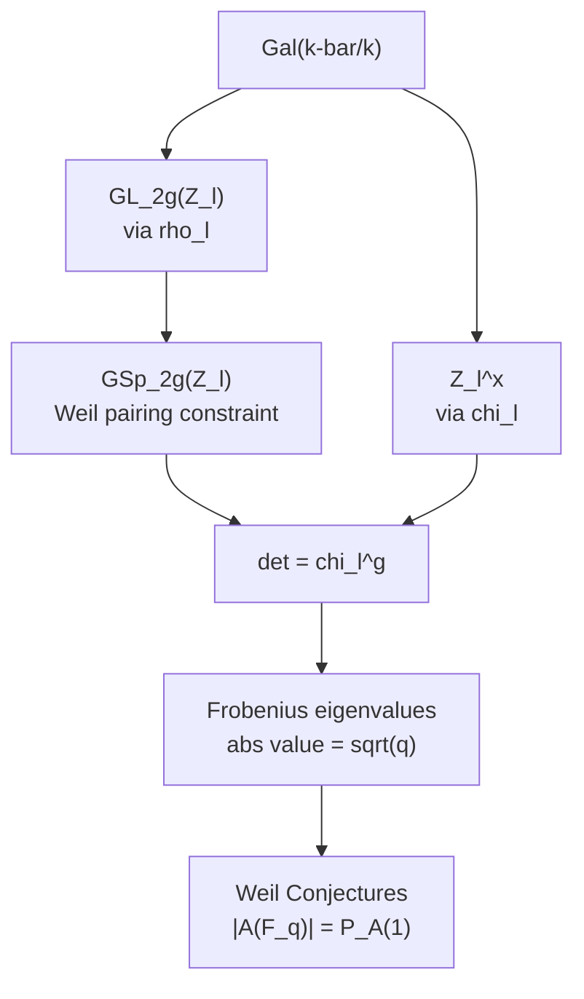

> **Prerequisites**: [[32-weil-pairing-tate-modules|32. The Weil Pairing on Tate Modules]], [[22-characteristic-polynomial-endomorphism|22. Characteristic Polynomial of an Endomorphism]]
> **Objectives**:
> - Hiểu Galois representation $\rho_\ell: \operatorname{Gal}(\bar{k}/k) \to \operatorname{GL}(T_\ell(A))$ và ý nghĩa của nó
> - Chứng minh Galois-equivariance của Weil pairing dẫn đến $\rho_\ell$ land in $\operatorname{GSp}_{2g}$
> - Hiểu $\ell$-adic cyclotomic character $\chi_\ell$ và công thức $\det \rho_\ell = \chi_\ell^g$
> - Áp dụng trên $\mathbb{F}_q$: Frobenius, Weil numbers, và $\det(\rho_\ell(\operatorname{Frob})) = q^g$
> - Kết nối sang Weil conjectures và Tate's Isogeny Theorem

---

## Motivation / Intuition

Khi học về Weil pairing, ta thường nghĩ về nó như một công cụ tính toán (Miller's algorithm, MOV attack). Nhưng từ góc nhìn số học, Weil pairing là **cầu nối** giữa:

- **Hình học**: cấu trúc của $A[n]$ và $\hat{A}[n]$
- **Số học**: Galois action trên các điểm torsion

Cầu nối này thể hiện qua **Galois-equivariance**: Galois group acts trên $T_\ell(A)$, và Weil pairing **bảo toàn** structure đó. Hệ quả: Galois representation của $A$ phải land trong một nhóm nhỏ hơn ($\operatorname{GSp}_{2g}$ thay vì $\operatorname{GL}_{2g}$), và determinant của biểu diễn liên quan đến cyclotomic character.

Đây là nguyên lý "bảo toàn cấu trúc qua Galois" — rất phổ biến trong số học: Galois acts trên geometric objects và phải tôn trọng mọi cấu trúc algebraic trên đó.

Bài này là tổng hợp của cả Module 5, kết nối Weil pairing với lý thuyết Galois representations — một trong những lĩnh vực trung tâm của số học hiện đại.

---

## Galois Representation Từ Tate Module

### Thiết Lập

Cho $A/k$ là abelian variety, $\ell \neq \operatorname{char}(k)$ là prime. Tate module $T_\ell(A)$ là $\mathbb{Z}_\ell$-module free rank $2g$.

**Galois action**: $\operatorname{Gal}(\bar{k}/k)$ acts trên $A[\ell^m] \subseteq A(\bar{k})$ bằng cách apply $\sigma$ lên tọa độ của điểm:

$$
\sigma \cdot (x_1, \ldots, x_n) = (\sigma(x_1), \ldots, \sigma(x_n))
$$

Action này tương thích với transition maps $[\ell]$, nên cảm ứng action trên inverse limit:

> [!definition] Definition 33.1 — $\ell$-adic Galois Representation của Abelian Variety
> **$\ell$-adic Galois representation** cảm ứng bởi $A$ là homomorphism liên tục:
>
> $$
> \rho_\ell = \rho_{\ell, A} : \operatorname{Gal}(\bar{k}/k) \to \operatorname{Aut}_{\mathbb{Z}_\ell}(T_\ell(A)) \cong \operatorname{GL}_{2g}(\mathbb{Z}_\ell)
> $$
>
> Sau khi tensor với $\mathbb{Q}_\ell$, ta có representation trên $V_\ell(A)$:
>
> $$
> \rho_\ell : \operatorname{Gal}(\bar{k}/k) \to \operatorname{GL}(V_\ell(A)) \cong \operatorname{GL}_{2g}(\mathbb{Q}_\ell)
> $$
>
> Đây là một **$\ell$-adic representation** (representation $\ell$-adic) của Galois group chiều $2g$.

> [!note] Remark 33.2 — Tại Sao Liên Tục?
> $\operatorname{Gal}(\bar{k}/k)$ được trang bị **profinite topology** (Krull topology). Liên tục nghĩa là: với mọi $m$, kernel của $\operatorname{Gal}(\bar{k}/k) \to \operatorname{GL}(A[\ell^m])$ là mở (tức là Galois group của một extension hữu hạn). Điều này đúng vì $A[\ell^m]$ là finite set defined over extension hữu hạn.

---

## Cyclotomic Character $\ell$-adic

> [!definition] Definition 33.3 — $\ell$-adic Cyclotomic Character
> **$\ell$-adic cyclotomic character** là homomorphism liên tục:
>
> $$
> \chi_\ell : \operatorname{Gal}(\bar{k}/k) \to \mathbb{Z}_\ell^{\times}
> $$
>
> định nghĩa bởi Galois action trên $\mathbb{Z}_\ell(1) = \varprojlim \mu_{\ell^m}$:
>
> $$
> \sigma(\zeta) = \zeta^{\chi_\ell(\sigma)} \quad \forall \zeta \in \mu_{\ell^m}, \forall m
> $$
>
> Tức $\chi_\ell(\sigma)$ là "số" (trong $\mathbb{Z}_\ell^{\times}$) mà $\sigma$ nhân căn đơn vị bậc $\ell^m$ lên.

> [!example] Example 33.4 — Cyclotomic Character trên $\mathbb{F}_q$
> Với $k = \mathbb{F}_q$ và Frobenius $\operatorname{Frob}_q$: tác động của $\operatorname{Frob}_q$ lên $\mu_{\ell^m} \subseteq \bar{\mathbb{F}}_q$ là nâng lên bậc $q$:
>
> $$
> \operatorname{Frob}_q(\zeta) = \zeta^q \implies \chi_\ell(\operatorname{Frob}_q) = q \in \mathbb{Z}_\ell^{\times}
> $$
>
> Đây là lý do Frobenius được gọi là "Frobenius": nó acts bằng cách nâng lên bậc $q$ trên các roots of unity.

> [!example] Example 33.5 — Cyclotomic Character trên $\mathbb{Q}$
> Với $k = \mathbb{Q}$: $\chi_\ell: \operatorname{Gal}(\bar{\mathbb{Q}}/\mathbb{Q}) \to \mathbb{Z}_\ell^{\times}$. Image của $\chi_\ell$ là $\mathbb{Z}_\ell^{\times}$ (surjective). Đây là character kinh điển trong số học.

---

## Galois-Equivariance Và Hệ Quả

> [!theorem] Theorem 33.6 — Galois-Equivariance Của Weil Pairing
> Với mọi $\sigma \in \operatorname{Gal}(\bar{k}/k)$, $P \in A[n]$, $L \in \hat{A}[n]$:
>
> $$
> e_n(\sigma(P), \sigma(L)) = \sigma(e_n(P, L)) = e_n(P, L)^{\chi_n(\sigma)}
> $$
>
> Ở đây $\chi_n: \operatorname{Gal}(\bar{k}/k) \to (\mathbb{Z}/n\mathbb{Z})^{\times}$ là cyclotomic character mod $n$.
>
> Trên Tate module:
>
> $$
> e_\ell(\rho_\ell(\sigma)(v), \hat{\rho}_\ell(\sigma)(w)) = \chi_\ell(\sigma) \cdot e_\ell(v, w)
> $$
>
> với $v \in T_\ell(A)$, $w \in T_\ell(\hat{A})$, và $\hat{\rho}_\ell$ là representation trên $T_\ell(\hat{A})$.

**Proof.**
Từ Bài 31 (Theorem 31.10): $e_n(\sigma(P), \sigma(L)) = \sigma(e_n(P, L))$. Galois acts trên $\mu_n$ bằng $\chi_n$: $\sigma(\zeta) = \zeta^{\chi_n(\sigma)}$. Do đó:

$$
e_n(\sigma(P), \sigma(L)) = e_n(P, L)^{\chi_n(\sigma)}
$$

Trên Tate module: taking inverse limit của equation trên cho version $\ell$-adic. $\blacksquare$

---

## Representation Landing in GSp

### Chính Lý

> [!theorem] Theorem 33.7 — $\rho_\ell$ Land Trong $\operatorname{GSp}_{2g}$
> Cho $A/k$ có polarization $\phi: A \xrightarrow{\sim} \hat{A}$. Khi đó với pairing $e_\ell^\phi: T_\ell(A) \times T_\ell(A) \to \mathbb{Z}_\ell(1)$:
>
> $$
> e_\ell^\phi(\rho_\ell(\sigma)(v), \rho_\ell(\sigma)(w)) = \chi_\ell(\sigma) \cdot e_\ell^\phi(v, w) \quad \forall v, w \in T_\ell(A)
> $$
>
> Tức là $\rho_\ell(\sigma) \in \operatorname{GSp}(T_\ell(A), e_\ell^\phi)$ với **similitude factor** $\chi_\ell(\sigma)$:
>
> $$
> \rho_\ell : \operatorname{Gal}(\bar{k}/k) \to \operatorname{GSp}_{2g}(\mathbb{Z}_\ell)
> $$
>
> trong đó $\operatorname{GSp}_{2g}$ là **symplectic similitude group** (nhóm đồng dạng symplectic).

**Proof.**
Tính trực tiếp:

$$
e_\ell^\phi(\rho_\ell(\sigma)(v), \rho_\ell(\sigma)(w)) = e_\ell(\rho_\ell(\sigma)(v), \hat{\rho}_\ell(\sigma)(\phi(w)))
$$

$$
= e_\ell(\rho_\ell(\sigma)(v), \rho_\ell(\sigma)(\phi(w))) \quad \text{(vì } \phi \text{ defined over } k\text{)}
$$

$$
= \chi_\ell(\sigma) \cdot e_\ell(v, \phi(w)) = \chi_\ell(\sigma) \cdot e_\ell^\phi(v, w)
$$

$\blacksquare$

> [!definition] Definition 33.8 — Symplectic Similitude Group
> **Symplectic similitude group** là:
>
> $$
> \operatorname{GSp}_{2g}(R) = \left\{ M \in \operatorname{GL}_{2g}(R) \mid M^T J M = \lambda J \text{ với một } \lambda \in R^{\times} \right\}
> $$
>
> trong đó $J = \begin{pmatrix} 0 & I_g \\ -I_g & 0 \end{pmatrix}$ là matrix symplectic chuẩn. Scalar $\lambda$ được gọi là **similitude factor** (thừa số đồng dạng).
>
> **Multiplier map**: $\nu: \operatorname{GSp}_{2g} \to \mathbb{G}_m$, $M \mapsto \lambda$ — nhận similitude factor.

---

## Determinant Và Cyclotomic Character

> [!theorem] Theorem 33.9 — Formula $\det \rho_\ell = \chi_\ell^g$
> Với $A/k$ abelian variety dimension $g$ có polarization $\phi$:
>
> $$
> \det(\rho_\ell) = \chi_\ell^g : \operatorname{Gal}(\bar{k}/k) \to \mathbb{Z}_\ell^{\times}
> $$
>
> Tức là $\det(\rho_\ell(\sigma)) = \chi_\ell(\sigma)^g$ với mọi $\sigma$.

**Proof.**
Từ $e_\ell^\phi(\rho_\ell(\sigma)(v), \rho_\ell(\sigma)(w)) = \chi_\ell(\sigma) \cdot e_\ell^\phi(v, w)$ và $e_\ell^\phi$ là non-degenerate, áp dụng lý thuyết symplectic:

Với $M = \rho_\ell(\sigma)$: $\det(M)^2 = \chi_\ell(\sigma)^{2g}$ (tích của $2g$ eigenvalues, tính từ $M^T J M = \chi_\ell(\sigma) J$).

Thực ra: $\nu(M)^g = \det(M)$ là công thức tổng quát trong $\operatorname{GSp}_{2g}$ (đối với $g = 1$: $\det(M) = \lambda$; tổng quát: $\det(M) = \lambda^g$).

Vậy $\det(\rho_\ell(\sigma)) = \chi_\ell(\sigma)^g$. $\blacksquare$

> [!example] Example 33.10 — Kiểm Tra Trên EC ($g = 1$)
> Với $E/k$ ($g=1$): $\det(\rho_\ell(\sigma)) = \chi_\ell(\sigma)$.
>
> Trên $E/\mathbb{F}_q$: $\det(\rho_\ell(\operatorname{Frob}_q)) = \chi_\ell(\operatorname{Frob}_q) = q$.
>
> Nhưng char poly của $\rho_\ell(\operatorname{Frob}_q)$ là $X^2 - tX + q$ với $t = q + 1 - |E(\mathbb{F}_q)|$. Constant term = $q$ = determinant. Consistent!

> [!example] Example 33.11 — Abelian Surface ($g = 2$)
> Với abelian surface $A$ ($g=2$) trên $\mathbb{F}_q$: $\det(\rho_\ell(\operatorname{Frob}_q)) = q^2$.
>
> Char poly của Frobenius trên $T_\ell(A)$ là bậc $4$: $X^4 - s_1 X^3 + s_2 X^2 - q s_1 X + q^2$.
>
> Constant term = $q^2$ = determinant. Đây là **Weil conjecture** cho abelian surfaces.

---

## Ứng Dụng: Weil Conjectures

> [!theorem] Theorem 33.12 — Riemann Hypothesis cho Abelian Varieties
> Cho $A/\mathbb{F}_q$ abelian variety chiều $g$. Frobenius $\pi_A: A \to A$ có characteristic polynomial trên $T_\ell(A)$:
>
> $$
> P_A(X) = \det(X \cdot I - \rho_\ell(\operatorname{Frob}_q)) \in \mathbb{Z}[X]
> $$
>
> (hệ số nguyên, không phụ thuộc vào $\ell$). Mọi root $\alpha_i$ của $P_A$ thỏa:
>
> $$
> |\alpha_i| = \sqrt{q} \quad \text{(với mọi embedding } \mathbb{C}\text{)}
> $$
>
> (đây là phần Riemann Hypothesis của Weil conjectures cho AV).
>
> Hơn nữa:
>
> $$
> |A(\mathbb{F}_q)| = \prod_{i=1}^{2g} (1 - \alpha_i) = P_A(1)
> $$

Weil pairing góp phần vào chứng minh: từ Galois-equivariance, $\det(\rho_\ell(\operatorname{Frob}_q)) = q^g$. Điều này forced mọi root $\alpha_i$ phải đạt $|\alpha_i| = \sqrt{q}$ (bằng cách kết hợp $\alpha_1 \cdots \alpha_{2g} = q^g$ với tính đối xứng $\alpha_i \leftrightarrow q/\alpha_i$).

---

## Tate's Isogeny Theorem

> [!theorem] Theorem 33.13 — Tate's Isogeny Theorem
> Cho $A, B$ là abelian varieties trên $k = \mathbb{F}_q$. Khi đó:
>
> $$
> \operatorname{Hom}(A, B) \otimes_{\mathbb{Z}} \mathbb{Z}_\ell \xrightarrow{\sim} \operatorname{Hom}_{\mathbb{Z}_\ell[\operatorname{Gal}]}(T_\ell(A), T_\ell(B))
> $$
>
> Tức là: mọi Galois-equivariant linear map $T_\ell(A) \to T_\ell(B)$ đến từ một isogeny $A \to B$ (sau khi tensor $\mathbb{Z}_\ell$).

**Ý nghĩa.** Isogeny class của $A$ được xác định hoàn toàn bởi characteristic polynomial của Frobenius trên $T_\ell(A)$ — tức bởi **Weil polynomial** $P_A(X)$.

Weil pairing xuất hiện trong chứng minh Tate: để verify rằng Galois-equivariant maps preserve symplectic structure (nếu $A = B$ có polarization). Xem Bài 42 để có statement đầy đủ hơn.

---

## Galois Representations: Bức Tranh Tổng Thể

Tổng hợp toàn bộ Module 5 qua một commutative diagram:



*Chuỗi hệ quả từ Galois action qua Weil pairing đến Weil conjectures.*

---

## Serre's Theorem về Image Galois

Một ứng dụng quan trọng khác của Weil pairing là giới hạn image của $\rho_\ell$:

> [!theorem] Theorem 33.14 — Serre's Open Image Theorem (EC case)
> Cho $E/\mathbb{Q}$ là elliptic curve không có complex multiplication (non-CM). Khi đó với mọi prime $\ell$:
>
> $$
> \rho_\ell\left(\operatorname{Gal}(\bar{\mathbb{Q}}/\mathbb{Q})\right) = \operatorname{GL}_2(\mathbb{Z}_\ell)
> $$
>
> (image là toàn bộ $\operatorname{GL}_2(\mathbb{Z}_\ell)$). Với $\ell$ đủ lớn: image là toàn bộ $\operatorname{GL}_2(\mathbb{Z}_\ell)$.

> [!note] Remark 33.15 — Tại Sao Không Phải $\operatorname{Sp}_2$?
> Image $\rho_\ell$ **không** nằm trong $\operatorname{Sp}_2(\mathbb{Z}_\ell)$ mà trong $\operatorname{GSp}_2(\mathbb{Z}_\ell) = \operatorname{GL}_2(\mathbb{Z}_\ell)$ (cho $g=1$). Sự khác biệt: $\operatorname{Sp}_2$ preserves pairing **chính xác** ($\lambda = 1$), còn $\operatorname{GSp}_2$ chỉ cần $\lambda \in \mathbb{Z}_\ell^{\times}$. Galois action twisted bởi cyclotomic character, nên $\lambda = \chi_\ell \neq 1$ nói chung.

---

## Ví Dụ Cụ Thể: Frobenius và Weil Pairing trên $E/\mathbb{F}_7$

Trở lại ví dụ chuẩn: $E: y^2 = x^3 + x$ trên $\mathbb{F}_7$ (supersingular, $|E(\mathbb{F}_7)| = 8$, $t = 0$).

> [!example] Example 33.16 — Frobenius Matrix trên $T_5(E)$
> Char poly của Frobenius: $X^2 + 7$ (hệ số $t = 0$, constant $q = 7$).
>
> Vậy $\rho_5(\operatorname{Frob}_7)$ có matrix (trong một basis của $T_5(E)$) với char poly $X^2 + 7$.
>
> Kiểm tra: $\det(\rho_5(\operatorname{Frob}_7)) = 7 = \chi_5(\operatorname{Frob}_7) = 7$. Consistent với $g = 1$.
>
> Eigenvalues: $\pm i\sqrt{7}$ (trong $\mathbb{C}$), tức $|\alpha| = \sqrt{7}$. Weil RH đúng.

> [!example] Example 33.17 — Frobenius và μ_n
> Frobenius $\operatorname{Frob}_7$ acts trên $\mu_{5^m} \subseteq \bar{\mathbb{F}}_7$:
>
> $$
> \operatorname{Frob}_7(\zeta) = \zeta^7 \implies \chi_5(\operatorname{Frob}_7) = 7 \equiv 2 \pmod{5}
> $$
>
> (vì $7 \equiv 2 \pmod 5$). Vậy Frobenius acts trên $\mu_5$ bằng cách lấy bình phương ($\zeta \mapsto \zeta^2$), và $\chi_5(\operatorname{Frob}_7) = 2 \in (\mathbb{Z}/5\mathbb{Z})^{\times}$.
>
> Weil pairing equivariance: $e_5(\operatorname{Frob}_7(P), \operatorname{Frob}_7(Q)) = e_5(P,Q)^2$.

---

## Bảng Tổng Kết Module 5

| Bài | Chủ đề | Kết quả chính |
|-----|--------|---------------|
| 28 | EC Weil Pairing | $e_n: E[n] \times E[n] \to \mu_n$, Miller algorithm |
| 29 | Setup tổng quát | $e_n: A[n] \times \hat{A}[n] \to \mu_n$, perfect |
| 30 | Xây dựng algebraic | Construction qua divisors, well-defined |
| 31 | Tính chất | Bilinear, alternating, non-deg, Galois-equiv |
| 32 | Tate module | $e_\ell: T_\ell(A) \times T_\ell(\hat{A}) \to \mathbb{Z}_\ell(1)$ |
| 33 | Galois repn | $\rho_\ell: \operatorname{Gal} \to \operatorname{GSp}_{2g}(\mathbb{Z}_\ell)$, $\det = \chi_\ell^g$ |

---

## SageMath Cheatsheet

```python
E = EllipticCurve(GF(7), [1, 0])
print("|E(F_7)| =", E.order())
t = 7 + 1 - E.order()
print("t =", t)
print("char poly of Frobenius: X^2 -", t, "X + 7")

ell = 3
print("det(rho_ell(Frob)) = q =", 7)
print("chi_ell(Frob) = q mod ell^m =", 7, "(= 7 in Z_ell^x)")

p, ell = 7, 5
print("chi_ell(Frob_p) mod ell =", p % ell)
print("Frob acts on mu_5 by zeta -> zeta^", p % ell)

E2 = EllipticCurve(GF(631), [30, 34])
P = E2(36, 60)
Q = E2(121, 387)
w = P.weil_pairing(Q, 5)
print("e_5(P,Q) =", w)

sigma_w = w**631
print("Frob(e_5(P,Q)) = e_5(P,Q)^631 =", sigma_w)
frob_P = E2(P[0]**631 % 631, P[1]**631 % 631)
frob_Q = E2(Q[0]**631 % 631, Q[1]**631 % 631)
```

---

## Summary / Key Takeaways

- $\rho_\ell: \operatorname{Gal}(\bar{k}/k) \to \operatorname{GL}_{2g}(\mathbb{Z}_\ell)$ — **$\ell$-adic Galois representation** cảm ứng bởi Tate module.
- $\chi_\ell: \operatorname{Gal}(\bar{k}/k) \to \mathbb{Z}_\ell^{\times}$ — **$\ell$-adic cyclotomic character** cảm ứng bởi action trên $\mathbb{Z}_\ell(1)$.
- Galois-equivariance: $e_\ell(\sigma v, \sigma w) = \chi_\ell(\sigma) e_\ell(v, w)$ — Galois action twisted bởi $\chi_\ell$.
- Hệ quả: $\rho_\ell$ lands in $\operatorname{GSp}_{2g}(\mathbb{Z}_\ell)$ với similitude factor $\chi_\ell$.
- Formula: $\det(\rho_\ell) = \chi_\ell^g$.
- Trên $\mathbb{F}_q$: $\det(\rho_\ell(\operatorname{Frob}_q)) = q^g$ — hệ quả từ Weil pairing.
- Eigenvalues của Frobenius có $|\alpha_i| = \sqrt{q}$ — **Weil conjectures / Riemann Hypothesis for AV**.
- Tate's Isogeny Theorem: isogeny class ↔ char poly của Frobenius (trên $\mathbb{F}_q$).
- Serre's theorem: non-CM EC over $\mathbb{Q}$ cho $\rho_\ell$ surjective onto $\operatorname{GL}_2(\mathbb{Z}_\ell)$.

---

## References

- Serre, J.-P. *Abelian ℓ-Adic Representations and Elliptic Curves*. Benjamin, 1968 (W. A. Benjamin). Classic reference.
- Tate, J. "Endomorphisms of Abelian Varieties over Finite Fields." *Inventiones Math.* 2 (1966), 134–144. (Isogeny Theorem.)
- Milne, J. S. *Abelian Varieties*, Chapter 19–20. jmilne.org/math.
- Silverman, J. H. *The Arithmetic of Elliptic Curves*, Chapter V.2. Springer GTM 106.
- Fontaine, J.-M. & Ouyang, Y. *Theory of p-adic Galois Representations*. Lecture Notes.
- Conrad, B. "Abelian Varieties." Stanford lecture notes. Available online.
- Weil, A. "Variétés abéliennes et courbes algébriques." Hermann, 1948. (Original paper.)
- Deligne, P. "La conjecture de Weil I." *Publications Math. IHES* 43 (1974), 273–307. (Full proof of Weil conjectures.)
