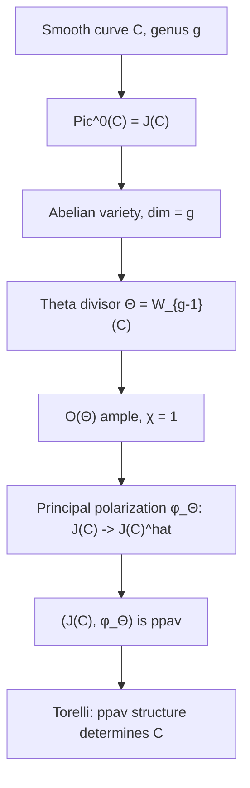

> **Prerequisites**: [[35-polarizations|35. Polarizations]], [[05-line-bundles-picard-group|05. Line Bundles and the Picard Group]], [[04-divisors-on-varieties|04. Divisors on Varieties]], [[24-dual-abelian-variety|24. The Dual Abelian Variety Â]]
> **Objectives**:
> - Xây dựng Jacobian variety $J(C) = \operatorname{Pic}^0(C)$ của curve $C$ và hiểu tại sao nó là abelian variety
> - Định nghĩa Abel-Jacobi map và hiểu ý nghĩa của nó
> - Xây dựng theta divisor $\Theta \subset J(C)$ và chứng minh nó cho principal polarization
> - Phát biểu Torelli's theorem: $J(C)$ xác định $C$
> - Đặt vấn đề Schottky problem và ý nghĩa của nó

---

## Motivation / Intuition

Abelian variety xuất phát từ đâu trong thực tế? Câu trả lời lịch sử (và quan trọng nhất) là từ **Jacobian variety** của algebraic curve. Jacobian là "prototype" của mọi abelian variety — trong một nghĩa chính xác, mọi abelian variety isogenous với một quotient của tích các Jacobians.

Ý tưởng cơ bản: cho $C$ là algebraic curve smooth của genus $g$ over field $k$. Nhóm $\operatorname{Pic}^0(C)$ — các divisors bậc 0 modulo equivalence — tạo thành một abelian variety chiều $g$. Đây là **Jacobian variety** $J(C)$.

Điều làm $J(C)$ đặc biệt là nó mang một **principal polarization canonical** — được cho bởi **theta divisor** $\Theta \subset J(C)$. Theta divisor là tập $W_{g-1}(C)$ = image của $C^{(g-1)}$ (divisors hiệu quả bậc $g-1$) trong $J(C)$. Đây là một hypersurface trong $J(C)$ và nó xác định một isomorphism $J(C) \xrightarrow{\sim} \widehat{J(C)}$.

Ý nghĩa lịch sử: bài toán Abel-Jacobi (thế kỷ 19) hỏi: "khi nào $\int_\gamma \omega = 0$ với mọi $1$-form $\omega$?". Câu trả lời liên quan đến $J(C)$. Jacobi inversion theorem nói rằng $J(C)$ parametrizes các divisors "hoàn toàn" — đây là nguồn gốc của tên "Jacobian".

---

## Xây Dựng Jacobian Variety

### Definition

> [!definition] Definition 38.1 — Jacobian Variety $J(C)$
> Cho $C$ là smooth projective curve của genus $g$ over field $k$. **Jacobian variety** của $C$ là:
>
> $$
> J(C) = \operatorname{Pic}^0(C),
> $$
>
> được hiểu như một **algebraic variety** (không phải chỉ là nhóm trừu tượng). Cụ thể, $J(C)$ là **connected component của identity** trong Picard scheme $\operatorname{Pic}_{C/k}$.
>
> Là group, $J(C)$ gồm các classes của divisors bậc 0 trên $C$:
>
> $$
> J(C)(k) = \frac{\{ D \in \operatorname{Div}(C) : \deg(D) = 0 \}}{\{ (f) : f \in k(C)^\times \}} = \operatorname{Pic}^0(C)(k).
> $$

### Theorem

> [!theorem] Theorem 38.2 — Jacobian Là Abelian Variety
> $J(C)$ là một abelian variety over $k$ của chiều $\dim J(C) = g$ (genus của $C$).

**Proof sketch.**
Đây là kết quả nền tảng, có lịch sử dài. Có nhiều phương pháp chứng minh:

**Phương pháp 1 (Universal property):** $J(C)$ được xây dựng như một variety qua universal property: nó là "fine moduli space" (hay coarse) của degree-0 line bundles trên $C$. Weil (1948) xây dựng $J(C)$ over arbitrary field.

**Phương pháp 2 (Phức):** Khi $k = \mathbb{C}$, $C$ là Riemann surface genus $g$, và:

$$
J(C) = \frac{H^0(C, \Omega^1_C)^*}{H_1(C, \mathbb{Z})} \cong \frac{\mathbb{C}^g}{\Lambda},
$$

là torus phức chiều $g$. Nhờ existence của theta divisor (ample), đây là abelian variety.

**Tại sao $\dim = g$:** Theo Riemann-Roch, $\dim H^0(C, \Omega^1) = g$, nên torus phức có chiều $g$. Algebraically, $\dim J(C) = g$ vì Picard scheme có fiber dimension $g$. $\blacksquare$

### Worked Example

> [!example] Example 38.3 — Genus 1: Elliptic Curve = Jacobian Của Chính Nó
> Cho $C = E$ là elliptic curve (smooth projective curve of genus 1). Chọn một điểm $O \in E(k)$ làm origin.
>
> Khi đó:
>
> $$
> J(E) = \operatorname{Pic}^0(E) \cong E
> $$
>
> qua isomorphism tự nhiên: $P \mapsto [P - O]$ (divisor của $P$ trừ divisor của $O$). Đây là isomorphism group (và isomorphism của varieties).
>
> Đặc biệt: $\dim J(E) = 1 =$ genus của $E$. Và $E$ có canonical principal polarization $\phi: E \xrightarrow{\sim} \widehat{E}$ tương ứng với theta divisor $\Theta = \{O\}$ (điểm đơn, xem bên dưới).

### Worked Example

> [!example] Example 38.4 — Genus 2: Abelian Surface
> Cho $C: y^2 = f(x)$ với $f$ polynomial bậc 5 hoặc 6 không có nghiệm bội (hyperelliptic curve genus 2). Khi đó:
>
> $$
> J(C) = \operatorname{Pic}^0(C) \quad \text{là abelian surface (chiều 2).}
> $$
>
> Group $J(C)(k)$: mọi phần tử có dạng $[P_1 + P_2 - 2\infty]$ (với $P_1, P_2 \in C$ và $\infty$ là điểm tại vô cực). Addition trong $J(C)$ tính bằng *Cantor's algorithm* — thuật toán cổ điển trong crypto của hyperelliptic curves (HEC).
>
> Ví dụ: $C: y^2 = x^5 - x$ over $\mathbb{F}_{127}$. Jacobian $J(C)$ là abelian surface và $|J(C)(\mathbb{F}_{127})|$ có thể tính được.

---

## Abel-Jacobi Map

### Definition

> [!definition] Definition 38.5 — Abel-Jacobi Map
> Cho $C$ là smooth curve genus $g$ và chọn điểm cơ sở $p_0 \in C(k)$. **Abel-Jacobi map** là:
>
> $$
> \iota_{p_0}: C \to J(C), \quad p \mapsto [p - p_0] \in \operatorname{Pic}^0(C).
> $$
>
> Đây là injection morphism (không phải group homomorphism).
>
> Tổng quát hơn, với mỗi $d \geq 1$, ta có map từ symmetric power $C^{(d)} = C^d/S_d$:
>
> $$
> \iota_d: C^{(d)} \to J(C), \quad \{p_1, \ldots, p_d\} \mapsto [p_1 + \cdots + p_d - d \cdot p_0].
> $$

### Theorem

> [!theorem] Theorem 38.6 — Abel's Theorem
> Cho $D = \sum n_i p_i$ là divisor bậc 0 trên $C$. Khi đó $[D] = 0$ trong $J(C)$ (tức là $D$ principal) khi và chỉ khi tồn tại rational function $f \in k(C)^\times$ sao cho $\operatorname{div}(f) = D$.

**Proof sketch.**
Đây là Abel's theorem — fundamental theorem of algebraic curves. Phương hướng $\Rightarrow$ là định nghĩa của divisor principal. Phương hướng $\Leftarrow$ cần lý thuyết Riemann surfaces (over $\mathbb{C}$) hoặc Riemann-Roch và lý thuyết Jacobian. $\blacksquare$

### Theorem

> [!theorem] Theorem 38.7 — Jacobi Inversion Theorem
> Map $\iota_g: C^{(g)} \to J(C)$ là **birational map** (dominant map, isomorphism trên open dense subset). Nghĩa là "mọi phần tử của $J(C)$ biểu diễn được như hình ảnh của $g$ điểm trên $C$" (với một số ngoại lệ trên codimension $\geq 1$ subset).

**Proof sketch.**
Theo Riemann-Roch: với divisor hiệu quả $D$ bậc $g$ chung, $\ell(D) = 1$ (tức là $D$ được xác định duy nhất bởi class). Do đó $\iota_g$ là birational. $\blacksquare$

> [!note] Remark 38.8 — Ý Nghĩa Của Jacobi Inversion
> Jacobi Inversion nói rằng: bất kỳ degree-0 divisor nào cũng có thể "xấp xỉ" bởi sự khác nhau của $g$ điểm. Điều này là analog của việc $\mathbb{R}/\mathbb{Z}$ (torus 1-chiều) có thể parametrize bởi một interval $[0,1)$.

---

## Theta Divisor Và Principal Polarization

Đây là trái tim của bài — xây dựng principal polarization canonical của $J(C)$.

### Definition

> [!definition] Definition 38.9 — Image $W_d(C)$
> Cho $C$ là smooth curve và $J(C)$ là Jacobian. Đặt:
>
> $$
> W_d(C) = \operatorname{Im}(\iota_d: C^{(d)} \to J(C))
> $$
>
> là image của symmetric power $C^{(d)}$ trong $J(C)$. Đây là subvariety của $J(C)$ với:
>
> $$
> \dim W_d(C) = \min(d, g).
> $$

### Definition

> [!definition] Definition 38.10 — Theta Divisor $\Theta$
> Với curve $C$ genus $g$ và chọn điểm cơ sở $p_0$, **theta divisor** của $J(C)$ là:
>
> $$
> \Theta = W_{g-1}(C) \subset J(C).
> $$
>
> Đây là subvariety chiều $g-1$ trong $J(C)$ chiều $g$, tức là một **divisor** trên $J(C)$.
>
> Theo **Riemann's Theorem**: có translation $\kappa \in J(C)$ sao cho $\Theta = \iota_{g-1}(C^{(g-1)}) + \kappa$, và class $[\Theta] \in \operatorname{Pic}(J(C))$ không phụ thuộc vào chọn $p_0$ (chỉ thay đổi bởi translation khi $p_0$ thay đổi).

### Theorem

> [!theorem] Theorem 38.11 — Theta Divisor Cho Principal Polarization
> Line bundle $\mathcal{O}_{J(C)}(\Theta)$ là **ample** với $\chi(\mathcal{O}(\Theta)) = 1$. Do đó:
>
> $$
> \phi_\Theta: J(C) \xrightarrow{\sim} \widehat{J(C)}
> $$
>
> là **principal polarization** của $J(C)$.

**Proof sketch.**
**Ampleness:** Ta cần chứng minh $\mathcal{O}(\Theta)$ ample trên $J(C)$. Trong ngữ cảnh phức, điều này tương ứng với Riemann form của $\Theta$ là dương-xác-định (positive definite Hermitian form) — đây chính xác là điều kiện của Riemann cho torus phức là abelian variety. Algebraically, dùng Mumford's criterion: $H^i(J(C), \mathcal{O}(n\Theta)) = 0$ với $i > 0$ và $n \gg 0$.

**$\chi = 1$:** Theo lý thuyết theta functions (analytic) hoặc Riemann-Roch cho abelian varieties: $\chi(\mathcal{O}(\Theta)) = 1$ — đây là hệ quả của $\Theta$ irreducible và có "self-intersection" chuẩn hóa. Algebraically: $\deg(\phi_\Theta) = \chi(\mathcal{O}(\Theta))^2 = 1$. $\blacksquare$

> [!note] Remark 38.12 — Theta Divisor Trong Từng Chiều
> - **$g = 1$**: $\Theta = W_0(C) = \{[p_0 - p_0]\} = \{0\}$ = điểm origin. $\mathcal{O}(\Theta) = \mathcal{O}(O)$ là principal polarization của $E = J(E)$.
> - **$g = 2$**: $\Theta = W_1(C) = \iota_1(C) \subset J(C)$ = image của $C$ trong abelian surface $J(C)$. $\Theta$ là curve trong abelian surface.
> - **$g = 3$**: $\Theta = W_2(C) \subset J(C)$ là surface trong abelian 3-fold. $\Theta$ có singularities tại các điểm $[D - 2p_0]$ với $D$ effective và $\ell(D) \geq 2$.

### Worked Example

> [!example] Example 38.13 — Jacobian Của Elliptic Curve: Phân Tích Đầy Đủ
> Cho $E: y^2 = x^3 + ax + b$ over $k$ với $4a^3 + 27b^2 \neq 0$, và $O = [0:1:0]$ là điểm vô cực.
>
> **Xây dựng $J(E)$:** $J(E) = \operatorname{Pic}^0(E)$. Abel-Jacobi: $\iota_O: E \to J(E)$, $P \mapsto [P - O]$.
>
> **Isomorphism $E \xrightarrow{\sim} J(E)$:** Map $\iota_O: E \to J(E)$ là isomorphism (biểu hiện rằng mọi degree-0 divisor biểu diễn duy nhất bởi $[P - O]$). Inverse: $[D] \mapsto$ điểm $P$ với $[D] = [P - O]$.
>
> **Theta divisor:** $\Theta = W_0(E) = \{\,[O - O]\,\} = \{0_{J(E)}\}$ = điểm origin của $J(E)$.
>
> **Principal polarization:** $\phi_\Theta = \phi_{\mathcal{O}(\Theta)}: J(E) \xrightarrow{\sim} \widehat{J(E)}$ với $\Theta = \{0\}$, tức là $\mathcal{O}(\Theta) = \mathcal{O}(O)$ — chính xác là principal polarization ta đã thấy trong bài 35!
>
> **Tóm lại:** Đối với $g = 1$, "Jacobian của elliptic curve là elliptic curve đó" và "principal polarization từ theta divisor là $\phi_{\mathcal{O}(O)}$". Vòng tròn lý thuyết đã khép.

### Worked Example

> [!example] Example 38.14 — Jacobian Của Hyperelliptic Curve Genus 2
> Cho $C: y^2 = x^5 + x^4 - x + 1$ (generic hyperelliptic genus 2, with $\infty$ as base point).
>
> **$J(C)$:** Abelian surface (chiều 2). Points của $J(C)(k)$ có dạng classes $[P_1 + P_2 - 2\infty]$ với $P_1, P_2 \in C$.
>
> **Theta divisor:** $\Theta = W_1(C) = \iota_1(C)$ = image của $C$ trong $J(C)$ qua $P \mapsto [P - \infty]$. Đây là curve trong abelian surface.
>
> **Principal polarization:** $\phi_\Theta: J(C) \xrightarrow{\sim} \widehat{J(C)}$ với $\Theta$ ample ($\chi(\mathcal{O}(\Theta)) = 1$).
>
> **Tại sao $\chi = 1$?** Theo công thức Riemann-Roch cho abelian varieties: $\chi(\mathcal{O}(\Theta)) = \sqrt{\deg \phi_\Theta}$. Với Jacobian của curve, degree bằng 1 (nên principal). Điều này xác nhận bởi tính toán trực tiếp: $h^0(\mathcal{O}(\Theta)) = 1$ — tức là duy nhất (lên đến scalar) một theta function.

---

## Torelli's Theorem

Một câu hỏi tự nhiên: Jacobian $J(C)$ (với ppav structure) xác định curve $C$ đến mức nào?

### Theorem

> [!theorem] Theorem 38.15 — Torelli's Theorem
> Cho $C$ và $C'$ là hai smooth projective curves over algebraically closed field $k$. Nếu có isomorphism của principally polarized abelian varieties:
>
> $$
> (J(C),\, \phi_\Theta) \cong (J(C'),\, \phi_{\Theta'}),
> $$
>
> thì $C \cong C'$ (isomorphic như algebraic curves).

**Proof sketch.**
Chứng minh đầy đủ dùng lý thuyết về **singularities của theta divisor** — đặc biệt là mệnh đề: từ $\Theta$, có thể tái tạo $C$ (embedded as $W_1(C) \subset J(C)$ khi $g \geq 2$). Cụ thể:

- Khi $g = 2$: $\Theta = W_1(C) \cong C$ — curve $C$ chính là theta divisor!
- Khi $g \geq 3$: Dùng "Schottky-Jung" hay lý thuyết về singularities của $\Theta$.

Xem [Mumford §12] hoặc [Milne AV §14] cho chứng minh đầy đủ. $\blacksquare$

> [!note] Remark 38.16 — Ý Nghĩa Của Torelli
> Torelli's theorem nói: **ppav structure** (abelian variety + polarization) hoàn toàn xác định curve. Nhưng **abelian variety thuần túy** (không có polarization) không đủ: có thể có $J(C) \cong J(C')$ như abelian varieties nhưng $C \not\cong C'$.
>
> Điều này nhấn mạnh tầm quan trọng của polarization — nó là "bộ nhớ" của curve.

---

## Schottky Problem

### Note

> [!note] Remark 38.17 — Schottky Problem (Bài Toán Schottky)
> **Câu hỏi:** Trong không gian moduli $\mathcal{A}_g$ của tất cả ppav chiều $g$, ppav nào là Jacobians của curves?
>
> Đây là **Schottky problem** — một trong những bài toán mở nổi tiếng nhất trong hình học đại số. Một số kết quả:
>
> - **$g = 1$:** Mọi ppav chiều 1 là Jacobian (trivially, vì ppav chiều 1 = elliptic curve = Jacobian của chính nó).
> - **$g = 2$:** Mọi ppav chiều 2 là Jacobian. (Bởi vì $\dim \mathcal{A}_2 = 3 = \dim \mathcal{M}_2$ — không gian moduli của curves genus 2.)
> - **$g = 3$:** Mọi ppav chiều 3 là Jacobian. ($\dim \mathcal{A}_3 = 6 = \dim \mathcal{M}_3$.)
> - **$g \geq 4$:** Jacobians tạo thành một proper subvariety của $\mathcal{A}_g$ (vì $\dim \mathcal{M}_g = 3g - 3 < g(g+1)/2 = \dim \mathcal{A}_g$ khi $g \geq 4$).
>
> **Đặc trưng của Jacobians:** Nhiều đặc trưng đã được tìm ra:
> - Gunning-Novikov (1987): dùng equations của theta functions (KP equation).
> - Andreotti-Mayer: ppav có $\dim \operatorname{Sing}(\Theta) \geq g-4$ là Jacobian (under genericity).
> - Krichever (2010): tiêu chuẩn trisecant.

### Worked Example

> [!example] Example 38.18 — Jacobians Không Phải Toàn Bộ $\mathcal{A}_g$ Khi $g \geq 4$
> **Đếm chiều:**
>
> $$
> \dim \mathcal{M}_g = 3g - 3 \quad \text{(không gian moduli của curves genus } g \geq 2).
> $$
>
> $$
> \dim \mathcal{A}_g = \frac{g(g+1)}{2} \quad \text{(không gian moduli của ppav chiều } g).
> $$
>
> | $g$ | $\dim \mathcal{M}_g$ | $\dim \mathcal{A}_g$ | Kết luận |
> |-----|---------------------|---------------------|----------|
> | 1 | 1 | 1 | Bằng nhau — mọi ppav là Jacobian |
> | 2 | 3 | 3 | Bằng nhau — mọi ppav là Jacobian |
> | 3 | 6 | 6 | Bằng nhau — mọi ppav là Jacobian |
> | 4 | 9 | 10 | Jacobians codimension 1 trong $\mathcal{A}_4$ |
> | 5 | 12 | 15 | Jacobians codimension 3 trong $\mathcal{A}_5$ |
> | $g$ | $3g-3$ | $g(g+1)/2$ | Khoảng cách tăng |
>
> Khi $g = 4$: $\mathcal{A}_4$ chiều 10, Jacobians chiều 9 = hypersurface trong $\mathcal{A}_4$.

---

## Kết Nối Với Cryptography: HEC

### Note

> [!note] Remark 38.19 — Hyperelliptic Curve Cryptography (HEC)
> Jacobian của hyperelliptic curve được dùng trong mật mã học:
>
> **HEC (Hyperelliptic Curve Cryptography):** Thay vì làm việc trên $E(\mathbb{F}_q)$ (elliptic curve), ta làm việc trên $J(C)(\mathbb{F}_q)$ với $C$ hyperelliptic genus $g$.
>
> **Ưu điểm:** $|J(C)(\mathbb{F}_q)| \approx q^g$ — lớn hơn $|E(\mathbb{F}_q)| \approx q$ rất nhiều! Với $g = 2$: $|J(C)(\mathbb{F}_{2^{40}})| \approx 2^{80}$ security với $q = 2^{40}$.
>
> **Cantor's algorithm:** Thực hiện group operation trong $J(C)$ bằng thuật toán dựa trên divisor reduction. Với genus 2:
> - Input: hai semi-reduced divisors $D_1, D_2$.
> - Output: reduced divisor $D_1 + D_2 \in J(C)(\mathbb{F}_q)$.
>
> **Weil pairing trên Jacobians:** $e_n: J(C)[n] \times J(C)[n] \to \mu_n$ (từ principal polarization) — dùng cho pairing-based crypto trên genus 2.

---

## Tóm Tắt: Từ Curve Đến ppav

Sơ đồ tổng quan:



---

## SageMath Cheatsheet

```sage
# Hyperelliptic curve and its Jacobian
p = 127
R.<x> = PolynomialRing(GF(p))
f = x^5 - x  # hyperelliptic curve y^2 = x^5 - x, genus 2
C = HyperellipticCurve(f)
J = C.jacobian()

print(f"Curve: y^2 = {f}")
print(f"Genus of C: {C.genus()}")  # should be 2

# Cardinality of J(F_p)
print(f"|J(F_p)| = {J.count_points()}")

# Points in J(F_p): divisors [P1 + P2 - 2*inf]
Jfp = J(GF(p))
# Random point in J
D = Jfp.random_element()
print(f"Random divisor D = {D}")

# Group operation
D2 = Jfp.random_element()
print(f"D + D2 = {D + D2}")
print(f"2*D = {2*D}")

# Order of a divisor
print(f"Order of D: {D.order()}")

# Elliptic curve Jacobian: J(E) = E itself
E = EllipticCurve(GF(p), [0, -1])  # y^2 = x^3 - 1
print(f"\nElliptic curve (genus 1):")
print(f"|E(F_p)| = {E.cardinality()}")
P = E.random_point()
print(f"Random point P = {P}")
# Abel-Jacobi: P -> [P - O] in Pic^0(E)
# This is just P itself in E (since J(E) = E)
```

---

## Summary / Key Takeaways

- **Jacobian** $J(C) = \operatorname{Pic}^0(C)$ là abelian variety của chiều $g =$ genus của $C$, parametrizing degree-0 line bundles trên $C$.
- **Abel-Jacobi map** $\iota_{p_0}: C \to J(C)$, $p \mapsto [p - p_0]$, nhúng curve vào Jacobian của nó.
- **Jacobi Inversion**: $\iota_g: C^{(g)} \to J(C)$ là birational — mọi phần tử của $J(C)$ "xấp xỉ" bởi sum của $g$ điểm.
- **Theta divisor** $\Theta = W_{g-1}(C) \subset J(C)$ là hypersurface canonical của $J(C)$.
- **$\mathcal{O}(\Theta)$ ample với $\chi = 1$**: cho **principal polarization** $\phi_\Theta: J(C) \xrightarrow{\sim} \widehat{J(C)}$.
- **Genus 1**: $J(E) = E$ và theta divisor $= \{O\}$, principal polarization $= \phi_{\mathcal{O}(O)}$.
- **Genus 2**: $J(C)$ là abelian surface và $\Theta = C \subset J(C)$ (curve trong abelian surface).
- **Torelli's Theorem**: ppav $(J(C), \phi_\Theta) \cong (J(C'), \phi_{\Theta'}) \Rightarrow C \cong C'$. Polarization nhớ curve.
- **Schottky problem**: không phải mọi ppav chiều $g \geq 4$ là Jacobian. Jacobians là proper subvariety của $\mathcal{A}_g$.
- **HEC crypto**: $J(C)(\mathbb{F}_q)$ với $C$ hyperelliptic genus 2 được dùng trong mật mã — group lớn hơn elliptic curve.

---

## References

- Mumford, D. *Abelian Varieties*, Chapter III, §§10–14. (Jacobians, theta divisor, Torelli.)
- Milne, J.S. *Jacobian Varieties*, lecture notes (jmilne.org). (Dedicated notes on Jacobians.)
- Griffiths, P. & Harris, J. *Principles of Algebraic Geometry*, Chapter 2.7. (Analytic treatment, Abel-Jacobi.)
- Birkenhake & Lange, *Complex Abelian Varieties*, Chapter 11. (Jacobians analytically.)
- Cassels, J.W.S. & Flynn, E.V. *Prolegomena to a Middlebrow Arithmetic of Curves of Genus 2*. (Genus 2 Jacobians, Cantor's algorithm.)
- Galbraith, S. *Mathematics of Public Key Cryptography*, Chapter 7. (Hyperelliptic curves in crypto.)
- Debarre, O. *Two or Three Things I Know About Abelian Varieties* (UNC notes, 2017). (Jacobians, Schottky problem survey.)
- Wikipedia: *Jacobian variety*, *Torelli theorem*, *Schottky problem*.
