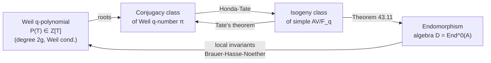

> **Prerequisites**: [[42-tate-isogeny-theorem|42. Tate's Isogeny Theorem]], [[40-weil-numbers|40. Weil Numbers and Their Properties]]
> **Objectives**:
> - Phát biểu Honda-Tate Theorem: bijection giữa isogeny classes và Weil numbers
> - Hiểu tính injectivity (do Tate) và surjectivity (do Honda)
> - Biết chiến lược xây dựng AV từ Weil number (Honda's construction)
> - Tính toán cụ thể: dimension của AV từ Weil polynomial
> - Ứng dụng: đếm isogeny classes, LMFDB

---

## Motivation / Intuition

Từ các bài trước, ta đã có bức tranh gần như hoàn chỉnh:
- Mỗi abelian variety $A$ over $\mathbb{F}_q$ gắn với một Weil $q$-number $\pi_A$ (Bài 40).
- Isogeny class của $A$ được xác định bởi $\pi_A$ (Tate's theorem, Bài 42).
- Do đó, ta có một map injective: $\{\text{isogeny classes của simple AV}/\mathbb{F}_q\} \to \{\text{conjugacy classes của Weil }q\text{-numbers}\}$.

Câu hỏi còn lại: map này có **surjective** không? Tức là, với mọi Weil $q$-number $\pi$, có tồn tại simple abelian variety $A/\mathbb{F}_q$ sao cho $\pi_A$ và $\pi$ conjugate không?

**Honda (1968)** chứng minh: **CÓ!** Mọi Weil $q$-number đều là Frobenius của một abelian variety nào đó. Kết hợp với injectivity của Tate, ta thu được:

$$
\{\text{isogeny classes của simple AV over }\mathbb{F}_q\} \xrightarrow{1:1} \{\text{conjugacy classes của Weil }q\text{-numbers}\}
$$

Đây là **Honda-Tate theorem** — phân loại hoàn chỉnh abelian varieties over finite fields up to isogeny.

---

## Honda-Tate Theorem: Phát Biểu

### Theorem

> [!theorem] Theorem 43.1 — Honda-Tate Theorem  
> Cho $q = p^a$ là một prime power. Map tự nhiên:
>
> $$
> \Phi: \{\text{isogeny classes của simple abelian varieties over }\mathbb{F}_q\} \to \{\mathbb{Q}\text{-conjugacy classes của Weil }q\text{-numbers}\}
> $$
>
> $$
> [A] \mapsto [\pi_A]
> $$
>
> là một **bijection** (song ánh).

**Proof structure.**

**(Injectivity, Tate 1966):** Nếu $[A] = [B]$ tức $A \sim B$, thì $\pi_A$ và $\pi_B$ có cùng characteristic polynomial (Corollary 42.4), nên cùng conjugacy class. Ngược lại, nếu $[\pi_A] = [\pi_B]$, thì $A \sim B$ (Corollary 42.4). $\checkmark$

**(Surjectivity, Honda 1968):** Cho $\pi$ là Weil $q$-number bất kỳ. Ta cần xây dựng simple AV $A/\mathbb{F}_q$ sao cho $\pi_A$ conjugate với $\pi$. Đây là phần không tầm thường. Xem Theorem 43.3 cho construction. $\checkmark$

$\blacksquare$

### Theorem

> [!theorem] Theorem 43.2 — Dimension của AV từ Weil Number  
> Cho $\pi$ là Weil $q$-number, $L = \mathbb{Q}(\pi)$ (trường số học sinh bởi $\pi$), và $e = e(\pi)$ là tối thiểu số nguyên dương sao cho $\pi^e$ là Weil $p^{ae}$-number với $p \nmid $ (denominator of invariants).
>
> Dimension của abelian variety $A$ tương ứng với $\pi$ là:
>
> $$
> g = \dim A = \frac{[L:\mathbb{Q}]}{2} \cdot [D:L]^{1/2}
> $$
>
> với $D = \operatorname{End}^0(A)$ là endomorphism algebra và $[D:L]$ là square.
>
> **Công thức đơn giản** (khi $A$ simple với $\operatorname{End}^0(A) = L$, tức $[D:L] = 1$):
>
> $$
> g = \frac{[L:\mathbb{Q}]}{2} = \frac{\deg P_\pi^{\text{irred}}}{2}
> $$
>
> với $P_\pi^{\text{irred}}$ là minimal polynomial của $\pi$ over $\mathbb{Q}$.

> [!example] Example 43.3 — Tính Dimension từ Weil Number  
> **(a)** $\pi = \sqrt{-p}$ (Weil $p$-number với $p$ nguyên tố, $p \equiv 3 \pmod 4$). Minimal polynomial: $T^2 + p$. $L = \mathbb{Q}(i\sqrt{p})$, $[L:\mathbb{Q}] = 2$, nên $g = 1$. Đây là elliptic curve.
>
> **(b)** $\pi$ là nghiệm của $T^4 - T^3 + 2T^2 - 101T + 101^2$ (irreducible Weil $101$-polynomial bậc $4$). $L = \mathbb{Q}(\pi)$, $[L:\mathbb{Q}] = 4$, nên $g = 2$. Đây là abelian surface.
>
> **(c)** $\pi = \sqrt{4} = 2$ (Weil $4$-number thực, $q = 4$). $L = \mathbb{Q}$, $[L:\mathbb{Q}] = 1$, nhưng $g \geq 1$, nên phải có $[D:L] > 1$. Thực ra $g = 1$ và $D$ là quaternion algebra (supersingular elliptic curve over $\mathbb{F}_4$).

---

## Honda's Construction (Chiến Lược Surjectivity)

Honda xây dựng AV từ Weil number bằng một chiến lược khéo léo gồm hai bước:

### Theorem

> [!theorem] Theorem 43.4 — Honda's Lift (Lý thuyết CM)  
> Cho $\pi$ là Weil $q$-number với $L = \mathbb{Q}(\pi)$ là CM field (imaginary quadratic extension của totally real field). Khi đó:
>
> **(Step 1)** Tồn tại simple abelian variety $B$ over số phức $\mathbb{C}$ với Complex Multiplication (CM) bởi $\mathcal{O}_L$ (ring of integers của $L$), và có Frobenius type phù hợp với $\pi$.
>
> **(Step 2)** $B$ có model over số trường $K$ (algebraic number field nhỏ). Khi đó reduction của $B$ modulo một prime ideal $\mathfrak{p}$ của $K$ over $p$ cho abelian variety $A = B_{\mathfrak{p}}$ over finite field $\mathbb{F}_{p^f}$ (với $f = f(\mathfrak{p}|p)$).
>
> **(Step 3)** Frobenius của $A$ có minimal polynomial liên quan đến $\pi$.
>
> Sau khi điều chỉnh (base change, Weil restriction), ta thu được AV over $\mathbb{F}_q$ với Frobenius $= \pi$.

**Proof (sketch - Step 1).**
Mọi CM field $L$ có abelian varieties với CM by $L$: đây là kết quả cổ điển từ lý thuyết số phức. Cụ thể, nếu $\Phi$ là một CM type (tập con của embeddings $L \hookrightarrow \mathbb{C}$ thỏa điều kiện $\Phi \cup \bar{\Phi} = $ tất cả embeddings), thì $A = \mathbb{C}^g / \Phi(\mathcal{O}_L)$ là abelian variety với CM by $\mathcal{O}_L$.

**Proof (sketch - Steps 2-3).**
Dùng lý thuyết canonical lift của Serre-Tate và reduction theory. Chi tiết phức tạp, xem Honda (1968) hoặc Milne's notes. $\blacksquare$

> [!warning] Remark 43.5 — Trường hợp phức tạp: Weil numbers không phải CM  
> Không phải mọi Weil $q$-number $\pi$ đều có $\mathbb{Q}(\pi)$ là CM field. Ví dụ: với $\pi = p^{a/2}$ (real), $\mathbb{Q}(\pi)$ là số thực, không phải CM. Trường hợp này cần điều chỉnh: AV tương ứng là supersingular và endomorphism algebra $D$ là quaternion algebra (không commutative). Honda xử lý bằng cách dùng Weil restriction và các kỹ thuật bổ sung.

---

## Phân Loại Đầy Đủ theo Honda-Tate

### Classification

Các trường hợp cụ thể của Honda-Tate, phụ thuộc vào cấu trúc của $L = \mathbb{Q}(\pi)$:

> [!theorem] Theorem 43.6 — Honda-Tate: Các Trường Hợp  
> Với Weil $q$-number $\pi$ ($q = p^a$), đặt $L = \mathbb{Q}(\pi)$, $[L:\mathbb{Q}] = 2r$. AV tương ứng $A$ có $\dim A = r \cdot [D:L]^{1/2}$.
>
> **(Case R)** $\pi = \pm p^{a/2} \in \mathbb{R}$: $L = \mathbb{Q}$, $r = 1/2$... Cần $a$ chẵn, $q$ là số chính phương. Endomorphism algebra $D$ là quaternion division algebra over $\mathbb{Q}$ unramified away from $p$ và $\infty$. $\dim A = 1$ (elliptic curve supersingular).
>
> **(Case CM)** $\pi \notin \mathbb{R}$, $L = \mathbb{Q}(\pi)$ là CM field, $[D:L] = 1$: AV $A$ ordinary hoặc semi-ordinary, $\dim A = r = [L:\mathbb{Q}]/2$.
>
> **(Case Mixed)** $\pi \notin \mathbb{R}$ nhưng $L$ không phải CM: điều này không xảy ra! Vì với Weil $q$-number, $\bar\pi = q/\pi$, nên $L = \mathbb{Q}(\pi)$ đóng dưới complex conjugate, tức $L$ là CM field (nếu $\pi \notin \mathbb{R}$) hoặc $\mathbb{Q}$ (nếu $\pi \in \mathbb{R}$).

### Worked Example

> [!example] Example 43.7 — Xây Dựng AV từ Weil Numbers cho $q = 5$  
> Tất cả isogeny classes của elliptic curves over $\mathbb{F}_5$ ($g=1$):
>
> Weil $5$-polynomials bậc $2$: $T^2 - tT + 5$ với $|t| \leq 2\sqrt{5} \approx 4.47$, nên $t \in \{-4, -3, -2, -1, 0, 1, 2, 3, 4\}$. Nhưng không phải tất cả đều cho valid Weil polynomial (cần check $t^2 - 4\cdot 5 < 0$ hoặc đặc biệt).
>
> Các $t$ hợp lệ:
>
> | $t$ | $P(T) = T^2-tT+5$ | $|E(\mathbb{F}_5)| = 5+1-t$ | Loại |
> |---|---|---|---|
> | $-4$ | $T^2+4T+5$ | $10$ | ordinary (disc $= -4$) |
> | $-3$ | $T^2+3T+5$ | $9$ | ordinary (disc $= -11$) |
> | $-2$ | $T^2+2T+5$ | $8$ | ordinary (disc $= -16$) |
> | $-1$ | $T^2+T+5$ | $7$ | ordinary (disc $= -19$) |
> | $0$ | $T^2+5$ | $6$ | supersingular |
> | $1$ | $T^2-T+5$ | $5$ | ordinary |
> | $2$ | $T^2-2T+5$ | $4$ | ordinary |
> | $3$ | $T^2-3T+5$ | $3$ | ordinary |
> | $4$ | $T^2-4T+5$ | $2$ | ordinary |
>
> Vậy có $9$ isogeny classes của elliptic curves over $\mathbb{F}_5$. Honda-Tate đảm bảo mỗi $t$ trên tương ứng với ít nhất một elliptic curve (tồn tại).

> [!example] Example 43.8 — AV từ $\pi = 2i$ (Weil $4$-number)  
> $\pi = 2i \in \mathbb{C}$, $q = 4$. $L = \mathbb{Q}(2i) = \mathbb{Q}(i)$, $[L:\mathbb{Q}] = 2$, nên $g = 1$ (elliptic curve).
>
> Minimal polynomial: $T^2 + 4$. Số điểm: $|E(\mathbb{F}_4)| = (1-2i)(1+2i) = 1+4 = 5$.
>
> AV tương ứng: elliptic curve $E$ over $\mathbb{F}_4$ với $|E(\mathbb{F}_4)| = 5$. Ví dụ: $E: y^2 + y = x^3$ over $\mathbb{F}_4$ (supersingular curve với $j = 0$, thực ra $|E(\mathbb{F}_4)| = 5$).
>
> Điều Honda-Tate đảm bảo: một elliptic curve như vậy **tồn tại** — và thực ra, ta có thể tìm nó.

---

## Ứng dụng: Đếm Isogeny Classes

Honda-Tate theorem cho phép ta đếm isogeny classes bằng cách đếm Weil polynomials:

### Theorem

> [!theorem] Theorem 43.9 — Đếm Isogeny Classes  
> Số isogeny classes của $g$-dimensional abelian varieties over $\mathbb{F}_q$ bằng số $\mathbb{Q}$-conjugacy classes của Weil $q$-numbers $\pi$ sao cho abelian variety tương ứng có dimension $g$.
>
> Đặc biệt với $g = 1$: số isogeny classes của elliptic curves over $\mathbb{F}_q$ bằng:
>
> $$
> N(1, q) = \#\{t \in \mathbb{Z}: |t| \leq 2\sqrt{q},\text{ và Hasse-Deuring conditions}\}
> $$
>
> Asymptotically $N(1,q) \sim 4\sqrt{q}$ khi $q \to \infty$.

> [!note] Remark 43.10 — LMFDB Database  
> Dự án **LMFDB** (L-functions and Modular Forms Database) có database đầy đủ về isogeny classes của abelian varieties over finite fields, được phân loại theo Honda-Tate. Website: lmfdb.org
>
> Ví dụ, với $g = 2$, $q$ nhỏ, tất cả Weil $q$-polynomials bậc $4$ được liệt kê cùng với thông tin về isogeny class tương ứng.

---

## Endomorphism Algebras và Honda-Tate

Honda-Tate còn cho phép ta tính endomorphism algebra $D = \operatorname{End}^0(A)$ từ $\pi$:

> [!theorem] Theorem 43.11 — Endomorphism Algebra từ Weil Number  
> Cho $A$ simple over $\mathbb{F}_q$ với Frobenius $\pi_A$, $L = \mathbb{Q}(\pi_A)$. Endomorphism algebra $D = \operatorname{End}^0(A)$ là một **central simple $L$-algebra**. Nó được xác định hoàn toàn bởi local invariants $\text{inv}_v(D)$ tại mọi place $v$ của $L$:
>
> - Với $v \nmid p$ và $v \nmid \infty$: $\text{inv}_v(D) = 0$.
> - Với $v \mid p$: $\text{inv}_v(D) = \frac{v(\pi_A)}{v(q)} \cdot [L_v:\mathbb{Q}_p] \pmod{\mathbb{Z}}$.
> - Với $v \mid \infty$: $\text{inv}_v(D) = \frac{1}{2}$ nếu $v$ real, $0$ nếu $v$ complex.
>
> (Ở đây $v(\pi_A)$ là $v$-adic valuation của $\pi_A$ trong $L_v$.)

> [!example] Example 43.12 — Endomorphism Algebra cho Supersingular Elliptic Curve  
> Cho $E$ supersingular elliptic curve over $\mathbb{F}_p$ (với $p \geq 5$). Frobenius $\pi_E$ thoả $\pi_E^2 = -p$ (hoặc $\pi_E = \pm\sqrt{-p}$). $L = \mathbb{Q}(\sqrt{-p})$, imaginary quadratic.
>
> Local invariants: $\text{inv}_p(D) = 1/2$ (vì $v_p(\pi_E) = 1/2 \cdot [L_p:\mathbb{Q}_p] / v_p(q) = ...$), $\text{inv}_\infty(D) = 1/2$.
>
> Bởi định lý Brauer-Hasse-Noether, $D$ là quaternion algebra over $\mathbb{Q}$ ramified tại $p$ và $\infty$ chính xác. Đây là quaternion algebra Hamilton! $\operatorname{rank}_\mathbb{Z} D = 4$.

---

## Sơ Đồ Isogeny Graph

Isogeny classes (các "nút" trong isogeny graph) được phân loại bởi Honda-Tate. Trong isogeny graph, mỗi nút là một isomorphism class của AV, và hai nút được nối bởi cạnh nếu có isogeny giữa chúng.



---

## SageMath Cheatsheet

```python
# Enumerate Weil polynomials (= isogeny classes) over F_q
import math

def weil_polynomials_g1(q):
    """List all Weil q-polynomials of degree 2 (g=1 case)."""
    bound = int(2 * math.sqrt(q))
    result = []
    for t in range(-bound, bound+1):
        disc = t*t - 4*q
        # Check Hasse conditions (simplified: just need |t| <= 2*sqrt(q))
        if t*t <= 4*q:
            result.append((t, f"T^2 - {t}*T + {q}"))
    return result

polys_5 = weil_polynomials_g1(5)
print(f"Weil 5-polynomials (g=1): {len(polys_5)} isogeny classes")
for t, p in polys_5:
    print(f"  t={t}: {p}, |E(F_5)| = {5+1-t}")

# For g=2: count Weil polynomials T^4 - a1*T^3 + a2*T^2 - a1*q*T + q^2
# (palindromic structure: coefficients c_k = q^(g-k) * c_{2g-k})
def weil_polynomials_g2(q):
    """Approximate count of Weil q-polynomials of degree 4."""
    import numpy as np
    bound_a1 = int(4 * math.sqrt(q))  # rough bound on a1
    count = 0
    for a1 in range(-bound_a1, bound_a1+1):
        for a2 in range(int(-6*q), int(6*q)):
            # Check if T^4 - a1*T^3 + a2*T^2 - a1*q*T + q^2 is Weil poly
            coeffs = [1, -a1, a2, -a1*q, q**2]
            roots = np.roots(coeffs)
            if all(abs(abs(r) - math.sqrt(q)) < 0.01 for r in roots):
                count += 1
    return count

# Note: this is slow for large q; use LMFDB for comprehensive data

# Verify dimension formula
# For pi = root of T^4 - T^3 + 2*T^2 - 101*T + 101^2
# [Q(pi):Q] = 4 (irreducible degree 4 polynomial)
# g = [Q(pi):Q]/2 = 2 (abelian surface)
from numpy.polynomial import polynomial as P
coeffs = [101**2, -101, 2, -1, 1]  # constant term first for numpy
import numpy as np
roots = np.roots([1, -1, 2, -101, 101**2])  # highest first
print("\nRoots of T^4 - T^3 + 2T^2 - 101T + 101^2:")
for r in roots:
    print(f"  {r:.4f}, |r| = {abs(r):.4f}")
print(f"All roots have |r| = sqrt(101)? {all(abs(abs(r)-math.sqrt(101))<0.01 for r in roots)}")
print(f"Dimension of corresponding AV: g = deg(poly)/2 = 4/2 = 2")
```

---

## Summary / Key Takeaways

- **Honda-Tate Theorem**: bijection $[\text{simple AV}/\mathbb{F}_q]_{\sim} \xrightarrow{1:1} [\pi \in W(q)]_{\mathbb{Q}\text{-conj}}$.
- **Injectivity** (Tate 1966): isogeny class $\Rightarrow$ Frobenius conjugacy class (từ Tate's isogeny theorem).
- **Surjectivity** (Honda 1968): mọi Weil $q$-number đến từ một AV, xây dựng via CM theory + reduction.
- **Dimension formula**: $\dim A = [L:\mathbb{Q}]/2 \cdot [D:L]^{1/2}$ với $L = \mathbb{Q}(\pi)$.
- **Endomorphism algebra** $D$ xác định bởi local invariants tại primes over $p$ và infinite places.
- **Ứng dụng**: Đếm isogeny classes, LMFDB database, số $|A(\mathbb{F}_{q^n})|$ từ Frobenius polynomial.
- Với $g = 1$: số isogeny classes $\sim 4\sqrt{q}$ khi $q \to \infty$.

---

## References

- Honda, T. "Isogeny classes of abelian varieties over finite fields." *Journal of the Mathematical Society of Japan* **20** (1968), 83–95.
- Tate, J. "Endomorphisms of Abelian Varieties over Finite Fields." *Inventiones Mathematicae* **2** (1966), 134–144.
- Wikipedia, "Honda–Tate theorem." en.wikipedia.org/wiki/Honda%E2%80%93Tate_theorem
- Oort, F. "Abelian Varieties over Finite Fields." §19 (Honda-Tate theory in detail). math.nyu.edu/~tschinke/books/finite-fields/final/05_oort.pdf
- Fernando, R. "An example of the Honda-Tate theorem." ravif.web.illinois.edu/exposition/Honda-Tate.pdf
- Dupuy, T., Kedlaya, K., Roe, D., Vincent, C. "Isogeny Classes of Abelian Varieties over Finite Fields in the LMFDB." arxiv.org/abs/2003.05380
- Milne, J.S. *Abelian Varieties*, §15 (Abelian varieties over finite fields). jmilne.org/math
- Dembélé, L. "Abelian Varieties over Finite Fields: Honda-Tate's Theorem." AWS 2024 Notes. swc-math.github.io/aws/2024/PAWSDembele/2023PAWSDembeleNotes.pdf
