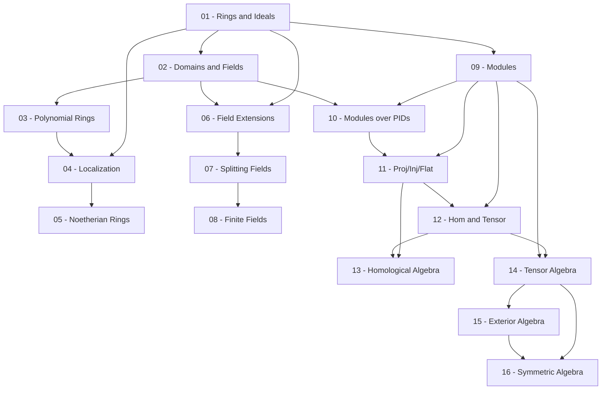

> **Level**: Graduate (rigorous, đầy đủ proof)
> **Background**: Group Theory cơ bản, Linear Algebra
> **SageMath**: Có
> **Sources**: Dummit & Foote (D&F Ch. 7–17), Lang's Algebra, Rotman AMA, Atiyah–MacDonald Ch. 1–2

---

## Lessons

| # | Title | Key Concepts | Prerequisites | Difficulty |
|---|-------|-------------|---------------|------------|
| 01 | Rings and Ideals | Định nghĩa ring, ring homomorphism, ideal, quotient ring, correspondence theorem | — | ★★☆☆☆ |
| 02 | Special Rings: Domains and Fields | Integral domain, zero divisor, field, characteristic, PID, UFD, Euclidean domain | 01 | ★★★☆☆ |
| 03 | Polynomial Rings and Factorization | R[x], Gauss's Lemma, Eisenstein, UFD iff R[x] UFD, irreducible vs prime | 02 | ★★★☆☆ |
| 04 | Localization | S⁻¹R, universal property, local rings, prime spectrum | 01–03 | ★★★☆☆ |
| 05 | Noetherian Rings and Hilbert Basis Theorem | Chain conditions, Noetherian/Artinian, HBT, radical, Nakayama's Lemma | 01–04 | ★★★★☆ |
| 06 | Field Extensions | Algebraic/transcendental, [K:F] degree, finite extensions, minimal polynomial | 01–02 | ★★★☆☆ |
| 07 | Splitting Fields and Algebraic Closure | Splitting field, normal/separable extension, algebraic closure | 06 | ★★★★☆ |
| 08 | Finite Fields | Cấu trúc F_{p^n}, Frobenius endomorphism, cyclic multiplicative group | 06–07 | ★★★☆☆ |
| 09 | Modules: Definitions and Basic Constructions | R-module, submodule, quotient, isomorphism theorems, free module, direct sum | 01 | ★★☆☆☆ |
| 10 | Finitely Generated Modules over PIDs | Structure theorem, invariant factor/elementary divisor form, ứng dụng Jordan form | 02, 09 | ★★★★☆ |
| 11 | Projective, Injective, and Flat Modules | Exact sequences, split sequences, Baer's criterion | 09–10 | ★★★★☆ |
| 12 | Exact Functors and Hom/Tensor | Hom_R, tensor product, left/right exactness, Hom–Tensor adjunction | 09–11 | ★★★★☆ |
| 13 | Introduction to Homological Algebra | Chain complexes, homology, Snake Lemma, Five Lemma, long exact sequence, Tor & Ext | 11–12 | ★★★★★ |
| 14 | Tensor Algebra | Tensor product tổng quát, tensor algebra T(M), multilinear maps | 09, 12 | ★★★☆☆ |
| 15 | Exterior Algebra and Determinants | ∧(M), alternating maps, determinant via exterior algebra, Grassmann algebra | 14 | ★★★★☆ |
| 16 | Symmetric Algebra and Applications | Sym(M), polynomial ring as symmetric algebra, ứng dụng Commutative Algebra | 14–15 | ★★★☆☆ |

---

## Appendix Candidates

| ID | Theorem | Related Lesson | Notes |
|----|---------|----------------|-------|
| A0 | Structure Theorem for Modules over PIDs | 10 | Chứng minh đầy đủ — hai dạng invariant factor và elementary divisor |
| A1 | Hilbert Basis Theorem | 05 | Chứng minh induction trên Noetherian condition |
| A2 | Baer's Criterion (Injective Modules) | 11 | Chứng minh kỹ thuật via Zorn's Lemma |
| A3 | Snake Lemma | 13 | Diagram chase đầy đủ |

---

## Dependency Graph

---

## Progress Tracker

- [ ] [[00-roadmap|00. Roadmap]]
- [ ] [[01-rings-and-ideals|01. Rings and Ideals]]
- [ ] [[02-special-rings-domains-fields|02. Special Rings: Domains and Fields]]
- [ ] [[03-polynomial-rings-and-factorization|03. Polynomial Rings and Factorization]]
- [ ] [[04-localization|04. Localization]]
- [ ] [[05-noetherian-rings|05. Noetherian Rings and Hilbert Basis Theorem]]
- [ ] [[06-field-extensions|06. Field Extensions]]
- [ ] [[07-splitting-fields|07. Splitting Fields and Algebraic Closure]]
- [ ] [[08-finite-fields|08. Finite Fields]]
- [ ] [[09-modules-definitions|09. Modules: Definitions and Basic Constructions]]
- [ ] [[10-modules-over-pids|10. Finitely Generated Modules over PIDs]]
- [ ] [[11-projective-injective-flat|11. Projective, Injective, and Flat Modules]]
- [ ] [[12-hom-and-tensor|12. Exact Functors and Hom/Tensor]]
- [ ] [[13-homological-algebra|13. Introduction to Homological Algebra]]
- [ ] [[14-tensor-algebra|14. Tensor Algebra]]
- [ ] [[15-exterior-algebra|15. Exterior Algebra and Determinants]]
- [ ] [[16-symmetric-algebra|16. Symmetric Algebra and Applications]]
