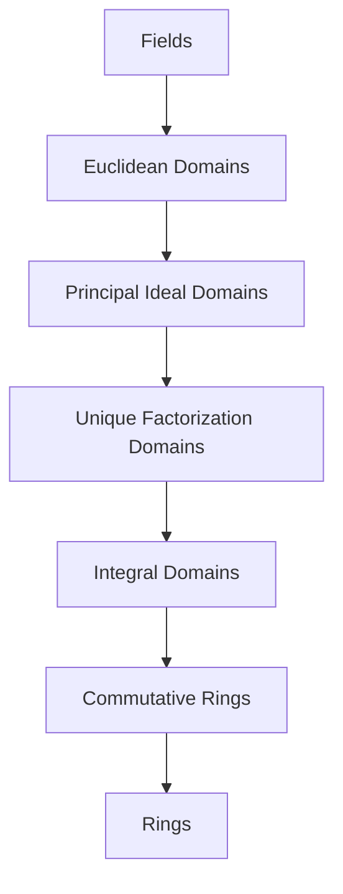

> **Prerequisites**: [[01-rings-and-ideals|01. Rings and Ideals]] — định nghĩa ring, ideal, prime/maximal ideal, quotient ring.
> **Objectives**:
> - Phân biệt integral domain, division ring, và field
> - Nắm vững hệ thống phân cấp: Fields ⊂ ED ⊂ PID ⊂ UFD ⊂ Integral Domain
> - Hiểu khái niệm characteristic và ý nghĩa của nó
> - Nhận biết và làm việc với associates, irreducibles, và primes trong domain
> - Hiểu vì sao $\mathbb{Z}[\sqrt{-5}]$ là counterexample kinh điển cho UFD

---

## Motivation / Intuition

Không phải mọi ring đều "ngoan ngoãn" như $\mathbb{Z}$ hay $\mathbb{Q}$. Trong $\mathbb{Z}/6\mathbb{Z}$, ta gặp $2 \cdot 3 = 0$ dù cả $2$ và $3$ đều không phải $0$ — một hiện tượng không tồn tại trong số học thông thường.

Bài này xây dựng một **hệ thống phân cấp** các loại ring "tốt" hơn và hơn:

$$
\text{Fields} \subset \text{Euclidean Domains} \subset \text{PIDs} \subset \text{UFDs} \subset \text{Integral Domains}
$$

Mỗi tầng thêm vào một tính chất số học quan trọng. Hiểu rõ hệ thống này là chìa khóa để học Commutative Algebra: nhiều định lý chỉ đúng ở một tầng nào đó, và phần lớn nỗ lực của Commutative Algebra là "nâng" kết quả từ tầng thấp lên tầng cao hơn thông qua các kỹ thuật như localization.

---

## Integral Domain

### Định nghĩa và Zero Divisors

> [!definition] Definition 2.1 — Zero Divisor và Integral Domain
> Cho $R$ là commutative ring.
>
> - Phần tử $a \in R$, $a \neq 0$, là **zero divisor** (ước số không) nếu tồn tại $b \neq 0$ với $ab = 0$.
> - $R$ là **integral domain** (miền nguyên) nếu $R$ không có zero divisors, tức:
>
> $$
> ab = 0 \implies a = 0 \text{ hoặc } b = 0
> $$

> [!example] Example 2.2
> - $\mathbb{Z}$, $\mathbb{Q}$, $\mathbb{R}$, $\mathbb{C}$: integral domains.
> - $\mathbb{Z}[i]$, $\mathbb{Z}[\sqrt{-5}]$: integral domains (subring của $\mathbb{C}$).
> - $\mathbb{Z}/p\mathbb{Z}$ với $p$ nguyên tố: integral domain (và là field).
> - $\mathbb{Z}/6\mathbb{Z}$: **không** là integral domain ($2 \cdot 3 = 0$).
> - $M_2(\mathbb{R})$: **không** là integral domain và không giao hoán:
>
> $$
> \begin{pmatrix}1&0\\0&0\end{pmatrix}\begin{pmatrix}0&0\\0&1\end{pmatrix} = \begin{pmatrix}0&0\\0&0\end{pmatrix}
> $$

> [!theorem] Theorem 2.3 — Cancellation Law
> $R$ là integral domain $\iff$ quy tắc triệt tiêu (cancellation law) đúng trong $R$:
>
> $$
> ab = ac \text{ và } a \neq 0 \implies b = c
> $$

**Proof.**
($\Rightarrow$) $ab = ac \Rightarrow a(b-c) = 0$. Vì $a \neq 0$ và $R$ là integral domain, $b - c = 0$.

($\Leftarrow$) Nếu $ab = 0 = a \cdot 0$ và $a \neq 0$, cancellation cho $b = 0$. $\blacksquare$

> [!theorem] Theorem 2.4 — Finite Integral Domain là Field
> Mọi integral domain hữu hạn đều là field.

**Proof.**
Cho $R$ là integral domain hữu hạn, $a \in R$, $a \neq 0$. Xét ánh xạ $\mu_a : R \to R$, $x \mapsto ax$. Vì $R$ là integral domain, $\mu_a$ là đơn ánh. Vì $R$ hữu hạn, $\mu_a$ là song ánh. Vậy tồn tại $b \in R$ với $ab = 1$, tức $a$ là unit. $\blacksquare$

---

## Characteristic

> [!definition] Definition 2.5 — Characteristic
> **Characteristic** (đặc số) của ring $R$, ký hiệu $\operatorname{char}(R)$, là số nguyên dương nhỏ nhất $n$ sao cho $n \cdot 1 = \underbrace{1 + \cdots + 1}_{n} = 0$. Nếu không có số $n$ như vậy, $\operatorname{char}(R) = 0$.

> [!theorem] Theorem 2.6 — Characteristic của Integral Domain
> Characteristic của một integral domain hoặc bằng $0$, hoặc là số nguyên tố.

**Proof.**
Giả sử $\operatorname{char}(R) = n > 0$ và $n = ab$ với $1 \leq a, b < n$. Khi đó:

$$
0 = n \cdot 1 = (ab) \cdot 1 = (a \cdot 1)(b \cdot 1)
$$

Vì $R$ là integral domain, $a \cdot 1 = 0$ hoặc $b \cdot 1 = 0$. Nhưng điều này mâu thuẫn với tính tối thiểu của $n$. Vậy $n$ phải là số nguyên tố. $\blacksquare$

> [!example] Example 2.7
> - $\operatorname{char}(\mathbb{Z}) = \operatorname{char}(\mathbb{Q}) = \operatorname{char}(\mathbb{R}) = \operatorname{char}(\mathbb{C}) = 0$.
> - $\operatorname{char}(\mathbb{Z}/p\mathbb{Z}) = \operatorname{char}(\mathbb{F}_p) = p$.
> - $\operatorname{char}(\mathbb{F}_{p^n}) = p$ (sẽ gặp ở Bài 08).
> - Mọi field có characteristic $0$ đều chứa $\mathbb{Q}$ như subfield; mọi field có characteristic $p$ đều chứa $\mathbb{F}_p$.

---

## Field và Division Ring

> [!definition] Definition 2.8 — Field và Division Ring
> - **Division ring** (thể chia): ring $R$ (không nhất thiết giao hoán) với $1 \neq 0$ mà mọi phần tử $\neq 0$ đều có nghịch đảo nhân, tức $R^\times = R \setminus \{0\}$.
> - **Field** (trường): commutative division ring.

> [!example] Example 2.9
> - Fields: $\mathbb{Q}$, $\mathbb{R}$, $\mathbb{C}$, $\mathbb{F}_p = \mathbb{Z}/p\mathbb{Z}$, $\mathbb{Q}(\sqrt{2})$.
> - Division ring nhưng **không** là field: **Quaternions** $\mathbb{H} = \{a + bi + cj + dk \mid a,b,c,d \in \mathbb{R}\}$ với $i^2 = j^2 = k^2 = ijk = -1$, $ij = k \neq ji = -k$.

> [!theorem] Theorem 2.10 — Field $\iff$ chỉ có Ideals tầm thường
> $R$ là field $\iff$ các ideals của $R$ chỉ là $\{0\}$ và $R$.

**Proof.**
($\Rightarrow$) Nếu $I \trianglelefteq R$ và $I \neq \{0\}$, lấy $a \in I$, $a \neq 0$. Vì $R$ là field, $a^{-1} \in R$, nên $1 = a^{-1} \cdot a \in I$, dẫn đến $I = R$.

($\Leftarrow$) Nếu $a \neq 0$, ideal $(a) = R$, nên $1 \in (a)$, tức $ba = 1$ với $b \in R$. Vậy $a$ là unit. $\blacksquare$

---

## Hệ thống phân cấp: ED ⊂ PID ⊂ UFD ⊂ Domain

### Associates, Irreducibles, Primes

> [!definition] Definition 2.11 — Associates, Irreducible, Prime
> Cho $R$ là integral domain và $a, b \in R$ không phải unit và $\neq 0$:
>
> - $a$ và $b$ là **associates** (phần tử liên kết) nếu $a = ub$ với $u \in R^\times$.
> - $a$ là **irreducible** (bất khả quy) nếu: $a = bc \Rightarrow b \in R^\times$ hoặc $c \in R^\times$.
> - $a$ là **prime** (nguyên tố) nếu: $(a)$ là prime ideal, tức $a \mid bc \Rightarrow a \mid b$ hoặc $a \mid c$.

> [!theorem] Theorem 2.12 — Prime $\Rightarrow$ Irreducible
> Trong integral domain, mọi phần tử nguyên tố đều bất khả quy.

**Proof.**
Cho $p$ là prime và $p = ab$. Vì $p \mid ab$ và $p$ là prime, WLOG $p \mid a$, tức $a = pc$ với $c \in R$. Khi đó $p = ab = pcb$, nên $p(1 - cb) = 0$. Vì $p \neq 0$ và $R$ là domain, $cb = 1$, tức $b$ là unit. $\blacksquare$

> [!warning] Counterexample 2.13 — Irreducible không nhất thiết là Prime
> Trong $\mathbb{Z}[\sqrt{-5}]$: phần tử $3$ là irreducible nhưng **không** phải prime.
>
> - $3 \mid (2 + \sqrt{-5})(2 - \sqrt{-5}) = 4 + 5 = 9$, nhưng $3 \nmid (2 + \sqrt{-5})$ và $3 \nmid (2 - \sqrt{-5})$ trong $\mathbb{Z}[\sqrt{-5}]$.
> - Điều này xảy ra vì $\mathbb{Z}[\sqrt{-5}]$ **không** là UFD.
> - Hơn nữa: $9 = 3 \cdot 3 = (2+\sqrt{-5})(2-\sqrt{-5})$ — hai cách phân tích thành irreducibles khác nhau.

### Unique Factorization Domain (UFD)

> [!definition] Definition 2.14 — UFD (Miền phân tích nhân tử duy nhất)
> Integral domain $R$ là **UFD** (unique factorization domain) nếu mọi phần tử $\neq 0$, không là unit đều có thể viết:
>
> $$
> a = p_1 p_2 \cdots p_n
> $$
>
> với $p_i$ là irreducible, và cách viết này **duy nhất** theo nghĩa: nếu $a = q_1 \cdots q_m$ thì $m = n$ và có thể sắp xếp lại để $p_i$ và $q_i$ là associates.

> [!theorem] Theorem 2.15 — Đặc trưng của UFD
> $R$ là UFD $\iff$ (1) mọi chuỗi tăng $(a_1) \subseteq (a_2) \subseteq \cdots$ ổn định (ACC on principal ideals), và (2) trong $R$, irreducible $\iff$ prime.

### Principal Ideal Domain (PID)

> [!definition] Definition 2.16 — PID (Miền ideal chính)
> Integral domain $R$ là **PID** nếu mọi ideal của $R$ đều là principal, tức có dạng $(a)$ với $a \in R$.

> [!theorem] Theorem 2.17 — PID là UFD
> Mọi PID đều là UFD.

**Proof sketch.**
Cần chứng minh hai điều:

**(a) ACC (Ascending Chain Condition) trên principal ideals đúng trong PID:**
Cho $(a_1) \subseteq (a_2) \subseteq \cdots$. Đặt $I = \bigcup_n (a_n)$. Kiểm tra $I$ là ideal. Vì $R$ là PID, $I = (b)$ với $b \in R$. Khi đó $b \in (a_N)$ với $N$ nào đó, nên $(a_n) = I = (b)$ với mọi $n \geq N$.

**(b) Irreducible $\Rightarrow$ prime trong PID:**
Cho $p$ irreducible và $p \mid ab$. Xét ideal $(p, a)$. Vì PID, $(p, a) = (d)$. Khi đó $p = dr$ với $r \in R$. Vì $p$ irreducible, $d$ là unit hoặc $r$ là unit.
- Nếu $d$ là unit: $(p,a) = R$, nên $1 = sp + ta$ với $s, t \in R$, suy ra $b = spb + tab$. Vì $p \mid ab$, ta có $p \mid b$.
- Nếu $r$ là unit: $p$ và $d$ là associates, tức $(p,a) = (p)$, suy ra $p \mid a$. $\blacksquare$

> [!warning] Counterexample 2.18 — UFD nhưng không PID
> $\mathbb{Z}[x]$ là UFD (định lý Gauss, Bài 03) nhưng **không** phải PID: ideal $(2, x)$ không phải principal.
>
> Chứng minh: nếu $(2, x) = (f)$, thì $f \mid 2$ và $f \mid x$. Từ $f \mid 2$: $f = \pm 1$ hoặc $f = \pm 2$. Nếu $f = \pm 2$: $2 \nmid x$, mâu thuẫn. Nếu $f = \pm 1$: $(f) = \mathbb{Z}[x]$, nhưng $(2, x) \neq \mathbb{Z}[x]$ (mọi phần tử trong $(2,x)$ có hệ số tự do chẵn).

### Euclidean Domain (ED)

> [!definition] Definition 2.19 — Euclidean Domain
> Integral domain $R$ là **Euclidean domain** nếu tồn tại hàm **Euclidean norm** (hoặc **degree function**) $N : R \setminus \{0\} \to \mathbb{Z}_{\geq 0}$ sao cho:
>
> Với mọi $a \in R$, $b \in R \setminus \{0\}$, tồn tại $q, r \in R$ với:
>
> $$
> a = bq + r, \quad \text{trong đó } r = 0 \text{ hoặc } N(r) < N(b)
> $$

> [!example] Example 2.20
> - $\mathbb{Z}$ với $N(n) = |n|$: thuật toán chia Euclid.
> - $k[x]$ với $k$ là field, $N(f) = \deg f$: phép chia đa thức.
> - $\mathbb{Z}[i]$ (Gaussian integers) với $N(a+bi) = a^2 + b^2$: chuẩn phức.
> - $\mathbb{Z}[\omega]$ với $\omega = e^{2\pi i/3}$ (Eisenstein integers), $N(a+b\omega) = a^2 - ab + b^2$.

> [!theorem] Theorem 2.21 — ED là PID
> Mọi Euclidean domain đều là PID.

**Proof.**
Cho $I \trianglelefteq R$, $I \neq \{0\}$. Chọn $b \in I \setminus \{0\}$ với $N(b)$ nhỏ nhất. Với mọi $a \in I$, chia Euclid: $a = bq + r$ với $r = 0$ hoặc $N(r) < N(b)$. Vì $r = a - bq \in I$ và $N(b)$ tối thiểu, phải có $r = 0$. Vậy $b \mid a$, tức $I = (b)$. $\blacksquare$

> [!warning] Counterexample 2.22 — PID nhưng không ED
> $\mathbb{Z}\!\left[\frac{1+\sqrt{-19}}{2}\right]$ là PID nhưng **không** là Euclidean domain với **bất kỳ** norm nào. Đây là ví dụ tinh tế — chứng minh cần kỹ thuật nặng hơn phạm vi bài này.

### Tóm tắt hệ thống phân cấp



| Lớp | Ví dụ điển hình | Ví dụ phản | Tính chất đặc trưng |
|-----|-----------------|------------|---------------------|
| Field | $\mathbb{Q}$, $\mathbb{F}_p$ | $\mathbb{Z}$ | Mọi phần tử $\neq 0$ có nghịch đảo |
| ED | $\mathbb{Z}$, $k[x]$, $\mathbb{Z}[i]$ | $\mathbb{Z}[(1+\sqrt{-19})/2]$ | Có thuật toán chia |
| PID | $\mathbb{Z}$, $k[x]$ | $\mathbb{Z}[x]$ | Mọi ideal là chính |
| UFD | $\mathbb{Z}[x]$, $k[x,y]$ | $\mathbb{Z}[\sqrt{-5}]$ | Phân tích nhân tử duy nhất |
| Domain | $\mathbb{Z}[\sqrt{-5}]$ | $\mathbb{Z}/6\mathbb{Z}$ | Không có zero divisor |

---

## Norm và Phân tích trong Gaussian Integers

> [!example] Example 2.23 — Phân tích trong $\mathbb{Z}[i]$
> Trong $\mathbb{Z}[i]$, **norm** $N(a+bi) = a^2 + b^2$ là multiplicative: $N(\alpha\beta) = N(\alpha)N(\beta)$.
>
> Điều này cho phép ta phân tích: một số nguyên tố $p \in \mathbb{Z}$ phân tích trong $\mathbb{Z}[i]$ khi và chỉ khi $p \equiv 1 \pmod 4$ hoặc $p = 2$.
>
> - $2 = -i(1+i)^2$ — ramified.
> - $5 = (2+i)(2-i)$ — split.
> - $3$ vẫn là nguyên tố trong $\mathbb{Z}[i]$ — inert ($3 \equiv 3 \pmod 4$).
>
> Đây là ví dụ đầu tiên của lý thuyết **ramification** — trung tâm của Algebraic Number Theory.

---

## SageMath Cheatsheet

```python
R = ZZ[I]
a = R(2 + I)
b = R(2 - I)
print(a * b)
print(R(5).is_irreducible())

print(a.norm())

S.<x> = QQ[]
f = x^3 - 2*x + 1
g = x^2 - 1
q, r = f.quo_rem(g)
print(q, r)

print(ZZ.is_unique_factorization_domain())
print(ZZ.is_principal_ideal_domain())
print(QQ['x'].is_euclidean_domain())

print(factor(360))

S.<x> = ZZ[]
print(factor(x^4 - 1))

R.<I> = ZZ[]
p = R(5)
print(factor(p))
```

---

## Summary / Key Takeaways

- **Zero divisor**: $a \neq 0$ với $ab = 0$ ($b \neq 0$) — thước đo sự "xấu" của ring.
- **Integral domain**: không có zero divisor; có cancellation law; finite domain là field.
- **Characteristic**: $\operatorname{char}(R) = 0$ hoặc là số nguyên tố trong integral domain.
- **Field**: mọi phần tử $\neq 0$ là unit — ideal duy nhất là $\{0\}$ và $R$.
- **Phân cấp**: Fields ⊊ ED ⊊ PID ⊊ UFD ⊊ Domain.
- **Irreducible vs Prime**: prime $\Rightarrow$ irreducible; ngược lại đúng trong UFD.
- **$\mathbb{Z}[\sqrt{-5}]$**: domain nhưng không UFD — phân tích $9 = 3 \cdot 3 = (2+\sqrt{-5})(2-\sqrt{-5})$.
- Hiểu phân cấp này là nền tảng: Commutative Algebra nghiên cứu làm thế nào các tính chất "tốt" (UFD, PID, ...) được phục hồi sau localization, completion, hay base change.

---

## References

- Dummit, D. S., & Foote, R. M. *Abstract Algebra* (3rd ed.), Chapters 8–9.
- Lang, S. *Algebra* (revised 3rd ed.), Chapter II §§2–4.
- Atiyah, M. F., & MacDonald, I. G. *Introduction to Commutative Algebra*, Chapter 1.
- Ireland, K., & Rosen, M. *A Classical Introduction to Modern Number Theory*, Chapter 1 (Gaussian integers).
- https://doc.sagemath.org/html/en/reference/rings/
