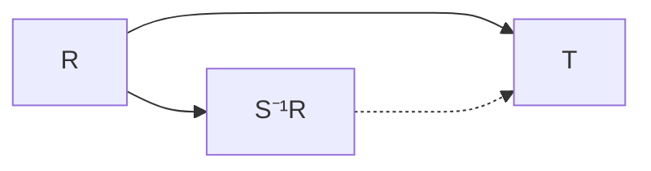

> **Prerequisites**: [[01-rings-and-ideals|01. Rings and Ideals]], [[02-special-rings-domains-fields|02. Special Rings: Domains and Fields]], [[03-polynomial-rings-and-factorization|03. Polynomial Rings and Factorization]] — integral domain, prime ideal, field of fractions, UFD.
> **Objectives**:
> - Hiểu localization là phép "thêm nghịch đảo" cho một tập nhân đóng
> - Xây dựng $S^{-1}R$ chặt chẽ và chứng minh universal property
> - Phân biệt localization tại một phần tử $f$, tại một prime $P$, và field of fractions
> - Nắm vững Correspondence Theorem cho ideals qua localization
> - Hiểu local rings và Nakayama's Lemma (phiên bản cơ bản)

---

## Motivation / Intuition

Localization là một trong những kỹ thuật trung tâm của Commutative Algebra và Algebraic Geometry. Ý tưởng xuất phát từ một phép toán rất quen thuộc: từ $\mathbb{Z}$, ta xây dựng $\mathbb{Q}$ bằng cách "chia cho mọi số nguyên khác $0$". Localization tổng quát hóa điều này.

**Tại sao cần localization?** Trong Algebraic Geometry, một variety $X$ được xác định bởi ring các hàm toàn cục. Để nghiên cứu $X$ gần một điểm $p$, ta muốn "phóng to" về lân cận của $p$ — tức chỉ quan tâm đến các hàm được định nghĩa gần $p$, không nhất thiết toàn cục. Localization tại prime ideal tương ứng với $p$ cho phép làm chính xác điều này.

**Trực giác cốt lõi**: Localization là phép "lật ngược" (invert) một tập nhân đóng $S$ — ta thêm $s^{-1}$ vào ring cho mọi $s \in S$, và đây là cách "tự nhiên" nhất để làm điều đó.

---

## Tập nhân đóng (Multiplicative Set)

> [!definition] Definition 4.1 — Multiplicative Set
> Một tập con $S \subseteq R$ được gọi là **multiplicative set** (tập nhân đóng) nếu:
>
> 1. $1 \in S$,
> 2. $s, t \in S \Rightarrow st \in S$.
>
> Nói cách khác, $S$ đóng với phép nhân và chứa phần tử đơn vị.

> [!example] Example 4.2 — Các multiplicative sets quan trọng
> Cho $R$ commutative:
>
> - $S = R \setminus \{0\}$ (nếu $R$ là integral domain): dẫn đến **field of fractions** $\operatorname{Frac}(R)$.
> - $S = R \setminus P$ với $P$ là prime ideal: vì $ab \notin P \iff a \notin P$ và $b \notin P$, nên $R \setminus P$ đóng với nhân. Dẫn đến **localization tại $P$**, ký hiệu $R_P$.
> - $S = \{1, f, f^2, f^3, \ldots\}$ với $f \in R$: dẫn đến **localization tại $f$**, ký hiệu $R_f$ hay $R[f^{-1}]$.
> - $S = R^\times$ (tập các units): $S^{-1}R \cong R$ (không đổi gì).

---

## Xây dựng $S^{-1}R$

### Construction

> [!definition] Definition 4.3 — Localization $S^{-1}R$
> Cho $R$ là commutative ring và $S \subseteq R$ là multiplicative set. Xét quan hệ tương đương trên $R \times S$:
>
> $$
> (r, s) \sim (r', s') \iff \exists\, u \in S:\; u(rs' - r's) = 0
> $$
>
> **Localization** $S^{-1}R$ là tập các lớp tương đương $r/s = [(r,s)]$ với phép toán:
>
> $$
> \frac{r}{s} + \frac{r'}{s'} = \frac{rs' + r's}{ss'}, \qquad \frac{r}{s} \cdot \frac{r'}{s'} = \frac{rr'}{ss'}
> $$

> [!note] Remark 4.4 — Tại sao cần $u$?
> Nếu $R$ là integral domain, điều kiện $u(rs'-r's)=0$ tương đương $rs' = r's$ (vì $u \neq 0$). Nhưng trong ring tổng quát, có thể tồn tại zero divisors, nên cần thêm $u \in S$ để quan hệ $\sim$ thực sự là tương đương (tính bắc cầu cần yếu tố $u$).

> [!theorem] Theorem 4.5 — $S^{-1}R$ là ring
> Với các phép toán trên, $S^{-1}R$ là commutative ring với:
>
> - Phần tử $0$: $0/1$.
> - Phần tử $1$: $1/1$.
> - Có ring homomorphism tự nhiên $\iota : R \to S^{-1}R$, $r \mapsto r/1$.

> [!note] Remark 4.6 — $\iota$ không nhất thiết là đơn ánh
> $\ker \iota = \{r \in R \mid \exists\, s \in S : sr = 0\}$. Nếu $S$ không chứa zero divisor và $0 \notin S$, thì $\iota$ là đơn ánh.

---

## Universal Property

> [!theorem] Theorem 4.7 — Universal Property of Localization
> Cho $\varphi : R \to T$ là ring homomorphism sao cho $\varphi(s)$ là unit trong $T$ với mọi $s \in S$. Khi đó tồn tại duy nhất $\bar{\varphi} : S^{-1}R \to T$ sao cho $\bar{\varphi} \circ \iota = \varphi$:
>
> $$
> \bar{\varphi}(r/s) = \varphi(r)\varphi(s)^{-1}
> $$

**Proof.**
**Tồn tại:** Định nghĩa $\bar\varphi(r/s) = \varphi(r)\varphi(s)^{-1}$. Kiểm tra well-defined: nếu $r/s = r'/s'$, tức $u(rs' - r's) = 0$ với $u \in S$, thì $\varphi(u)(\varphi(r)\varphi(s') - \varphi(r')\varphi(s)) = 0$ trong $T$. Vì $\varphi(u)$ là unit, $\varphi(r)\varphi(s)^{-1} = \varphi(r')\varphi(s')^{-1}$. Kiểm tra $\bar\varphi$ là ring homomorphism: routine.

**Tính duy nhất:** Nếu $\bar\varphi \circ \iota = \varphi$ thì $\bar\varphi(r/1) = \varphi(r)$ và $\bar\varphi(1/s) = \bar\varphi(s/1)^{-1} = \varphi(s)^{-1}$. Nên $\bar\varphi(r/s) = \varphi(r)\varphi(s)^{-1}$ buộc phải như vậy. $\blacksquare$



*Diagram: Universal property — $\bar\varphi$ là ánh xạ duy nhất làm tam giác giao hoán.*

---

## Các trường hợp quan trọng

### Field of Fractions

> [!definition] Definition 4.8 — Field of Fractions
> Cho $R$ là integral domain. **Field of fractions** (trường thương) của $R$ là:
>
> $$
> \operatorname{Frac}(R) = (R \setminus \{0\})^{-1} R
> $$

> [!example] Example 4.9
> - $\operatorname{Frac}(\mathbb{Z}) = \mathbb{Q}$.
> - $\operatorname{Frac}(k[x]) = k(x)$ — trường các hàm hữu tỉ.
> - $\operatorname{Frac}(\mathbb{Z}[i]) = \mathbb{Q}(i)$.
> - $\operatorname{Frac}(k[x_1,\ldots,x_n]) = k(x_1,\ldots,x_n)$ — trường hàm hữu tỉ nhiều biến.

### Localization tại một phần tử

> [!definition] Definition 4.10 — Localization tại $f$
> Với $f \in R$, đặt $S = \{1, f, f^2, \ldots\} = \{f^n \mid n \geq 0\}$. Khi đó:
>
> $$
> R_f := S^{-1}R = R\!\left[f^{-1}\right] = \left\{ \frac{r}{f^n} \;\middle|\; r \in R,\, n \geq 0 \right\}
> $$

> [!example] Example 4.11
> - $\mathbb{Z}[2^{-1}] = \left\{ \frac{a}{2^n} \mid a \in \mathbb{Z}, n \geq 0 \right\}$ — ring các phân số nhị phân.
> - $k[x]_{(x)} = k[x][x^{-1}]$ — Laurent polynomials $k[x, x^{-1}]$.
> - Trong Algebraic Geometry: $\operatorname{Spec}(R_f)$ là tập các prime ideals của $R$ không chứa $f$ — tương ứng với "phần mở" $D(f)$ của $\operatorname{Spec}(R)$.

### Localization tại Prime Ideal

> [!definition] Definition 4.12 — Localization tại $P$
> Cho $P \trianglelefteq R$ là prime ideal. Đặt $S = R \setminus P$ (multiplicative set vì $P$ prime). Khi đó:
>
> $$
> R_P := (R \setminus P)^{-1} R = \left\{ \frac{r}{s} \;\middle|\; r \in R,\, s \notin P \right\}
> $$

> [!example] Example 4.13
> - $\mathbb{Z}_{(p)} = \left\{ \frac{a}{b} \in \mathbb{Q} \mid p \nmid b \right\}$ — ring các phân số "có mẫu không chia hết $p$".
> - $k[x]_{(x)} = \left\{ f/g \mid g(0) \neq 0 \right\}$ — hàm hữu tỉ xác định tại $0$.

---

## Local Rings

> [!definition] Definition 4.14 — Local Ring
> Ring $R$ (commutative, có đơn vị) được gọi là **local ring** (vành địa phương) nếu nó có duy nhất một maximal ideal $\mathfrak{m}$. Ta viết $(R, \mathfrak{m})$ hoặc $(R, \mathfrak{m}, k)$ với $k = R/\mathfrak{m}$ là **residue field**.

> [!theorem] Theorem 4.15 — Đặc trưng Local Ring
> Ring $R$ là local $\iff$ tập các non-units của $R$ tạo thành một ideal.

**Proof.**
($\Rightarrow$) Nếu $R$ local với maximal $\mathfrak{m}$: mọi ideal $\neq R$ đều chứa trong $\mathfrak{m}$, nên $u \in R$ là unit $\iff u \notin \mathfrak{m}$. Vậy tập non-units bằng $\mathfrak{m}$.

($\Leftarrow$) Nếu $J = $ tập non-units là ideal: $J \neq R$ (vì $1 \notin J$). Với mọi ideal $I \neq R$: mọi phần tử của $I$ là non-unit (không thì $I = R$), nên $I \subseteq J$. Vậy $J$ là maximal ideal duy nhất. $\blacksquare$

> [!theorem] Theorem 4.16 — $R_P$ là Local Ring
> Với $P$ là prime ideal của $R$, $R_P$ là local ring với maximal ideal $PR_P = \left\{ \frac{r}{s} \mid r \in P, s \notin P \right\}$.

**Proof.**
Phần tử $r/s \in R_P$ là unit $\iff$ tồn tại $r'/s'$ với $(r/s)(r'/s') = 1 \iff rr' = ss' \iff r \notin P$ (vì $ss' \notin P$ do $s, s' \notin P$, và nếu $r \notin P$ ta lấy $r' = s$, $s' = r$). Vậy non-units = $\{r/s \mid r \in P\} = PR_P$. $\blacksquare$

> [!example] Example 4.17 — Ví dụ Local Rings
> - $\mathbb{Z}_{(p)}$ với maximal ideal $(p)\mathbb{Z}_{(p)} = \{a/b \mid p \mid a, p \nmid b\}$, residue field $\mathbb{F}_p$.
> - $k[[x]]$ (formal power series) với maximal ideal $(x)$, residue field $k$.
> - Mọi field là local ring với $\mathfrak{m} = \{0\}$.

---

## Correspondence Theorem cho Ideals

> [!theorem] Theorem 4.18 — Ideals của $S^{-1}R$
> Cho $\iota : R \to S^{-1}R$. Có song ánh bảo toàn thứ tự:
>
> $$
> \left\{ \text{prime ideals } Q \trianglelefteq S^{-1}R \right\} \longleftrightarrow \left\{ \text{prime ideals } P \trianglelefteq R \mid P \cap S = \emptyset \right\}
> $$
>
> cho bởi $Q \mapsto \iota^{-1}(Q)$ và $P \mapsto S^{-1}P := \left\{ \frac{p}{s} \mid p \in P, s \in S \right\}$.

**Proof sketch.**
Mọi ideal $J$ của $S^{-1}R$ có dạng $S^{-1}I$ với $I = \iota^{-1}(J) \trianglelefteq R$. Kiểm tra: $J$ prime $\iff I$ prime và $I \cap S = \emptyset$. Đây là bijection. $\blacksquare$

> [!example] Example 4.19 — Prime ideals của $\mathbb{Z}_{(p)}$
> Prime ideals của $\mathbb{Z}$ là $\{0\}$ và $(q)$ với $q$ nguyên tố. Các prime ideals không giao với $S = \mathbb{Z} \setminus (p)$ là $\{0\}$ và $(p)$. Vậy $\mathbb{Z}_{(p)}$ có đúng hai prime ideals: $\{0\}$ và $(p)\mathbb{Z}_{(p)}$ — phù hợp với cấu trúc local ring.

> [!example] Example 4.20 — Localization phá vỡ non-zero divisors
> Xét $R = \mathbb{Z}/6\mathbb{Z}$ và $S = \{1, 2, 4\}$ (powers of $2$). Phần tử $3 \in R$ thỏa $2 \cdot 3 = 0$, nên trong $S^{-1}R$: $3/1 = 0/2$ vì $2(3 \cdot 2 - 0 \cdot 1) = 2 \cdot 6 = 0$. Localization có thể "giết" các phần tử không phải zero divisor.

---

## Localization của Modules

> [!definition] Definition 4.21 — Localization của Module
> Cho $M$ là $R$-module và $S \subseteq R$ multiplicative set. **Localization** $S^{-1}M$ là $S^{-1}R$-module với phần tử $m/s$ ($m \in M$, $s \in S$) và quan hệ:
>
> $$
> \frac{m}{s} = \frac{m'}{s'} \iff \exists\, u \in S:\; u(s'm - sm') = 0
> $$

> [!theorem] Theorem 4.22 — Localization là exact functor
> Nếu $0 \to M' \to M \to M'' \to 0$ là exact sequence của $R$-modules, thì:
>
> $$
> 0 \to S^{-1}M' \to S^{-1}M \to S^{-1}M'' \to 0
> $$
>
> cũng là exact.

Tính chất này — localization **bảo toàn exactness** — là lý do localization cực kỳ mạnh trong Homological Algebra (sẽ gặp ở Bài 11–13). Ta nói localization là **exact functor**.

---

## SageMath Cheatsheet

```python
R.<x> = QQ[]
f = x^2 - 2

S = R.localization(f)
print(S)

K = QQ.fraction_field()
print(K)

R = ZZ
P = R.ideal(5)
Rp = R.localization(P.gens())
print(Rp)

R.<x,y> = QQ[]
f = x
Rf = R.localization(f)
print(Rf)
```

---

## Summary / Key Takeaways

- **Multiplicative set** $S$: đóng với nhân, chứa $1$. Ba loại chính: $R\setminus\{0\}$, $R\setminus P$, $\{f^n\}$.
- **$S^{-1}R$**: xây dựng qua quan hệ tương đương trên $R \times S$; có ring homomorphism tự nhiên $\iota : R \to S^{-1}R$.
- **Universal property**: $S^{-1}R$ là ring "tự do nhất" invert $S$ — xác định duy nhất (sai sai isomorphism).
- **Field of fractions** $\operatorname{Frac}(R) = (R\setminus\{0\})^{-1}R$: trường thương của integral domain.
- **$R_f$**: invert một phần tử — tương ứng với "mở" tập $D(f)$ trong Algebraic Geometry.
- **$R_P$**: invert $R \setminus P$ — cho local ring $(R_P, PR_P)$ với residue field $k(P) = R_P/PR_P$.
- **Local ring**: có duy nhất maximal ideal — đặc trưng bởi tập non-units là ideal.
- **Ideals của $S^{-1}R$**: tương ứng với prime ideals của $R$ không giao với $S$.
- **Localization là exact functor**: bảo toàn short exact sequences — tính chất quan trọng cho Homological Algebra.

---

## References

- Dummit, D. S., & Foote, R. M. *Abstract Algebra* (3rd ed.), Chapter 15.
- Atiyah, M. F., & MacDonald, I. G. *Introduction to Commutative Algebra*, Chapters 3–4.
- Lang, S. *Algebra* (revised 3rd ed.), Chapter II §3.
- Matsumura, H. *Commutative Ring Theory*, Chapter 1.
- https://doc.sagemath.org/html/en/reference/rings/sage/rings/localization.html
