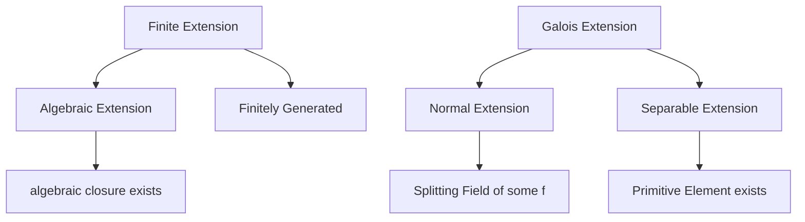

> **Prerequisites**: [[06-field-extensions|06. Field Extensions]] — algebraic/transcendental, minimal polynomial, simple extension $F(\alpha)$, Tower Law.
> **Objectives**:
> - Xây dựng splitting field của một đa thức
> - Phân biệt normal extension và separable extension
> - Hiểu định nghĩa và tính duy nhất (sai sai isomorphism) của algebraic closure
> - Phát biểu Primitive Element Theorem

---

## Motivation / Intuition

Cho đa thức $f = x^4 - 5x^2 + 6 = (x^2-2)(x^2-3)$ trên $\mathbb{Q}$. Để $f$ "tách hoàn toàn thành nhân tử tuyến tính", ta cần một field chứa đồng thời $\sqrt{2}$ và $\sqrt{3}$ — đó là $\mathbb{Q}(\sqrt{2}, \sqrt{3})$. Đây là **splitting field** của $f$.

Hai câu hỏi sâu hơn xuất hiện tự nhiên:

**Tại sao splitting field quan trọng?** Galois Group của $f$ — nhóm các automorphisms của splitting field cố định $\mathbb{Q}$ — mã hóa toàn bộ thông tin về sự phân tích nghiệm của $f$. Sự cộng hoán của Galois group tương ứng với tính giải được bằng căn thức.

**$\overline{\mathbb{Q}}$ là gì?** Nếu ta muốn một field mà *mọi* đa thức hệ số hữu tỉ đều có nghiệm, ta cần **algebraic closure** — một extension "lớn nhất" theo nghĩa algebraic. Sự tồn tại của nó (dùng Zorn's Lemma) và tính duy nhất (sai sai isomorphism) là định lý nền tảng của lý thuyết.

---

## Splitting Field

### Định nghĩa và sự tồn tại

> [!definition] Definition 7.1 — Splits completely và Splitting Field
> Cho $F$ là field và $f \in F[x]$, $\deg f = n \geq 1$.
>
> - $f$ **splits completely** (tách hoàn toàn) trên $K$ nếu $f = a(x - \alpha_1) \cdots (x - \alpha_n)$ với $\alpha_i \in K$.
> - **Splitting field** (trường tách) của $f$ trên $F$ là extension $K/F$ nhỏ nhất sao cho $f$ splits completely trên $K$:
>
> $$
> K = F(\alpha_1, \ldots, \alpha_n)
> $$
>
> với $\alpha_1, \ldots, \alpha_n$ là tất cả các nghiệm của $f$ trong $K$.

> [!theorem] Theorem 7.2 — Splitting Field tồn tại và hữu hạn
> Mọi $f \in F[x]$ có bậc $n \geq 1$ đều có splitting field $K/F$ với $[K:F] \leq n!$.

**Proof.**
Bằng induction trên $n = \deg f$. Nếu $f$ splits hoàn toàn trên $F$, đặt $K = F$ và xong.

Nếu $f$ có nhân tử bất khả quy $p$ bậc $d > 1$, đặt $F_1 = F[x]/(p) = F(\alpha_1)$ với $\alpha_1$ là nghiệm của $p$. Trong $F_1[x]$, $(x - \alpha_1) \mid f$, nên viết $f = (x - \alpha_1) g$ với $\deg g = n-1$. Áp dụng induction cho $g$ trên $F_1$: tồn tại splitting field $K$ của $g$ trên $F_1$ với $[K:F_1] \leq (n-1)!$. Tower Law:

$$
[K:F] = [K:F_1][F_1:F] \leq (n-1)! \cdot d \leq (n-1)! \cdot n = n! \qquad \blacksquare
$$

> [!example] Example 7.3 — Splitting fields
> - $f = x^2 - 2 \in \mathbb{Q}[x]$: splitting field $\mathbb{Q}(\sqrt{2})$, degree $2$.
> - $f = x^3 - 2 \in \mathbb{Q}[x]$: nghiệm $\sqrt[3]{2}, \omega\sqrt[3]{2}, \omega^2\sqrt[3]{2}$ với $\omega = e^{2\pi i/3}$. Splitting field $\mathbb{Q}(\sqrt[3]{2}, \omega)$, degree $6$.
> - $f = x^4 - 5x^2 + 6 = (x^2-2)(x^2-3) \in \mathbb{Q}[x]$: splitting field $\mathbb{Q}(\sqrt{2}, \sqrt{3})$, degree $4$.
> - $f = x^p - 1 \in \mathbb{Q}[x]$ với $p$ nguyên tố: splitting field $\mathbb{Q}(\zeta_p)$ với $\zeta_p = e^{2\pi i/p}$, degree $p-1$.

### Tính duy nhất

> [!theorem] Theorem 7.4 — Splitting Field là duy nhất (sai sai isomorphism)
> Cho $f \in F[x]$. Nếu $K_1$ và $K_2$ đều là splitting fields của $f$ trên $F$, thì tồn tại $F$-isomorphism $\sigma : K_1 \xrightarrow{\sim} K_2$ (tức $\sigma$ là isomorphism và $\sigma|_F = \operatorname{id}_F$).

Chứng minh bằng induction trên $[K_1:F]$, lifting từng automorphism một khi thêm từng nghiệm vào.

---

## Normal Extension

> [!definition] Definition 7.5 — Normal Extension
> Finite extension $K/F$ là **normal** (chuẩn tắc) nếu một trong các điều kiện tương đương sau:
>
> 1. $K$ là splitting field của một đa thức $f \in F[x]$.
> 2. Mọi đa thức bất khả quy $p \in F[x]$ có nghiệm trong $K$ đều splits hoàn toàn trên $K$.
> 3. Mọi $F$-embedding $\sigma : K \hookrightarrow \overline{F}$ đều thỏa $\sigma(K) = K$.

> [!example] Example 7.6
> - $\mathbb{Q}(\sqrt{2})/\mathbb{Q}$: **normal** — splitting field của $x^2-2$.
> - $\mathbb{Q}(\sqrt[3]{2})/\mathbb{Q}$: **không** normal — $x^3-2$ có nghiệm $\sqrt[3]{2} \in \mathbb{Q}(\sqrt[3]{2})$ nhưng không tách hoàn toàn (hai nghiệm phức $\omega\sqrt[3]{2}, \omega^2\sqrt[3]{2}$ không trong $\mathbb{Q}(\sqrt[3]{2}) \subset \mathbb{R}$).
> - $\mathbb{Q}(\sqrt[3]{2}, \omega)/\mathbb{Q}$: **normal** — splitting field của $x^3-2$.

> [!note] Remark 7.7 — Bất thường của "normal"
> "Normal" không transitive: $\mathbb{Q}(\sqrt[4]{2})/\mathbb{Q}(\sqrt{2})$ normal (degree $2$), $\mathbb{Q}(\sqrt{2})/\mathbb{Q}$ normal, nhưng $\mathbb{Q}(\sqrt[4]{2})/\mathbb{Q}$ **không** normal vì $x^4-2$ có nghiệm $\sqrt[4]{2}$ nhưng không splits ($i\sqrt[4]{2} \notin \mathbb{Q}(\sqrt[4]{2}) \subset \mathbb{R}$).

---

## Separable Extension

### Separable Polynomials

> [!definition] Definition 7.8 — Separable Polynomial
> $f \in F[x]$ là **separable** nếu $f$ không có nghiệm bội (multiple root) trong bất kỳ extension nào của $F$, tức $\gcd(f, f') = 1$ trong $F[x]$ (với $f'$ là đạo hàm hình thức).

> [!theorem] Theorem 7.9 — Bất khả quy và Separable
> Nếu $\operatorname{char}(F) = 0$, mọi đa thức bất khả quy $f \in F[x]$ đều separable.
>
> Nếu $\operatorname{char}(F) = p > 0$, $f$ bất khả quy bất separable $\iff$ $f(x) = g(x^p)$ với $g \in F[x]$.

**Proof.**
Cho $f$ bất khả quy. Nếu $f$ không separable, $\gcd(f, f') \neq 1$. Vì $f$ bất khả quy và $\deg f' < \deg f$, ta cần $f' = 0$. Nếu $\operatorname{char}(F) = 0$ thì $f' = 0 \Rightarrow f$ là hằng số — mâu thuẫn. Nếu $\operatorname{char}(F) = p$, $f' = 0 \iff$ mọi hệ số của $x^k$ với $p \nmid k$ bằng $0$, tức $f(x) = \sum a_i x^{pi} = g(x^p)$. $\blacksquare$

> [!definition] Definition 7.10 — Separable Extension
> Extension $K/F$ là **separable** nếu mọi $\alpha \in K$ đều có minimal polynomial separable trên $F$.
>
> Field $F$ là **perfect** nếu mọi algebraic extension của $F$ đều separable. Các fields sau đây là perfect:
>
> - Mọi field có $\operatorname{char}(F) = 0$.
> - Mọi finite field $\mathbb{F}_q$.
> - Mọi algebraically closed field.

> [!warning] Counterexample 7.11 — Extension không separable
> Cho $F = \mathbb{F}_p(t)$ (trường hàm hữu tỉ) và $f = x^p - t \in F[x]$. Trong splitting field $K = F(\alpha)$ với $\alpha^p = t$:
>
> $$
> x^p - t = x^p - \alpha^p = (x - \alpha)^p
> $$
>
> Vậy $\alpha$ là nghiệm bội bậc $p$ — $f$ không separable. Extension $K/F$ là **purely inseparable**.

---

## Algebraic Closure

### Định nghĩa

> [!definition] Definition 7.12 — Algebraically Closed Field
> Field $K$ là **algebraically closed** nếu mọi đa thức $f \in K[x]$ bậc $\geq 1$ đều có nghiệm trong $K$.
>
> Tương đương: mọi đa thức bất khả quy trong $K[x]$ đều có bậc $1$.

> [!example] Example 7.13
> - $\mathbb{C}$ là algebraically closed — **Fundamental Theorem of Algebra**.
> - $\mathbb{R}$ không algebraically closed ($x^2+1$ không có nghiệm thực).
> - $\overline{\mathbb{Q}} = $ algebraic closure của $\mathbb{Q}$ — algebraically closed.
> - $\mathbb{F}_p$ không algebraically closed ($x^p - x - 1$ không có nghiệm trong $\mathbb{F}_p$).

> [!definition] Definition 7.14 — Algebraic Closure
> **Algebraic closure** (bao đóng đại số) của $F$ là extension $\overline{F}/F$ thỏa:
>
> 1. $\overline{F}$ algebraically closed.
> 2. $\overline{F}/F$ là algebraic extension.

> [!theorem] Theorem 7.15 — Tồn tại và Duy nhất của Algebraic Closure
> Với mọi field $F$:
>
> 1. **(Tồn tại)** Algebraic closure $\overline{F}$ tồn tại.
> 2. **(Duy nhất)** Nếu $\overline{F}_1$ và $\overline{F}_2$ đều là algebraic closures của $F$, thì tồn tại $F$-isomorphism $\overline{F}_1 \cong \overline{F}_2$.

**Proof sketch của tồn tại (Artin's construction).**
Ý tưởng: xây dựng $\overline{F}$ bằng cách liên tục "thêm" nghiệm của mọi đa thức bất khả quy.

**Bước 1:** Với mỗi đa thức bất khả quy $f \in F[x]$, ta có extension $F[x]/(f)$ chứa một nghiệm của $f$. Xét tất cả đa thức bất khả quy $\{f_i\}_{i \in I}$ trên $F$.

**Bước 2:** Dùng Zorn's Lemma trên tập tất cả các pairs $(K, \varphi_K)$ với $K/F$ algebraic và $\varphi_K : K \to \overline{F}$ — ta tìm extension "lớn nhất".

**Bước 3:** Chứng minh extension cực đại này là algebraically closed: nếu $g \in K[x]$ bất khả quy, hệ số của $g$ algebraic trên $F$, nên $F(a_0, \ldots, a_n)$ hữu hạn chiều trên $F$, cho phép thêm nghiệm của $g$ vào. $\blacksquare$

> [!note] Remark 7.16 — Algebraic Closure là "bao nhỏ nhất"
> $\overline{F}$ là algebraic closure của $F$ $\iff$ $\overline{F}$ algebraically closed và $\overline{F}/F$ algebraic. Ta có thể coi $\overline{F}$ như field nhỏ nhất (theo nghĩa algebraic) mà trên đó mọi đa thức hệ số trong $F$ đều splits.

---

## $F$-Embeddings và Số lượng Automorphisms

> [!definition] Definition 7.17 — $F$-Embedding
> Cho $K/F$ và $\overline{F}$ algebraic closure. Một **$F$-embedding** là ring homomorphism $\sigma : K \to \overline{F}$ với $\sigma|_F = \operatorname{id}_F$.
>
> Ký hiệu $\operatorname{Hom}_F(K, \overline{F})$ là tập tất cả $F$-embeddings.

> [!theorem] Theorem 7.18 — Đếm $F$-embeddings (Separable Degree)
> Cho $K = F(\alpha)$ với $m_\alpha$ là minimal polynomial của $\alpha$, $\deg m_\alpha = n$. Khi đó:
>
> $$
> |\operatorname{Hom}_F(K, \overline{F})| = \text{số nghiệm phân biệt của } m_\alpha \text{ trong } \overline{F}
> $$
>
> Đặc biệt, nếu $K/F$ separable (tức $m_\alpha$ separable), thì số này bằng $n = [K:F]$.

> [!definition] Definition 7.19 — Separable Degree
> **Separable degree** (bậc separable) của finite extension $K/F$ là:
>
> $$
> [K:F]_s = |\operatorname{Hom}_F(K, \overline{F})|
> $$
>
> Luôn có $[K:F]_s \mid [K:F]$, và $[K:F]_s = [K:F]$ khi và chỉ khi $K/F$ separable.

---

## Primitive Element Theorem

> [!theorem] Theorem 7.20 — Primitive Element Theorem
> Cho $K/F$ finite separable extension. Khi đó tồn tại $\theta \in K$ sao cho $K = F(\theta)$. Phần tử $\theta$ được gọi là **primitive element** của $K/F$.

**Proof (trường hợp $F$ vô hạn).**
Đủ để chứng minh cho $K = F(\alpha, \beta)$: ta tìm $\theta = \alpha + c\beta$ với $c \in F$ sao cho $K = F(\theta)$.

Gọi $m_\alpha = \prod (x - \alpha_i)$ và $m_\beta = \prod (x - \beta_j)$ với $\alpha = \alpha_1$, $\beta = \beta_1$ trong $\overline{F}$. Vì $F$ vô hạn và có hữu hạn nhiều ràng buộc, tồn tại $c \in F$ sao cho $\alpha_i + c\beta_j \neq \alpha_1 + c\beta_1$ với mọi $(i,j) \neq (1,1)$. Với $c$ như vậy, $\theta = \alpha + c\beta$ thỏa $K = F(\theta)$. $\blacksquare$

> [!example] Example 7.21
> - $\mathbb{Q}(\sqrt{2}, \sqrt{3}) = \mathbb{Q}(\sqrt{2} + \sqrt{3})$ — primitive element $\theta = \sqrt{2} + \sqrt{3}$, với $m_\theta = x^4 - 10x^2 + 1$.
> - $\mathbb{Q}(\sqrt{2}, \sqrt{3}) = \mathbb{Q}(\sqrt{2} + \sqrt{3})$: kiểm tra $[\mathbb{Q}(\theta):\mathbb{Q}] = 4 = [\mathbb{Q}(\sqrt{2},\sqrt{3}):\mathbb{Q}]$.

---

## Tóm tắt quan hệ giữa các loại extension



*Diagram: Quan hệ giữa các loại extensions. Galois extension = normal + separable.*

---

## SageMath Cheatsheet

```python
R.<x> = QQ[]

f = x^3 - 2
K = f.splitting_field('a')
print(K)
print(K.degree())

f = x^4 - 5*x^2 + 6
K = f.splitting_field('a')
print(K.degree())

K.<a> = NumberField(x^3 - 2)
print(K.is_galois())
print(K.galois_closure('b'))

K.<a> = NumberField(x^4 - 2)
print(K.is_galois())

F = GF(7)
R.<x> = F[]
f = x^3 + x + 1
print(f.is_irreducible())
print(f.is_squarefree())

K.<a> = NumberField(x^2 - 2)
L.<b> = NumberField(x^2 - 3)
compositum = K.composite_fields(L)
print(compositum)
```

---

## Summary / Key Takeaways

- **Splitting field** $K = F(\alpha_1,\ldots,\alpha_n)$ của $f$: extension nhỏ nhất để $f$ tách hoàn toàn; $[K:F] \leq n!$; duy nhất sai sai $F$-isomorphism.
- **Normal extension**: splitting field của một đa thức $\iff$ mọi bất khả quy có một nghiệm thì tách hoàn toàn $\iff$ ổn định dưới $F$-embeddings.
- **Separable extension**: minimal polynomial không có nghiệm bội. Char $0$ và finite fields là **perfect** — mọi extension là separable.
- Extension **không separable** (purely inseparable) xảy ra khi char $p > 0$ và $f = g(x^p)$.
- **Algebraic closure** $\overline{F}$: algebraically closed + algebraic over $F$; tồn tại (Zorn) và duy nhất sai sai isomorphism.
- **Separable degree** $[K:F]_s = |\operatorname{Hom}_F(K,\overline{F})|$; bằng $[K:F]$ $\iff$ separable.
- **Primitive Element Theorem**: finite separable extension là simple $K = F(\theta)$.

---

## References

- Dummit, D. S., & Foote, R. M. *Abstract Algebra* (3rd ed.), Chapters 13–14.
- Lang, S. *Algebra* (revised 3rd ed.), Chapter V.
- Rotman, J. J. *Advanced Modern Algebra* (3rd ed.), Chapter 3.
- Milne, J. S. *Fields and Galois Theory* (free online notes), Chapters 2–3.
